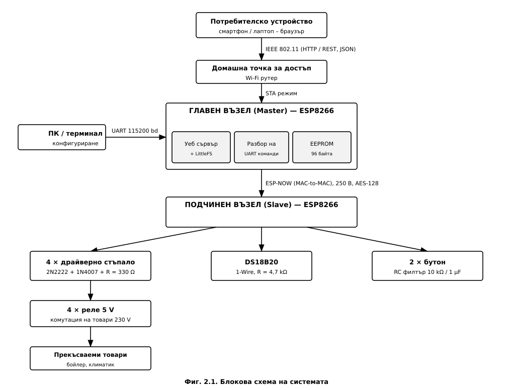
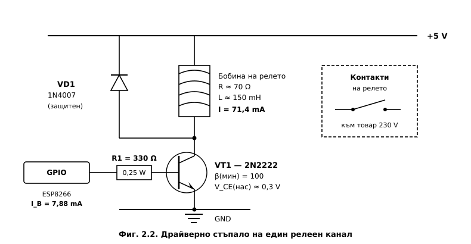
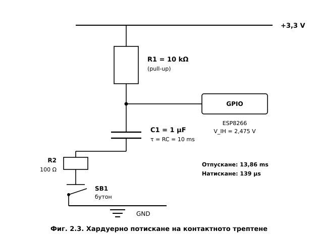
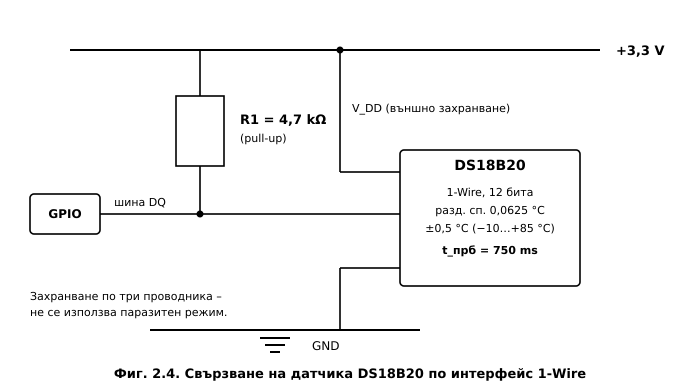
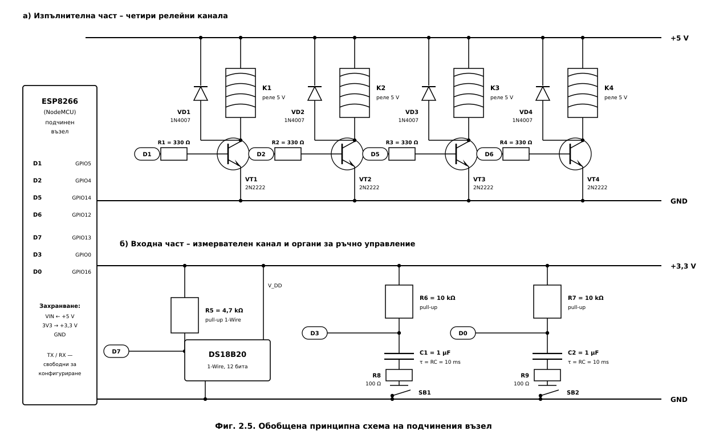

# ГЛАВА ВТОРА
# ХАРДУЕРНО ПРОЕКТИРАНЕ НА СИСТЕМАТА

---

## 2.1. Изисквания към хардуера и общ подход

Хардуерното проектиране изхожда пряко от изходните данни по заданието (т. 3) и от
архитектурните решения, обосновани в Глава 1. Формулират се следните изисквания:

- **двувъзлова структура** – главен (Master) и подчинен (Slave) модул на базата на ESP8266;
- **четири независими релейни канала** за комутация на товари с мрежово напрежение;
- **един измервателен канал** за температура;
- **два органа за ръчно управление** с хардуерно потискане на контактното трептене;
- **сериен интерфейс**, оставен свободен за конфигуриране по UART;
- **галванично разделяне** на силнотоковата част от управляващата чрез контактите на релетата.

Приетият подход е **модулен**: всеки функционален възел (драйверен канал, входен канал,
измервателен канал) се проектира и оразмерява самостоятелно, след което се проверява
съвместимостта им по отношение на енергийния баланс и на разпределението на изводите.
Такава организация позволява независима проверка на всяко стъпало и опростява откриването
на неизправности.

---

## 2.2. Блокова схема на хардуера

Блоковата схема на хардуера е представена на **Фиг. 2.1**. Тя реализира т. 4.2 от
обяснителната записка и т. 5.1 от графичната част на заданието.

Схемата е разделена на четири зони, които отразяват както функционалното, така и
**физическото** разпределение на апаратурата.

**Главен възел.** Реализиран е с модул NodeMCU v3, който обединява четири функционални
блока:

- **система в кристал ESP8266EX** – процесорно ядро Xtensa LX106 с тактова честота
  80 MHz и интегриран радиочестотен тракт по IEEE 802.11 b/g/n с вградена антена;
- **SPI Flash памет с обем 4 MB**, свързана към процесора по интерфейс SPI; в нея се
  разполагат изпълнимата програма, файловата система LittleFS със съдържанието на уеб
  интерфейса и секторът на емулираната енергонезависима памет;
- **мост USB–UART (CH340)**, през който персоналният компютър достъпва серийния интерфейс
  за конфигуриране по т. 5 от заданието;
- **линеен стабилизатор AMS1117** с изходно напрежение 3,3 V, захранван от шината VBUS
  на USB конектора.

**Подчинен възел.** Използва същия модул, но без мрежов стек към точката за достъп и без
файлова система – в SPI Flash паметта се разполагат само програмата и емулираната
енергонезависима памет. Към изводите му са свързани четирите драйверни стъпала, датчикът
DS18B20 и двата бутона с RC филтри.

**Външни устройства.** Смартфонът или лаптопът на потребителя, домашната точка за достъп и
персоналният компютър не са част от проектираната система. Те са показани, за да се
отразят границите ѝ и видът на всяка връзка: радиовръзка по IEEE 802.11 към точката за
достъп и кабелна връзка по USB към компютъра.

**Силова част.** Мрежата ~230 V, захранващият блок AC/DC и контактите на релетата
образуват силовата част, отделена с пунктирна рамка. Съществени за безопасността са
**две граници на галванично разделяне**: захранващият блок разделя управляващата част от
мрежата по захранване, а релетата – по управлявани вериги, като връзката между бобината и
контактите е **механична**, а не електрическа.

> **Разлика между емулираната и физическата памет.** Блокът „EEPROM" не е отделна схема.
> ESP8266 не разполага с физическа енергонезависима памет от този тип – тя се емулира в
> сектор от SPI Flash паметта (т. 3.2.1). Затова на блоковата схема паметта е показана
> като част от SPI Flash, а не като самостоятелен блок.

**Физическо разделяне и захранване на възлите.** Тъй като обменът между възлите е
безжичен, те **се монтират на различни места**: главният – в близост до домашната точка
за достъп, подчиненият – в близост до управляваните товари. Следователно двата възела
**не могат да използват обща захранваща шина** и се захранват независимо. Главният възел
консумира до 170 mA и се захранва по USB от стандартен адаптер 5 V. Подчиненият възел
консумира до 489 mA (т. 2.7) и се захранва от собствен захранващ блок AC/DC, който
захранва едновременно логическата част (през стабилизатора) и релейните бобини
(непосредствено от шината +5 V).

Потокът на управление е **двупосочен, но асиметричен**: командите преминават от
потребителя до изпълнителния възел през две различни физически среди (IEEE 802.11 и
ESP-NOW), докато телеметрията се връща само по ESP-NOW. Това разделение беше обосновано в
т. 1.1.6.

---

## 2.3. Избор на елементна база

**Таблица 2.1. Основни елементи на системата**

| Означение | Елемент | Тип | Функция |
|---|---|---|---|
| DD1, DD2 | Микроконтролер | ESP8266EX (модул NodeMCU v3) | главен и подчинен възел |
| VT1…VT4 | Биполярен транзистор | 2N2222 (NPN, TO-92) | ключов елемент на драйвера |
| VD1…VD4 | Диод | 1N4007 | защита от обратно напрежение |
| R1…R4 | Резистор | 330 Ω, 0,25 W | базов резистор |
| K1…K4 | Реле | 5 V, Rбобина ≈ 70 Ω | изпълнителен елемент |
| BK1 | Температурен датчик | DS18B20 (TO-92) | измервателен канал |
| R5 | Резистор | 4,7 kΩ | pull-up за шината 1-Wire |
| SB1, SB2 | Бутон | тактов, нормално отворен | ръчно управление |
| R6, R7 | Резистор | 10 kΩ | pull-up за бутоните |
| C1, C2 | Кондензатор | 1 µF | филтриращ елемент |
| R8, R9 | Резистор | 100 Ω | токоограничаващ резистор |

**Обосновка на избора на транзистор.** Транзисторът 2N2222 [18] е избран поради следните
съображения: максимален колекторен ток 800 mA при необходими 71,4 mA (запас над 10 пъти);
гарантиран минимален коефициент на усилване по ток hFE = 100 в работния
диапазон; допустима мощност на разсейване 625 mW в корпус TO-92; и широка наличност на
пазара. Алтернативата – полеви транзистор (напр. 2N7000) – би елиминирала базовия ток, но
при прагово напрежение на отпушване до 3 V и захранване на GPIO 3,3 V работата в областта
на насищане не е гарантирана в целия температурен диапазон.

**Обосновка на избора на датчик.** DS18B20 [19] е предпочетен пред аналогови датчици (LM35,
термистор) и пред DHT11/DHT22 поради: цифров изход, който изключва грешките от
аналогово-цифровото преобразуване и от дължината на кабела; гарантирана точност ±0,5 °C в
диапазона −10…+85 °C; разрешаваща способност 0,0625 °C при 12-битово преобразуване; и
възможност за **неблокиращо четене**, което е ключово за изискването по т. 7 от задачите.

---

## 2.4. Драйверно стъпало на релейните канали

### 2.4.1. Постановка на задачата

Изводите на ESP8266 не могат да управляват релейна бобина непосредствено по две
независими причини:

- **по ток** – максималният изходен ток на един извод е **12 mA** [11, 20], докато бобината
  изисква над 70 mA;
- **по напрежение** – изходното напрежение на извода е **3,3 V**, а бобината е
  оразмерена за **5 V**.

Следователно е необходимо **усилвателно стъпало**, което едновременно усилва тока и
осъществява преход към по-високото захранващо напрежение. Принципната схема на един канал
е показана на **Фиг. 2.2**.

Приета е схема на **ключ в общ емитер с товар в колектора** (*low-side switch*).
Предимството ѝ е, че емитерът е свързан към общата точка, поради което управляващото
напрежение се прилага непосредствено между базата и масата – без необходимост от
преобразувател на ниво. Транзисторът работи в **ключов режим**: в запушено състояние
(GPIO в ниско ниво) или в състояние на **дълбоко насищане** (GPIO във високо ниво).

### 2.4.2. Изчисляване на колекторния ток

Токът през бобината се определя по закона на Ом:

$$I_C = \frac{V_{CC}}{R_{\text{бобина}}} = \frac{5\ \text{V}}{70\ \Omega} = 71{,}4\ \text{mA}$$

Това е токът, който ключовият транзистор трябва да провежда в наситено състояние.

### 2.4.3. Изчисляване на базовия ток

За да работи транзисторът в областта на насищане, а не в активния режим, базовият ток
трябва да превишава значително стойността, изчислена по коефициента на усилване. Минимално
необходимият базов ток е:

$$I_{B(\text{мин})} = \frac{I_C}{h_{FE(\text{мин})}} = \frac{71{,}4\ \text{mA}}{100} = 0{,}714\ \text{mA}$$

На практика се въвежда **коефициент на пренасищане** $k = 5\ldots10$, който гарантира
насищане при разсейване на параметрите, при понижена температура и при стареене на
елемента:

$$I_{B(\text{изиск})} = k \cdot I_{B(\text{мин})} = 5 \times 0{,}714 = 3{,}57\ \text{mA}$$

### 2.4.4. Оразмеряване на базовия резистор

Базовият резистор се определя от втория закон на Кирхоф за базовата верига:

$$R_B = \frac{V_{OH} - V_{BE}}{I_B}$$

където $V_{OH} = 3{,}3$ V е изходното напрежение на извода при високо ниво, а
$V_{BE} \approx 0{,}7$ V е напрежението база-емитер в проводящо състояние.

Съпротивлението се определя не като единична стойност, а като **допустим диапазон**,
ограничен от две противоположни изисквания.

**Долна граница** – токът, източван от извода, не трябва да превишава допустимите 12 mA:

$$R_{B(\text{мин})} = \frac{3{,}3 - 0{,}7}{12 \cdot 10^{-3}} = 217\ \Omega$$

**Горна граница** – базовият ток не трябва да пада под изискваната стойност за насищане:

$$R_{B(\text{макс})} = \frac{3{,}3 - 0{,}7}{3{,}57 \cdot 10^{-3}} = 728\ \Omega$$

Следователно допустимият диапазон е $217\ \Omega \le R_B \le 728\ \Omega$. От редицата E12
се избира номиналната стойност:

$$R_B = 330\ \Omega$$

която попада в средната част на диапазона и осигурява запас в двете посоки.

### 2.4.5. Проверка на избраната стойност

Действителният базов ток при $R_B = 330\ \Omega$ е:

$$I_B = \frac{3{,}3 - 0{,}7}{330} = 7{,}88\ \text{mA}$$

което представлява **66 %** от допустимия ток на извода. Форсираният коефициент на усилване
е:

$$\beta_{\text{форс}} = \frac{I_C}{I_B} = \frac{71{,}4}{7{,}88} = 9{,}1$$

Коефициентът на пренасищане спрямо гарантирания минимум е:

$$\frac{h_{FE(\text{мин})}}{\beta_{\text{форс}}} = \frac{100}{9{,}1} = 11$$

Условието за дълбоко насищане ($\beta_{\text{форс}} \ll h_{FE(\text{мин})}$) е изпълнено с
единадесеткратен запас.

**Проверка при най-неблагоприятни условия.** При насищане напрежението база-емитер нараства
до $V_{BE(\text{нас})} \approx 1{,}2$ V. Тогава:

$$I_B = \frac{3{,}3 - 1{,}2}{330} = 6{,}36\ \text{mA}, \qquad \beta_{\text{форс}} = 11{,}2 \ll 100$$

Насищането остава гарантирано и в този случай.

### 2.4.6. Проверка по разсейвана мощност

Мощността, разсейвана от транзистора в наситено състояние при
$V_{CE(\text{нас})} \approx 0{,}3$ V:

$$P_C = I_C \cdot V_{CE(\text{нас})} = 71{,}4 \cdot 10^{-3} \times 0{,}3 = 21{,}4\ \text{mW}$$

$$P_B = I_B \cdot V_{BE} = 7{,}88 \cdot 10^{-3} \times 0{,}7 = 5{,}5\ \text{mW}$$

$$P_{\text{общо}} = P_C + P_B = 26{,}9\ \text{mW}$$

Това е **4,3 %** от допустимата мощност на разсейване 625 mW – транзисторът работи в
облекчен топлинен режим и не изисква радиатор.

Мощността в базовия резистор:

$$P_{R_B} = I_B^2 \cdot R_B = (7{,}88 \cdot 10^{-3})^2 \times 330 = 20{,}5\ \text{mW}$$

Стандартен резистор с мощност 0,25 W осигурява дванадесеткратен запас.

**Проверка на сумарния ток от изводите.** При едновременно включени четири канала:

$$I_{\Sigma} = 4 \times 7{,}88 = 31{,}5\ \text{mA}$$

Това е приемливо натоварване за групата изводи на ESP8266, но обосновава
**последователното, а не едновременното** превключване на релетата в програмната
реализация (Глава 3).

### 2.4.7. Защитен диод

Релейната бобина е индуктивен товар. При запушване на транзистора токът през нея не може
да се измени скокообразно, поради което върху индуктивността възниква
**самоиндукционно напрежение**:

$$u_L = -L \frac{di}{dt}$$

При липса на защитен елемент отрицателният фронт на тока е много стръмен и напрежението
достига стойности от порядъка на стотици волта, което многократно превишава допустимото
$V_{CEO} = 30$ V на транзистора и води до необратим пробив.

Диодът **VD1 (1N4007)**, свързан **обратно** паралелно на бобината (катод към +5 V), осигурява
затворен контур за тока след запушването. Енергията, натрупана в магнитното поле:

$$W = \frac{1}{2} L I_C^2 = \frac{1}{2} \times 0{,}15 \times (71{,}4 \cdot 10^{-3})^2 \approx 383\ \mu\text{J}$$

се разсейва в активното съпротивление на бобината с времеконстанта:

$$\tau_L = \frac{L}{R_{\text{бобина}}} = \frac{0{,}15}{70} = 2{,}14\ \text{ms}$$

Практическото затихване настъпва за $\approx 5\tau_L = 10{,}7$ ms.

**Проверка на параметрите на диода** [21]**:**

| Параметър | Изискване | 1N4007 | Запас |
|---|---|---|---|
| Максимален прав ток | 71,4 mA | 1000 mA | 14× |
| Обратно напрежение | 5 V | 1000 V | 200× |

Времето за възстановяване на 1N4007 (десетки микросекунди) е несъществено, тъй като
честотата на превключване на релетата е от порядъка на единици превключвания в минута.

> **Забележка.** Защитният диод удължава времето на отпускане на релето, тъй като
> поддържа тока през бобината. При приложения, изискващи бързо отпускане, последователно
> на диода се включва резистор или ценеров диод. За разглежданата система – комутация на
> товари с топлинна инерция – това забавяне (единици милисекунди) е без значение.

---

## 2.5. Схема за потискане на контактното трептене

### 2.5.1. Природа на явлението

При затваряне на механичен контакт подвижната му част претърпява многократни отскоци
поради еластичната деформация на материала. Резултатът е **серия от паразитни импулси** с
продължителност от **0,5 до 10 ms**, която микроконтролерът интерпретира като няколко
последователни натискания. За система, управляваща товари с мрежово напрежение, това е
недопустимо: едно натискане би предизвикало многократно превключване на релето.

Съгласно заданието потискането се реализира **хардуерно** – чрез интегриращ RC филтър.
Схемата е показана на **Фиг. 2.3**.

### 2.5.2. Принцип на действие и изчисляване на времеконстантата

Резисторът R1 = 10 kΩ поддържа високо ниво на входа при отпуснат бутон. Кондензаторът
C1 = 1 µF, включен между входа и масата, интегрира бързите изменения на напрежението.
Времеконстантата на веригата е:

$$\tau = R_1 \cdot C_1 = 10 \cdot 10^{3}\ \Omega \times 1 \cdot 10^{-6}\ \text{F} = 10 \cdot 10^{-3}\ \text{s} = 10\ \text{ms}$$

Праговите нива на входа на ESP8266 са:

$$V_{IH(\text{мин})} = 0{,}75 \cdot V_{DD} = 0{,}75 \times 3{,}3 = 2{,}475\ \text{V}$$
$$V_{IL(\text{макс})} = 0{,}25 \cdot V_{DD} = 0{,}25 \times 3{,}3 = 0{,}825\ \text{V}$$

### 2.5.3. Време за реакция при отпускане

След отпускане на бутона кондензаторът се зарежда през R1 по закона:

$$u_C(t) = V_{DD}\left(1 - e^{-t/\tau}\right)$$

Времето до достигане на прага $V_{IH}$ се получава от:

$$t_{\text{отп}} = -\tau \ln\left(1 - \frac{V_{IH}}{V_{DD}}\right) = -10 \cdot \ln(1 - 0{,}75) = 10 \times 1{,}386 = 13{,}86\ \text{ms}$$

### 2.5.4. Време за реакция при натискане

При натиснат бутон кондензаторът се разрежда през токоограничаващия резистор
R2 = 100 Ω с времеконстанта:

$$\tau_{\text{разр}} = R_2 \cdot C_1 = 100 \times 1 \cdot 10^{-6} = 100\ \mu\text{s}$$

Времето до спадане под прага $V_{IL}$ е:

$$t_{\text{нат}} = -\tau_{\text{разр}} \ln\left(\frac{V_{IL}}{V_{DD}}\right) = -100 \cdot \ln(0{,}25) = 139\ \mu\text{s}$$

Получава се **силно асиметрична характеристика**: натискането се регистрира за 139 µs, а
отпускането – за 13,86 ms. Тази асиметрия е **желана**: бързата реакция при натискане
осигурява субективно усещане за отзивчивост, а бавното възстановяване потиска трептенето
при отпускане, когато то е най-силно изразено.

### 2.5.5. Проверка на потискащата способност

Изменението на напрежението върху кондензатора при паразитен импулс с продължителност
$t_b$ се определя от:

$$\Delta u = V_{DD}\left(1 - e^{-t_b/\tau}\right)$$

**Таблица 2.2. Потискане на паразитните импулси**

| Продължителност на импулса $t_b$ | Изменение $\Delta u$ | Резултат |
|---|---|---|
| 0,5 ms | 0,161 V | потиснат |
| 1,0 ms | 0,314 V | потиснат |
| 2,0 ms | 0,598 V | потиснат |
| 5,0 ms | 1,298 V | потиснат |

Дори при най-неблагоприятния случай (импулс с продължителност 5 ms) изменението на
напрежението е 1,298 V – стойност, която остава **под прага $V_{IH} = 2{,}475$ V**.
Следователно филтърът потиска целия практически диапазон на контактното трептене.

### 2.5.6. Роля на токоограничаващия резистор R2

Резисторът R2 = 100 Ω не участва в определянето на времеконстантата на филтъра, но
изпълнява две съществени функции.

**Ограничаване на разрядния ток.** При липса на R2 кондензаторът би се разреждал
непосредствено през контакта на бутона, като пиковият ток би бил ограничен единствено от
преходното съпротивление на контакта (десетки миллиома). Това предизвиква **електроерозия
на контактната повърхност** и съкращава експлоатационния ресурс. С резистора:

$$I_{\text{пик}} = \frac{V_{DD}}{R_2} = \frac{3{,}3}{100} = 33\ \text{mA}$$

**Ограничаване на постоянния ток.** При задържан бутон токът през делителя е:

$$I = \frac{V_{DD}}{R_1 + R_2} = \frac{3{,}3}{10100} = 327\ \mu\text{A}$$

което е пренебрежимо за енергийния баланс.

**Обосновка на избора на R1 и C1.** Стойността R1 = 10 kΩ е компромис: по-голямо
съпротивление би увеличило чувствителността към индуктивни смущения (висок импеданс на
входа), а по-малко – би увеличило непроизводителното потребление. Стойността C1 = 1 µF
определя времеконстанта, която надвишава максималната продължителност на трептенето
(10 ms), без да внася забележимо за потребителя закъснение.

---

## 2.6. Измервателен канал

Датчикът DS18B20 се свързва по интерфейс **1-Wire** съгласно **Фиг. 2.4**.

Интерфейсът използва **един двупосочен сигнален проводник** с изход от тип „отворен дрейн",
което налага наличието на подтеглящ резистор. Стандартната стойност R5 = 4,7 kΩ осигурява
достатъчен ток за зареждане на паразитния капацитет на линията при дължини до няколко метра.

Приет е режим на **външно захранване по три проводника** (VDD, DQ, GND), а не
паразитният режим. Обосновката е следната: при паразитно захранване датчикът черпи енергия
от сигналната линия, което изисква активно подтегляне на шината по време на
преобразуването и **усложнява реализацията на неблокиращо четене**. Външното захранване
освобождава шината по време на преобразуването и позволява микроконтролерът да изпълнява
други задачи – изискване, формулирано в т. 7 от задачите.

**Таблица 2.3. Параметри на измервателния канал**

| Параметър | Стойност |
|---|---|
| Разрешаваща способност (12 бита) | 0,0625 °C |
| Гарантирана точност | ±0,5 °C (−10…+85 °C) |
| Време за преобразуване (12 бита) | до 750 ms |
| Работен диапазон | −55…+125 °C |
| Ток при преобразуване | 1,5 mA |
| Ток в режим на покой | 1 µA |

Времето за преобразуване от **750 ms** е ключово за софтуерното проектиране: блокиращо
изчакване на тази стойност би довело до недопустимо забавяне на главния цикъл. Решението –
стартиране на преобразуването и отложено прочитане чрез `setWaitForConversion(false)` –
се разглежда в Глава 3.

---

## 2.7. Захранващ блок и енергиен баланс

Захранването се осъществява от стабилизиран източник **5 V**, от който се захранват
релейните бобини непосредствено, а логическата част – през интегрирания на модула
линеен стабилизатор AMS1117-3.3 [22].

**Таблица 2.4. Енергиен баланс на подчинения възел (най-неблагоприятен случай)**

| Консуматор | Ток |
|---|---|
| ESP8266 – връх при предаване | 170 mA |
| 4 × релейна бобина (4 × 71,4 mA) | 285,7 mA |
| DS18B20 при преобразуване | 1,5 mA |
| Базови токове на драйверите (4 × 7,88 mA) | 31,5 mA |
| **Общо** | **≈ 489 mA** |

При избор на захранващ блок **5 V / 1 A** се осигурява **двукратен запас**, което е
необходимо поради импулсния характер на консумацията при предаване по Wi-Fi.

Разсейваната от стабилизатора мощност при ток на логическата част 170 mA:

$$P_{\text{стаб}} = (V_{\text{вх}} - V_{\text{изх}}) \cdot I = (5 - 3{,}3) \times 0{,}170 = 289\ \text{mW}$$

Стойността е в допустимите граници за корпус SOT-223 при наличие на медна площ за
топлоотвеждане.

**Развързване по захранване.** Импулсният характер на консумацията при работа на радиото
(токови скокове от 15 mA до 170 mA за микросекунди) изисква:

- **електролитен кондензатор 470 µF** в близост до входа на захранването – компенсира
  бавните изменения при включване на релетата;
- **керамичен кондензатор 100 nF** при всеки активен елемент – потиска високочестотните
  съставки.

Без адекватно развързване токовите скокове предизвикват пропадания на захранващото
напрежение, които водят до непредвидено нулиране на микроконтролера – типична и трудно
диагностицируема неизправност при този клас устройства.

---

## 2.8. Разпределение на изводите

Разпределението на изводите не е произволно: част от изводите на ESP8266 имат **специални
функции при стартиране** (*boot straps*) [20], чието нарушаване прави зареждането невъзможно.

**Таблица 2.5. Ограничения на изводите на ESP8266**

| Извод | Означение | Ограничение при стартиране |
|---|---|---|
| GPIO0 | D3 | трябва да е във високо ниво |
| GPIO2 | D4 | трябва да е във високо ниво |
| GPIO15 | D8 | трябва да е в ниско ниво |
| GPIO1 / GPIO3 | TX / RX | заети от серийния интерфейс |
| GPIO16 | D0 | няма вътрешен подтеглящ резистор |

**Таблица 2.6. Разпределение на изводите на подчинения възел**

| Функция | Извод | GPIO | Обосновка |
|---|---|---|---|
| Реле 1 | D1 | GPIO5 | без ограничения при стартиране |
| Реле 2 | D2 | GPIO4 | без ограничения при стартиране |
| Реле 3 | D5 | GPIO14 | без ограничения при стартиране |
| Реле 4 | D6 | GPIO12 | без ограничения при стартиране |
| DS18B20 | D7 | GPIO13 | без ограничения при стартиране |
| Бутон 1 (превключване) | D3 | GPIO0 | външен pull-up – високо ниво при стартиране |
| Бутон 2 (авариен стоп) | D0 | GPIO16 | външният pull-up компенсира липсата на вътрешен |
| Конфигуриране | TX / RX | GPIO1 / GPIO3 | **оставени свободни** |

**Обосновка на приетите решения:**

**а) Релейните изходи са разположени на изводи без ограничения при стартиране.** Ако
релеен изход бъде свързан към GPIO0 или GPIO2, които имат вградени подтеглящи резистори,
при подаване на захранване базата на транзистора би получила високо ниво **преди
инициализацията на програмата**, което би предизвикало кратковременно задействане на
релето. За система, комутираща товари с мрежово напрежение, това е недопустимо.

**б) GPIO15 (D8) не се използва за бутон.** Външен подтеглящ резистор към 3,3 V би
задържал извода във високо ниво при стартиране, което **блокира зареждането** на модула.

**в) Серийният интерфейс е оставен свободен.** Изискването по т. 5 от заданието
предполага, че изводите GPIO1 и GPIO3 остават на разположение на UART. Това ограничава
броя на свободните изводи, но е безусловно изискване.

**г) Бутон на GPIO0.** При отпуснат бутон външният резистор поддържа високо ниво и
стартирането е нормално. Задържането на бутона при подаване на захранване превежда модула
в режим на програмиране – обстоятелство, което в софтуерната реализация се използва
целенасочено за **фабрично нулиране на конфигурацията**.

На главния възел се използват единствено серийният интерфейс (за конфигуриране) и
светодиодният индикатор на GPIO2 за визуализация на състоянието на връзката.

---

## 2.9. Обобщена принципна схема на подчинения възел

Обобщената принципна схема, обединяваща разгледаните в т. 2.4–2.6 стъпала, е представена на
**Фиг. 2.5**. Тя реализира графична част т. 5.2 от заданието.

За прегледност схемата е разделена на два функционални панела с отделни захранващи шини:

- **панел а)** – изпълнителната част, захранвана от шината **+5 V**, която обединява
  четирите идентични драйверни канала;
- **панел б)** – входната част, захранвана от шината **+3,3 V**, която обхваща измервателния
  канал и двата органа за ръчно управление.

Връзките между изводите на микроконтролера и отделните стъпала са означени чрез
**означения на веригите** (D1, D2, D5, D6, D7, D3, D0) вместо чрез начертани проводници.
Този начин на представяне е възприет, за да се избегнат пресичания на линиите и следва
приетата практика при оформяне на принципни схеми.

Съществено е разделянето на **двете захранващи шини**. Релейните бобини се захранват
непосредствено от +5 V, без да преминават през стабилизатора на модула, докато входните
вериги използват стабилизираното напрежение +3,3 V. Така импулсните токове при задействане
на релетата (до 285 mA) **не натоварват линейния стабилизатор** и не предизвикват пропадания
на напрежението, върху което работи логическата част.

---

## 2.10. Изводи по Глава 2

1. Разработени са **блокова схема на хардуера** (Фиг. 2.1) и **обобщена принципна схема**
   (Фиг. 2.5), като блоковата схема отразява физическото разделяне на възлите, независимото
   им захранване и двете граници на галванично разделяне от мрежата ~230 V.
2. Оразмерено е **драйверното стъпало**: установен е допустимият диапазон за базовия
   резистор $217\ \Omega \le R_B \le 728\ \Omega$, от който е избрана номиналната стойност
   **330 Ω**, осигуряваща базов ток 7,88 mA и **единадесеткратен коефициент на пренасищане**.
3. Проверен е топлинният режим на ключовия транзистор – разсейваната мощност 26,9 mW
   представлява **4,3 %** от допустимата, поради което не се изисква радиатор.
4. Оразмерен е **защитният диод**: при енергия в магнитното поле 383 µJ и времеконстанта
   на затихване 2,14 ms параметрите на 1N4007 осигуряват запас 14× по ток и 200× по
   напрежение.
5. Оразмерен е **RC филтърът** за потискане на контактното трептене с времеконстанта
   $\tau = 10$ ms, който потиска импулси с продължителност до 5 ms и осигурява асиметрична
   реакция: **139 µs при натискане и 13,86 ms при отпускане**.
6. Съставен е **енергийният баланс** – сумарен ток 489 mA в най-неблагоприятния случай,
   покрит с двукратен запас от източник 5 V / 1 A.
7. Обосновано е **разпределението на изводите** с отчитане на специалните им функции при
   стартиране, като серийният интерфейс е оставен свободен съгласно т. 5 от заданието.
