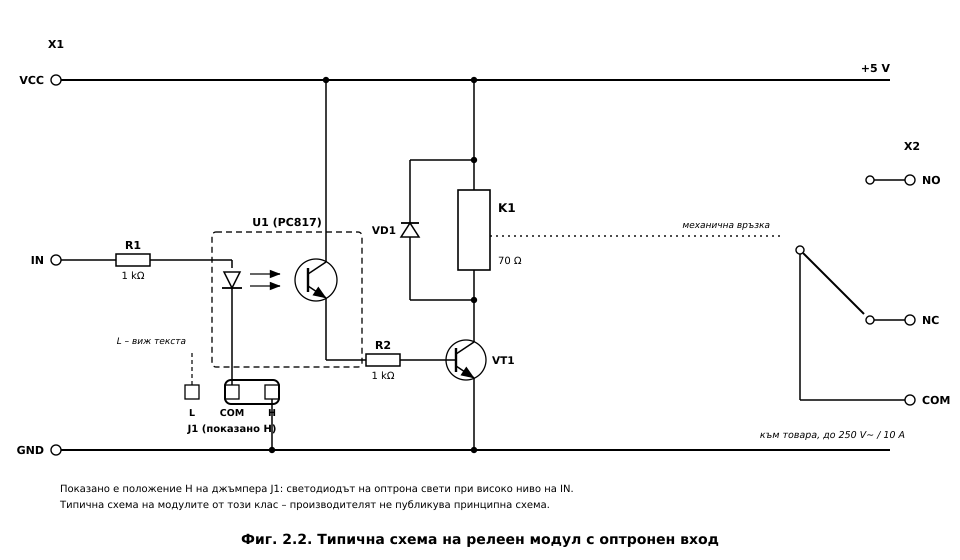
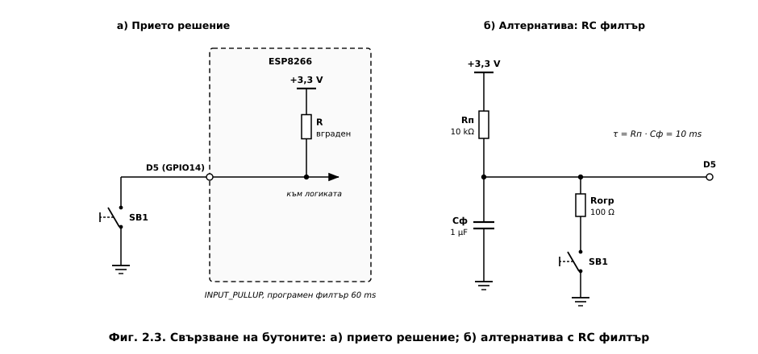
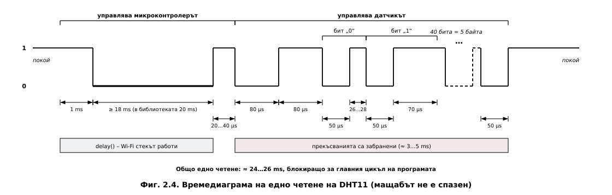
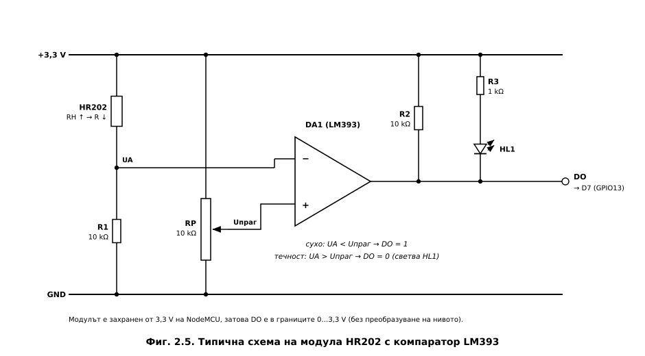
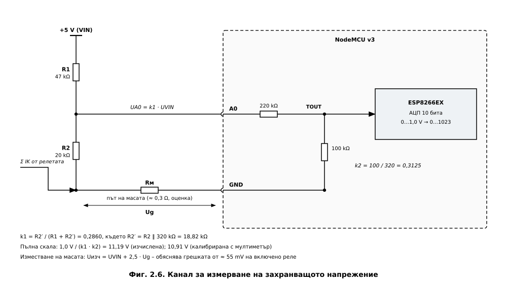
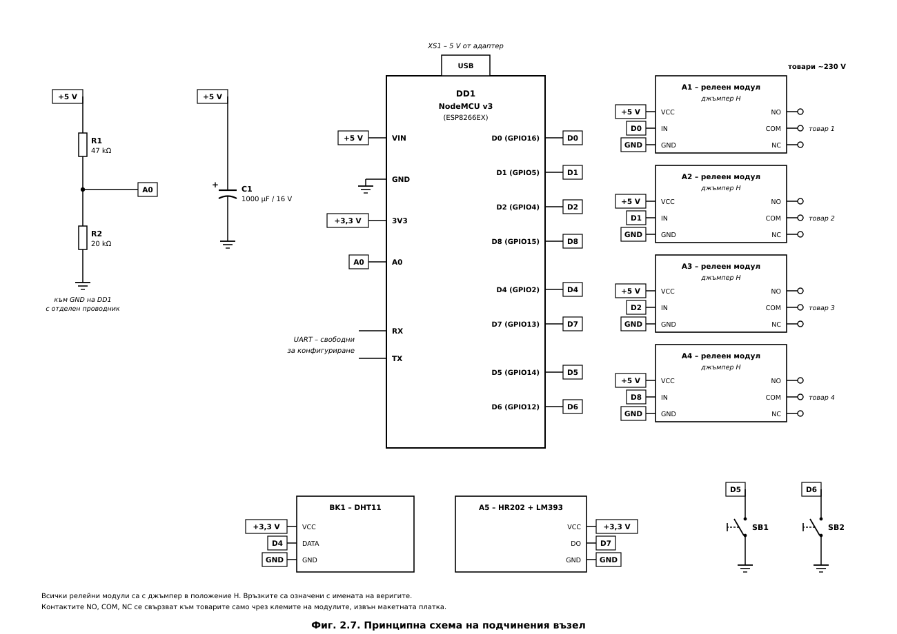
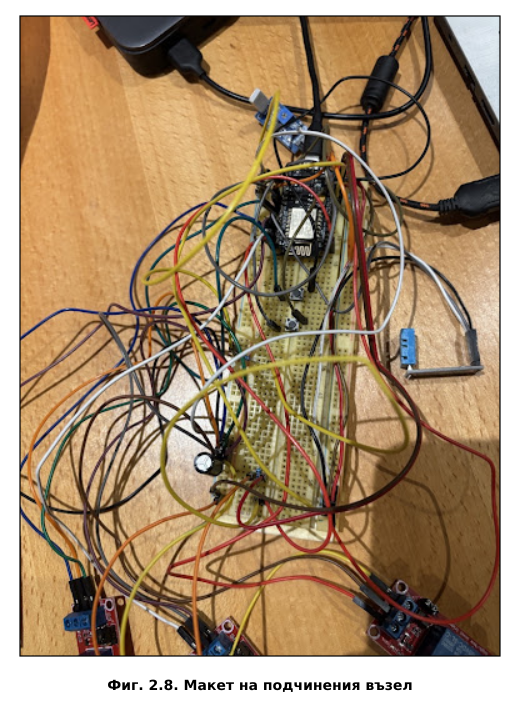

# ГЛАВА ВТОРА
# ХАРДУЕРНО ПРОЕКТИРАНЕ НА СИСТЕМАТА

---

## 2.1. Изисквания и избор на метод на работа

Хардуерното проектиране изхожда от изходните данни по заданието (т. 3) и от изводите на
литературното проучване (т. 1.3). Изискванията са: двувъзлова структура на базата на ESP8266
(т. 3.1); температурен датчик с интерфейс по избор (т. 3.2) – избран е DHT11, който измерва и
относителната влажност; четири електромеханични релета (т. 3.3); два механични бутона
(т. 3.4); конфигуриране по UART (т. 3.5). Извън минималните изисквания са въведени **защита
при влага** с втори датчик – HR202 с компаратор LM393, и **контрол на захранващото
напрежение** на релейната част през аналоговия вход A0.

Приетият метод е **модулен**: релейните канали и датчиците са масово произвеждани модули, а
двата възела – развойни платки NodeMCU v3. Модулите съдържат проверени схемни решения и
позволяват изграждане на макета без запояване. Затова проектирането се съсредоточава върху
**съвместимостта между модулите** – логическите нива, енергийния баланс при захранване по USB
и функциите на изводите при стартиране, където са действителните рискове за надеждната
работа.

## 2.2. Блокова схема на хардуера

Блоковата схема е представена на **Фиг. 2.1**. Тя реализира т. 4.2 от обяснителната
записка и т. 5.1 от графичната част на заданието.

**Главен възел.** Развойната платка NodeMCU v3 съдържа системата в кристал ESP8266EX
(процесорно ядро Xtensa LX106, 80 MHz, радиочестотен тракт по IEEE 802.11 b/g/n [11]),
SPI Flash памет 4 MB за програмата, уеб страницата и емулираната EEPROM, мост USB–UART CH340
за конфигурирането по т. 3.5 [18] и стабилизатор AMS1117 за 3,3 V. Главният възел няма
външна периферия – той е свързан към домашната точка за достъп в режим на станция (STA) и към
подчинения възел по ESP-NOW.

**Подчинен възел.** Към същата платка са свързани четири релейни модула (D0, D1, D2, D8,
захранване от шината +5 V), датчиците DHT11 (D4) и HR202 (D7), захранени от 3,3 V, два бутона
към масата (D5, D6), делителят R1–R2 към аналоговия вход A0 и буферният кондензатор C1 на
шината +5 V. Токовете на бобините на релетата не преминават през стабилизатора.

**Силова част.** Мрежата ~230 V и товарите са свързани **само към контактите на релетата**.
Границата на галванично разделяне е между бобината и контактите – изолацията на релето е
1500 V~ [19]. При едноканалните модули входната и релейната част обикновено имат обща маса,
затова оптронът **не се разглежда като граница на безопасност**.

Командите достигат до подчинения възел през две среди – IEEE 802.11 до главния възел и
ESP-NOW до подчинения, а телеметрията се връща само по ESP-NOW (т. 1.1.6). Параметрите и
изискванията към сигналите между блоковете са обобщени в **Таблица 2.1**.

**Таблица 2.1. Сигнали между блоковете**

| Сигнал | Между блоковете | Вид и нива | Изисквания |
|---|---|---|---|
| HTTP, JSON | браузър ↔ главен възел | IEEE 802.11 b/g/n, TCP/IP през точката за достъп | асинхронни заявки; отговор до 2 kB |
| ESP-NOW | главен ↔ подчинен възел | кадри на връзково ниво, 2,4 GHz, общ канал с точката за достъп | полезни данни до 250 B; потвърждение на MAC ниво |
| UART | компютър ↔ възел | 115 200 bit/s, 8N1, през моста USB–UART | текстови команди, завършващи с нов ред |
| IN1…IN4 | D0, D1, D2, D8 → A1…A4 | 0 / 3,3 V, активно високо ниво | около 2,2 mA на канал; ниско ниво при стартиране |
| DATA | D4 ↔ BK1 (DHT11) | еднопроводна линия, отворен дрейн, 3,3 V | четене около 25 ms, не по-често от 1 s |
| DO | A5 (HR202) → D7 | 0 / 3,3 V, отворен колектор; 0 – влага | проверка във всяка итерация; задържане 2 s |
| SB1, SB2 | бутони → D5, D6 | към масата, вграден подтеглящ резистор | трептене до около 10 ms; филтър 60 ms |
| A0 | делител R1–R2 → A0 | 0…1 V на входа на АЦП (0…11 V на шината) | 10 проби; разделителна способност 10,65 mV |
| +5 V, +3,3 V | USB → VIN; AMS1117 → датчиците | 5 V ± 5 % [20]; 3,3 V | до около 0,49 A за подчинения възел |

## 2.3. Избор на елементна база

Избраните елементи са дадени в **Таблица 2.2**.

**Таблица 2.2. Основни елементи на системата**

| Означение | Елемент | Тип / параметри | Функция |
|---|---|---|---|
| DD1, DD2 | Развойна платка | NodeMCU v3 (ESP8266EX, CH340, AMS1117) | главен и подчинен възел |
| A1…A4 | Релеен модул | 1 канал, 5 V, оптронен вход с избор H/L, реле SRD-05VDC-SL-C | изпълнителни елементи |
| BK1 | Датчик за температура и влажност | DHT11, еднопроводен цифров интерфейс | измервателен канал |
| A5 | Датчик за влага (модул) | HR202 + компаратор LM393, цифров изход DO | защитна блокировка |
| SB1, SB2 | Бутон | тактов, 6 × 6 mm, 4 извода, нормално отворен | местно управление |
| R1 | Резистор | 47 kΩ, 0,25 W | горно рамо на делителя |
| R2 | Резистор | 20 kΩ, 0,25 W | долно рамо на делителя |
| C1 | Кондензатор | електролитен, 1000 µF / 16 V | буфер на шината +5 V |

**Развойна платка NodeMCU v3.** Освен ESP8266EX съдържа всички елементи, необходими за
самостоятелна работа – стабилизатор, мост USB–UART, бутони RST и FLASH, вграден делител на
аналоговия вход и изводи със стъпка 2,54 mm за макетна платка [21].

**Релейни модули с оптронен вход.** Предпочетени са пред собствено транзисторно стъпало,
защото имат вграден защитен диод, светлинна индикация, избор на активното ниво с джъмпер и
оптронен вход, който черпи от извода само няколко милиампера. Вътрешната им схема не е
документирана от производителя, затова в т. 2.4 тя се разглежда като типична за този клас
модули.

**DHT11 вместо DS18B20.** Първоначално е разгледан DS18B20 (1-Wire, ±0,5 °C). Избран е
DHT11 [22], защото измерва и относителната влажност, работи при 3,3 V и изисква един извод.
Цената на избора е по-ниската точност и **блокиращото четене** от около 25 ms (т. 2.6.1).

**Датчик за влага HR202.** HR202 (по каталога на производителя – HR202L) е влагочувствителен
резистор [23], чието съпротивление спада рязко, когато върху него попадне вода. Компараторът
LM393 [24] превръща това изменение в цифров сигнал с праг, настроен с потенциометър така, че
модулът да реагира на **намокряне**, а не на обичайната влажност в помещението.

**Бутони, R1–R2 и C1.** Тактовите бутони 6 × 6 mm са свързани между извода и масата;
изводите на бутона са съединени вътрешно по двойки, затова завъртян на 90° бутон е постоянно
„натиснат". Стойностите на R1, R2 и C1 са обосновани в т. 2.6.3 и т. 2.7.

## 2.4. Изпълнителна част – релейни модули

### 2.4.1. Типична схема на модула и избор на активното ниво

Типичната схема на едноканален релеен модул с оптронен вход и избор на активното ниво е
показана на **Фиг. 2.2**.

Входният сигнал IN постъпва през резистор (обикновено 1 kΩ) към светодиода на оптрона
(обикновено PC817 [25]). В положение **H** на джъмпера катодът е свързан към масата и
светодиодът свети при **високо** ниво на IN, а в положение **L** анодът е свързан към +5 V и
светодиодът свети при **ниско** ниво. Фототранзисторът на оптрона отпушва ключовия
транзистор, който включва бобината на релето; паралелно на бобината е защитен диод.

**Приет е режим H (активно високо ниво).** При нулиране и стартиране изводите на ESP8266 са
входове и в режим H релето остава изключено. В режим L входът е свързан към +5 V през
светодиода и към извода на ESP8266 би постъпило напрежение над 3,3 V, а при нулиране релето
би могло да се включи.

### 2.4.2. Съвместимост на входа с 3,3 V логика

Токът на входа при високо ниво се оценява при типичните стойности $R_{\text{вх}} = 1$ kΩ и
$V_F \approx 1{,}15$ V за инфрачервения светодиод на оптрона при малък ток:

$$I_{\text{вх}} = \frac{V_{OH} - V_F}{R_{\text{вх}}} = \frac{3{,}3 - 1{,}15}{1000} \approx 2{,}2\ \text{mA}$$

Това е **под една пета от допустимия ток на извода** ($I_{\max} = 12$ mA [11]). При четири
включени канала изводите отдават общо около 9 mA.

Коефициентът на предаване по ток на PC817 е поне 50 % [25]. Следователно
фототранзисторът осигурява поне 1,1 mA за управление на ключа. За бобина с ток 71,4 mA
(т. 2.4.3) това изисква коефициент на усилване на ключа

$$h_{FE} > \frac{I_K}{I_{C,\text{опт}}} = \frac{71{,}4}{1{,}1} \approx 65$$

Транзисторите в тези модули изпълняват условието при типичните си параметри, но **без голям
запас**. В макета четирите модула се задействат надеждно при 3,3 V.

### 2.4.3. Параметри на релето

Релето SRD-05VDC-SL-C има бобина за 5 V със съпротивление 70 Ω, напрежение на задействане
до 75 % от номиналното и превключващи контакти за 10 A / 250 V~ [19]. Токът на бобината е:

$$I_K = \frac{U_K}{R_K} = \frac{5\ \text{V}}{70\ \Omega} = 71{,}4\ \text{mA}$$

Напрежението на задействане е най-много 3,75 V. Релето се задейства надеждно и при пропадане
на шината +5 V с повече от 1 V спрямо действителното напрежение на VIN (около 4,9 V).

**Натоварване на контактите.** Стойността 10 A се отнася за активен товар; при индуктивни
товари и товари с голям пусков ток допустимият ток е значително по-малък. Бойлер с мощност
3 kW консумира около 13 A и **не може да се включва пряко** – релето управлява контактор.

### 2.4.4. Защитен диод

Без защитен елемент самоиндукционното напрежение при изключване на бобината достига стотици
волта и пробива ключовия транзистор. Диодът затваря тока след изключването. При индуктивност
от порядъка на 0,15 H (оценка) енергията в магнитното поле и времеконстантата са:

$$W = \frac{1}{2} L I_K^2 = \frac{1}{2} \times 0{,}15 \times (71{,}4 \cdot 10^{-3})^2 \approx 0{,}38\ \text{mJ}$$

$$\tau_L = \frac{L}{R_K} = \frac{0{,}15}{70} \approx 2{,}1\ \text{ms}$$

Диодът удължава отпускането на релето с няколко милисекунди – без значение за товари с
топлинна инерция.

---

## 2.5. Органи за местно управление – бутони

### 2.5.1. Схема на свързване и контактно трептене

Бутонът SB1 (D5) превключва реле 1, а SB2 (D6) изключва аварийно всички релета. Двата бутона
са свързани между извода и масата (**Фиг. 2.3, а**), а високото ниво при отпуснат бутон се
осигурява от **вградения подтеглящ резистор**, включен с режима `INPUT_PULLUP` [26].
Изводите GPIO14 и GPIO12 поддържат прекъсвания, което позволява **броене на фронтовете** и
измерване на трептенето. Трептенето на механичен контакт обикновено продължава няколко
милисекунди и рядко надхвърля 10 ms [27].

### 2.5.2. Програмно потискане и сравнение с RC филтър

В реализацията потискането е **програмно**. Новото състояние на бутона се приема едва когато
входът е останал непроменен поне **60 ms** (алгоритъмът е описан в Глава 3). Интервалът е
шест пъти по-дълъг от 10 ms и остава под 100 ms – границата, под която реакцията на
системата се възприема като мигновена [28].

За сравнение е разгледана алтернативата – **хардуерен RC филтър** (**Фиг. 2.3, б**) с
подтеглящ резистор $R_п = 10$ kΩ, кондензатор $C_ф = 1$ µF и токоограничаващ резистор
$R_{огр} = 100$ Ω. Времеконстантата при отпускане е:

$$\tau = R_п \cdot C_ф = 10 \cdot 10^{3} \times 1 \cdot 10^{-6} = 10\ \text{ms}$$

Праговите нива на входа на ESP8266 са $V_{IH} = 0{,}75\,V_{DD} = 2{,}475$ V и
$V_{IL} = 0{,}25\,V_{DD} = 0{,}825$ V [11]. Времето за реакция при отпускане и при натискане
е:

$$t_{\text{отп}} = \tau \ln\frac{V_{DD}}{V_{DD} - V_{IH}} = 10 \times \ln 4 = 13{,}9\ \text{ms}$$

$$t_{\text{нат}} = R_{огр} C_ф \ln\frac{V_{DD}}{V_{IL}} = 100\ \mu\text{s} \times \ln 4 = 139\ \mu\text{s}$$

Паразитен импулс с продължителност 5 ms изменя напрежението върху кондензатора с:

$$\Delta u = V_{DD}\left(1 - e^{-t_b/\tau}\right) = 3{,}3 \times \left(1 - e^{-0{,}5}\right) = 1{,}30\ \text{V} < V_{IH}$$

Следователно филтърът също потиска трептенето.

**Таблица 2.3. Сравнение на програмното и хардуерното потискане**

| Критерий | Програмно (прието) | RC филтър |
|---|---|---|
| Допълнителни елементи | няма | 3 на бутон |
| Закъснение при натискане | 60 ms (настройва се) | 139 µs |
| Промяна на параметрите | в програмата | смяна на елементи |
| Натоварване на процесора | проверка във всяка итерация (µs) | няма |
| Устойчивост при дълги проводници и смущения | по-ниска | по-висока |
| Измерване на трептенето чрез броене на фронтовете | възможно | филтърът скрива трептенето |

За бутони близо до платката програмното потискане е достатъчно и по-гъвкаво; RC филтър е
препоръчителен при дълги проводници или силни смущения.

---

## 2.6. Измервателни канали

### 2.6.1. Датчик за температура и влажност DHT11

Датчикът работи при захранване 3…5,5 V и има точност ±2 °C и ±5 % RH при разделителна
способност 1 °C и 1 % RH [22]. Захранва се с 3,3 V, а линията за данни (отворен дрейн) е
свързана към D4 (GPIO2). Библиотеката включва вградения подтеглящ резистор на извода преди
всяко четене [29], което е достатъчно за проводници до няколко десетки сантиметра; при кабел
до 20 m производителят препоръчва външен резистор 5 kΩ [22].

**Протокол на обмена.** Времедиаграмата на едно четене е показана на **Фиг. 2.4**.

Микроконтролерът задържа линията в ниско ниво поне 18 ms (библиотеката използва 20 ms,
предшествани от 1 ms във високо ниво). Датчикът отговаря с 80 µs ниско и 80 µs високо ниво и
предава 40 бита – влажност, температура и контролна сума. Всеки бит започва с 50 µs ниско
ниво, последвано от 26…28 µs („0") или 70 µs („1") високо ниво.

Продължителността на едно четене е:

$$t_{\text{четене}} \approx 1 + 20 + 0{,}16 + (3{,}0 \ldots 4{,}8) \approx 24{,}2 \ldots 26{,}0\ \text{ms}$$

Библиотеката приема 40-те бита при **забранени прекъсвания** (3…5 ms), а стартовия импулс
формира чрез `delay()` [29]. Wi-Fi стекът продължава да работи, но за главния цикъл цялото
четене от около 25 ms е **блокиращо** и определя максималното време за цикъл. Линията на
DHT11 в покой е във високо ниво, както изисква GPIO2 при стартиране (т. 2.8).

### 2.6.2. Датчик за влага HR202 (модул с компаратор LM393)

Типичната схема на модула е показана на **Фиг. 2.5**.

HR202 (съпротивление около 31 kΩ при 60 % RH и 25 °C [23]) и постоянен резистор образуват
делител, чието напрежение се сравнява от LM393 с праговото напрежение от потенциометъра.
Изходът на LM393 е с **отворен колектор** [24] и е изтеглен с 10 kΩ към захранването на
модула. Модулът е захранен от 3,3 V, затова изходът DO се изменя между 0 и 3,3 V и се
свързва към GPIO13 (D7) **без преобразуване на нивото**; при 5 V високото ниво би превишило
допустимото за ESP8266.

**Поведение в макета.** При сух датчик DO е във високо ниво, а при намокряне преминава в
ниско. Програмата веднага изключва всички релета и блокира включването им, а блокировката се
сваля едва след 2 s непрекъснато сухо състояние. Компараторът няма хистерезис и близо до
прага изходът му може да трепти – задържането във времето изпълнява ролята на хистерезис.

**Ограничения.** Производителят предписва захранване с променливо напрежение до 1,5 V с
честота 500 Hz…2 kHz [23], за да се избегне поляризацията на чувствителния слой. В модула се използва
постоянно напрежение, което е приемливо за праговото откриване на намокряне, но не и за
точно измерване на влажността. Затова стойността на влажността се измерва с DHT11, а HR202
служи **като прагов датчик за влага** – за защитната блокировка.

**Поведение при неизправност.** Изводът D7 е с вграден подтеглящ резистор, затова при
прекъснат проводник входът се чете като „сухо" и защитата **не се задейства**. Недостатъкът
се отстранява с обърнато активно ниво, така че прекъсването да води до блокировка (насока
за развитие).

### 2.6.3. Контрол на захранващото напрежение (A0)

Схемата на канала е показана на **Фиг. 2.6**.

Аналогово-цифровият преобразувател (АЦП) на ESP8266 е 10-битов и измерва напрежения
0…1,0 V на извода TOUT [11]. Платката NodeMCU съдържа вграден делител 220 kΩ / 100 kΩ, с
който обхватът на извода A0 става 0…3,2 V [21]. Външният делител R1 = 47 kΩ,
R2 = 20 kΩ разширява обхвата така, че да се измерва шината +5 V.

**Изчисляване на делителя.** Входното съпротивление на вградения делител,
$R_{\text{вх}} = 220 + 100 = 320$ kΩ, е свързано успоредно на R2 и не може да се пренебрегне:

$$R_2' = \frac{R_2 \cdot R_{\text{вх}}}{R_2 + R_{\text{вх}}} = \frac{20 \times 320}{20 + 320} = 18{,}82\ \text{k}\Omega$$

$$k_1 = \frac{R_2'}{R_1 + R_2'} = \frac{18{,}82}{47 + 18{,}82} = 0{,}2860, \qquad k_2 = \frac{100}{320} = 0{,}3125$$

Пълната скала на измерваното напрежение е:

$$U_{\text{VIN,max}} = \frac{U_{\text{АЦП,max}}}{k_1 k_2} = \frac{1{,}0}{0{,}2860 \times 0{,}3125} = 11{,}19\ \text{V}$$

Ако вграденият делител се пренебрегне, се получава $3{,}2 \times (47 + 20)/20 = 10{,}72$ V –
грешка от 4,2 %.

**Калибровка.** В програмата е използвана пълна скала **10,91 V**, определена чрез сравнение
с мултиметър – с 2,5 % по-малка от изчислената заради допуските на опорното напрежение и на
резисторите (т. 2.11). Разделителната способност е 10,91 V / 1024 = 10,65 mV, а осредняването
на 10 проби намалява случайния шум около 3,2 пъти. При $U_{\text{VIN}} = 5$ V отчетът е около
469, а токът през делителя (76 µA) е пренебрежим.

**Корекция при включени релета.** При калибровката е установено, че с всяко включено реле
изчисленото напрежение надвишава показанието на мултиметъра с около 55 mV; в програмата е
въведена съответна корекция. Причината е **изместването на масата**: долният край на R2 е
свързан към шината GND на макетната платка, по която тече и токът на бобините. Ако този край
е с $U_g$ над масата на ESP8266, изчисленото напрежение е:

$$U_{\text{изч}} = U_{\text{VIN}} + \frac{1 - k_1}{k_1}\,U_g = U_{\text{VIN}} + 2{,}5\,U_g$$

Грешката от 55 mV на реле отговаря на $U_g \approx 22$ mV на реле, т. е. на съпротивление на
общия път на масата около 0,29 Ω при ток около 75 mA на модул – типично за контактите на
макетна платка. Хипотезата може да се провери с измерване на $U_g$ между долния край на R2 и
извода GND на NodeMCU. **Схемното решение** е долният край на R2 да се свърже пряко към
извода GND с отделен проводник – тогава програмната корекция става излишна.

---

## 2.7. Захранване и енергиен баланс

Двата възела се захранват по USB с 5 V. Главният възел няма периферия и консумира до
около 180 mA. Подчиненият възел захранва и релейните модули, затова балансът му е
определящ.

**Таблица 2.4. Енергиен баланс на подчинения възел (най-неблагоприятен случай)**

| Консуматор | Ток, mA | Източник на данните |
|---|---|---|
| ESP8266EX – предаване по 802.11b (връх) | 170 | каталог [11] |
| Мост CH340 и светодиоди на платката | ≈ 10 | оценка |
| 4 × бобина на реле (4 × 71,4 mA) | 285,6 | каталог [19] |
| 4 × входна верига и светодиоди на модулите | ≈ 20 | оценка |
| DHT11 при измерване | 2,5 | каталог [22] |
| Датчик за влага HR202 (модул с LM393) | ≈ 5 | оценка |
| Делител R1–R2 | 0,08 | изчисление |
| **Общо** | **≈ 493** | |

Сумарният ток при четири включени релета и предаване по радиоканала достига около
0,49 A. Порт USB 2.0 на персонален компютър гарантира 500 mA [20], т. е. **запасът е
практически нулев**. Затова подчиненият възел се захранва от **адаптер 5 V с ток поне 1 A**,
който осигурява двукратен запас. Средната консумация е по-малка, защото ESP8266 предава
само част от времето: при приемане консумира около 56 mA [11].

Токът на бобините протича от USB конектора през извода VIN до модулите и **не преминава през
стабилизатора**. Разсейваната мощност в AMS1117 [30] при ток на логическата част 180 mA и
напрежение на VIN около 4,9 V е:

$$P_{\text{стаб}} = (U_{\text{VIN}} - 3{,}3) \cdot I = (4{,}9 - 3{,}3) \times 0{,}18 \approx 0{,}29\ \text{W}$$

Стойността е допустима за корпус SOT-223 с медна площ на печатната платка.

**Буферен кондензатор C1 = 1000 µF / 16 V.** Свързан е между шината +5 V и масата пред
релейните модули и поема бързите изменения на тока при предаване по радиоканала и при
превключване на релетата. Импулс от 100 mA с продължителност 1 ms понижава напрежението му с:

$$\Delta U = \frac{I \cdot \Delta t}{C} = \frac{0{,}1 \times 1 \cdot 10^{-3}}{1000 \cdot 10^{-6}} = 0{,}1\ \text{V}$$

Заедно със съпротивлението на захранващия път (около 0,5 Ω) кондензаторът образува
нискочестотен филтър с времеконстанта около 0,5 ms; номиналното напрежение 16 V дава
3,2-кратен запас. Спецификацията USB 2.0 допуска до 10 µF капацитет при включване [20], затова
при захранване от порт на компютър е възможно кратко пропадане на напрежението; при адаптер
това е без значение.

---

## 2.8. Разпределение на изводите

Част от изводите на ESP8266 имат **специални функции при стартиране** (*boot straps*):
GPIO0 и GPIO2 трябва да са във високо ниво, а GPIO15 – в ниско; GPIO1 и GPIO3 са на
серийния интерфейс, а GPIO6…GPIO11 са заети от SPI Flash паметта. Нарушаването на тези
условия прави зареждането на програмата невъзможно [31]. Приетото разпределение е дадено в
**Таблица 2.5**.

**Таблица 2.5. Разпределение на изводите на подчинения възел**

| Функция | Извод | GPIO | Обосновка |
|---|---|---|---|
| Реле 1 | D0 | GPIO16 | изход; не се нуждае от прекъсване |
| Реле 2 | D1 | GPIO5 | без ограничения при стартиране |
| Реле 3 | D2 | GPIO4 | без ограничения при стартиране |
| Реле 4 | D8 | GPIO15 | ниско ниво при стартиране съвпада с изключено реле |
| DHT11 | D4 | GPIO2 | линията в покой е във високо ниво – съвместимо със стартирането |
| Бутон SB1 | D5 | GPIO14 | без ограничения; прекъсване по фронт |
| Бутон SB2 | D6 | GPIO12 | без ограничения; прекъсване по фронт |
| HR202 (DO) | D7 | GPIO13 | без ограничения |
| Напрежение +5 V | A0 | TOUT | единственият аналогов вход |
| Конфигуриране | TX / RX | GPIO1 / GPIO3 | **оставени свободни** (т. 3.5 от заданието) |
| Свободен | D3 | GPIO0 | бутон FLASH на платката |

**Реле 4 е преместено от GPIO0 (D3) на GPIO15 (D8).** В първата версия реле 4 беше на GPIO0,
който при стартиране трябва да е във високо ниво, а входът на модула в режим H е товар към
маса. С използвания модул нивото остава над прага за „1", но това е **негарантирана работна
точка**: с друг модул платката би стартирала в режим на програмиране, а бутонът FLASH при
включено реле дава изхода накъсо към маса. GPIO15 изисква **ниско ниво** при стартиране –
изискването съвпада с изключеното състояние на релето, при условие че джъмперът е в
положение H (в положение L платката **не стартира**).

Реле 1 е на GPIO16, който не поддържа прекъсвания и затова не е използван за бутон; при някои
платки той е кратко във високо ниво при включване, което може да предизвика кратко щракване
на релето. Бутоните са на GPIO14 и GPIO12, които поддържат прекъсвания; фабричното нулиране
се извършва със задържане на SB1 за 3 s при подаване на захранване. На главния възел се
използват само USB и серийният интерфейс.

---

## 2.9. Принципна схема на подчинения възел

Обобщената принципна схема на подчинения възел е представена на **Фиг. 2.7**. Тя реализира
т. 4.3 от обяснителната записка и т. 5.2 от графичната част на заданието.

Шината +5 V (VIN) захранва релейните модули A1…A4 и горния край на делителя R1–R2, а между
нея и масата е буферният кондензатор C1. Шината +3,3 V от стабилизатора на платката захранва
двата датчика – DHT11 и HR202. Долният край на R2 е свързан към масата с отделен проводник
(т. 2.6.3). Връзките са означени с **имената на веригите**, а не с начертани проводници – така
се избягват пресичанията на линиите. Вътрешните схеми на модулите са дадени на Фиг. 2.2 и
Фиг. 2.5, а схемата на модула A5 с чувствителния елемент B1 (HR202) – и на лист 2 от
графичната част.

---

## 2.10. Конструктивна реализация на макета

Макетът на подчинения възел е изграден върху **макетна платка без запояване** с
гъвкави съединителни проводници (**Фиг. 2.8**). Релейните модули и двата датчика – DHT11 и
HR202 – са свързани с проводници с накрайници. Главният възел е отделна платка NodeMCU,
захранена по USB.

Макетната платка позволява бързи промени – например преместването на реле 4 от D3 на D8, –
но преходното съпротивление на контактите ѝ се натрупва по пътя на тока (вероятната причина
за грешката от т. 2.6.3), а механичната ѝ надеждност е ниска. Мрежовото напрежение не се
допуска на макетната платка – товарите се свързват само към клемите на релейните модули. За
окончателно изделие се препоръчват печатна платка с отделен път на масата за релейната част,
предпазител и схема за плавно включване, контактори за товари над 10 A и кутия, отговаряща
на изискванията за електрическа безопасност.

## 2.11. Анализ на точността

Измерваните величини и оценката на грешките им са обобщени в **Таблица 2.6**.

**Канал за захранващото напрежение.** Коефициентът $k_1$ на делителя зависи от R1 и R2 с
чувствителност

$$\frac{\Delta k_1}{k_1} = \frac{R_1}{R_1 + R_2'}\left(\frac{\Delta R_2'}{R_2'} - \frac{\Delta R_1}{R_1}\right), \qquad \frac{\Delta R_2'}{R_2'} = \frac{R_{\text{вх}}}{R_2 + R_{\text{вх}}} \cdot \frac{\Delta R_2}{R_2}$$

С $R_1/(R_1 + R_2') = 0{,}714$ и $R_{\text{вх}}/(R_2 + R_{\text{вх}}) = 0{,}941$ най-голямата
грешка на мащаба е 1,4 % при резистори с допуск ±1 % и 6,9 % при ±5 %. Към нея се добавя
допускът на опорното напрежение на АЦП. Разликата от 2,5 % между изчислената и
калибрираната пълна скала (т. 2.6.3) е в тези граници. Калибровката с мултиметър отстранява
систематичната грешка на мащаба, а корекцията за включените релета – изместването на масата.
Остават грешката от квантуването ±½ LSB = ±5,3 mV, грешката на мултиметъра, използван при
калибровката, и температурният дрейф на елементите.

Каналът служи за откриване на пропадания на захранването – под долната граница 4,75 V за
USB [20] и под напрежението на задействане на релетата 3,75 V. Разделителната способност
10,65 mV е над 20 пъти по-фина от най-малкото от тези отклонения (0,25 V), затова
точността е достатъчна.

**Температура и влажност.** Точността се определя от DHT11 – ±2 °C и ±5 % RH [22].
Показанието се предава с два знака след десетичната запетая, но това не повишава точността.
За оценка на микроклимата и за управление на товари с голяма топлинна инерция (т. 1.2.3) тя
е достатъчна.

**Датчик за влага.** HR202 работи като прагов датчик и точността му по влажност е без
значение. Прагът се задава с потенциометъра на модула. Времето за реакция на програмата
при намокряне без трептене на изхода е най-много 25,5 ms (т. 4.6) – пренебрежимо спрямо
времето, за което водата достига до датчика.

**Времена.** Времето за цикъл и закъснението на обмена се измерват с функцията `micros()`
с разделителна способност 1 µs. Моментът на приемане се регистрира в обратна функция, която
се изпълнява между итерациите на главния цикъл. Затова грешката при измерването на
закъснението е не по-голяма от продължителността на една итерация.

**Таблица 2.6. Оценка на точността на измерванията**

| Величина | Разделителна способност | Основни източници на грешка | Грешка след калибровка |
|---|---|---|---|
| Напрежение на шината +5 V | 10,65 mV | допуски на R1, R2 и на опорното напрежение; изместване на масата | ±5,3 mV от квантуването и грешката на мултиметъра |
| Температура | 1 °C | датчик DHT11 | ±2 °C [22] |
| Относителна влажност | 1 % RH | датчик DHT11 | ±5 % RH [22] |
| Влага (HR202) | сухо / мокро | праг на компаратора | реакция на програмата до 25,5 ms (без трептене) |
| Време за цикъл, закъснение | 1 µs | момент на изпълнение на обратната функция | до една итерация на главния цикъл |

## 2.12. Икономически показатели

Себестойността на макета е оценена по ориентировъчни цени на дребно към септември 2026 г.
(**Таблица 2.7**). Цените на развойната платка и на релейния модул са по данни от онлайн
магазини за електронни компоненти [32, 33], закръглени нагоре. Останалите
цени са типични цени на дребно.

**Таблица 2.7. Себестойност на макета (ориентировъчни цени, септември 2026 г.)**

| Елемент | Брой | Цена, € | Сума, € |
|---|---|---|---|
| Развойна платка NodeMCU v3 | 2 | 4,00 | 8,00 |
| Релеен модул, 1 канал, 5 V, оптронен вход | 4 | 2,80 | 11,20 |
| Датчик за температура и влажност DHT11 (модул) | 1 | 2,50 | 2,50 |
| Датчик за влага HR202 с компаратор LM393 (модул) | 1 | 2,50 | 2,50 |
| Бутони, резистори, кондензатор 1000 µF | – | – | 1,00 |
| Макетна платка и съединителни проводници | – | – | 5,00 |
| USB адаптер 5 V / 1 A с кабел | 2 | 5,00 | 10,00 |
| **Общо** | | | **40,20** |

Електронната част без захранващите адаптери и монтажните материали струва около 25 €. При
серийно производство модулите се заменят с обща печатна платка, което намалява
себестойността допълнително.

**Разходи за експлоатация.** Всеки възел консумира около 0,35 W без включени релета
(около 66 mA при приемане по радиоканала [11]), а всяко включено реле добавя 0,36 W. При
средно две включени релета и к.п.д. на адаптерите около 75 % (прието) консумацията от
мрежата е около 1,9 W, т. е. около 17 kWh годишно. При цена 0,15 €/kWh (прието) това са
около 2,5 € годишно – пренебрежимо спрямо енергията на управляваните товари.

## 2.13. Изводи по Глава 2

1. Разработени са **блокова схема на хардуера** (Фиг. 2.1) с параметрите на сигналите между
   блоковете (Таблица 2.1) и **принципна схема на подчинения възел** (Фиг. 2.7).
2. Релейните модули работят в режим **H** при входен ток около 2,2 mA, но запасът на ключа им
   при 3,3 V е малък; товари над 10 A изискват контактор. Трептенето на бутоните се потиска
   програмно с интервал 60 ms.
3. Датчиците DHT11 и HR202 се захранват от 3,3 V и се свързват без преобразуване на нивата;
   четенето на DHT11 (около 25 ms) е блокиращо за главния цикъл.
4. Делителят дава разделителна способност 10,65 mV; грешката от 55 mV на включено реле е
   обяснена с изместване на масата. Енергийният баланс (около 0,49 A) обосновава адаптер
   5 V / 1 A, а реле 4 е преместено от GPIO0 на GPIO15.
5. Точността на измерванията е достатъчна за предназначението им. Себестойността на макета е
   около 40 €, а разходът за енергия – около 2,5 € годишно.
