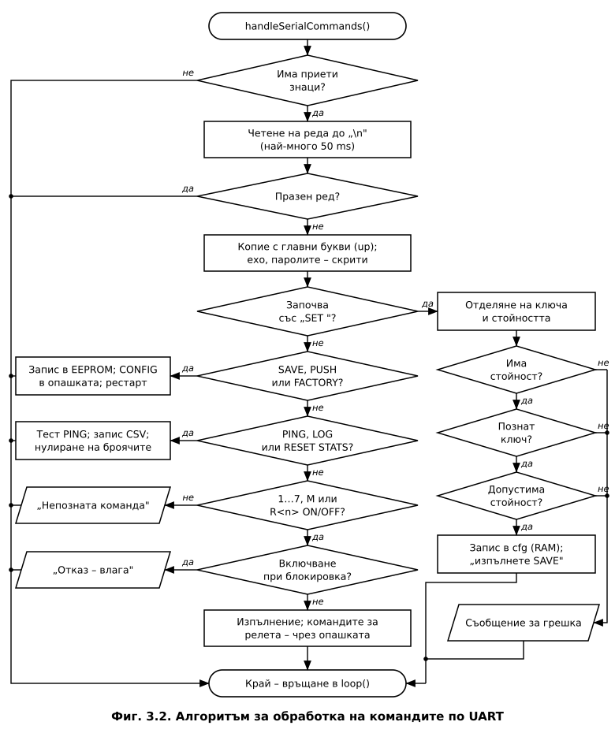
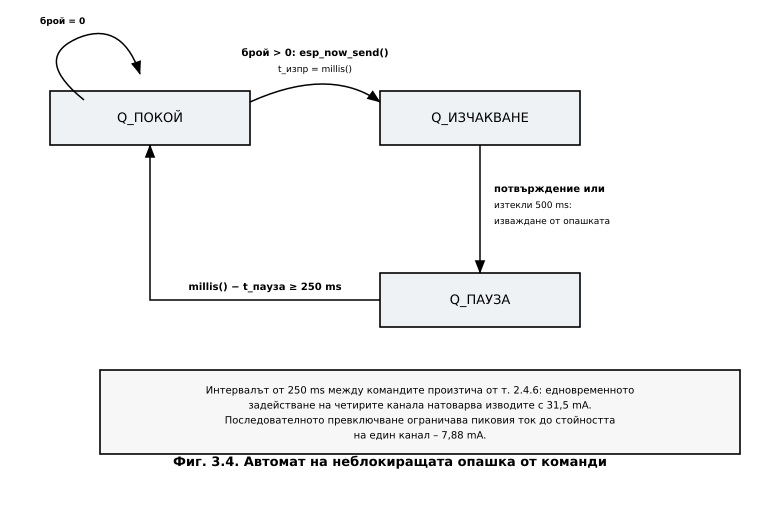
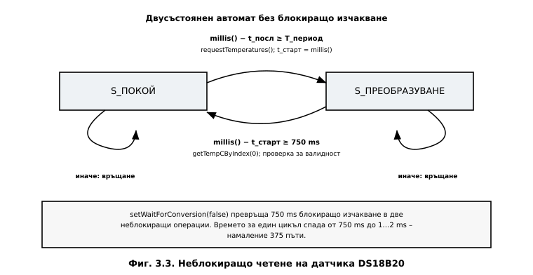
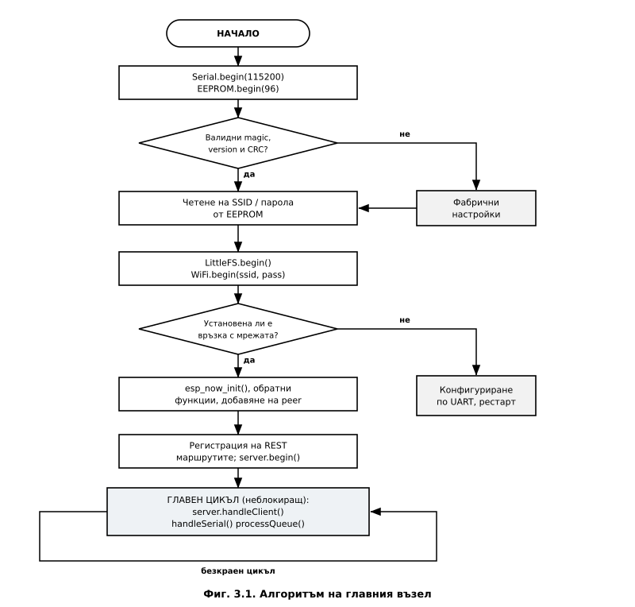

# ГЛАВА ТРЕТА
# СОФТУЕРНО ПРОЕКТИРАНЕ НА СИСТЕМАТА

---

## 3.1. Принципи на софтуерната организация

Програмното осигуряване на двата възела е изградено върху **кооперативна многозадачност
без операционна система**. При този подход главният цикъл последователно извиква
обслужващите функции на всички подсистеми, като **всяка от тях е задължена да върне
управлението за възможно най-кратко време**.

Основното следствие е забраната за използване на блокиращи конструкции – `delay()`,
циклично изчакване (*busy-wait*) и синхронни операции с дълго време за изпълнение.
Вместо това всяка подсистема се реализира като **краен автомат** (*finite state machine*),
чието състояние се съхранява в статични променливи, а преходите се управляват от
сравнения на текущия момент `millis()` със запомнени времеви отпечатъци.

**Количествена обосновка.** В Глава 2 беше установено, че най-бавният фронт на сигнала
след RC филтъра на бутоните настъпва за **13,86 ms**. За надеждно разпознаване на
натискане са необходими поне пет отчета в рамките на този интервал, откъдето следва
изискването към продължителността на един цикъл:

$$T_{\text{цикъл}} \le \frac{t_{\text{отп}}}{5} = \frac{13{,}86}{5} \approx 2{,}8\ \text{ms}$$

**Таблица 3.1. Брой отчети на един фронт в зависимост от времето на цикъла**

| $T_{\text{цикъл}}$ | Брой отчети | Оценка |
|---|---|---|
| 1 ms | 13,9 | достатъчно |
| 2 ms | 6,9 | достатъчно |
| 5 ms | 2,8 | недостатъчно |
| 10 ms | 1,4 | недостатъчно |
| **750 ms** (блокиращо четене) | **0,018** | **неработоспособно** |

Последният ред е определящ: **едно-единствено блокиращо четене на DS18B20 би направило
системата неработоспособна** по отношение на ръчното управление. Постигнатото време за
цикъл от 1…2 ms е **375 пъти по-малко** от блокиращия вариант.

---

## 3.2. Организация на енергонезависимата памет и конфигуриране по UART

### 3.2.1. Разпределение на 96-байтовия буфер

Съгласно т. 5 от заданието мрежовите параметри не се кодират в програмата, а се съхраняват
в емулирана енергонезависима памет. ESP8266 не разполага с физическа EEPROM памет –
библиотеката `EEPROM` [23] емулира такава чрез отделен сектор от SPI Flash паметта, който се
прочита в оперативната памет при `EEPROM.begin()` и се записва обратно при `commit()`.

**Таблица 3.2. Разпределение на конфигурационния буфер (96 байта)**

| Отместване | Размер | Поле | Предназначение |
|---|---|---|---|
| 0…3 | 4 B | `magic` | признак `0x484D4331` за валиден запис |
| 4 | 1 B | `version` | версия на структурата |
| 5…37 | 33 B | `ssid[33]` | 32 знака + нулев байт (IEEE 802.11: max 32) |
| 38…78 | 41 B | `pass[41]` | 40 знака + нулев байт |
| 79…84 | 6 B | `peerMac[8]` | MAC адрес на отсрещния възел |
| 85 | 1 B | `wifiChannel` | работен канал 1…13 |
| 86 | 1 B | `flags` | служебни флагове |
| 87…91 | 5 B | `reserved` | резерв за бъдещо разширение |
| 92…95 | 4 B | `crc32` | контролна сума на предходните 92 байта |

> **Забележка за ограничението.** Стандартът WPA2-PSK допуска пароли с дължина 8…63 знака.
> Приетият обем от 96 байта позволява съхранението на **до 40 знака**, което покрива
> практически всички битови мрежи, но е формално ограничение на реализацията. При
> необходимост полето `reserved` може да бъде преразпределено в полза на паролата.

### 3.2.2. Структура и защита на целостта

**Листинг 3.1. Структура на конфигурацията и изчисляване на контролната сума**

```cpp
#define CFG_MAGIC    0x484D4331UL   // "HMC1"
#define CFG_VERSION  1
#define EEPROM_SIZE  96

typedef struct {
    uint32_t magic;          // признак за валиден запис
    uint8_t  version;        // версия на структурата
    char     ssid[33];       // име на мрежата
    char     pass[41];       // парола
    uint8_t  peerMac[6];     // MAC на отсрещния възел
    uint8_t  wifiChannel;    // работен канал
    uint8_t  flags;
    uint8_t  reserved[5];
    uint32_t crc;            // контролна сума на предходните полета
} Config;

static_assert(sizeof(Config) == EEPROM_SIZE,
              "Структурата трябва да заема точно 96 байта");

Config cfg;

// CRC-32 (полином 0xEDB88320) – използва се и от двата възела
uint32_t crc32(const uint8_t *data, size_t len) {
  uint32_t crc = 0xFFFFFFFF;
  for (size_t i = 0; i < len; i++) {
    crc ^= data[i];
    for (uint8_t b = 0; b < 8; b++)
      crc = (crc >> 1) ^ (0xEDB88320UL & (-(int32_t)(crc & 1)));
  }
  return ~crc;
}
```

Директивата `static_assert` осигурява **проверка на етапа на компилиране**: ако при
промяна на структурата размерът ѝ се отклони от 96 байта, компилацията ще бъде прекратена
с грешка, вместо да се получи трудно откриваема грешка по време на изпълнение.

Валидността на записа се проверява по **три независими признака**: сигнатура `magic`,
номер на версията и контролна сума CRC-32. Първият открива неинициализирана памет, вторият
– несъвместим формат след обновяване на програмата, а третият – повреда на данните при
прекъсване на захранването по време на запис.

**Листинг 3.2. Запис и зареждане на конфигурацията**

```cpp
void saveConfig() {
  cfg.crc = crc32((uint8_t *)&cfg, sizeof(cfg) - sizeof(cfg.crc));
  EEPROM.put(0, cfg);
  if (EEPROM.commit()) Serial.println(F("Конфигурацията е записана."));
  else                 Serial.println(F("ГРЕШКА при запис в EEPROM!"));
}

void loadConfig() {
  EEPROM.get(0, cfg);
  uint32_t calc = crc32((uint8_t *)&cfg, sizeof(cfg) - sizeof(cfg.crc));
  if (cfg.magic != CFG_MAGIC || cfg.version != CFG_VERSION || cfg.crc != calc) {
    Serial.println(F("Няма валидна конфигурация – фабрични настройки."));
    setDefaults();
    saveConfig();
  }
}
```

### 3.2.3. Алгоритъм за разбор на командите

Алгоритъмът за обработка на постъпващите по серийния интерфейс команди е представен на
**Фиг. 3.2**.



**Таблица 3.3. Набор от команди по UART**

| Команда | Действие | Валидация |
|---|---|---|
| `SSID=<име>` | задава името на мрежата | дължина ≤ 32 знака |
| `PASS=<парола>` | задава паролата | дължина 8…40 знака |
| `SAVE` | записва конфигурацията в EEPROM | изчислява CRC |
| `SHOW` | извежда текущата конфигурация | паролата не се показва |
| `RESET` | фабрични настройки и рестарт | – |

**Листинг 3.3. Разбор на командите**

```cpp
void handleSerialCommands() {
  if (Serial.available() <= 0) return;      // неблокираща проверка

  String raw = Serial.readStringUntil('\n');
  raw.trim();
  if (raw.length() == 0) return;

  if (raw.startsWith("SSID=")) {
    String v = raw.substring(5);
    if (v.length() == 0 || v.length() > 32) {
      Serial.println(F("Грешка: дължината трябва да е 1…32 знака."));
      return;
    }
    strncpy(cfg.ssid, v.c_str(), sizeof(cfg.ssid) - 1);
    cfg.ssid[sizeof(cfg.ssid) - 1] = '\0';
    Serial.println(F("SSID е приет. Изпълнете SAVE."));
  }
  else if (raw.startsWith("PASS=")) {
    String v = raw.substring(5);
    if (v.length() < 8 || v.length() > 40) {
      Serial.println(F("Грешка: дължината трябва да е 8…40 знака."));
      return;
    }
    strncpy(cfg.pass, v.c_str(), sizeof(cfg.pass) - 1);
    cfg.pass[sizeof(cfg.pass) - 1] = '\0';
    Serial.println(F("Паролата е приета. Изпълнете SAVE."));
  }
  else if (raw == "SAVE")  { saveConfig(); }
  else if (raw == "SHOW")  { printConfig(); }
  else if (raw == "RESET") { setDefaults(); saveConfig(); ESP.restart(); }
  else Serial.println(F("Непозната команда."));
}
```

Три особености на реализацията заслужават внимание:

**а) Запазване на регистъра.** Разборът се извършва върху **оригиналния ред**, а не върху
превърнат към главни букви. Това е задължително, тъй като имената на мрежите и паролите
са чувствителни към регистъра. Сравнението на служебните команди се прави поотделно.

**б) Неблокираща проверка.** Функцията започва с проверка `Serial.available() <= 0` и
незабавно връща управлението при липса на данни. В `setup()` допълнително се задава
`Serial.setTimeout(50)`, което ограничава изчакването при непълен ред.

**в) Защита от препълване.** Използва се `strncpy` с ограничение `sizeof(поле) - 1` и явно
поставяне на нулев байт. Дължината се проверява **преди** копирането, а не се разчита
само на отрязването.

---

## 3.3. Комуникационен обмен по ESP-NOW

### 3.3.1. Структури на обменяните данни

Обменът използва две структури с **фиксиран размер**, идентични в двата възела. Тъй като
ESP-NOW пренася нетипизиран блок от байтове, съвпадението на структурите е условие за
правилна работа.

**Листинг 3.4. Структури на обмена**

```cpp
#define PROTO_VERSION 1
#define CMD_RELAY     0
#define CMD_RESTART   1
#define CMD_CONFIG    2

// Телеметрия: подчинен -> главен възел
typedef struct {
    uint8_t  protoVersion;
    uint32_t readingId;        // пореден номер на пакета
    float    temperature;      // °C от DS18B20
    bool     relayState[4];    // действително състояние на изходите
    bool     sensorValid;      // валидност на последното четене
    uint32_t freeHeap;
    uint32_t loopTime;         // време на последния цикъл, ms
    uint32_t uptime;           // s
    uint32_t successPackets;
    uint32_t failedPackets;
} TelemetryMsg;

// Команда: главен -> подчинен възел
typedef struct {
    uint8_t  protoVersion;
    uint8_t  cmdType;
    uint8_t  relayIndex;       // 0…3
    bool     relayState;
    uint32_t seq;              // пореден номер срещу дублиране
} ControlMsg;
```

Полето `protoVersion` позволява **отхвърляне на пакети от несъвместима версия**, а полето
`seq` – разпознаване на дублирани пакети. Последното е необходимо, тъй като ESP-NOW не
гарантира еднократна доставка: при загубено потвърждение подателят може да повтори
изпращането.

### 3.3.2. Обратни функции и правила за тях

**Листинг 3.5. Обратни функции на подчинения възел**

```cpp
volatile bool     cmdPending = false;
volatile uint8_t  pendingIdx = 0;
volatile bool     pendingState = false;
uint32_t          lastSeq = 0;

void OnDataSent(uint8_t *mac, uint8_t sendStatus) {
  if (sendStatus == 0) successPackets++;
  else                 failedPackets++;
}

void OnDataRecv(uint8_t *mac, uint8_t *data, uint8_t len) {
  if (len != sizeof(ControlMsg)) return;          // чужд или повреден пакет
  ControlMsg in;
  memcpy(&in, data, sizeof(in));
  if (in.protoVersion != PROTO_VERSION) return;   // несъвместима версия
  if (in.seq == lastSeq) return;                  // дублиран пакет
  lastSeq = in.seq;

  pendingIdx   = in.relayIndex;                   // само запомняне
  pendingState = in.relayState;
  cmdPending   = true;                            // обработка в loop()
}
```

Обратните функции на ESP-NOW се изпълняват в **контекста на системната задача на
радиостека** [12, 24]. Затова в тях е недопустимо да се извършват продължителни операции, работа
със серийния порт или достъп до Flash паметта. Приетото решение е обратната функция
**единствено да запомни получените данни** и да вдигне флаг, а действителната обработка
да се извърши в главния цикъл. Променливите, споделяни между двата контекста, са
обявени като `volatile`.

### 3.3.3. Неблокираща опашка от команди

Наивната реализация на изпращането изчаква потвърждението в цикъл:

```cpp
esp_now_send(peer, data, len);
while (waitingForAck) { }        // ГРЕШНО: блокира целия цикъл
```

Такава конструкция блокира уеб сървъра и обработката на бутоните за целия срок на
изчакване. Вместо нея е реализиран **тристъпков краен автомат** (**Фиг. 3.4**).



**Листинг 3.6. Автомат на опашката**

```cpp
#define QUEUE_SIZE      12
#define ACK_TIMEOUT_MS  500
#define CMD_SPACING_MS  250

typedef struct { uint8_t relayIndex; bool state; } QueueItem;
QueueItem cmdQueue[QUEUE_SIZE];
uint8_t qHead = 0, qCount = 0;

// Вдигат се при изпращане и се обновяват от OnDataSent() на главния възел
volatile bool waitingForDelivery = false;
volatile bool deliverySuccess    = false;

enum QState { Q_IDLE, Q_WAIT_ACK, Q_COOLDOWN };
QState qState = Q_IDLE;
unsigned long qSendTime = 0, qCooldownStart = 0;

void processQueue() {
  switch (qState) {

    case Q_IDLE:
      if (qCount > 0) {
        sendControl(CMD_RELAY, cmdQueue[qHead].relayIndex, cmdQueue[qHead].state);
        qSendTime = millis();
        qState = Q_WAIT_ACK;
      }
      break;

    case Q_WAIT_ACK:
      if (!waitingForDelivery) {                  // получено потвърждение
        if (deliverySuccess)
          relayState[cmdQueue[qHead].relayIndex] = cmdQueue[qHead].state;
        else
          setError(F("Подчиненият модул не отговаря"));
        qHead = (qHead + 1) % QUEUE_SIZE; qCount--;
        qCooldownStart = millis(); qState = Q_COOLDOWN;
      }
      else if (millis() - qSendTime > ACK_TIMEOUT_MS) {
        waitingForDelivery = false;
        setError(F("Изтекло време за потвърждение"));
        qHead = (qHead + 1) % QUEUE_SIZE; qCount--;
        qCooldownStart = millis(); qState = Q_COOLDOWN;
      }
      break;

    case Q_COOLDOWN:
      if (millis() - qCooldownStart >= CMD_SPACING_MS) qState = Q_IDLE;
      break;
  }
}
```

**Обосновка на интервала между командите.** Стойността `CMD_SPACING_MS = 250` произтича
пряко от хардуерното оразмеряване в т. 2.4.6: едновременното задействане на четирите
канала натоварва изводите на микроконтролера със сумарен ток **31,5 mA**. Принудителната
пауза между командите осигурява **последователно, а не едновременно** задействане, при
което пиковият ток е ограничен до стойността за един канал – **7,88 mA**. Така софтуерното
решение компенсира хардуерно ограничение – типичен пример за взаимното влияние между
двата етапа на проектирането.

### 3.3.4. Синхронизация на работния канал

ESP8266 разполага с **един радиочестотен тракт**, поради което интерфейсът за станция и
ESP-NOW работят на един и същ физически канал (т. 1.1.6). Главният възел получава канала
си от точката за достъп, докато подчиненият възел не е асоцииран към мрежа и **не знае
този канал**.

Приетото решение е подчиненият възел да стартира **скрита точка за достъп** с единствената
цел да фиксира работния канал:

```cpp
WiFi.mode(WIFI_AP_STA);
WiFi.softAP("hidden_slave", "", cfg.wifiChannel, /* hidden = */ 1);
```

Главният възел при стартиране сравнява канала на рутера със записания в конфигурацията и
при разминаване извежда предупреждение по UART, тъй като в такъв случай ESP-NOW обменът
е невъзможен.

---

## 3.4. Уеб сървър с файлова система LittleFS

### 3.4.1. Организация на файловата система

Статичното съдържание на потребителския интерфейс се съхранява в **LittleFS** [25] – файлова
система с износоустойчиво разпределение, изградена върху свободната област от SPI Flash
паметта.

| Файл | Предназначение | Приблизителен обем |
|---|---|---|
| `/index.html` | структура на страницата | ≈ 3 kB |
| `/style.css` | оформление | ≈ 2 kB |
| `/app.js` | клиентска логика (Fetch API) | ≈ 3 kB |

Отделянето на интерфейса от изпълнимия код има три предимства: **актуализация без
прекомпилиране** на фърмуера; **намален обем на изображението** на програмата; и
**възможност за разделно тестване** на клиентската част в обикновен браузър.

### 3.4.2. RESTful интерфейс

Интерфейсът е изграден съгласно архитектурния стил **REST** [26].

**Таблица 3.4. Маршрути на приложния програмен интерфейс**

| Метод | Маршрут | Действие | Отговор |
|---|---|---|---|
| `GET` | `/` | сервира `index.html` от LittleFS | `text/html` |
| `GET` | `/api/state` | текущо състояние на системата | `application/json` |
| `POST` | `/api/relay?id=N&state=0\|1` | превключва канал `N` | `application/json` |
| `POST` | `/api/relay/all?state=0\|1` | превключва всички канали | `application/json` |
| `GET` | `/api/config` | мрежова конфигурация | `application/json` |

**Листинг 3.7. Регистрация на маршрутите**

```cpp
#include <LittleFS.h>

#define B(x) ((x) ? "true" : "false")   // съкращение за булев литерал в JSON

void setupWebServer() {
  if (!LittleFS.begin()) {
    Serial.println(F("ГРЕШКА: LittleFS не може да бъде монтирана."));
    return;
  }
  // статичното съдържание се сервира направо от файловата система
  server.serveStatic("/", LittleFS, "/index.html");
  server.serveStatic("/style.css", LittleFS, "/style.css");
  server.serveStatic("/app.js",    LittleFS, "/app.js");

  server.on("/api/state", HTTP_GET, []() {
    char json[320];
    snprintf(json, sizeof(json),
      "{\"temperature\":%.2f,\"sensorValid\":%s,\"id\":%lu,"
      "\"relays\":[%s,%s,%s,%s],\"uptime\":%lu,\"loopTime\":%lu,"
      "\"queue\":%u,\"linkAlarm\":%s}",
      lastTemp, lastSensorValid ? "true" : "false", (unsigned long)lastId,
      B(relayState[0]), B(relayState[1]), B(relayState[2]), B(relayState[3]),
      (unsigned long)lastUptime, (unsigned long)lastLoopTime,
      qCount, linkAlarm() ? "true" : "false");
    server.send(200, "application/json", json);
  });

  server.on("/api/relay", HTTP_POST, []() {
    int idx = server.arg("id").toInt();
    int st  = server.arg("state").toInt();
    if (idx < 0 || idx > 3) {
      server.send(400, "application/json", "{\"error\":\"Невалиден индекс\"}");
      return;
    }
    if (!enqueueRelay(idx, st != 0)) {
      server.send(503, "application/json", "{\"error\":\"Опашката е пълна\"}");
      return;
    }
    server.send(202, "application/json", "{\"queued\":true}");
  });

  server.begin();
}
```

Съществени особености:

**а) Кодът за състояние 202 (Accepted).** Командата се поставя в опашката, но към момента
на отговора **още не е изпълнена**. Връщането на 202 вместо 200 отразява коректно
асинхронния характер на операцията: действителното състояние пристига със следващия пакет
телеметрия.

**б) Използване на `snprintf` вместо конкатенация на `String`.** Многократното
долепяне на обекти `String` предизвиква **фрагментация на динамичната памет**, която при
непрекъснато работещо устройство води до отказ след часове или дни. Форматирането в
статичен буфер с явно указан размер изключва този клас неизправности.

**в) Паролата не се предоставя през интерфейса.** Маршрутът `/api/config` връща името на
мрежата и работния канал, но **никога** съдържанието на полето `pass`.

### 3.4.3. Клиентска част – асинхронни заявки

**Листинг 3.8. Клиентска логика (фрагмент от `app.js`)**

```javascript
const REFRESH_MS = 1000;

async function fetchState() {
  try {
    const r = await fetch('/api/state');
    if (!r.ok) throw new Error('HTTP ' + r.status);
    const d = await r.json();

    document.getElementById('temp').textContent =
        d.sensorValid ? d.temperature.toFixed(2) : '--';
    d.relays.forEach((s, i) => updateButton(i, s));
    setStatus(d.linkAlarm ? 'няма връзка с подчинения възел' : 'онлайн');
  } catch (e) {
    setStatus('връзката е прекъсната');
  }
}

async function toggleRelay(idx, state) {
  const r = await fetch(`/api/relay?id=${idx}&state=${state ? 1 : 0}`,
                        { method: 'POST' });
  const d = await r.json();
  if (d.error) alert(d.error);
}

setInterval(fetchState, REFRESH_MS);
```

Използването на **Fetch API** [27] с `async/await` осигурява **асинхронно обновяване без
презареждане на страницата**. Заявките се изпълняват в изчаквателния цикъл на браузъра,
без да блокират потребителския интерфейс. Обработката на грешки чрез `try/catch` позволява
да се разграничи **отпадането на връзката с главния възел** (неуспешна заявка) от
**отпадането на връзката с подчинения възел** (успешна заявка с флаг `linkAlarm`).

> **Уточнение относно понятието „асинхронен".** Използваната библиотека
> `ESP8266WebServer` е синхронна – заявките се обслужват при извикване на
> `handleClient()`. Асинхронността, която потребителят възприема, се осигурява от
> **клиентската страна** чрез Fetch API. Тъй като всички обработчици завършват за
> микросекунди (поставяне в опашка или форматиране на низ), те не нарушават изискването
> за кратък цикъл. Алтернативата `ESPAsyncWebServer` би пренесла обслужването в
> прекъсвания, но налага ограничения върху действията в обработчиците, съпоставими с тези
> при обратните функции на ESP-NOW.

---

## 3.5. Неблокиращ измервателен канал

Библиотеката `DallasTemperature` [28] по подразбиране изчаква завършването на преобразуването
в блокиращ цикъл. Извикването `setWaitForConversion(false)` разделя операцията на две
независими части, което позволява реализацията на двусъстоянен автомат (**Фиг. 3.3**).



**Листинг 3.9. Неблокиращо четене на DS18B20**

```cpp
#include <OneWire.h>
#include <DallasTemperature.h>

#define ONE_WIRE_PIN     D7
#define CONVERSION_MS    750     // време за 12-битово преобразуване
#define MEASURE_PERIOD   2000    // период на измерване

OneWire oneWire(ONE_WIRE_PIN);
DallasTemperature sensors(&oneWire);

enum SensorState { S_IDLE, S_CONVERTING };
SensorState sState = S_IDLE;
unsigned long sLastRead = 0, sConvStart = 0;
float  lastValidTemp = 0.0;
bool   haveValidReading = false;
uint16_t sensorErrors = 0;

void setupSensor() {
  sensors.begin();
  sensors.setResolution(12);
  sensors.setWaitForConversion(false);   // ключово: без блокиращо изчакване
}

void handleSensor() {
  unsigned long now = millis();

  switch (sState) {
    case S_IDLE:
      if (now - sLastRead >= MEASURE_PERIOD) {
        sensors.requestTemperatures();   // връща управлението незабавно
        sConvStart = now;
        sState = S_CONVERTING;
      }
      break;

    case S_CONVERTING:
      if (now - sConvStart >= CONVERSION_MS) {
        float t = sensors.getTempCByIndex(0);
        if (t == DEVICE_DISCONNECTED_C || t < -55.0 || t > 125.0) {
          sensorErrors++;                // задържа се последната валидна стойност
        } else {
          lastValidTemp = t;
          haveValidReading = true;
        }
        sLastRead = now;
        sState = S_IDLE;
      }
      break;
  }
}
```

**Задържане на последната валидна стойност.** При неуспешно четене се увеличава броячът
на грешките, но **не се записва нулева стойност**. Ако това не се направи, при единична
грешка потребителският панел би показал подвеждащите 0 °C, което е неразличимо от
действително измерена нула.

---

## 3.6. Обслужване на органите за ръчно управление

Хардуерният RC филтър от т. 2.5 потиска контактното трептене, но **не гарантира
разпознаване на фронта**. Затова програмно се реализира допълнително потвърждение на
устойчивото ниво – без използване на `delay()`.

**Листинг 3.10. Неблокиращо обслужване на бутон**

```cpp
#define DEBOUNCE_MS 30

bool btnStable = HIGH, btnLastRead = HIGH;
unsigned long btnLastChange = 0;

void handleButtons() {
  unsigned long now = millis();
  bool r = digitalRead(BUTTON_TOGGLE_PIN);

  if (r != btnLastRead) {                 // регистрирана промяна
    btnLastRead   = r;
    btnLastChange = now;                  // рестартира отчитането
  }
  else if (now - btnLastChange > DEBOUNCE_MS && r != btnStable) {
    btnStable = r;
    if (btnStable == LOW)                 // фронт на натискане
      applyRelay(0, !relayState[0]);
  }
}
```

Програмният праг `DEBOUNCE_MS = 30` е избран по-голям от времето на нарастване на
напрежението във филтъра (13,86 ms), но достатъчно малък, за да остане незабележим за
потребителя. Двете нива на защита – **хардуерно и софтуерно** – образуват независими
механизми: филтърът потиска електрическите импулси, а автоматът потвърждава устойчивостта
на логическото ниво.

---

## 3.7. Главен цикъл

Алгоритъмът на главния възел е представен на **Фиг. 3.1**.



**Листинг 3.11. Главни цикли на двата възела**

```cpp
// --------- ГЛАВЕН ВЪЗЕЛ ---------
void loop() {
  server.handleClient();      // обслужване на HTTP заявките
  MDNS.update();
  handleSerialCommands();     // конфигуриране по UART
  processQueue();             // неблокиращо изпращане на командите
}

// --------- ПОДЧИНЕН ВЪЗЕЛ ---------
void loop() {
  unsigned long loopStart = millis();

  handleButtons();            // ръчно управление
  handleEspNowIncoming();     // изпълнение на приетите команди
  handleSensor();             // неблокиращо измерване
  sendTelemetryIfDue();       // периодична телеметрия

  lastLoopDuration = millis() - loopStart;   // за диагностика
}
```

Нито една от извикваните функции не съдържа блокиращи конструкции. Измереното време за
един цикъл `lastLoopDuration` се включва в телеметрията и се извежда в диагностичния
панел – това позволява **количествена проверка на изискването за неблокиращо изпълнение**
по време на работа, а не само по време на разработката.

**Таблица 3.5. Разпределение на времето в един цикъл на подчинения възел**

| Функция | Типично време | Забележка |
|---|---|---|
| `handleButtons()` | < 0,05 ms | две операции `digitalRead` |
| `handleEspNowIncoming()` | < 0,1 ms | изпълнява се само при приета команда |
| `handleSensor()` | < 0,1 ms | сравнение; обмен по 1-Wire само двукратно на период |
| `sendTelemetryIfDue()` | ≈ 1 ms | само веднъж на 2000 ms |
| **Общо** | **1…2 ms** | |

---

## 3.8. Изводи по Глава 3

1. Софтуерът е изграден върху **кооперативна многозадачност без операционна система**,
   при която всяка подсистема е реализирана като **краен автомат**, а блокиращите
   конструкции са изключени.
2. Количествено е обосновано изискването към главния цикъл: $T_{\text{цикъл}} \le 2{,}8$ ms,
   изведено от времеконстантата на RC филтъра. Постигнатите **1…2 ms** са **375 пъти**
   по-малко от блокиращия вариант.
3. Разработена е структура на **96-байтовия конфигурационен буфер** с тристепенна защита
   на целостта (`magic`, `version`, CRC-32) и проверка на размера на етапа на компилиране.
4. Реализиран е **алгоритъм за конфигуриране по UART** с команди `SSID=` и `PASS=`, който
   премахва твърдо кодираните мрежови данни съгласно т. 5 от заданието.
5. Реализиран е **тристъпков автомат за опашката от команди**, чийто интервал от 250 ms
   произтича пряко от хардуерното ограничение по сумарен ток от т. 2.4.6.
6. Реализиран е **уеб сървър с LittleFS** и RESTful интерфейс с асинхронни заявки от
   страна на клиента чрез Fetch API; използването на `snprintf` вместо конкатенация на
   `String` изключва фрагментацията на динамичната памет.
7. Реализирано е **неблокиращо четене на DS18B20** чрез `setWaitForConversion(false)` със
   задържане на последната валидна стойност при грешка.
