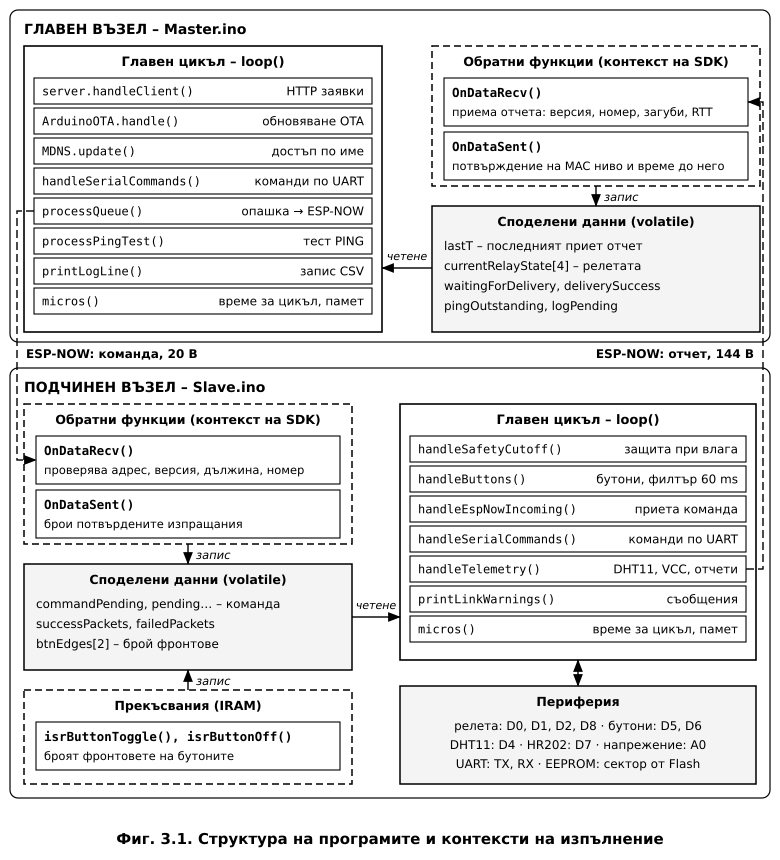
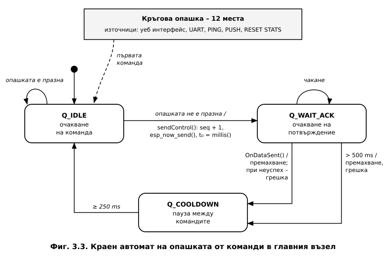
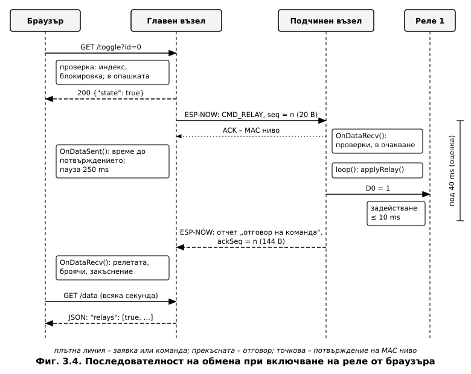
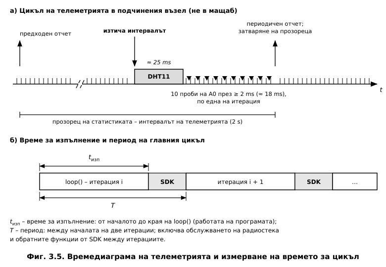
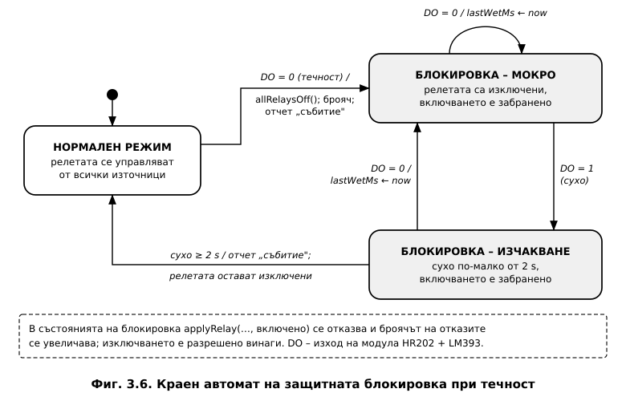
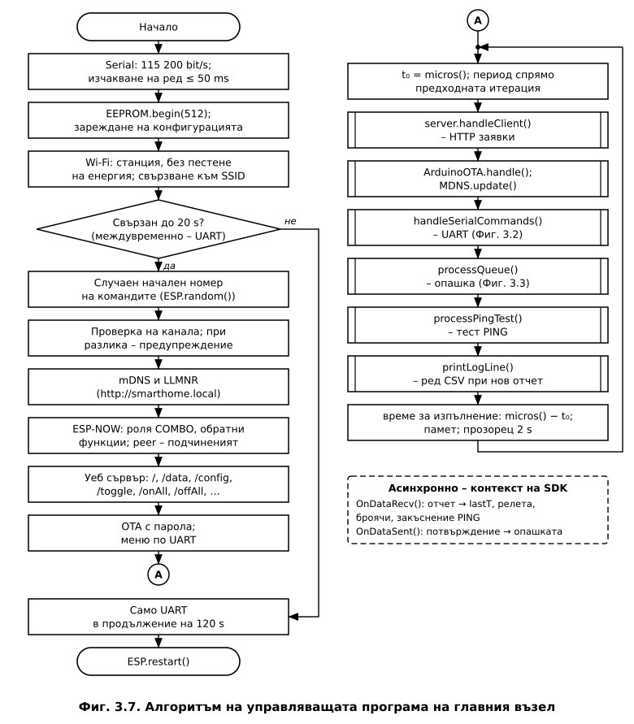
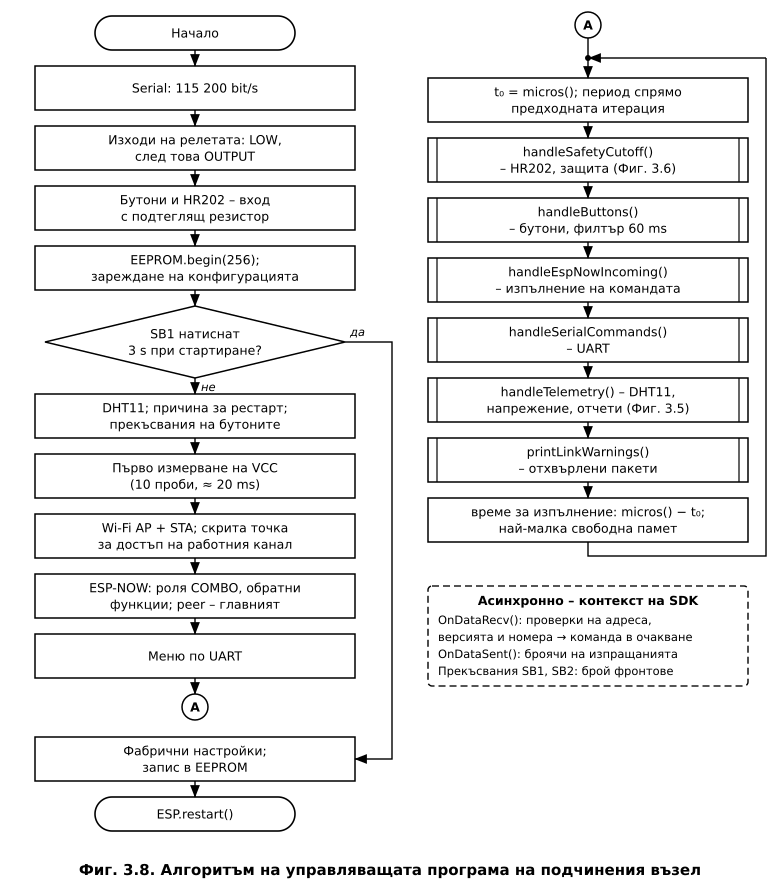

# ГЛАВА ТРЕТА
# СОФТУЕРНО ПРОЕКТИРАНЕ НА СИСТЕМАТА

---

## 3.1. Организация на програмното осигуряване

Програмното осигуряване реализира т. 4.4 от заданието – алгоритъма на управляващата програма
– и т. 3.5 – конфигурирането по UART. Освен управлението на релетата, телеметрията и
защитата при влага (датчик HR202) програмите измерват сами показателите, които се изследват в Глава 4:
време за цикъл, закъснение и загуби на пакети, трептене на бутоните.

Програмата на всеки възел е един файл на C++ – около 1560 реда за главния (`Master.ino`) и
около 1080 реда за подчинения възел (`Slave.ino`). Описана е версия 3 на програмите, а
разликите спрямо версия 2 са посочени там, където са съществени. Използвано е ядрото Arduino
за ESP8266, версия 3.1.2 [25], което е надстройка над Non-OS SDK [32], и
библиотеките `ESP8266WiFi`, `espnow` [12], `EEPROM`, `ESP8266WebServer`,
`ESP8266mDNS`, `ArduinoOTA` и `DHT sensor library` 1.4.6 [28].

### 3.1.1. Модел на изпълнение

ESP8266 не изпълнява операционна система с приоритетни задачи. Ядрото извиква еднократно
`setup()`, а след това – многократно `loop()`. След всяко завършване на `loop()`, както и при
`delay()` и `yield()`, управлението се предава на SDK, който обслужва радиостека и TCP/IP.
Затова участъци от програмата с продължителност над 50 ms трябва да се избягват [25].

Приетият модел е **кооперативна многозадачност**. Всяка подсистема е функция, която се
извиква във всяка итерация на `loop()`, проверява дали има работа и връща управлението, без
да чака. Изчакването се реализира чрез сравнение на `millis()` или `micros()` със запомнен
момент. Разликата се изчислява с беззнакова аритметика и остава вярна и при препълването на
брояча (за `micros()` – на всеки $2^{32}$ µs ≈ 71,6 min).

Освен главния цикъл има още два контекста на изпълнение (**Фиг. 3.1**):

- **обратните функции на ESP-NOW** – извикват се от системния контекст на SDK между две
  итерации на `loop()` или по време на `delay()`. В тях не се допускат изчакване,
  продължителна работа и извеждане по UART [12, 25];
- **обработчиците на прекъсвания** от бутоните – изпълняват се веднага при фронта и трябва
  да са в оперативната памет за инструкции (атрибут `IRAM_ATTR`) [25].



Обменът между контекстите следва едно правило: **обратната функция и обработчикът на
прекъсване само записват данни и вдигат флаг, а действието се изпълнява в главния цикъл.**
Споделените променливи са обявени като `volatile`. Така изходите и серийният порт никога не
се достъпват едновременно от два контекста.

### 3.1.2. Изисквания към времето за цикъл

Горната граница на времето за изпълнение на една итерация се определя от три условия:
работата на радиостека (под 50 ms [25]); филтъра на бутоните, който приема ново
състояние след 60 ms без промяна (т. 2.5.3) и затова изисква многократна проверка на входа в
този интервал; и възприемането от потребителя – реакция до 100 ms изглежда мигновена
[27].

Единствената съзнателно блокираща операция е четенето на DHT11 – около 25 ms на всеки 2 s
(т. 2.6.1). Ако натискането съвпадне с него, промяната се отчита с до 25 ms закъснение, след
което тече интервалът на филтъра:

$$t_{\text{реакция,max}} \approx t_{\text{DHT}} + t_{\text{филтър}} = 25 + 60 = 85\ \text{ms} < 100\ \text{ms}$$

Промените спрямо версия 2 са обобщени в **Таблица 3.1**.

**Таблица 3.1. Операции с продължително изпълнение в подчинения възел**

| Операция | Версия 2 | Версия 3 |
|---|---|---|
| Четене на DHT11 | ≈ 25 ms на всеки 2 s | ≈ 25 ms на всеки 2 s |
| Измерване на напрежението (10 проби) | блокиращо, 10 × `delay(2)` ≈ 20 ms | неблокиращо, по една проба на итерация |
| Най-дълга итерация (оценка) | ≈ 45 ms | ≈ 25 ms |
| Отчитане на времето за цикъл | `millis()`, разделителна способност 1 ms | `micros()`, разделителна способност 1 µs |

---

## 3.2. Конфигуриране и енергонезависима памет

### 3.2.1. Структура на конфигурацията

ESP8266 няма вградена EEPROM памет. Библиотеката `EEPROM` зарежда в оперативната памет
отделен сектор от Flash паметта, а `commit()` го изтрива и записва наново [25].
Конфигурацията е структура от 244 B в главния и 24 B в подчинения възел (**Таблица 3.2**).

**Таблица 3.2. Конфигурационни параметри**

| Параметър | Възел | По подразбиране | Допустими стойности |
|---|---|---|---|
| Име на мрежата (SSID) / парола | Г | – | до 32 / до 64 знака |
| Име за mDNS | Г | `smarthome` | до 31 знака |
| MAC адрес на другия възел | Г, П | адресът в макета | `xx:xx:xx:xx:xx:xx` |
| Wi-Fi канал на подчинения възел | Г, П | 6 | 1…13 |
| Интервал на телеметрията | Г, П | 2000 ms | 500…60 000 ms |
| Корекция на напрежението | Г, П | 0 V | −2…+2 V |
| Парола за OTA | Г | `esp8266ota` | до 32 знака |
| Уеб потребител / парола; автентикация | Г | `admin` / `admin`; изкл. | до 16 / 32 знака; 0 или 1 |
| Праг за авария на връзката | Г | 10 s | 3…300 s |

*Г – главен възел; П – подчинен възел.*

Целостта на записа се проверява по три признака: **сигнатура** („HMC1" или „HMS1"), която
открива неинициализирана памет; **версия на формата**, която открива запис от друга версия на
програмата; и **контролна сума CRC-32** на останалите байтове, която открива повреда при
прекъсване на захранването по време на запис. Запис от версия 2 с вярна сигнатура и
контролна сума се **прехвърля** автоматично – разположението на полетата е същото, затова се
сменя само номерът на версията, а корекцията на напрежението се нулира, тъй като във версия 2
тя не се прилагаше. Във всички останали случаи се зареждат фабричните настройки. Записът във
Flash паметта се извършва само по команда, никога периодично, затова ограниченият брой
цикли на изтриване практически не се изчерпва.

### 3.2.2. Команден интерфейс по UART

Серийният интерфейс работи със 115 200 bit/s, формат 8N1. Всяка команда е ред текст
(**Таблица 3.3**), а алгоритъмът на обработката е даден на **Фиг. 3.2**.

**Таблица 3.3. Команди по UART**

| Команда | Действие | Възел |
|---|---|---|
| `SET SSID <име>`, `SET PASS <парола>`, `SET NAME <име>` | мрежа и име за mDNS | Г |
| `SET MAC`, `SET CHANNEL`, `SET INTERVAL`, `SET VCCOFFSET` | адрес на другия възел, канал, интервал, корекция | Г, П |
| `SET OTAPASS`, `SET WEBUSER`, `SET WEBPASS`, `SET WEBAUTH`, `SET LINKTIMEOUT` | защита на достъпа, праг за авария | Г |
| `SAVE`, `FACTORY` | запис в EEPROM; фабрични настройки и рестарт | Г, П |
| `PUSH` | изпраща интервала, корекцията и канала към подчинения възел | Г |
| `1`…`7`, `M`, `R<n> ON`, `R<n> OFF` | статус, релета, рестарт, конфигурация, измервания, меню | Г, П |
| `PING <n>`, `LOG ON`, `LOG OFF`, `RESET STATS` | тест на закъснението, запис във формат CSV, нулиране на броячите | Г (`RESET STATS` – и П) |


**Листинг 3.1. Разбор на командите `SET <ключ> <стойност>` (фрагмент)**

```cpp
  if (up.startsWith("SET ")) {              // up - редът в главни букви, raw - оригиналът
    int sp = raw.indexOf(' ', 4);           // интервалът след ключа
    String key = (sp < 0 ? raw.substring(4) : raw.substring(4, sp));
    String val = (sp < 0 ? String("") : raw.substring(sp + 1));
    key.trim(); key.toUpperCase(); val.trim();   // стойността запазва регистъра
    if (val.length() == 0) { Serial.println(F("Липсва стойност.")); return; }

    if (key == "SSID") {
      strncpy(cfg.ssid, val.c_str(), sizeof(cfg.ssid) - 1);
      cfg.ssid[sizeof(cfg.ssid) - 1] = 0;
    }
    else if (key == "CHANNEL") {
      int c = val.toInt();
      if (c >= 1 && c <= 13) cfg.wifiChannel = (uint8_t)c;
      else Serial.println(F("Допустим диапазон: 1-13."));
    }
    // ... останалите параметри по същия начин
    return;
  }
```

Реализацията има следните особености:

- **регистърът на стойността се запазва** – ключовите думи се сравняват в главни букви, а
  стойността се взема от оригиналния ред, защото SSID и паролите различават малки и главни
  букви;
- **стойностите се проверяват преди присвояването** (обхват, формат на MAC адреса), а
  текстовете се копират с `strncpy` до размера на полето, с явна завършваща нула;
- **паролите не се извеждат** – в ехото на командата и при показване на конфигурацията те
  са заменени с „***" и „(зададена)"; уеб интерфейсът също не ги предоставя;
- **приемането не блокира цикъла** – при липса на знаци функцията връща управлението веднага,
  а изчакването на непълен ред е ограничено до 50 ms. Затова терминалът трябва да изпраща целия
  ред наведнъж, както серийният монитор на Arduino или PuTTY с локално редактиране на реда.

Промените се правят в оперативната памет и се запазват със `SAVE`. Ако главният възел не се
свърже с мрежата за 20 s, той обслужва само UART още 120 s и се рестартира – така погрешно
въведени SSID или парола се поправят без повторно програмиране. Фабричните настройки на
подчинения възел се възстановяват и без компютър – със задържане на бутона SB1 за 3 s при
подаване на захранването (т. 2.8).

---

## 3.3. Комуникационен протокол по ESP-NOW

### 3.3.1. Съобщения

ESP-NOW пренася до 250 B полезни данни в кадър за управление по IEEE 802.11 от вида
„действие, специфично за производителя". Освен данните кадърът съдържа MAC заглавие,
идентификатори и контролна сума – общо 43 B [10, 12].

Обменът използва две структури, еднакви в двата възела: **отчет** от 144 B от подчинения
към главния възел (**Таблица 3.4**) и **команда** от 20 B в обратна посока
(**Таблица 3.5**). Структурите се предават като блок байтове без преобразуване, което е
допустимо, защото двата възела са с еднакъв процесор и компилатор. Ограничението от 250 B се
проверява при компилиране със `static_assert`.

**Таблица 3.4. Състав на отчета на подчинения възел (144 B)**

| Група | Съдържание | Размер |
|---|---|---|
| Заглавие | версии на протокола и програмата, вид на отчета, канал, пореден номер, номер на последната изпълнена команда | 12 B |
| Датчици и изходи | DHT11: температура, влажност, валидност, брой грешки; HR202: сухо/мокро; блокировка; 4 релета | 17 B |
| Напрежение и конфигурация | сума на пробите от A0, напрежение, интервал, корекция | 12 B |
| Състояние на системата | време на работа, причина за последния рестарт | 36 B |
| Връзка и команди | потвърдени и непотвърдени изпращания, отхвърлени команди | 10 B |
| Време за цикъл | брой итерации, средно и най-голямо време за изпълнение, най-голям период, прозорец, максимум от стартирането | 24 B |
| Памет, бутони, защита | свободна памет и фрагментация; фронтове и натискания на бутоните; задействания и откази на защитата | 31 B |
| Подравняване | – | 2 B |

**Таблица 3.5. Видове команди на главния възел**

| Код | Команда | Действие в подчинения възел |
|---|---|---|
| 0 | `CMD_RELAY` | включва или изключва реле; включването се отказва при блокировка |
| 1 | `CMD_RESTART` | рестарт |
| 2 | `CMD_CONFIG` | запис на интервала, корекцията и канала; при нов канал – рестарт |
| 3 | `CMD_PING` | само отговор – за измерване на закъснението |
| 4 | `CMD_RESET_STATS` | нулира броячите на измерванията |

Всяка команда съдържа версията на протокола и пореден номер `seq`. Отчетите са три вида:
**периодичен** – на всеки интервал на телеметрията (2 s); **отговор на команда** – веднага
след изпълнението ѝ; **събитие** – след натискане на бутон, промяна на датчика за влага HR202
или команда по UART, най-често веднъж на 50 ms.

**Време за предаване.** Горна оценка се получава при най-ниската скорост на IEEE 802.11b –
1 Mbit/s с дълга преамбюла от 192 µs [10]:

$$t_{\text{кадър}} = t_{\text{PLCP}} + \frac{8\,(L + 43)}{R} = 192\ \mu\text{s} + \frac{8 \times (144 + 43)\ \text{bit}}{1\ \text{Mbit/s}} = 1{,}69\ \text{ms}$$

За командата ($L$ = 20 B) времето е 0,70 ms. С кадъра за потвърждение (0,30 ms) един отчет
заема канала за около 2 ms, а една команда – за около 1 ms. При интервал 2 s периодичните
отчети заемат около **0,1 %** от времето на канала, т. е. практически не натоварват домашната
мрежа.

### 3.3.2. Надеждност на обмена

**Две нива на потвърждение.** Обратната функция `OnDataSent` съобщава дали приемникът е
потвърдил кадъра на MAC ниво. Това гарантира приемане от радиоинтерфейса, но не и обработка
от програмата [12]. Затова след всяка изпълнена команда подчиненият възел изпраща отчет
„отговор на команда" с номера ѝ (`ackSeq`) и с действителното състояние на релетата,
прочетено обратно от изходите. Главният възел приема състоянието на релетата **само от
отчетите** – подчиненият възел е единственият източник на истина.

**Проверка на приетите команди.** Подчиненият възел проверява адреса на подателя, версията
на протокола, дължината и поредния номер (**Листинг 3.2**). Отхвърлените команди се броят и
се предават в отчетите.

**Листинг 3.2. Приемане на команда в подчинения възел (фрагмент)**

```cpp
void OnDataRecv(uint8_t *mac, uint8_t *incomingData, uint8_t len) {
  if (!isBroadcastMac(cfg.peerMac) && memcmp(mac, cfg.peerMac, 6) != 0) {
    foreignMacSeen = true; cmdRejected++; return;           // не е от главния възел
  }
  if (len >= 1 && incomingData[0] != PROTO_VERSION) {     // друга версия на протокола
    badProtoSeen = incomingData[0]; cmdRejected++; return;
  }
  if (len != sizeof(incomingControl)) { cmdRejected++; return; }
  memcpy(&incomingControl, incomingData, sizeof(incomingControl));
  if (haveLastSeq && incomingControl.seq == lastSeq) {     // повторно приет пакет
    cmdRejected++; return;
  }
  lastSeq = incomingControl.seq;
  haveLastSeq = true;
  // ... само запомняне на полетата - командата се изпълнява в loop()
  commandPending = true;
}
```

**Идемпотентни команди.** `CMD_RELAY` съдържа желаното състояние, а не указание
„превключи". Повторното изпълнение дава същия резултат, а две бързи натискания в браузъра
преди пристигането на отчета не превключват релето обратно.

**Случаен начален пореден номер.** Главният възел номерира командите от случайно 32-битово
число (`ESP.random()`). Във версия 2 номерирането започваше от стойност, запазена в
конфигурацията, и след рестарт на главния възел първата команда можеше да бъде отхвърлена
като повторна. Сега вероятността за това е $2^{-32}$.

**Отчитане на загубите.** Отчетите се номерират последователно след всеки рестарт на
подчинения възел. Пропуск от $k$ номера увеличава брояча на загубените пакети с $k$, а
по-малък номер или по-малко време на работа означава рестарт. Ако отчет липсва по-дълго от
прага за авария (10 s), уеб страницата показва предупреждение.

### 3.3.3. Неблокираща опашка от команди

Командите на главния възел – от уеб интерфейса, UART, теста на закъснението и командите
`PUSH` и `RESET STATS` – се поставят в кръгова опашка с 12 места. Изпращането се управлява
от крайния автомат на **Фиг. 3.3**, който заменя блокиращото изчакване на потвърждението.



Командата не се повтаря на приложно ниво – повторните предавания на MAC ниво се извършват от
радиоинтерфейса, а неуспехът се съобщава на потребителя. Показваното състояние остава
действителното, защото идва от отчетите. Изчакването от 500 ms само предпазва автомата от
блокиране, ако обратната функция не бъде извикана. Паузата от 250 ms между командите е
избрана така, че релетата да се включват едно след друго. Токът по шината +5 V нараства на
стъпки от 71,4 mA, а не от 286 mA едновременно, което е съществено при енергийния баланс на
границата на порт USB 2.0 (т. 2.7). Последователно се включват и товарите, затова пусковите
им токове се разпределят във времето. Цената е, че командата „включи всички" се изпълнява за
около 0,76 s.

### 3.3.4. Последователност на обмена

Пътят на една команда от браузъра до релето и обратно е показан на **Фиг. 3.4**.



Главният възел проверява допустимостта на командата, поставя я в опашката и веднага
отговаря на браузъра. Командата се изпраща в същата итерация на главния цикъл, а подчиненият
възел я изпълнява в следващата си итерация и в нея изпраща отчета. Закъснението до
задействането на релето е сума от предаването на командата (около 1 ms), изчакването на
итерацията на подчинения възел (обикновено под 1 ms, до 25 ms при четене на DHT11) и времето
за задействане на релето (до 10 ms [19]) – общо под 40 ms. Двупосочното закъснение
„команда – отчет", измервано с теста PING, се очаква да е няколко милисекунди и най-много
около 30 ms. Оценките се проверяват в Глава 4.

### 3.3.5. Синхронизация на работния канал

ESP8266 има един радиочестотен тракт, затова интерфейсът за станция и ESP-NOW работят на общ
канал (т. 1.1.6). Каналът на главния възел се определя от рутера, а подчиненият възел не е
свързан към мрежата. Затова той стартира **скрита точка за достъп**, чиято единствена задача
е да фиксира канала от конфигурацията:

```cpp
WiFi.mode(WIFI_AP_STA);
WiFi.softAP("Hidden_Slave", "", cfg.wifiChannel, 1);   // 1 - скрито име на мрежата
```

При стартиране главният възел сравнява канала на рутера с конфигурирания и при разлика
извежда предупреждение. Каналът на подчинения възел се сменя по UART или с `CMD_CONFIG`. Втората
възможност работи само докато двата възела са на общ канал, т. е. при планирана смяна –
първо се изпраща новият канал, а след това се сменя каналът на рутера. Рутерът трябва да
работи на **фиксиран канал**. Автоматичното търсене на канала е насока за развитие.

---

## 3.4. Уеб сървър и потребителски интерфейс

### 3.4.1. Организация и адреси

Главният възел използва синхронния сървър `ESP8266WebServer`. Заявките се обслужват от
`server.handleClient()` в главния цикъл, а всеки обработчик завършва бързо – поставя команда
в опашката или формира отговор. Уеб страницата (HTML, CSS и JavaScript, 17,5 kB) е записана
в програмната памет с атрибут `PROGMEM` и се изпраща с `send_P()` направо от Flash паметта,
без копиране в оперативната памет. Затова не е необходима файлова система, а страницата и
програмата се обновяват винаги заедно. Адресите са дадени в **Таблица 3.6**.

**Таблица 3.6. Адреси на уеб сървъра**

| Адрес | Параметри | Действие | Отговор / кодове за грешка |
|---|---|---|---|
| `/` | – | уеб страницата | HTML |
| `/data` | – | състояние, измервания, диагностика | JSON, ≈ 1 kB |
| `/config` | – | конфигурация, без паролите | JSON |
| `/toggle` | `id` = 0…3 | превключва реле | 400 – индекс; 403 – влага; 503 – пълна опашка |
| `/onAll`, `/offAll` | – | включва или изключва всички релета | 403 – влага |
| `/ping` | `n` = 1…1000 | стартира теста на закъснението | 409 – тестът се изпълнява |
| `/resetStats` | – | нулира броячите в двата възела | – |

Състоянието е представено като ресурс (`/data`), който страницата запитва периодично –
подход, близък до стила REST [33]. Действията обаче се извикват с метода GET, който
според семантиката на HTTP не бива да променя състоянието на сървъра [34]. В системата
рискът е малък, защото адресите се извикват само от скрипта на страницата, но в изделие
действията трябва да се изпълняват с метода POST.

### 3.4.2. Формиране на отговорите в JSON

Във версия 2 отговорът на `/data` се получаваше с долепване на обекти `String`. Всяка
секундна заявка заделяше и освобождаваше десетки блокове динамична памет, което при
непрекъсната работа води до фрагментиране. Във версия 3 отговорите се формират в
**статичен буфер от 2048 B** (**Листинг 3.3**). Текстовете се екранират съгласно RFC 8259, а
NaN и ±∞, които нямат представяне в JSON, се записват като `null` [35]. Съкращаването
на резултата се открива и при препълване сървърът връща код 500 с кратък валиден JSON –
браузърът никога не получава невалиден документ.

**Листинг 3.3. Форматиране в статичния буфер**

```cpp
__attribute__((format(printf, 1, 2)))     // компилаторът проверява аргументите
static void jsonPrintf(const char *fmt, ...) {
  if (jsonOverflow) return;
  size_t room = JSON_BUF_SIZE - jsonLen;
  va_list ap;
  va_start(ap, fmt);
  int n = vsnprintf(jsonBuf + jsonLen, room, fmt, ap);
  va_end(ap);
  if (n < 0 || (size_t)n >= room) { jsonOverflow = true; jsonBuf[jsonLen] = '\0'; return; }
  jsonLen += (size_t)n;
}
```

При типични стойности отговорът на `/data` е около 1 kB. Горната граница, получена при
най-големи стойности на всички броячи и най-дълги текстове, е около 1,4 kB – буферът има
резерв около 30 %.

### 3.4.3. Клиентска част, достъп и защита

При зареждане скриптът на страницата запитва веднъж `/config`, а след това всяка секунда –
`/data` чрез Fetch API [36], и обновява страницата без презареждане. Неуспешната заявка
означава, че главният възел е недостъпен, а флагът за авария в успешния отговор – че
подчиненият възел не изпраща данни. Показва се едно съобщение по приоритет: несъвместима
версия на протокола, авария на връзката, последна грешка при изпращане. Датчикът за влага
HR202 се показва в картата „Сензор за влага" като „СУХО", „МОКРО (БЛОКИРАНО)" или „СУХО (ИЗЧАКВАНЕ)" – през двете секунди до
свалянето на блокировката.

Главният възел обявява името си чрез mDNS [37] и LLMNR и е достъпен на адрес
`http://smarthome.local`. По избор достъпът се защитава с HTTP Basic автентикация, при която
паролата се предава кодирана, но не шифрирана [38] – приемливо в доверена домашна
мрежа, но не и в изделие. Главният възел се обновява безжично (OTA) с парола – изображението
от 393 kB се побира в областта за OTA от около 1 MB. Шифрирането на ESP-NOW със 128-битови
ключове е предвидено по избор [12] и в макета е изключено.

---

## 3.5. Измервания в подчинения възел

### 3.5.1. Температура, влажност и захранващо напрежение

DHT11 се чете в началото на всеки периодичен отчет, но не по-често от веднъж на 2 s. При
неуспешно четене се увеличава броячът на грешките и **се задържат последните валидни
стойности** – ако вместо тях се предаде нула, панелът би показал подвеждащите 0 °C. До първото
успешно четене в JSON се предава `null`.

Измерването на напрежението е разделено на стъпки, за да не блокира цикъла. След четенето на
DHT11 се стартира серия от 10 проби. Във всяка итерация се взема най-много една проба, ако от
предходната са изминали поне 2 ms, а след десетата се изпраща периодичният отчет
(**Фиг. 3.5, а**). Напрежението се изчислява с една обща функция за телеметрията и за UART:

$$U_{\text{VCC}} = \frac{\bar{N}_{A0}}{1024}\,U_{\text{FS}} - n\,\Delta U_{\text{р}} + U_{\text{кор}}$$

където $\bar{N}_{A0}$ е средният отчет на АЦП; $U_{\text{FS}}$ = 10,91 V – калибрираната пълна
скала (т. 2.6.3); $n$ – броят на включените релета; $\Delta U_{\text{р}}$ = 0,055 V –
грешката на едно включено реле; $U_{\text{кор}}$ – корекцията от конфигурацията. В отчета се
предава и сумата на пробите за калибровката в Глава 4.

При интервал 2 ms десетте проби обхващат около 20 ms – един период на мрежовото напрежение.
При равномерно разположение сумата на десет проби от синусоида с период 20 ms е нула:

$$\sum_{k=0}^{9} \sin\left(\frac{2\pi k}{10} + \varphi\right) = 0$$

Следователно освен случайния шум осредняването потиска и смущенията с честота 50 Hz. Тъй като
действителният интервал е малко над 2 ms, потискането е частично, но значително.

### 3.5.2. Време за цикъл и динамична памет

Програмата измерва с `micros()` две величини (**Фиг. 3.5, б**): **време за изпълнение**
$t_{\text{изп}}$ – от началото до края на `loop()`, и **период** $T$ – между началата на две
поредни итерации, който включва и обслужването на радиостека от SDK. В началото на `loop()`
се запомня моментът $t_0$ и се обновява най-големият период, а в края се натрупват броят на
итерациите, сумата и максимумът на $t_{\text{изп}} = t_{\text{край}} - t_0$.



Статистиката се натрупва в **прозорец** между два периодични отчета и се предава с отчета:
брой итерации $N$, средно и най-голямо $t_{\text{изп}}$, най-голям период и продължителност
на прозореца $t_{\text{пр}}$; честотата на итерациите е $f = N / t_{\text{пр}}$. Пази се и
най-голямото $t_{\text{изп}}$ от стартирането. Четенето на DHT11 е в началото на същия цикъл
на телеметрията, затова максимумът във всеки отчет показва пряко времето, през което
датчикът блокира програмата.

**Защо версия 2 показваше 0 ms.** Във версия 2 времето се измерваше с `millis()` в края на
`loop()`, след изпращането на телеметрията. В отчета попадаше продължителността на
*предходната* итерация – обикновена итерация от няколко микросекунди, която с разделителна
способност 1 ms се отчита като 0 ms. Итерацията с четенето на DHT11 и с блокиращото
измерване на напрежението (около 45 ms) никога не се предаваше. Това е **грешка в
методиката на измерване**, а не свойство на системата.

Главният възел измерва по същия начин собствения си цикъл, времето до потвърждението на MAC
ниво и двупосочното закъснение при теста PING – от изпращането на заявката до пристигането на
отчета с нейния номер. Двата възела следят и свободната динамична памет, най-малката ѝ
стойност от стартирането и фрагментацията. С `LOG ON` главният възел извежда по UART ред във
формат CSV за всеки периодичен отчет – основата за обработката в Глава 4.

---

## 3.6. Местно управление и защита при влага

### 3.6.1. Обработка на бутоните

Всеки бутон се обслужва от неблокиращ филтър (**Листинг 3.4**). Новото състояние се приема,
когато входът е непроменен повече от 60 ms. При натискане SB1 превключва реле 1, а SB2
изключва всички релета, след което се изпраща отчет за събитие.

**Листинг 3.4. Филтър срещу трептене и броене на фронтовете (бутон SB1)**

```cpp
void IRAM_ATTR isrButtonToggle() { btnEdges[0]++; }   // прекъсване по всеки фронт

void handleButtons() {
  unsigned long now = millis();
  bool r = digitalRead(BUTTON_TOGGLE_PIN);
  if (r != toggleLastRead) { toggleLastRead = r; toggleLastChange = now; }
  else if (now - toggleLastChange > DEBOUNCE_MS && r != toggleStable) {   // 60 ms
    toggleStable = r;
    noteButtonTransition(0);                 // фронтове от предходното приемане
    if (toggleStable == LOW) {               // натискане
      btnPresses[0]++;
      applyRelay(0, !currentRelayState[0]);  // при блокировка включването се отказва
      requestReport(REPORT_EVENT);
    }
  }
  // ... бутон SB2 (D6) - аналогично, изключва всички релета
}
```

Двата входа имат и прекъсване по всеки фронт, чийто обработчик само увеличава брояч. При
всяко прието превключване се изчислява колко фронта са отчетени от предходното и се запазва
най-голямата стойност. Без трептене на едно превключване съответства един фронт – всеки
следващ е отскок на контакта. Така трептенето се оценява без осцилоскоп (Глава 4), като броят е
долна граница, защото много близки фронтове се сливат.

### 3.6.2. Защитна блокировка при влага (HR202)

Функцията на защитата е първа в главния цикъл. Поведението ѝ е описано с крайния автомат на
**Фиг. 3.6**.



Блокировката се задейства при първото отчитане на влага (DO = 0 на HR202) и изключва незабавно
всички релета.
Тя се сваля едва след 2 s **непрекъснато** сухо състояние, което предпазва от трептенето на
изхода на компаратора около прага (т. 2.6.2). След свалянето ѝ релетата **не се включват
автоматично**. Докато блокировката е активна, всяко включване – от бутон, по UART или по
ESP-NOW – се отказва, а изключването е разрешено винаги. Проверката е на три нива: браузърът
не изпраща заявка, главният възел отговаря с код 403, а подчиненият възел отказва
изпълнението. Решаваща е проверката в подчинения възел – тя действа и без главния възел, и без
Wi-Fi мрежа.

Времето за реакция е сума от най-много един период на главния цикъл (до около 25 ms при
съвпадение с четенето на DHT11) и времето за отпускане на релето (до 5 ms [19]), т. е.
най-много около **30 ms**.

---

## 3.7. Алгоритъм на управляващата програма

Алгоритъмът на двата възела реализира т. 4.4 от заданието, а графичното му представяне е
лист 3 от графичната част (т. 5.3).



Началната последователност на главния възел (**Фиг. 3.7**) включва зареждане на
конфигурацията и свързване към мрежата. Докато чака връзката, главният възел обслужва и
командите по UART, а ако връзка няма – преминава в конфигурационния прозорец (т. 3.2.2). След
свързването се избира случаен начален номер на командите, проверява се каналът и се
инициализират mDNS, ESP-NOW, уеб сървърът и безжичното обновяване. Режимът за пестене на
енергия на радиоинтерфейса е изключен, за да не се увеличава закъснението при приемане на
кадри.



В началната последователност на подчинения възел (**Фиг. 3.8**) изходите се установяват в
ниско ниво **преди** конфигурирането им като изходи, така че релетата не се задействат
кратковременно при подаване на захранването. Фабричното нулиране със задържан бутон се
проверява преди инициализацията на радиоинтерфейса, а първото измерване на напрежението се
извършва още в `setup()`, за да съдържа първият отчет валидна стойност. Редът на функциите в
главния цикъл следва приоритета им: първа е защитата при влага, следват бутоните, командите
по ESP-NOW и UART, а последна е телеметрията – така отчетът съдържа състоянието след всички
промени в същата итерация.

---

## 3.8. Проверка на програмата

Двете програми се компилират без предупреждения. Използваната памет е дадена в
**Таблица 3.7**.

**Таблица 3.7. Използвана памет (версия 3)**

| Памет | Главен възел | Подчинен възел | Достъпна |
|---|---|---|---|
| RAM – глобални и статични данни | 33 712 B (42 %) | 29 316 B (36 %) | 80 192 B |
| IRAM – код в оперативната памет | 60 831 B (92 %) | 60 747 B (92 %) | 65 536 B |
| Flash – програмен код | 356 644 B (34 %) | 271 980 B (25 %) | 1 048 576 B |

Високото запълване на IRAM се дължи на кеша на инструкциите (32 768 B) и на кода на ядрото и
SDK – приложната програма добавя само двата обработчика на прекъсвания. Паметта за данни на
главния възел е нараснала спрямо версия 2 (30 884 B) главно заради статичния буфер за JSON,
който е постоянен, за разлика от динамичните обекти `String`.

Част от поведението трудно се възпроизвежда на макета – препълването на `micros()`, загубата
на определени пакети, пакети от чужд адрес или с друга версия на протокола, препълването на
буфера за JSON. Затова **непроменените** файлове `Master.ino` и `Slave.ino` се компилират и на
персонален компютър заедно с имитация на програмния интерфейс на Arduino и ESP8266. В нея
времето е симулирано – брояч в микросекунди, който се увеличава от `delay()` и от всяка
хардуерна функция с типичното ѝ времетраене, – а изводите, АЦП, EEPROM, ESP-NOW, уеб сървърът
и серийният порт се имитират. Проверени са 114 условия за подчинения и 74 за главния възел,
сред тях прехвърлянето на конфигурация от версия 2, загубите и повторните пакети, защитата при
влага, трептенето на бутоните, теста PING и препълването на брояча на времето – всички са
изпълнени. Отговорите в JSON се проверяват със строг анализатор, а скриптът на уеб страницата
се изпълнява в Node.js с действителните отговори на главния възел – без грешки. Тестовете
проверяват **логиката** на програмата. Времената в симулацията са зададени, а не измерени,
затова времевите параметри и радиовръзката се проверяват експериментално в Глава 4.

---

## 3.9. Изводи по Глава 3

1. Програмите са изградени по модела на **кооперативната многозадачност**: обратните функции
   и обработчиците на прекъсвания само записват данни, а действията се изпълняват в главния
   цикъл.
2. Обосновано е изискването към времето за цикъл. Единствената блокираща операция е четенето
   на DHT11 (около 25 ms на 2 s), а реакцията на бутон е най-много около 85 ms. Спрямо версия 2
   най-дългата итерация е намалена от около 45 на около 25 ms.
3. Конфигурацията се съхранява в емулирана EEPROM с проверка по сигнатура, версия и CRC-32 и се
   прехвърля автоматично от версия 2. Командният интерфейс по UART проверява стойностите,
   запазва регистъра им и не извежда паролите.
4. Разработен е протокол по ESP-NOW с отчет от 144 B и команда от 20 B, потвърждение на две
   нива, идемпотентни команди, пореден номер със случайно начало и отчитане на загубите. Един
   отчет заема канала за около 2 ms (0,1 % при интервал 2 s).
5. Неблокиращата опашка с пауза 250 ms включва релетата и товарите последователно.
6. Уеб страницата се изпраща направо от Flash паметта, а отговорите в JSON се формират в
   статичен буфер с резерв около 30 %. Посочени са ограниченията – метод GET за действията и
   Basic автентикация без шифриране.
7. Вградени са средства за измерване на времето за цикъл (1 µs), паметта, закъснението,
   загубите на пакети и трептенето на бутоните – основата на Глава 4. Обяснен е артефактът
   „0 ms" във версия 2.
8. Защитната блокировка изключва релетата за не повече от около 30 ms, не ги включва
   автоматично и се проверява на три нива.
9. Разработен е алгоритъмът на управляващата програма на двата възела (т. 4.4 и т. 5.3 от
   заданието), проверен със 188 условия в тестове на персонален компютър.
