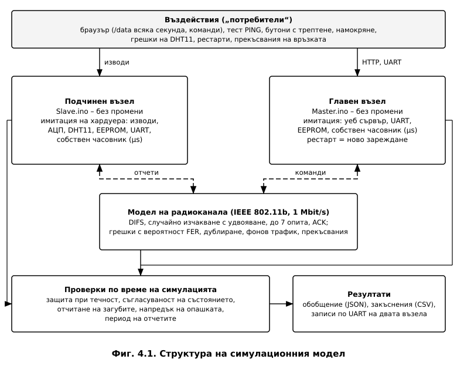
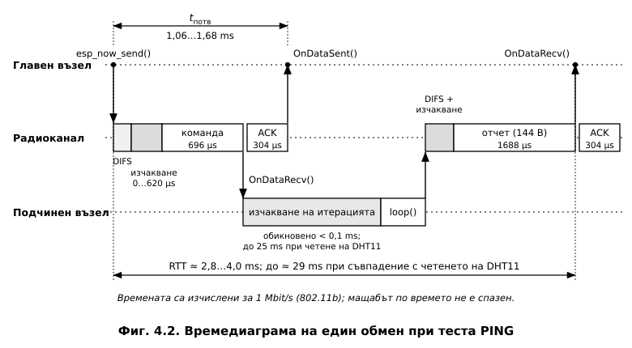
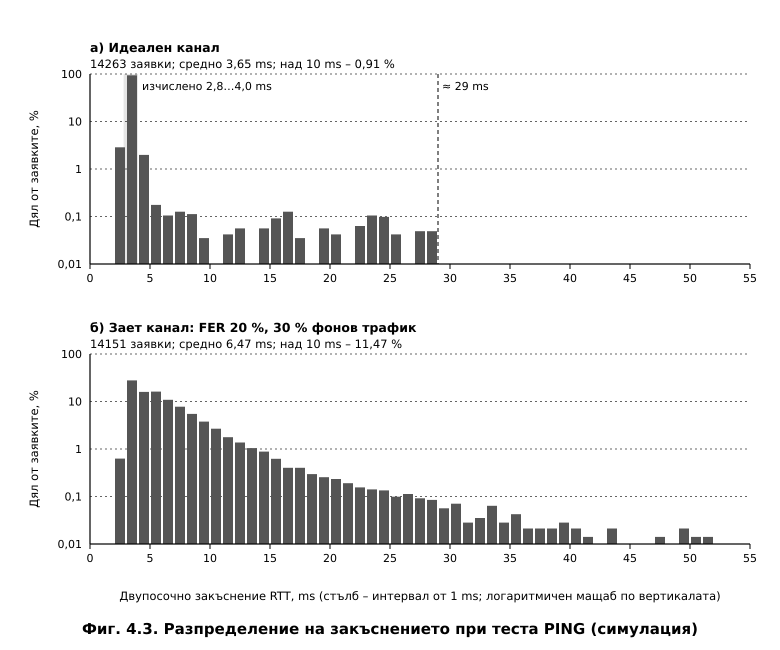

# ГЛАВА ЧЕТВЪРТА
# ЕКСПЕРИМЕНТАЛНИ И СИМУЛАЦИОННИ ИЗСЛЕДВАНИЯ

---

## 4.1. Цел и методи на изследването

Изследването проверява дали системата запазва правилното си поведение при неблагоприятни
условия: грешки и прекъсвания в радиоканала, повторно доставени кадри, рестарти на възлите,
трептене на бутоните и на изхода на датчика за течност, продължителна непрекъсната работа.
Използвани са три метода (**Таблица 4.1**):

- **проверка на макета** – работата на двата възела с версия 3 на програмите и калибровката
  на измерването на напрежението;
- **изчисление** – времената на обмена по IEEE 802.11 и енергийният бюджет на радиовръзката;
- **симулация на системата** – двете програми работят едновременно в симулирано време и
  обменят кадри през модел на радиоканала.

Симулацията позволява изпитвания, които на макета са трудно възпроизводими или изискват
много време – десетки хиляди повторения, зададен процент грешки в канала, рестарт в
определен момент, денонощна работа. Всички резултати в т. 4.4–4.7 са получени **чрез
симулация** и са означени като такива.

**Таблица 4.1. Изследвани показатели и методи**

| Показател | Метод |
|---|---|
| Работа на двата възела, реле 4 на извода D8 | проверка на макета |
| Калибровка на измерването на напрежението | проверка на макета (т. 2.6.3) |
| Закъснение на обмена, време до потвърждението | изчисление и симулация |
| Отчитане на загубите, съгласуваност на състоянието при грешки в канала | симулация |
| Бутони с трептене, защитна блокировка при течност | симулация |
| Денонощна работа с прекъсвания и рестарти | симулация |
| Обхват на радиовръзката | изчисление |

---

## 4.2. Проверка на макета

Двата възела са програмирани с версия 3 и работят заедно. Реле 4 се управлява нормално от
новия извод D8, което потвърждава практически решението от т. 2.8. Коефициентите за
измерването на напрежението – пълна скала 10,91 V и грешка 55 mV на включено реле – са
определени при изработването на макета чрез сравнение с мултиметър (т. 2.6.3).

Величините, които симулацията не моделира – напрежения и токове, обхват на радиовръзката,
поведение на динамичната памет, – се проверяват на макета с вградените средства за
измерване. Протоколът за това изпитване (опити Е1–Е12) е приложен към програмите.

---

## 4.3. Симулационен модел

Структурата на модела е показана на **Фиг. 4.1**. Непроменените файлове `Slave.ino` и
`Master.ino` се компилират на персонален компютър заедно с имитацията на хардуера от т. 3.8.
Всеки възел е отделна споделена библиотека със собствени изводи, EEPROM, сериен порт и
часовник с разделителна способност 1 µs. Рестартът на възел е ново зареждане на
библиотеката: оперативната памет се инициализира наново, а съдържанието на EEPROM се
запазва, както при реалния модул.

Кадрите между възлите преминават през модел на радиоканала по IEEE 802.11b при 1 Mbit/s
[10]. Всеки опит за предаване започва след интервал DIFS и случайно изчакване, чиято
горна граница се удвоява при всяко повторение. Кадърът се губи с вероятност FER. Ако
потвърждението не пристигне, опитът се повтаря до 7 пъти – стойността по подразбиране в
стандарта. Моделирани са и загуба само на потвърждението, повторно доставяне на кадър до
програмата, фонов трафик от други станции и пълни прекъсвания на връзката. Обратните функции
на ESP-NOW се извикват между итерациите на главния цикъл, както при реалния модул.

Въздействията са: браузър, който запитва `/data` всяка секунда и подава команди; тест PING;
натискания на бутоните с 1…6 отскока през 0,1…1,6 ms [25]; намокряне на датчика с
трептене на изхода на компаратора; грешки при четенето на DHT11. По време на симулацията
непрекъснато се проверяват инвариантите: нито едно реле не е включено по време на
блокировка; състоянието на релетата в главния възел съвпада с действителното (проба на всеки
100 ms); броят на загубените отчети, отчетен от главния възел, съвпада със загубените в канала;
опашката от команди не блокира. Параметрите на модела са дадени в **Таблица 4.2**.

**Таблица 4.2. Параметри на симулационния модел**

| Параметър | Стойност |
|---|---|
| Скорост; PLCP; DIFS / SIFS / слот | 1 Mbit/s; 192 µs; 50 / 10 / 20 µs |
| Граница на случайното изчакване | 31…1023 слота, удвояване при повторение |
| Опити на MAC ниво | до 7 |
| Време на обратните функции | между итерациите на главния цикъл |
| Четене на DHT11 / проба на АЦП / запис в EEPROM | 25,5 ms / 90 µs / 30 ms |
| Време между итерациите (работа на SDK) | 20…200 µs според сценария |
| Общо симулирано време | 44 h в 11 сценария |

**Ограничения на модела.** Времената на хардуерните функции в Таблица 4.2 са зададени в
модела, а не измерени. Затова симулацията проверява логиката и времевото поведение при тези
стойности, но не и действителното време за изпълнение на ESP8266. Не се моделират
разпространението на радиовълните (заместено е с параметъра FER), протоколът TCP и
динамичната памет. Тези свойства се проверяват на макета.

---

## 4.4. Закъснение на обмена

### 4.4.1. Изчислена оценка

Един обмен „заявка – отговор" при теста PING е показан на **Фиг. 4.2**, а изчислените му
съставки при 1 Mbit/s – в **Таблица 4.3**.

**Таблица 4.3. Изчислени съставки на обмена при 1 Mbit/s**

| Съставка | Време, µs |
|---|---|
| Интервал DIFS | 50 |
| Случайно изчакване, 0…31 слота по 20 µs | 0…620 |
| Кадър с команда (20 + 43 B) | 696 |
| SIFS и кадър за потвърждение (14 B) | 10 + 304 |
| **Време до потвърждението $t_{\text{потв}}$** | **1060…1680** |
| Изчакване на итерацията на подчинения възел | обикновено под 100; до 25 000 при четене на DHT11 |
| DIFS и случайно изчакване преди отчета | 50…670 |
| Кадър с отчет (144 + 43 B) | 1688 |
| **Двупосочно закъснение RTT** | **≈ 2800…4000; до ≈ 29 000** |

Ако заявката пристигне, докато подчиненият възел чете DHT11, RTT нараства с до 25 ms. Делът на
такива заявки е равен на дела на времето, в което се чете датчикът:
$P \approx t_{\text{DHT}} / T_{\text{тел}} = 25 / 2000 = 1{,}25\ \%$.

### 4.4.2. Резултати от симулацията

Изпълнени са по около 14 000 последователни заявки при два режима на канала. Резултатите са
дадени в **Таблица 4.4**, а разпределенията – на **Фиг. 4.3**.

**Таблица 4.4. Закъснение по ESP-NOW (симулация, по 1 h)**

| Показател | Изчислено | Идеален канал | Зает канал: FER 20 %, фонов трафик 30 % |
|---|---|---|---|
| Заявки / загубени | – | 14 263 / 0 | 14 151 / 0 |
| $t_{\text{потв}}$ мин. / ср. / макс., ms | 1,06 / 1,37 / 1,68 | 1,12 / 1,43 / 4,14 | 1,12 / 3,17 / 49,2 |
| RTT мин. / медиана, ms | 2,8 / – | 2,86 / 3,48 | 2,86 / 5,28 |
| RTT ср. / 99 % / макс., ms | – / – / ≈ 29 | 3,65 / 8,62 / 28,2 | 6,47 / 24,6 / 51,7 |
| Дял на RTT > 10 ms | ≈ 0,93 % | 0,91 % | 11,5 % |

При идеален канал симулацията потвърждава изчислението. Най-малкото RTT (2,86 ms) и средното
време до потвърждението (1,43 ms) се отличават от изчислените с по-малко от 5 %. Разликата
идва от времето до следващата итерация на главния цикъл. Разпределението е двугрупово
(Фиг. 4.3, а): 98 % от заявките са между 2,8 и 4,2 ms, а останалите са разпределени до
28,2 ms – случаите, в които заявката пристига по време на четенето на DHT11. Делът над 10 ms
(0,91 %) съвпада с очаквания за закъснения, по-големи от 6,5 ms, в рамките на 25-милисекундното
четене: $(25 - 6{,}5)/2000 \approx 0{,}93\ \%$.

При зает канал средното RTT се увеличава до 6,47 ms, а максималното – до 51,7 ms. Причините
са повторните предавания и удвояването на случайното изчакване. Нито една заявка не е
загубена. В 11 случая потвърждението на MAC ниво липсва, но командата е изпълнена и отчетът
е пристигнал – главният възел показва грешка, но показаното състояние остава вярно, защото
идва от отчета.

---

## 4.5. Устойчивост при грешки в радиоканала

### 4.5.1. Загуби, повторни кадри и съгласуваност на състоянието

Проведени са пет симулации по 2 h с вероятност за грешка на кадъра при един опит FER от 0 до
90 %, с команда от браузъра средно на всеки 10 s и с 0,2 % повторно доставени кадри
(**Таблица 4.5**). При 7 опита вероятността отчетът да бъде загубен на приложно ниво е
$\text{FER}^7$.

**Таблица 4.5. Работа при грешки в канала (симулация, по 2 h)**

| FER при един опит | 0 | 30 % | 50 % | 70 % | 90 % |
|---|---|---|---|---|---|
| Загубени отчети в канала | 0 от 4640 | 0 от 4681 | 25 от 4524 | 339 от 4499 | 2002 от 4146 |
| Очаквано по $\text{FER}^7$ | 0 | 0,02 % | 0,78 % | 8,2 % | 47,8 % |
| Загубени, отчетени от главния възел | 0 | 0 | 25 | 339 | 1999 + 3 |
| Повторни отчети: в канала / отчетени | 9 / 9 | 14 / 14 | 13 / 13 | 10 / 10 | 3 / 3 |
| Загубени команди | 0 | 0 | 8 | 79 | 549 |
| Повторни команди: доставени / отхвърлени | 4 / 4 | 0 / 0 | 1 / 1 | 1 / 1 | 0 / 0 |
| Съобщения за неуспешно изпращане | 0 | 13 | 107 | 507 | 1028 |
| Несъответствие на състоянието: дял / най-дълго | 0,03 % / 0,1 s | 0,06 % / 0,1 s | 0,24 % / 1,8 s | 0,94 % / 3,7 s | 6,6 % / 17,6 s |
| Средно $t_{\text{потв}}$, ms | 1,46 | 3,72 | 8,51 | 12,4 | 16,5 |

Резултатите показват следното:

- **Повторните предавания на MAC ниво скриват грешките в канала** до FER 30 % – не е загубен
  нито един отчет. Загубите растат стръмно едва при FER над 50 %, в съответствие с
  $\text{FER}^7$.
- **Отчитането на загубите е точно.** Главният възел открива всеки загубен отчет, след който е
  пристигнал поне един следващ. Трите неоткрити загуби при FER 90 % са последните отчети преди
  края на симулацията – те не могат да бъдат открити, защото след тях не е пристигнал отчет.
- **Всеки повторно доставен кадър е разпознат.** Повторните отчети се броят отделно, а
  повторните команди се отхвърлят и не се изпълняват втори път.
- **Показаното състояние се възстановява само.** При загубена команда или загубен отчет
  главният възел получава действителното състояние със следващия периодичен отчет. Затова
  несъответствието трае най-много няколко секунди – 1,8 s при FER 50 %. Дори при 48 % загуби
  то не остава трайно – най-дългото е 17,6 s, – а опашката от команди не блокира.
- При FER 30…90 % се появяват случаи, в които командата е изпълнена, но потвърждението е
  загубено. Потребителят вижда съобщение за грешка, а показаното състояние е вярно. Това е
  поведението, заложено в т. 3.3.3.

### 4.5.2. Оценка на обхвата

Грешката на кадъра зависи от мощността на приемания сигнал, т. е. от затихването по пътя.
При изходна мощност +20 dBm и чувствителност −98 dBm при 1 Mbit/s [11], антени с
усилване 0 dBi и запас за замиране 10 dB допустимото затихване е:

$$PL_{\text{доп}} = P_{\text{пред}} + G_{\text{пред}} + G_{\text{пр}} - S - M = 20 + 0 + 0 + 98 - 10 = 108\ \text{dB}$$

Затихването в сграда се описва с логаритмичния модел [38, 39]
$PL(d) = PL(1\ \text{m}) + N \lg d + L_{\text{прегр}}$, където $PL(1\ \text{m}) = 40{,}2$ dB при
2437 MHz, а $N \approx 28$ за жилищни сгради в обхвата 2,4 GHz [39]. От бюджета се
получава запасът, който остава за стените и плочите (**Таблица 4.6**).

**Таблица 4.6. Затихване и запас за преградите (изчисление)**

| Разстояние, m | 5 | 10 | 20 | 30 | 50 |
|---|---|---|---|---|---|
| Затихване без прегради, dB | 59,8 | 68,2 | 76,6 | 81,5 | 87,8 |
| Запас за прегради, dB | 48 | 40 | 31 | 26 | 20 |

Обхватът в жилище се определя от преградите, а не от разстоянието – на 20 m остават около
31 dB за загуби в стени и плочи. Когато сигналът приближи границата на чувствителността,
делът на грешните кадри расте. Според Таблица 4.5 системата продължава да работи с
възстановяващо се състояние дори при FER 70…90 %.

---

## 4.6. Местно управление и защита при течност

Резултатите от симулациите на бутоните и на защитата са дадени в **Таблица 4.7**.

**Таблица 4.7. Бутони и защитна блокировка (симулация)**

| Изпитване | Резултат |
|---|---|
| Нормални натискания (90…390 ms) с трептене, 2 h | 4692 от 4692 приети (SB1 – 3736, SB2 – 956) |
| Много кратки почуквания (20…45 ms) | 0 от 797 приети |
| Намокряния с трептене на изхода на компаратора, 3 h | 231 задействания при 231 намокряния |
| Намокряния без трептене, 3 h | 243 задействания при 243 намокряния |
| Опити за включване по време на блокировка – браузър / UART / бутон | 472 / 472 / 473 – всички отказани |
| Включено реле по време на блокировка | 0 случая |
| Време за реакция без трептене: медиана / 99 % / макс. | 0,25 / 15,6 / 25,5 ms |
| Време за реакция с трептене: медиана / 99 % / макс. | 0,25 / 27,8 / 45,7 ms |

Филтърът на бутоните приема всяко нормално натискане въпреки трептенето. Той отхвърля всички
почуквания, по-кратки от 60 ms. Трептенето на изхода на компаратора при намокряне и при
изсъхване не предизвиква допълнителни задействания и преждевременно сваляне на блокировката
– изискването за 2 s непрекъснато сухо състояние действа.

Времето за реакция обикновено е под 1 ms. Най-голямото време без трептене е 25,5 ms – колкото
продължава четенето на DHT11 в модела. Това потвърждава оценката от т. 3.6.2. При трептене
максимумът достига 45,7 ms. Причината е, че първият импулс на намокрянето е по-кратък от
текущото четене на датчика и завършва, преди програмата да провери входа. Блокировката се
задейства при следващия импулс. Постоянното намокряне винаги се открива при първата проверка.

---

## 4.7. Денонощна работа

Последната симулация обхваща 24 h работа с всички въздействия едновременно: FER 10 %, 10 %
фонов трафик, 0,1 % повторно доставени кадри, 1 % грешки при четене на DHT11, две прекъсвания
на връзката (30 s и 90 s), изключване на захранването на подчинения възел, рестарт на
подчинения възел по команда, рестарт на главния възел, 1486 команди от браузъра, поредица от
30 команди наведнъж, 554 натискания на бутоните (21 от тях по време на блокировка) и 21
намокряния. Резултатите са в **Таблица 4.8**.

**Таблица 4.8. Денонощна работа (симулация, 24 h)**

| Показател | Резултат |
|---|---|
| Изпратени отчети | 45 942 |
| Период на периодичните отчети: ср. / мин. / макс. | 2000,00 / 1999,78 / 2000,20 ms при около 20 препълвания на `micros()` |
| Загубени отчети (при прекъсванията) – в канала / отчетени | 61 / 61 |
| Повторни отчети – в канала / отчетени | 38 / 38 |
| Рестарти на подчинения възел – извършени / открити | 2 / 2 |
| Повторни команди – в канала / отхвърлени | 3 / 3 |
| Нови команди, отхвърлени след рестарта на главния възел | 0 |
| Предупреждение за авария: поява / изчезване | 10,6 s след началото / 1,6 s след края на прекъсването |
| Поредица от 30 команди | 12 приети, 18 с код 503 (пълна опашка) |
| Намокряния / задействания / включено реле при блокировка | 21 / 21 / 0 |
| Натискания: нормални / приети; кратки / приети | 511 / 511; 43 / 0 |
| Грешки на DHT11 / показана температура 0 °C | 482 / 0 случая |
| Препълвания на буфера за JSON / блокиране на опашката | 0 / 0 |
| Несъответствие на състоянието извън прекъсванията и първите 5 s след рестарт: дял / най-дълго | 0,01 % / 1,1 s |

Всички загуби на отчети са по време на двете прекъсвания и главният възел ги отчита точно.
Отчитането остава точно и след рестартите на двата възела. Предупреждението за авария се
появява около 10 s след началото на прекъсването – колкото е прагът – и изчезва с първия отчет
след него. Единственото по-дълго несъответствие на състоянието (1,1 s) е веднага след
30-секундното прекъсване. Командите, подадени по време на прекъсването, се губят, а
действителното състояние пристига с първия периодичен отчет. Периодът на отчетите остава
2 s с отклонение под 0,25 ms и при препълванията на брояча `micros()`.

---

## 4.8. Изводи по Глава 4

1. Макетът работи с версия 3 на програмите, а реле 4 се управлява от извода D8. Системата е
   изследвана и чрез симулация, в която двете непроменени програми работят заедно в
   симулирано време – общо 44 h в 11 сценария.
2. Изчисленото закъснение е потвърдено. При идеален канал RTT е 2,86…4,2 ms за 98 % от
   заявките, а при съвпадение с четенето на DHT11 – до 28,2 ms (0,91 % от заявките над 10 ms).
   При зает канал средното RTT е 6,47 ms, като не е загубена нито една заявка.
3. Повторните предавания на MAC ниво скриват грешките в канала до FER 30 %. При по-голям FER
   главният възел отчита загубите точно, повторните кадри се разпознават, а показаното
   състояние се възстановява със следващия отчет – за 1,8 s при FER 50 %.
4. Филтърът на бутоните приема всички нормални натискания и отхвърля всички почуквания под
   60 ms. Защитната блокировка се задейства при всяко намокряне, отказва всички опити за
   включване и не допуска нито едно включено реле. Времето за реакция без трептене е най-много
   25,5 ms.
5. При денонощна работа с прекъсвания, рестарти и грешки отчитането на загубите е точно,
   предупреждението за авария се появява и изчезва навреме, а опашката и буферът за JSON не се
   препълват и не блокират.
6. Резултатите показват, че програмите са устойчиви в рамките на модела. Напреженията и
   токовете, обхватът на радиовръзката и поведението на динамичната памет се проверяват на
   макета по приложения протокол.
