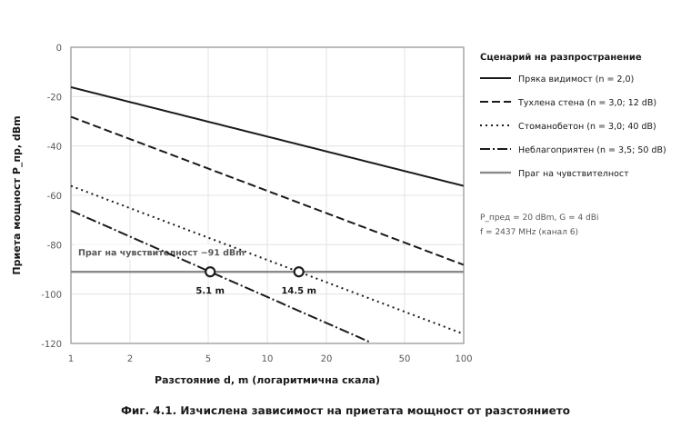
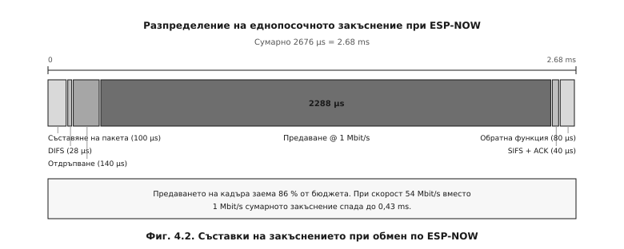

# ГЛАВА ЧЕТВЪРТА
# ЕКСПЕРИМЕНТАЛНИ ИЗСЛЕДВАНИЯ И РЕЗУЛТАТИ

---

## 4.1. Цел и организация на изследването

Експерименталното изследване има за цел да провери съответствието между **проектните
предпоставки** от Глави 2 и 3 и **действителното поведение** на изработения макет.
Изследват се четири групи показатели:

1. **Обхват** на връзката по ESP-NOW при различни условия на разпространение.
2. **Закъснение** от подаване на команда до задействане на изпълнителния елемент.
3. **Точност** на температурното измерване.
4. **Време за един цикъл** на програмата – проверка на неблокиращото изпълнение.

**Таблица 4.1. Използвана измервателна апаратура**

| Уред | Предназначение | Клас / разрешаваща способност |
|---|---|---|
| Цифров осцилоскоп (≥ 50 MHz, 2 канала) | измерване на закъснението и на фронтовете на RC филтъра | ≥ 8 бита, 1 GSa/s |
| Цифров мултицет | измерване на токове и напрежения | 4½ разреда |
| Еталонен термометър | сравнителна база за DS18B20 | ±0,1 °C |
| Лазерен далекомер / ролетка | измерване на разстоянието | ±0,01 m |
| Персонален компютър с терминал | приемане на телеметрията | 115200 bd |

> **Указание за оформяне.** Таблици 4.3, 4.5, 4.6, 4.7 и 4.8 представляват **протоколи
> от измерването**. Те се попълват с действително получените стойности при изпитването
> на макета. Колоните, означени с многоточие, се попълват от дипломанта; изчислените
> величини (средна стойност, средноквадратично отклонение, грешка) се получават по
> посочените в текста зависимости.

---

## 4.2. Изследване на обхвата на връзката

### 4.2.1. Теоретична оценка

Преди измерването е направена оценка по **енергийния бюджет на радиовръзката**.
Максималното допустимо затихване се определя като:

$$PL_{\text{макс}} = P_{\text{пред}} + G_{\text{пред}} + G_{\text{пр}} - S$$

където $S$ е чувствителността на приемника. За ESP8266 при 802.11b и скорост 1 Mbit/s:

$$PL_{\text{макс}} = 20 + 2 + 2 - (-91) = 115\ \text{dB}$$

Затихването в свободно пространство на разстояние 1 m при честота 2437 MHz (канал 6) е:

$$PL(1\,\text{m}) = 20\lg(d_{\text{km}}) + 20\lg(f_{\text{MHz}}) + 32{,}44 = 40{,}18\ \text{dB}$$

За закрити помещения се прилага логаритмичният модел:

$$PL(d) = PL(1\,\text{m}) + 10\,n\lg(d) + L_{\text{стени}}$$

където $n$ е показателят на затихване, а $L_{\text{стени}}$ – допълнителните загуби от
преградите. Изчислената зависимост е представена на **Фиг. 4.1**.



**Таблица 4.2. Изчислен максимален обхват по сценарии**

| Сценарий | $n$ | $L_{\text{стени}}$, dB | $d_{\text{макс}}$ |
|---|---|---|---|
| Пряка видимост, открито | 2,0 | 0 | ≈ 5500 m |
| Едно помещение | 2,2 | 0 | ≈ 2500 m |
| Един етаж, тухлена стена | 3,0 | 12 | ≈ 124 m |
| Два етажа, стоманобетон | 3,0 | 40 | **≈ 14,5 m** |
| Неблагоприятен случай | 3,5 | 50 | **≈ 5,1 m** |

Изчислението показва, че **определящи са не разстоянието, а преградите**. В условията на
жилищна сграда със стоманобетонни плочи очакваният обхват е от порядъка на 5…15 m, което
съответства на един-два етажа.

### 4.2.2. Методика на измерването

Подчиненият възел се поставя неподвижно, а главният се премества на нарастващо разстояние.
За всяка точка се отчитат **не по-малко от 100 последователни пакета телеметрия**, като се
регистрира броят на успешно доставените. Показателят за качество е **коефициентът на
доставените пакети**:

$$PDR = \frac{N_{\text{успешни}}}{N_{\text{успешни}} + N_{\text{загубени}}} \cdot 100\ \%$$

Броячите `successPackets` и `failedPackets` са вградени в телеметрията (Листинг 3.4), което
позволява отчитането да се извършва **без допълнителна апаратура**. За граница на работния
обхват се приема разстоянието, при което $PDR$ спада под **95 %**.

**Таблица 4.3. Протокол от измерването на обхвата**

| № | Разстояние, m | Прегради | $N_{\text{успешни}}$ | $N_{\text{загубени}}$ | $PDR$, % |
|---|---|---|---|---|---|
| 1 | 1 | няма | … | … | … |
| 2 | 5 | няма | … | … | … |
| 3 | 10 | една стена | … | … | … |
| 4 | 15 | една стена | … | … | … |
| 5 | 10 | плоча (един етаж) | … | … | … |
| 6 | 15 | плоча (един етаж) | … | … | … |
| 7 | 20 | две прегради | … | … | … |

---

## 4.3. Изследване на закъснението

### 4.3.1. Теоретичен анализ

Закъснението при обмен по ESP-NOW се формира от съставките, определени от механизма за
достъп до средата на IEEE 802.11 (т. 1.1.4). При приети стойности за 802.11g
($SIFS = 10\ \mu s$, слот 9 µs, $CW_{\min} = 31$) и полезен товар 250 байта се получава
разпределението, показано на **Фиг. 4.2**.



**Таблица 4.4. Изчислени съставки на еднопосочното закъснение**

| Съставка | Стойност, µs |
|---|---|
| Съставяне на пакета и извикване на `esp_now_send()` | 100 |
| Интервал DIFS | 28 |
| Средно отдръпване ($CW_{\min}/2$) | 139,5 |
| Предаване на кадъра при 1 Mbit/s | 2288 |
| Интервал SIFS | 10 |
| Потвърждение (ACK) | 30 |
| Обработка в обратната функция | 80 |
| **Сумарно** | **≈ 2676 µs ≈ 2,68 ms** |

Предаването на самия кадър заема **86 %** от бюджета. Следователно закъснението се
определя преди всичко от **избраната скорост на физическо ниво**, а не от програмната
реализация. При 54 Mbit/s сумарната стойност спада до **0,43 ms**.

За сравнение, маршрутизираният през точка за достъп обмен по HTTP изисква 20…100 ms,
тоест **7…37 пъти повече** – количествено потвърждение на избора, обоснован в т. 1.1.6.

### 4.3.2. Методика на измерването

Прилагат се **два независими метода**.

**Метод А – осцилографски (пряк).** В главния възел свободен извод се превключва във
високо ниво непосредствено преди извикването на `esp_now_send()`; в подчинения възел друг
извод се превключва непосредствено след изпълнението на командата в `applyRelay()`.
Двата сигнала се наблюдават с двуканален осцилоскоп, а закъснението се отчита като
интервал между фронтовете. Методът измерва **пълното закъснение от край до край**,
включително времето за изпълнение.

**Метод Б – програмен (косвен).** Главният възел записва времевия отпечатък
`micros()` преди изпращането и при получаване на потвърждението в `OnDataSent()`.
Разликата дава **времето до потвърждение на връзково ниво**:

```cpp
unsigned long tSend = 0;
volatile unsigned long tAck = 0;

void OnDataSent(uint8_t *mac, uint8_t status) {
  tAck = micros();                     // отпечатък в обратната функция
  deliverySuccess = (status == 0);
  waitingForDelivery = false;
}

// след потвърждението, в главния цикъл:
unsigned long latency = tAck - tSend;  // µs
```

Двата метода дават различни величини: метод Б измерва само радиочастта, докато метод А
включва и програмната обработка. **Разликата между тях е количествена оценка на
програмното закъснение.**

За всяка серия се извършват **не по-малко от 30 измервания**, по които се изчисляват
средната стойност и средноквадратичното отклонение:

$$\bar{t} = \frac{1}{N}\sum_{i=1}^{N} t_i, \qquad s = \sqrt{\frac{\sum_{i=1}^{N}(t_i - \bar{t})^2}{N-1}}$$

**Таблица 4.5. Протокол от измерването на закъснението**

| Условие | Метод | $N$ | $\bar{t}$, ms | $s$, ms | $t_{\min}$ | $t_{\max}$ |
|---|---|---|---|---|---|---|
| 1 m, пряка видимост | А (осцилоскоп) | 30 | … | … | … | … |
| 1 m, пряка видимост | Б (програмен) | 30 | … | … | … | … |
| 10 m, една стена | А | 30 | … | … | … | … |
| 10 m, една стена | Б | 30 | … | … | … | … |
| Сравнение: през точка за достъп | А | 30 | … | … | … | … |

---

## 4.4. Изследване на точността на температурното измерване

### 4.4.1. Методика

Датчикът DS18B20 и еталонният термометър се поставят в **обща топлинна среда** с
осигурено изравняване на температурата. Измерванията се провеждат в най-малко **пет
температурни точки**, обхващащи работния диапазон на помещението, като във всяка точка се
изчаква установяване на топлинното равновесие (не по-малко от 10 min) и се отчитат по
**10 последователни стойности**.

### 4.4.2. Обработка на резултатите

**Систематичната грешка** (отклонението от еталона) се определя като:

$$\Delta = \bar{\vartheta}_{\text{изм}} - \vartheta_{\text{ет}}$$

**Стандартната неопределеност по тип А** (от разсейването на отчетите):

$$u_A = \frac{s}{\sqrt{N}} = \frac{1}{\sqrt{N}}\sqrt{\frac{\sum(\vartheta_i - \bar{\vartheta})^2}{N-1}}$$

**Стандартната неопределеност по тип Б** се извежда от каталожната граница ±0,5 °C при
приемане на равномерно разпределение:

$$u_B = \frac{0{,}5}{\sqrt{3}} = 0{,}289\ ^\circ\text{C}$$

**Комбинираната** и **разширената** неопределеност при коефициент на покритие $k = 2$
(доверителна вероятност 95 %):

$$u_c = \sqrt{u_A^2 + u_B^2}, \qquad U = k \cdot u_c$$

При пренебрежимо малка съставка по тип А се получава **$U \approx 0{,}58\ ^\circ$C** –
стойност, с която трябва да се сравняват измерените отклонения. Съставката от
разрешаващата способност (0,0625 °C, което дава $u = 0{,}018\ ^\circ$C) е пренебрежима.

**Таблица 4.6. Протокол от измерването на температурата**

| Точка | $\vartheta_{\text{ет}}$, °C | $\bar{\vartheta}_{\text{изм}}$, °C | $s$, °C | $\Delta$, °C | $U$, °C | В границите? |
|---|---|---|---|---|---|---|
| 1 | … | … | … | … | … | … |
| 2 | … | … | … | … | … | … |
| 3 | … | … | … | … | … | … |
| 4 | … | … | … | … | … | … |
| 5 | … | … | … | … | … | … |

**Критерий за съответствие.** Измерването потвърждава каталожните данни, ако за всяка
точка е изпълнено $|\Delta| \le 0{,}5\ ^\circ$C. Систематично отклонение с еднакъв знак
във всички точки показва **адитивна грешка**, която може да бъде компенсирана програмно.

---

## 4.5. Експериментална проверка на филтъра за потискане на трептенето

### 4.5.1. Методика

Оразмеряването в т. 2.5 се основава на изчислената времеконстанта $\tau = R_1C_1 = 10$ ms.
Проверката ѝ е пряка: осцилоскопът се включва между извода на микроконтролера и общата
точка, а разгъвката се задейства по **спадащия фронт** при натискане на бутона.

Отчитат се три величини:

- **времето на нарастване до прага** $V_{IH} = 2{,}475$ V при отпускане;
- **времето на спадане до прага** $V_{IL} = 0{,}825$ V при натискане;
- **наличието на паразитни импулси** върху заснетата осцилограма.

Действителната времеконстанта се определя от измереното време до достигане на прага:

$$\tau_{\text{изм}} = \frac{-t_{\text{отп}}}{\ln\left(1 - \dfrac{V_{IH}}{V_{DD}}\right)} = \frac{t_{\text{отп}}}{1{,}386}$$

Относителното отклонение от изчислената стойност е:

$$\delta_\tau = \frac{\tau_{\text{изм}} - \tau_{\text{изч}}}{\tau_{\text{изч}}} \cdot 100\ \%$$

За сравнение се снема осцилограма и **без кондензатора C1**, при която трептенето се
наблюдава в явен вид.

**Таблица 4.7. Протокол от проверката на RC филтъра**

| Показател | Изчислено | Измерено | $\delta$, % |
|---|---|---|---|
| Времеконстанта $\tau$ | 10,00 ms | … | … |
| Време до $V_{IH}$ при отпускане | 13,86 ms | … | … |
| Време до $V_{IL}$ при натискане | 139 µs | … | … |
| Брой паразитни импулси с филтър | 0 | … | – |
| Брой паразитни импулси без C1 | – | … | – |

**Критерий за съответствие.** Отклонението $|\delta_\tau|$ не трябва да превишава
**±20 %**, което съответства на сумарния допуск на използваните елементи: резистор от
ред E24 с допуск ±5 % и керамичен кондензатор с допуск ±10…20 %. При липса на паразитни
импулси върху осцилограмата с филтър и наличието им без кондензатора се счита, че
хардуерното потискане изпълнява предназначението си.

---

## 4.6. Изследване на времето за цикъл

### 4.6.1. Методика

Времето за един цикъл се измерва **вградено** – чрез величината `lastLoopDuration`
(Листинг 3.11), която се включва в телеметрията. Измерването се провежда в четири режима,
като за всеки се отчитат стойностите в продължение на **не по-малко от 5 минути** и се
регистрира **максималната** стойност, която е определящата за работоспособността.

За контролно сравнение се компилира вариант с **блокиращо** четене на датчика
(`setWaitForConversion(true)`).

**Таблица 4.8. Протокол от измерването на времето за цикъл**

| Режим на работа | $\bar{T}_{\text{цикъл}}$, ms | $T_{\max}$, ms | Отчети на фронт |
|---|---|---|---|
| Покой (без обмен) | … | … | … |
| Изпращане на телеметрия | … | … | … |
| Обработка на HTTP заявка | … | … | … |
| Едновременно натиснат бутон и заявка | … | … | … |
| **Контрола: блокиращо четене** | … | … | … |

**Критерий за съответствие.** Съгласно т. 3.1 изискването е
$T_{\max} \le 2{,}8$ ms, което осигурява не по-малко от пет отчета на най-бавния фронт от
RC филтъра (13,86 ms). Броят отчети се изчислява като:

$$N_{\text{отчети}} = \frac{t_{\text{отп}}}{T_{\max}} = \frac{13{,}86}{T_{\max}}$$

---

## 4.7. Изследване на надеждността при продължителна работа

Проверява се устойчивостта на системата при непрекъсната работа – показател, който
блоковите изпитвания не откриват. Регистрират се **свободната оперативна памет**
(`freeHeap`) и броят на **самопроизволните рестарти**.

**Таблица 4.9. Протокол от изпитването с продължителност 72 часа**

| Време, h | Свободна памет, B | Изпратени пакети | Загубени пакети | $PDR$, % | Рестарти |
|---|---|---|---|---|---|
| 0 | … | … | … | … | 0 |
| 24 | … | … | … | … | … |
| 48 | … | … | … | … | … |
| 72 | … | … | … | … | … |

**Критерий за съответствие.** Свободната памет не трябва да показва **монотонно
намаление** – такава тенденция е признак за изтичане на памет (*memory leak*), типично
следствие от многократното долепяне на обекти `String`. Именно предотвратяването на този
дефект е причината за използването на `snprintf` в т. 3.4.2.

---

## 4.8. Изводи по Глава 4

1. Съставена е **методика за експериментално изследване** по четири групи показатели с
   посочени измервателна апаратура, брой измервания и критерии за съответствие.
2. Направена е **теоретична оценка на обхвата** по енергийния бюджет: при максимално
   допустимо затихване 115 dB очакваният обхват в жилищна сграда със стоманобетонни
   плочи е **5…15 m**, като определящи са преградите, а не разстоянието.
3. Направен е **теоретичен анализ на закъснението**: изчислената стойност **2,68 ms** се
   формира на 86 % от предаването на кадъра, тоест се определя от скоростта на физическо
   ниво, а не от програмната реализация. Предимството пред маршрутизиран обмен е
   **7…37 пъти**.
4. Определена е **разширената неопределеност** на температурното измерване
   $U \approx 0{,}58\ ^\circ$C при $k = 2$, която служи за критерий при оценката на
   измерените отклонения.
5. Предвидена е **пряка осцилографска проверка на RC филтъра** с критерий за отклонение
   на времеконстантата до ±20 %, съответстващ на допуските на използваните елементи.
6. Формулирано е **числено изискване към времето за цикъл** ($T_{\max} \le 2{,}8$ ms),
   проверимо чрез вградената в телеметрията величина `lastLoopDuration` – без външна
   апаратура.
7. Предвидено е **изпитване с продължителност 72 часа** за откриване на изтичане на памет
   – дефект, който се проявява само при продължителна работа.

---

## Използвани източници към Глава 4

29. Rappaport, T. S. *Wireless Communications: Principles and Practice.* 2nd ed.,
    Prentice Hall, 2002.
30. ITU-R P.1238. *Propagation data and prediction methods for the planning of indoor
    radiocommunication systems.* International Telecommunication Union.
31. JCGM 100:2008. *Evaluation of measurement data – Guide to the expression of
    uncertainty in measurement (GUM).* BIPM.
32. БДС EN ISO/IEC 17025. *Общи изисквания относно компетентността на лаборатории за
    изпитване и калибриране.*
