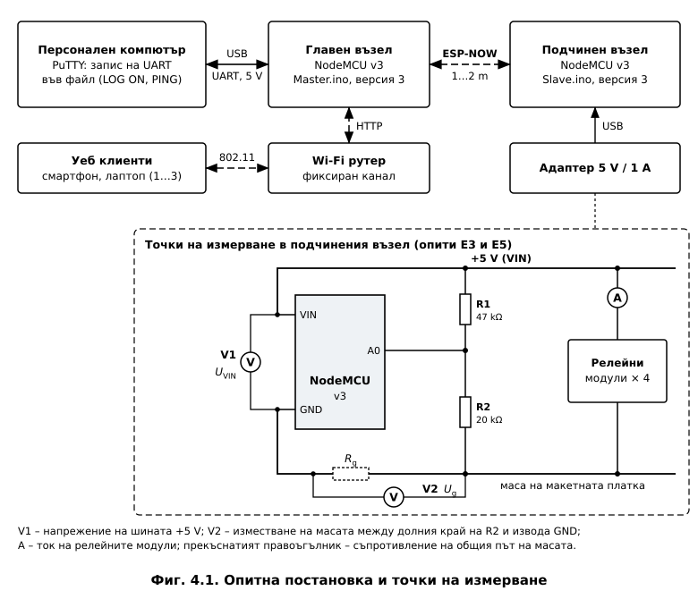

# ГЛАВА ЧЕТВЪРТА
# ЕКСПЕРИМЕНТАЛНИ ИЗСЛЕДВАНИЯ

---

> **Бележка към черновата.** Колоните „Резултат" в Таблици 4.3, 4.5 и 4.7–4.9 се попълват
> с измерените стойности от опитите Е1–Е12 (многоточие – още не е измерено). Главата
> съдържа методиката, изчислените очаквани стойности и вече получените резултати. Бележката
> се премахва след попълването.

## 4.1. Цел и организация на изследването

Изследването проверява дали изработеният макет отговаря на проектните предпоставки от
Глави 2 и 3. Проверката е на две нива:

- **логиката на програмите** – на персонален компютър, с имитация на хардуера и симулирано
  време (т. 3.8). Тя е извършена и резултатите ѝ са обобщени в т. 4.2;
- **поведението на макета** – времевите параметри, радиовръзката, аналоговото измерване и
  взаимодействието с потребителя, които не могат да се проверят чрез симулация.

Опитната постановка е показана на **Фиг. 4.1**. Главният възел е свързан към персонален
компютър по USB. Програма за сериен терминал (PuTTY) записва във файл изведените по UART
данни – редовете във формат CSV при `LOG ON` и резултатите от теста `PING`. Уеб интерфейсът се
отваря от един до три клиента. Подчиненият възел се захранва от адаптер 5 V / 1 A и е на
разстояние 1…2 m от главния, с пряка видимост.

Повечето величини се измерват от **самите програми** (т. 3.5.2) – без осцилоскоп и без
допълнителна апаратура (**Таблица 4.1**). Външен уред е необходим само за напреженията и
токовете.

**Таблица 4.1. Изследвани показатели и средства за измерване**

| Опит | Показател | Източник на стойността | Разделителна способност |
|---|---|---|---|
| Е1, Е2 | време за изпълнение и период на главния цикъл, итерации за 1 s | `micros()` в двата възела, запис `LOG ON` | 1 µs |
| Е8 | време до потвърждението на MAC ниво, двупосочно закъснение | `micros()` в главния възел, тест `PING` | 1 µs |
| Е9 | приети, загубени и повторени отчети; неуспешни изпращания | броячи по поредните номера | 1 пакет |
| Е3, Е5 | напрежение на шината +5 V, ток на релейните модули | мултиметър; АЦП на подчинения възел | 10,65 mV (АЦП) |
| Е6 | натискания и фронтове на бутоните | програмен филтър, прекъсвания | 1 фронт |
| Е7 | задействания и откази на защитата, изход на модула HR202 | броячи, мултиметър | – |
| Е11 | свободна памет, фрагментация, рестарти | `ESP.getHeapStats()`, причина за рестарт | 1 B |
| Е12 | поведение при подаване на захранването | наблюдение | – |

Преди всеки опит броячите се нулират с `RESET STATS`. По време на опитите за време не се
въвеждат команди по UART на подчинения възел, защото извеждането на текст удължава
итерацията. В таблиците се вписват само измерени стойности. Подробните указания и таблиците
за попълване са в протокола на измерванията към програмите.

---

## 4.2. Проверка на логиката и функционална проверка

Съответствието между изискванията и проверките е дадено в **Таблица 4.2**. Проверките на
персонален компютър са изпълнени – 114 условия за подчинения и 74 за главния възел, без
неуспешни (т. 3.8). Те потвърждават, че програмите реагират правилно и на ситуации, които
трудно се предизвикват на макета: загуба на определени пакети, пакети от чужд адрес или с
друга версия на протокола, препълване на брояча `micros()`.

**Таблица 4.2. Матрица на проверката**

| Изискване | Проверка на персонален компютър | Изпитване на макета |
|---|---|---|
| Управление на релетата от браузъра, UART и бутоните | изпълнена – опашка, команди, бутони | Е6, Е8 |
| Незабавен отчет с действителното състояние на релетата | изпълнена | Е8 |
| Защитна блокировка при течност | изпълнена – изключване, откази, задържане 2 s | Е7 |
| Конфигурация в EEPROM, прехвърляне от версия 2 | изпълнена | при първото стартиране на версия 3 |
| Реле 4 на извода D8 | – (хардуерно решение) | **потвърдено** |
| Време за цикъл под 50 ms | в модела максимумът е четенето на DHT11 | Е1, Е2 |
| Отчитане на загубите и на закъснението | изпълнена | Е8, Е9 |
| Валиден JSON без препълване | изпълнена – 8 отговора, най-големият 1,4 kB | Е11 |
| Измерване на напрежението | изпълнена – формула и корекция | Е3, Е5 |
| Поведение при включване | – | Е12 |

**Функционална проверка.** Двата възела са програмирани с версия 3. Реле 4 се управлява
нормално от новия извод D8. Това потвърждава практически решението от т. 2.8 – преместването
от GPIO0, който определя режима на зареждане.

---

## 4.3. Време за цикъл (опити Е1 и Е2)

**Очаквани стойности.** Най-дългата итерация на подчинения възел е тази с четенето на DHT11 –
около 25 ms (т. 3.1.2). Всички останали итерации са кратки, затова средното време за
изпълнение се очаква под 0,1 ms, а броят на итерациите – над 10 000 в секунда. В главния възел
най-дълги се очакват итерациите, в които уеб сървърът изпраща страницата (17,5 kB). Тя се
предава в няколко TCP сегмента, затова при зареждането ѝ итерацията може да достигне десетки
милисекунди.

**Методика.** Опит Е1 се провежда в три режима по 10 min: без отворен уеб интерфейс (А), с
един (Б) и с три клиента (В). Опит Е2 проверява източника на максимума: при интервал на
телеметрията 500 ms датчикът се чете само във всеки четвърти прозорец, защото не се чете
по-често от веднъж на 2 s. Следователно максимумът от около 25 ms трябва да се появява през
три прозореца, а в останалите да е много по-малък. При интервал 5000 ms всеки прозорец
съдържа по едно четене.

**Таблица 4.3. Време за цикъл**

| Показател | Очаквано | Режим А | Режим Б | Режим В |
|---|---|---|---|---|
| Подчинен възел: итерации за 1 s | > 10 000 | … | … | … |
| Подчинен възел: средно $t_{\text{изп}}$ | < 0,1 ms | … | … | … |
| Подчинен възел: най-голямо $t_{\text{изп}}$ | ≈ 25 ms | … | … | … |
| Главен възел: итерации за 1 s | > 10 000 | … | … | … |
| Главен възел: най-голямо $t_{\text{изп}}$ | расте при зареждане на страницата | … | … | … |

**Критерии.** Най-голямото време за изпълнение трябва да е под 50 ms в двата възела
[24]. В подчинения възел то трябва да съвпада с времето за четене на DHT11 и да се
повтаря с периода на четенето (Е2). По желание се прави сравнение с версия 2 по същия
метод. Версия 2 с добавено измерване с `micros()` се очаква да покаже около 45 ms в
итерацията на телеметрията, а панелът ѝ – 0 ms (т. 3.5.2).

---

## 4.4. Закъснение и надеждност на връзката (опити Е8–Е10)

### 4.4.1. Теоретична оценка

Закъснението се оценява по механизма за достъп до средата на IEEE 802.11 при скорост
1 Mbit/s (802.11b, DSSS) – интервал DIFS 50 µs, SIFS 10 µs, слот 20 µs, $CW_{\min}$ = 31
[10]. Времето за предаване на кадрите е изчислено в т. 3.3.1. Един обмен „заявка –
отговор" при теста PING е показан на **Фиг. 4.2**, а съставките му – в **Таблица 4.4**.

**Таблица 4.4. Изчислени съставки на обмена при 1 Mbit/s**

| Съставка | Време, µs |
|---|---|
| Интервал DIFS | 50 |
| Случайно изчакване, 0…31 слота по 20 µs | 0…620 |
| Кадър с команда (20 + 43 B) | 696 |
| SIFS и кадър за потвърждение (14 B) | 10 + 304 |
| **Време до потвърждението $t_{\text{потв}}$** | **1060…1680** |
| Изчакване на итерацията на подчинения възел | обикновено под 100; до 25 000 при четене на DHT11 |
| DIFS и случайно изчакване преди отчета | 50…670 |
| Кадър с отчет (144 + 43 B) | 1688 |
| **Двупосочно закъснение RTT** | **≈ 2800…4000; до ≈ 29 000** |

Следователно при 1 Mbit/s се очаква време до потвърждението 1,1…1,7 ms и двупосочно
закъснение 2,8…4,0 ms. Ако заявката пристигне, докато подчиненият възел чете DHT11, RTT се
увеличава с до 25 ms. Вероятността за това е равна на дела на времето, в което се чете
датчикът:

$$P \approx \frac{t_{\text{DHT}}}{T_{\text{тел}}} = \frac{25\ \text{ms}}{2000\ \text{ms}} = 1{,}25\ \%$$

Разпределението на RTT трябва да е **двугрупово**: почти всички стойности около 3 ms и около
1 % между 3 и 29 ms. Измереното време до потвърждението показва и действителната скорост на
предаване: около 1,1…1,7 ms съответства на 1 Mbit/s, а значително по-малко време – на
по-висока скорост.

### 4.4.2. Закъснение и загуби

**Методика.** При разстояние 1…2 m се изпълнява три пъти `PING 100`. Серията се повтаря с три
отворени уеб клиента, за да се оцени влиянието на натоварването на главния възел. Всеки
резултат се записва и като ред `PING,<№>,<RTT>`, от който се построява хистограмата на RTT.

**Таблица 4.5. Закъснение по ESP-NOW**

| Серия | Успешни / загубени | $t_{\text{потв}}$ мин. / ср. / макс., ms | RTT мин. / ср. / макс., ms | Дял на RTT > 10 ms |
|---|---|---|---|---|
| Очаквано (1 Mbit/s) | 100 / 0 | 1,06 / 1,37 / 1,68 | 2,8 / ≈ 3,4 / ≈ 29 | ≈ 1,25 % |
| 1 (1…2 m) | … | … | … | … |
| 2 (1…2 m) | … | … | … | … |
| 3 (1…2 m) | … | … | … | … |
| 4 (1…2 m, 3 клиента) | … | … | … | … |

**Надеждност (Е9).** В продължение на поне 1 h – за предпочитане цяла нощ – се записват
отчетите без намеса. Делът на доставените пакети се изчислява по броячите на главния възел
(т. 3.3.2). На разстояние 1…2 m се очаква доставяне близо до 100 %, защото загуба на
приложно ниво настъпва само ако са неуспешни всички повторни предавания на MAC ниво.
Резултатът се вписва в Таблица 4.9.

### 4.4.3. Оценка на обхвата

Допустимото затихване по пътя се определя от енергийния бюджет на радиовръзката. При
изходна мощност +20 dBm и чувствителност −98 dBm при 1 Mbit/s [11], коефициент на
усилване на антените 0 dBi (печатна антена с неизвестна ориентация) и запас за замиране
10 dB:

$$PL_{\text{доп}} = P_{\text{пред}} + G_{\text{пред}} + G_{\text{пр}} - S - M = 20 + 0 + 0 + 98 - 10 = 108\ \text{dB}$$

Затихването в сграда се описва с логаритмичния модел [38, 39]:

$$PL(d) = PL(1\ \text{m}) + N \lg d + L_{\text{прегр}}, \qquad PL(1\ \text{m}) = 40{,}2\ \text{dB при}\ 2437\ \text{MHz}$$

където $N \approx 28$ е коефициентът за жилищни сгради в обхвата 2,4 GHz [39], а
$L_{\text{прегр}}$ – загубите в стените и плочите. От бюджета се получава запасът, който
остава за преградите (**Таблица 4.6**).

**Таблица 4.6. Затихване и запас за преградите**

| Разстояние, m | 5 | 10 | 20 | 30 | 50 |
|---|---|---|---|---|---|
| Затихване без прегради, dB | 59,7 | 68,2 | 76,6 | 81,5 | 87,7 |
| Запас за прегради, dB | 48 | 40 | 31 | 27 | 20 |

Обхватът в жилище се определя **от преградите, а не от разстоянието**. Дори на 20 m остават
около 30 dB за загуби в стени и плочи. Решаващи са стоманобетонните плочи и стените с
арматура. Опит Е10 (по желание) проверява оценката – `PING 100` на няколко места с различен
брой стени между възлите. Ако не бъде проведен, обхватът остава само изчислен.

---

## 4.5. Измерване на захранващото напрежение (опити Е3 и Е5)

**Калибровка.** Коефициентите в програмата са определени при изработването на макета чрез
сравнение с мултиметър: пълна скала 10,91 V и грешка 55 mV на включено реле (т. 2.6.3).
Изчислената пълна скала е 11,19 V. Разликата от 2,5 % съответства на опорно напрежение на
АЦП около 0,975 V. При 5,0 V на шината очакваният среден отчет на A0 е около 469, а едно
включено реле го променя с около 5 единици.

**Методика.** Релетата се включват едно по едно, а след всяка промяна се изчаква един отчет
(около 3 s). С мултиметър се измерват напрежението $U_{\text{VIN}}$ на платката на
подчинения възел, напрежението $U_g$ между долния край на R2 и извода GND на платката и
токът по проводника +5 V към релейните модули. Серията се повтаря три пъти.

**Таблица 4.7. Захранващо напрежение и ток на релейните модули**

| Показател | Очаквано | $n$ = 0 | 1 | 2 | 3 | 4 |
|---|---|---|---|---|---|---|
| $U_{\text{VIN}}$ (мултиметър), V | ≈ 4,9…5,0 | … | … | … | … | … |
| VCC (уеб интерфейс), V | = $U_{\text{VIN}}$ ± 0,05 | … | … | … | … | … |
| Разлика VCC − $U_{\text{VIN}}$, mV | ≈ 0 | … | … | … | … | … |
| $U_g$ (R2 – GND на платката), mV | ≈ 22 $n$ | … | … | … | … | … |
| Ток на релейните модули, mA | ≈ 75 $n$ | … | … | … | … | … |

**Неопределеност.** Стандартната неопределеност на разликата VCC − $U_{\text{VIN}}$ се
определя главно от мултиметъра. За типичен уред с граница на грешката
$a = \pm(0{,}5\,\% + 2\ \text{единици})$ на обхват 20 V при 5 V се получава $a$ = 45 mV и
при равномерно разпределение [40]:

$$u_M = \frac{a}{\sqrt{3}} = 26\ \text{mV}, \qquad u_q = \frac{\text{LSB}}{\sqrt{12}\,\sqrt{10}} = \frac{10{,}65}{\sqrt{12}\,\sqrt{10}} = 1{,}0\ \text{mV}$$

$$U = k\sqrt{u_M^2 + u_q^2} \approx 2 \times 26 = 52\ \text{mV} \quad (k = 2)$$

Отклонения под около 50 mV не могат да бъдат разграничени от грешката на такъв мултиметър.
При изчисляването се използват данните на действително използвания уред.

**Критерии.** Корекцията в програмата е вярна, ако разликата VCC − $U_{\text{VIN}}$ остава в
границите на неопределеността при всички $n$. Хипотезата за изместване на масата (т. 2.6.3) се
потвърждава, ако $U_g$ нараства с около 22 mV на реле. Тогава свързването на R2 направо към
извода GND трябва да направи програмната корекция излишна. Токът на един модул се очаква около
75 mA – 71,4 mA за бобината [19] и няколко милиампера за входната верига. Това е проверка
на енергийния баланс от Таблица 2.6.

---

## 4.6. Бутони, защита и поведение при включване (опити Е6, Е7, Е12)

Очакваното поведение и резултатите са обобщени в **Таблица 4.8**. Трептенето на механичните
контакти обикновено е под 10 ms [25], затова при нормално натискане всички натискания
трябва да бъдат приети. Много кратките почуквания – по-кратки от 60 ms – се очаква да бъдат
отхвърлени от филтъра. Отношението между броя на фронтовете и броя на превключванията показва
колко е трептенето.

**Таблица 4.8. Бутони, защита при течност и поведение при включване**

| Опит | Проверка | Очаквано | Резултат |
|---|---|---|---|
| Е6 | 50 натискания на SB1 | 50 приети; фронтове ≥ 100 | … |
| Е6 | 50 натискания на SB2 | 50 приети; всички релета изключени | … |
| Е6 | 20 много кратки почуквания на SB1 | приемат се само по-дългите от 60 ms | … |
| Е6 | най-много фронтове за едно превключване | 1 без трептене, повече при трептене | … |
| Е7 | изход DO при сухо / мокро | ≈ 3,3 V / под 0,4 V | … |
| Е7 | 5 намокряния при включени релета | 5 задействания; всички релета изключени | … |
| Е7 | включване при блокировка – браузър, UART, бутон | отказ | … |
| Е7 | изсъхване | „СУХО (ИЗЧАКВАНЕ)" около 2 s, после „СУХО"; релетата остават изключени | … |
| Е12 | 10 подавания на захранването | 10 нормални стартирания; реле 4 не щраква | … |
| Е12 | реле 1 (GPIO16) при подаване на захранването | възможно кратко щракване (т. 2.8) | … |

---

## 4.7. Продължителна работа (опити Е9 и Е11)

При продължителна работа се проявяват дефекти, които кратките изпитвания не откриват –
загуби на динамична памет, фрагментация, рестарти от блокиране. В продължение на 24 h се
записват отчетите с `LOG ON`, а накрая се отчитат броячите (**Таблица 4.9**).

**Таблица 4.9. Продължителна работа**

| Показател | Очаквано | Резултат |
|---|---|---|
| Продължителност, h | ≥ 24 | … |
| Приети / загубени отчети; доставени, % | ≈ 100 % | … |
| Неуспешни изпращания на MAC ниво | единични | … |
| Рестарти на главния / подчинения възел | 0 / 0 | … |
| Най-малка свободна памет – главен / подчинен възел, B | постоянна след първите минути | … |
| Фрагментация на паметта, % | без нарастване | … |
| Най-голямо време за изпълнение от стартирането | ≈ 25 ms (подчинен възел) | … |
| Грешки при четене на DHT11 | единични | … |
| Препълвания на буфера за JSON | 0 | … |

**Критерий.** Най-малката свободна памет не трябва да намалява монотонно. Такава тенденция е
признак за загуба на памет. Именно затова отговорите в JSON се формират в статичен буфер
(т. 3.4.2).

---

## 4.8. Изводи по Глава 4

1. Разработена е методика за изследване на макета по опити Е1–Е12. Повечето величини се
   измерват от самите програми с разделителна способност 1 µs, без осцилоскоп. Външен уред е
   необходим само за напреженията и токовете.
2. Логиката на програмите е проверена на персонален компютър – 188 условия без неуспешни.
   Практически е потвърдено, че реле 4 работи на извода D8.
3. Изчислено е, че при 1 Mbit/s времето до потвърждението по ESP-NOW е 1,1…1,7 ms, а
   двупосочното закъснение е 2,8…4,0 ms. При съвпадение с четенето на DHT11 то нараства до
   около 29 ms. Вероятността за това е около 1,25 %, затова разпределението на закъснението
   трябва да е двугрупово.
4. Енергийният бюджет дава допустимо затихване 108 dB. На 20 m в жилищна сграда остават
   около 31 dB за загуби в прегради, т. е. обхватът се определя от преградите, а не от
   разстоянието.
5. Определени са очакваните стойности и критериите за времето за цикъл (най-много около 25 ms
   в подчинения възел), за измерването на напрежението (неопределеност около 50 mV при
   типичен мултиметър) и за хипотезата за изместване на масата (около 22 mV на реле).
6. Определени са критериите за бутоните, защитата при течност, поведението при включване и
   продължителната работа, в която най-малката свободна памет не бива да намалява.
