::: {custom-style="CenterMed"}
ТЕХНИЧЕСКИ УНИВЕРСИТЕТ – СОФИЯ
:::

::: {custom-style="CenterSml"}
ФАКУЛТЕТ ПО ЕЛЕКТРОННА ТЕХНИКА И ТЕХНОЛОГИИ

Катедра „Електронна техника"
:::

::: {custom-style="CenterBig"}
ДИПЛОМНА РАБОТА
:::

::: {custom-style="CenterSml"}
за придобиване на образователно-квалификационна степен
:::

::: {custom-style="CenterBig"}
„МАГИСТЪР"
:::

::: {custom-style="CenterSml"}
на тема
:::

::: {custom-style="CenterMed"}
СИСТЕМА ЗА УПРАВЛЕНИЕ НА ДОМА ЧРЕЗ IEEE 802.11 (Wi-Fi) ИНТЕРФЕЙС
:::

|  |  |
|---|---|
| **Дипломант:** | инж. Кръстиян Тодоров Праматаров |
| **Факултетен номер:** | 901322003 |
| **Специалност:** | Електронни системи за хибридни и електромобили |
| **Форма на обучение:** | редовна |
| **Научен ръководител:** | доц. д-р инж. Любомир Богданов |
| **Консултант:** | ................................................ |
| **Рецензент:** | ................................................ |

::: {custom-style="CenterMed"}
София, 2023 г.
:::


```{=openxml}
<w:p><w:r><w:br w:type="page"/></w:r></w:p>
```


# ДЕКЛАРАЦИЯ ЗА ОРИГИНАЛНОСТДолуподписаният **инж. Кръстиян Тодоров Праматаров**, факултетен номер **901322003**,
дипломант в катедра „Електронна техника" при Факултета по електронна техника и технологии
на Технически университет – София,

**Д Е К Л А Р И Р А М,  Ч Е:**

1. Настоящата дипломна работа на тема „Система за управление на дома чрез IEEE 802.11
   (Wi-Fi) интерфейс" е **разработена самостоятелно** от мен под ръководството на научния
   ръководител.
2. Всички използвани литературни източници и чужди резултати са **надлежно цитирани** в
   текста и включени в списъка на използваната литература.
3. Представените хардуерни и софтуерни решения, изчисления и експериментални резултати са
   **собствена разработка**, освен изрично посочените.

<br>

| | |
|---|---|
| Дата: ............... | Подпис: ................................ |
| | / инж. К. Т. Праматаров / |


```{=openxml}
<w:p><w:r><w:br w:type="page"/></w:r></w:p>
```


# АНОТАЦИЯ

**Тема:** Система за управление на дома чрез IEEE 802.11 (Wi-Fi) интерфейс
**Дипломант:** инж. Кръстиян Тодоров Праматаров, ф. № 901322003
**Специалност:** Електронни системи за хибридни и електромобили
**Научен ръководител:** доц. д-р инж. Любомир Богданов

---

В дипломната работа е проектирана, реализирана и изследвана **двувъзлова микроконтролерна
система за управление на дома** с потребителски интерфейс по
стандарта IEEE 802.11, изградена върху два модула ESP8266.

Проведеният литературен обзор съпоставя пет безжични технологии по десет
технико-икономически критерия. Показано е, че общоприетият довод срещу използването на
Wi-Fi в приложения от областта на Интернет на нещата – високото енергопотребление – е
валиден единствено за възли с батерийно захранване и **отпада за устройства, комутиращи
товари с мощност от порядъка на киловати**, при които делът на управляващата електроника е
под 0,05 %. Обоснована е **хибридна двуслойна комуникационна архитектура**: достъпът на
потребителя се осъществява от произволен браузър по HTTP/REST, а обменът между възлите –
по протокола ESP-NOW на връзково ниво, което премахва зависимостта от домашния
маршрутизатор.

В хардуерната част е анализирана съвместимостта на релейните модули с оптронен вход с 3,3 V
логика на ESP8266 (входен ток около 2,2 mA на канал), изчислен е делителят за контрол на
захранващото напрежение (пълна скала 11,19 V при калибрирани 10,91 V) и е съставен
енергийният баланс при захранване по USB (около 0,49 A в най-неблагоприятния случай).
Разпределението на изводите отчита функциите им при стартиране, включително преместването
на едно от релетата от GPIO0 на GPIO15. В софтуерната част е реализиран **неблокиращ главен
цикъл** с опашка от команди, защитна блокировка при отчетена течност и вградени средства за
измерване на времето за цикъл, закъснението и надеждността на връзката. Конфигурирането по
UART със запис в емулирана енергонезависима памет с контролна сума премахва твърдо
кодираните мрежови данни от изходния код.

Устойчивостта на системата е изследвана чрез **съвместна симулация на двете непроменени
програми** с модел на радиоканала по IEEE 802.11 – 44 h в 11 сценария. Двупосочното
закъснение е 2,9…4,2 ms за 98 % от заявките. Главният възел отчита загубите точно, а
показаното състояние се възстановява със следващия отчет. Защитната блокировка не допуска
включено реле при нито едно от 495 намокряния.

Системата е позиционирана като **изпълнителен слой на локален енергиен мениджмънт** при
домашно зареждане на електромобил: количествено е показано, че при еднофазно присъединяване
25 A и зареждане с 16 A остава резерв от едва 2070 W.

**Ключови думи:** IEEE 802.11, ESP8266, ESP-NOW, домашна автоматизация, енергиен
мениджмънт, електромобили, неблокиращо програмиране, релейни модули, симулация.

Обемът на дипломната работа е 75 страници и съдържа 19 фигури, 30 таблици,
4 листинга и 40 литературни източника. Графичната част се състои от 3 листа формат A1.

---

# ABSTRACT

**Title:** Home Automation System via IEEE 802.11 (Wi-Fi) Interface

The thesis presents the design, implementation and evaluation of a **two-node microcontroller home
automation system** with an IEEE 802.11 user interface, built on two ESP8266 modules.

A comparative review of five wireless technologies against ten technical and economic
criteria shows that the common argument against Wi-Fi for Internet-of-Things applications –
its power consumption – holds only for battery-powered nodes and **does not apply to devices
switching kilowatt-range loads**, where the controller accounts for less than 0.05 % of the
total. A **hybrid two-layer communication architecture** is justified: the user connects
from any browser over HTTP/REST, while inter-node exchange uses the ESP-NOW link-layer
protocol, removing the dependency on the home router.

The hardware section analyses the compatibility of opto-isolated relay modules with the
3.3 V logic of the ESP8266 (input current about 2.2 mA per channel), calculates the
supply-voltage divider (11.19 V full scale versus 10.91 V calibrated) and derives the power
budget for USB supply (about 0.49 A worst case). The pin assignment accounts for the boot-strap
functions of the pins, including moving one relay from GPIO0 to GPIO15. The software
implements a **non-blocking main loop** with a command queue, a liquid-detection safety
interlock and built-in instrumentation for loop time, latency and link reliability. UART
configuration stored in emulated non-volatile memory with a checksum eliminates hard-coded
network credentials from the source code.

Robustness is studied by **co-simulating both unmodified firmware images** with an IEEE 802.11
channel model – 44 h in 11 scenarios. The round-trip time is 2.9–4.2 ms for 98 % of the
requests, the master node accounts for every detectable packet loss, the displayed state
recovers with the next report, and the safety interlock keeps all relays off in each of 495
liquid-detection events.

The system is positioned as an **actuation layer for local home energy management** during
electric-vehicle charging: with a 25 A single-phase supply and 16 A charging, only 2070 W of
headroom remains.

**Keywords:** IEEE 802.11, ESP8266, ESP-NOW, home automation, energy management, electric
vehicles, non-blocking programming, relay modules, simulation.


```{=openxml}
<w:p><w:r><w:br w:type="page"/></w:r></w:p>
```


# СЪДЪРЖАНИЕ

| | стр. |
|---|---|
| **ДЕКЛАРАЦИЯ ЗА ОРИГИНАЛНОСТ** | 2 |
| **АНОТАЦИЯ** | 3 |
| **СЪДЪРЖАНИЕ** | 5 |
| **СПИСЪК НА ИЗПОЛЗВАНИТЕ СЪКРАЩЕНИЯ** | 7 |
| **ГЛАВА ПЪРВА. УВОД, ЦЕЛ И ЗАДАЧИ** | 8 |
| &nbsp;&nbsp;&nbsp;&nbsp;1.1. Литературен обзор | 8 |
| &nbsp;&nbsp;&nbsp;&nbsp;1.2. Връзка с проблематиката на електромобилите и локалния енергиен мениджмънт | 14 |
| &nbsp;&nbsp;&nbsp;&nbsp;1.3. Цел и задачи на дипломната работа | 17 |
| **ГЛАВА ВТОРА. ХАРДУЕРНО ПРОЕКТИРАНЕ** | 20 |
| &nbsp;&nbsp;&nbsp;&nbsp;2.1. Изисквания към хардуера и общ подход | 20 |
| &nbsp;&nbsp;&nbsp;&nbsp;2.2. Блокова схема на хардуера | 20 |
| &nbsp;&nbsp;&nbsp;&nbsp;2.3. Избор на елементна база | 22 |
| &nbsp;&nbsp;&nbsp;&nbsp;2.4. Изпълнителна част – релейни модули | 24 |
| &nbsp;&nbsp;&nbsp;&nbsp;2.5. Органи за местно управление – бутони | 26 |
| &nbsp;&nbsp;&nbsp;&nbsp;2.6. Измервателни канали | 28 |
| &nbsp;&nbsp;&nbsp;&nbsp;2.7. Захранване и енергиен баланс | 33 |
| &nbsp;&nbsp;&nbsp;&nbsp;2.8. Разпределение на изводите | 35 |
| &nbsp;&nbsp;&nbsp;&nbsp;2.9. Принципна схема на подчинения възел | 36 |
| &nbsp;&nbsp;&nbsp;&nbsp;2.10. Конструктивна реализация на макета | 37 |
| &nbsp;&nbsp;&nbsp;&nbsp;2.11. Изводи по Глава 2 | 38 |
| **ГЛАВА ТРЕТА. СОФТУЕРНО ПРОЕКТИРАНЕ** | 39 |
| &nbsp;&nbsp;&nbsp;&nbsp;3.1. Организация на програмното осигуряване | 39 |
| &nbsp;&nbsp;&nbsp;&nbsp;3.2. Конфигуриране и енергонезависима памет | 41 |
| &nbsp;&nbsp;&nbsp;&nbsp;3.3. Комуникационен протокол по ESP-NOW | 44 |
| &nbsp;&nbsp;&nbsp;&nbsp;3.4. Уеб сървър и потребителски интерфейс | 49 |
| &nbsp;&nbsp;&nbsp;&nbsp;3.5. Измервания в подчинения възел | 51 |
| &nbsp;&nbsp;&nbsp;&nbsp;3.6. Местно управление и защита при течност | 53 |
| &nbsp;&nbsp;&nbsp;&nbsp;3.7. Алгоритъм на управляващата програма | 55 |
| &nbsp;&nbsp;&nbsp;&nbsp;3.8. Проверка на програмата | 56 |
| &nbsp;&nbsp;&nbsp;&nbsp;3.9. Изводи по Глава 3 | 57 |
| **ГЛАВА ЧЕТВЪРТА. ЕКСПЕРИМЕНТАЛНИ И СИМУЛАЦИОННИ ИЗСЛЕДВАНИЯ** | 58 |
| &nbsp;&nbsp;&nbsp;&nbsp;4.1. Цел и методи на изследването | 58 |
| &nbsp;&nbsp;&nbsp;&nbsp;4.2. Проверка на макета | 59 |
| &nbsp;&nbsp;&nbsp;&nbsp;4.3. Симулационен модел | 59 |
| &nbsp;&nbsp;&nbsp;&nbsp;4.4. Закъснение на обмена | 61 |
| &nbsp;&nbsp;&nbsp;&nbsp;4.5. Устойчивост при грешки в радиоканала | 63 |
| &nbsp;&nbsp;&nbsp;&nbsp;4.6. Местно управление и защита при течност | 65 |
| &nbsp;&nbsp;&nbsp;&nbsp;4.7. Денонощна работа | 66 |
| &nbsp;&nbsp;&nbsp;&nbsp;4.8. Изводи по Глава 4 | 67 |
| **ЗАКЛЮЧЕНИЕ** | 67 |
| **ИЗПОЛЗВАНА ЛИТЕРАТУРА** | 72 |
| **ПРИЛОЖЕНИЕ А. Графична част – листове 1–3** | 73 |

> Номерата на страниците са ориентировъчни. При окончателното оформяне в текстов
> редактор съдържанието се генерира автоматично от стиловете на заглавията.


```{=openxml}
<w:p><w:r><w:br w:type="page"/></w:r></w:p>
```


# СПИСЪК НА ИЗПОЛЗВАНИТЕ СЪКРАЩЕНИЯ

| Съкращение | Значение |
|---|---|
| **AES** | Advanced Encryption Standard – стандарт за симетрично шифроване |
| **API** | Application Programming Interface – приложен програмен интерфейс |
| **BLE** | Bluetooth Low Energy |
| **BSS** | Basic Service Set – базов набор от услуги |
| **CRC** | Cyclic Redundancy Check – циклична контролна сума |
| **CSMA-CA** | Carrier Sense Multiple Access with Collision Avoidance |
| **CTR** | Current Transfer Ratio – коефициент на предаване по ток на оптрон |
| **DCF** | Distributed Coordination Function – разпределена координационна функция |
| **DLM** | Dynamic Load Management – динамично управление на товара |
| **EEPROM** | Electrically Erasable Programmable Read-Only Memory |
| **ESP-NOW** | Протокол на Espressif за обмен на връзково ниво |
| **EVSE** | Electric Vehicle Supply Equipment – зарядна станция |
| **GPIO** | General Purpose Input/Output – универсален вход/изход |
| **HEMS** | Home Energy Management System – система за управление на енергията в дома |
| **HTTP** | HyperText Transfer Protocol |
| **JSON** | JavaScript Object Notation |
| **LDO** | Low Dropout regulator – стабилизатор с малък пад |
| **MAC** | Medium Access Control – управление на достъпа до средата |
| **OCPP** | Open Charge Point Protocol |
| **OTA** | Over-The-Air – безжично обновяване на програмата |
| **PDR** | Packet Delivery Ratio – коефициент на доставените пакети |
| **REST** | Representational State Transfer |
| **RC** | Резисторно-капацитивна верига |
| **RH** | Relative Humidity – относителна влажност |
| **SPI** | Serial Peripheral Interface – сериен периферен интерфейс |
| **STA** | Station – станция в инфраструктурен режим |
| **UART** | Universal Asynchronous Receiver/Transmitter |
| **USB** | Universal Serial Bus – универсална серийна шина |
| **WPA2/WPA3** | Wi-Fi Protected Access – механизми за защита |
| **1-Wire** | Еднопроводен цифров интерфейс |
| **АЦП** | Аналогово-цифров преобразувател |


```{=openxml}
<w:p><w:r><w:br w:type="page"/></w:r></w:p>
```


# ГЛАВА ПЪРВА
# УВОД, ЦЕЛ И ЗАДАЧИ НА ДИПЛОМНАТА РАБОТА

---

## 1.1. Литературен обзор

### 1.1.1. Развитие на системите за домашна автоматизация

Развитието на домашната автоматизация преминава през три поколения. **Първото** се
свързва с протокола **X10** (1975 г.), пренасящ информация по силнотоковата мрежа при
скорост около 60 bit/s; въпреки ниската си надеждност той въвежда идеята за **адресируемо
управление на разпределени товари**. **Второто** се налага през 90-те години с кабелните
полеви шини **KNX/EIB** [1, 2], **LonWorks** и **BACnet** – надеждни и
детерминирани, но изискващи отделна шинна инсталация, което ги прави икономически
неприложими при модернизация на съществуващ жилищен фонд.

**Третото поколение** се основава на безжичните сензорни мрежи след приемането на
**IEEE 802.15.4** (2003 г.) и на концепцията за **ограничен изчислителен възел** (RFC 7228)
със стека **6LoWPAN** (RFC 4944) и протокола **CoAP** (RFC 7252) [3–5], като появата на евтини
системи в кристал с интегриран радиочестотен тракт свежда себестойността на един възел под
5 €. Към това поколение принадлежи настоящата разработка, чиято постановка е: **да се
постигне функционалност, съпоставима с професионална шинна система, без полагане на
допълнителна инсталация и при себестойност от няколко десетки лева.**

---

### 1.1.2. Критерии за оценка на безжичните технологии

Оценката е проведена по десет критерия: пропускателна способност; латентност;
обхват; енергопотребление; топология; себестойност; **необходимост от допълнителен шлюз**;
**достъп от потребителско устройство без допълнителен хардуер**; защита на информацията;
съвместно съществуване в ISM обхвата.

Двата удебелени критерия са определящи: система, изискваща отделен шлюз, за да бъде
достъпна от смартфон, увеличава едновременно себестойността и броя на точките на отказ
(*single points of failure*), което противоречи на изискването за автономност.

---

### 1.1.3. Анализ на алтернативните безжични технологии

**IEEE 802.15.4 и ZigBee** [6] осигуряват клетъчна (*mesh*) топология при изключително ниска
консумация – средният ток на крайно устройство се свежда до десетки микроампера. Три
обстоятелства обаче правят стека неприложим за поставената задача: **задължителен шлюз**,
тъй като нито един смартфон, таблет или лаптоп не разполага със ZigBee приемо-предавател;
**недостатъчна пропускателна способност** при кадър от **127 байта**, от които за приложни
данни остават 80…100 – принципно непригодно за пренос на уеб интерфейс; и **интерференция
с Wi-Fi**, чието избягване изисква каналите да бъдат подбрани в междините между Wi-Fi
канали 1, 6 и 11, което не може да бъде гарантирано в жилищна среда.

**Bluetooth Low Energy** [7] е налице във всеки съвременен смартфон, но отпада поради:
**липса на постоянна свързаност** – BLE е ориентиран към периодично свързване, докато
системата трябва да е достъпна непрекъснато, включително в отсъствието на собственика;
**топологично ограничение** – базовата архитектура е звезда, а Bluetooth Mesh използва
управляемо наводняване (*managed flooding*) със значителен паразитен трафик; и **отсъствие
на естествен IP стек**, поради което достъпът от браузър изисква междинен мост.

**Z-Wave** осигурява добра проникваща способност без конфликт с Wi-Fi, но е
**собственическа технология** с лицензиран достъп до спецификацията. **Thread/Matter** [8, 9] е
перспективно решение, което обаче изисква **граничен маршрутизатор** и по-обемен стек,
налагащ по-мощни микроконтролери. **LoRaWAN и NB-IoT** са принципно непригодни:
регулаторното **ограничение на коефициента на запълване** от 1 % в подобхвата g1 е
несъвместимо с интерактивно управление, а NB-IoT изисква абонамент към мобилен оператор,
с което системата губи автономността си.

---

### 1.1.4. IEEE 802.11 (Wi-Fi) – характеристика и критичен анализ

ESP8266 поддържа изменения **802.11 b/g/n** [10] в конфигурация 1 × 1, достигайки **72,2 Mbit/s**
на физическо ниво. Достъпът до средата се управлява от разпределената координационна
функция (**DCF**), реализираща **CSMA-CA**. Съществено предимство е **положителното
потвърждение на връзково ниво** – при загуба на кадър повторното предаване се извършва от
MAC подслоя, без участие на приложението. Защитата се осигурява от **WPA2-PSK**
(CCMP/AES-128) или **WPA3-SAE**.

Съгласно каталожните данни на ESP8266EX [11] консумацията е ≈ 170 mA при предаване, 56…60 mA
при приемане, ≈ 15 mA в *modem-sleep* и ≈ 20 µA в *deep-sleep* – с един до два порядъка
по-високо от ZigBee и BLE. Именно това традиционно се посочва като основен недостатък на
Wi-Fi в литературата за Интернет на нещата.

**Критичен анализ.** Настоящата разработка отхвърля механичното пренасяне на този извод,
тъй като той е валиден единствено за **възли със самостоятелно батерийно захранване**.
Проектираната система управлява **електромеханични релета, комутиращи товари с мрежово
напрежение 230 V**, откъдето следва, че: всеки възел е неотменимо свързан към
електрическата мрежа – в противен случай не би могъл да изпълни основната си функция;
бобината на едно реле консумира **70…90 mA**, съизмеримо със самия радиочестотен модул; а
управляваните товари са с мощност от порядъка на **киловати**, при което делът на
управляващата електроника е под **0,05 %**.

Оттук произтича основополагащият извод на обзора: **ограничението по енергопотребление,
което дисквалифицира Wi-Fi в класическите сензорни приложения, не е ограничение за
разглеждания клас изпълнителни устройства.**

---

### 1.1.5. Сравнителен анализ

**Таблица 1.1. Сравнителна характеристика на безжичните технологии**

| Показател | **Wi-Fi (802.11 b/g/n)** | ZigBee | BLE 5.x | Z-Wave | LoRaWAN |
|---|---|---|---|---|---|
| Честотен обхват | 2,4 GHz | 2,4 GHz / 868 MHz | 2,4 GHz | 868,42 MHz | 868 MHz |
| Скорост (физ. ниво) | до 72,2 Mbit/s | 250 kbit/s | 0,125…2 Mbit/s | до 100 kbit/s | 0,3…50 kbit/s |
| Полезен товар | до 2304 B | 127 B (кадър) | 251 B | 64 B | 51…242 B |
| Типична латентност | 20…100 ms | 20…50 ms | 7,5…100 ms | 50…100 ms | секунди |
| Обхват в помещение | 20…50 m | 10…30 m (mesh) | 10…40 m | 30…50 m | > 1 km |
| Консумация (активна) | висока | ниска | много ниска | ниска | много ниска |
| Топология | инфраструктурна звезда | клетъчна | звезда / mesh | клетъчна | звезда |
| **Необходим шлюз** | **не** | да | да | да | да |
| **Достъп от браузър** | **директен** | не | не | не | не |
| Себестойност на възела | ниска (3…5 €) | средна | ниска | висока | средна |
| Отвореност на стандарта | пълна | пълна | пълна | **ограничена** | пълна |

По критерия защита разликата е несъществена – всички технологии използват AES-128. ZigBee
и BLE превъзхождат Wi-Fi **единствено по енергопотребление**, чието значение беше
отхвърлено в т. 1.1.4. Особена тежест има критерият **отсъствие на шлюз**: при Wi-Fi
потребителят въвежда мрежово име или IP адрес в произволен браузър и получава пълноценен
управляващ интерфейс – без приложение, без облачна регистрация и без допълнителен хардуер.
Това е решаващо предимство както по **потребителска достъпност**, така и по **надеждност**,
тъй като броят на елементите във веригата на управление е сведен до минимум.

---

### 1.1.6. Хибридна комуникационна архитектура: IEEE 802.11 и ESP-NOW

Използването на инфраструктурен Wi-Fi за обмен **между самите възли** поражда специфичен
проблем. В режим BSS две станции, асоциирани към една и съща точка за достъп, **не могат
да обменят кадри директно** – всеки пакет преминава по маршрута STA₁ → AP → STA₂, тоест
изразходва **два преноса** през ефира. Заедно със забавянията от стека TCP/IP латентността
достига десетки до стотици милисекунди и, което е по-съществено, **зависи от устройство,
което не е част от проектираната система**: отпадането на домашния маршрутизатор би
означавало пълна загуба на управление върху товарите.

Решението е **двуслойна хибридна архитектура** с протокола **ESP-NOW** [12]. Обменът се
осъществява директно на **връзково ниво** чрез специализирани управляващи кадри
(*vendor-specific action frames*), адресирани по **MAC адрес** (**MAC-to-MAC** обмен), без
асоциация с точка за достъп, без DHCP и без TCP съединение. Полезният товар е до
**250 байта** – достатъчен за структурите с телеметрия и команди; поддържат се потвърждение
на доставката и криптиране по AES-128, а латентността е от **порядъка на единици
милисекунди**.

Съществено **технологично ограничение** произтича от наличието на **един-единствен
радиочестотен тракт** в ESP8266: интерфейсът за станция и интерфейсът за ESP-NOW
задължително работят на **един и същ физически канал**. Това налага каналът на подчинения
възел да бъде фиксиран и синхронизиран с канала на домашната точка за достъп – въпрос,
разгледан подробно в Глава 3.

**Таблица 1.2. Функционална декомпозиция на комуникационната подсистема**

| Направление | Протокол | Обосновка |
|---|---|---|
| Потребител → главен възел (**Master**) | IEEE 802.11, STA режим, HTTP/REST | универсален достъп от произволен браузър |
| Главен възел ↔ подчинен възел (**Slave**) | **ESP-NOW** (MAC-to-MAC) | минимална латентност, независимост от точката за достъп |

Така се използват **едновременно** двете най-силни страни на IEEE 802.11: универсалната
съвместимост с потребителските устройства на приложно ниво и ниската латентност на
връзково ниво.

---

### 1.1.7. Обоснован избор на микроконтролерна платформа

**Таблица 1.3. Сравнение на микроконтролерни платформи**

| Платформа | Ядро / такт | RAM | Вградено радио | Цена | Оценка |
|---|---|---|---|---|---|
| ATmega328P + ESP-01 | AVR 8-bit / 16 MHz | 2 KB | Wi-Fi (AT команди) | ≈ 6 € | Недостатъчна RAM, бавен обмен |
| **ESP8266EX** | **Xtensa LX106 / 80…160 MHz** | **≈ 50 KB свободни** | **802.11 b/g/n** | **≈ 3…5 €** | **Оптимално съотношение** |
| ESP32 | Xtensa LX6 двуядрен / 240 MHz | ≈ 320 KB | Wi-Fi + BLE | ≈ 6…9 € | Свръхкачествено за задачата |
| CC2530 / EFR32 | 8051 / Cortex-M | 8…64 KB | IEEE 802.15.4 | ≈ 5…10 € | Изисква задължителен шлюз |
| nRF52832 | Cortex-M4F | 64 KB | BLE | ≈ 5…8 € | Изисква мост към IP мрежата |

Изборът на **ESP8266EX** се обосновава със следното:

**а) Пълна интеграция** – в един корпус са обединени 32-битов процесор, радиочестотен
приемо-предавател и **пълните реализации на PHY и MAC подслоя на IEEE 802.11**, а
вграденият стек TCP/IP (lwIP) премахва нуждата от външен комуникационен контролер.

**б) Достатъчност, но не излишък на ресурса** – 80 MHz и около 50 KB свободна памет стигат
за едновременно обслужване на уеб сървър, ESP-NOW обмен, четене на цифров датчик за
температура и влажност и четири релейни канала, без ресурсът да е прекомерен; това обосновава изискването за **напълно
неблокиращ главен цикъл**.

**в) Достатъчна Flash памет** – 4 MB SPI Flash памет побират програмата заедно с уеб
страницата, съхранявана в областта на програмата (PROGMEM) и изпращана директно от там,
без копиране в оперативната памет. Програмата и интерфейсът се обновяват **заедно, с едно
безжично обновяване** (OTA), поради което версиите им винаги съответстват.

**г) Емулирана EEPROM памет** – библиотеката `EEPROM` емулира енергонезависима памет чрез
отделен сектор от Flash паметта, което позволява изпълнение на т. 5 от заданието:
**конфигуриране по UART** и **премахване на твърдо кодираните мрежови данни** от кода.

**д) Зрялост на екосистемата** – Arduino core за ESP8266 и библиотеките `ESP8266WebServer`,
`espnow`, `EEPROM`, `ArduinoOTA`, `ESP8266mDNS` и `DHT sensor library` позволяват
съсредоточаване върху приложната логика.

---

### 1.1.8. Изводи от литературния обзор

1. **Кабелните шинни системи** са най-надеждни, но изискват специализирана инсталация,
   което ги прави неприложими при модернизация на съществуващ жилищен фонд.
2. **ZigBee и BLE** превъзхождат Wi-Fi единствено по енергопотребление – показател **без
   практическо значение** за мрежово захранвани устройства, комутиращи киловатови товари.
3. **Задължителният шлюз** при ZigBee, Z-Wave и Thread увеличава себестойността и броя на
   точките на отказ, което противоречи на изискването за автономност.
4. **IEEE 802.11** е единствената технология с **директен достъп от произволно потребителско
   устройство чрез браузър**, без допълнителен хардуер и софтуер.
5. Зависимостта от точката за достъп при обмен между възлите се преодолява чрез **хибридна
   архитектура** с **ESP-NOW** на връзково ниво.
6. **ESP8266EX** дава оптимално съотношение функционалност/себестойност/сложност и осигурява
   **емулирана EEPROM** и достатъчно Flash памет за уеб интерфейса и за безжичното
   обновяване – предпоставките за изпълнение на т. 5 от заданието.

Тези изводи определят техническата концепция, чиято връзка с проблематиката на
електромобилите се разглежда в следващия раздел.

---

## 1.2. Връзка с проблематиката на електромобилите и локалния енергиен мениджмънт

### 1.2.1. Домашното зареждане като ограничение на битовото присъединяване

Масовото навлизане на електрическите превозни средства поражда качествено нов проблем на
ниво жилищен извод. Съгласно **IEC 61851-1** [13] домашното зареждане се осъществява
преимуществено в **Режим 2** (с вграден в кабела защитно-управляващ блок, IC-CPD) или
**Режим 3** (със стационарна зарядна станция, EVSE).

**Таблица 1.4. Типични конфигурации за домашно зареждане**

| Конфигурация | Ток | Мощност |
|---|---|---|
| Еднофазно, 16 A | 16 A | ≈ 3,7 kW |
| Еднофазно, 32 A | 32 A | ≈ 7,4 kW |
| Трифазно, 16 A | 3 × 16 A | ≈ 11 kW |
| Трифазно, 32 A | 3 × 32 A | ≈ 22 kW |

Разполагаемата мощност на типично българско битово присъединяване при еднофазен главен
предпазител 25 A е:

$$P_{\text{макс}} = U \cdot I_{\text{ном}} = 230\ \text{V} \times 25\ \text{A} = 5750\ \text{W}$$

Резервът, оставащ за битовите потребители при започнало зареждане, е:

$$P_{\text{резерв}} = P_{\text{макс}} - P_{EV} = 5750 - 3680 = 2070\ \text{W}$$

Този резерв е **недостатъчен** дори за самостоятелна работа на един електрически бойлер
(типично 2000 W), да не говорим за едновременна работа с останалите битови потребители.
Практическият резултат е **задействане на главния защитен апарат** и обезточване на цялото
жилище.

Съгласно **EN 60898-1** [14] автоматичен прекъсвач с характеристика B се задейства мигновено
при ток $(3\ldots5) \cdot I_{\text{ном}}$, а при условен ток на сработване
$1{,}45 \cdot I_{\text{ном}}$ – в рамките на един час. Следователно при умерено
претоварване системата за управление разполага с **минути**, а не с милисекунди, за да
реагира. Това е съществен извод: изискването към бързодействието е **меко**, но
изискването към **гарантираността** на реакцията е твърдо.

---

### 1.2.2. Подходи за управление на пиковото натоварване

В съвременната практика са известни три направления:

**а) Динамично управление на товара** (*Dynamic Load Management*, DLM) – измерва се общият
ток на присъединяването и се **намалява токът за зареждане** чрез коефициента на запълване
$D$ на сигнала **Control Pilot**. Съгласно IEC 61851-1 за $10\,\% \le D \le 85\,\%$:

$$I_{\text{макс}} = 0{,}6 \cdot D \quad [\text{A}]$$

а за $85\,\% < D \le 96\,\%$:

$$I_{\text{макс}} = (D - 64) \cdot 2{,}5 \quad [\text{A}]$$

**б) Изключване на прекъсваеми товари** (*load shedding*) – временно обезточване на
второстепенни потребители за времето на зареждане.

**в) Изместване на товари във времето** (*load shifting*) – използване на нощната тарифа и
на излишъка от собствено фотоволтаично производство.

**Таблица 1.5. Съпоставка на подходите спрямо настоящата разработка**

| Подход | Изпълнителен орган | Изисква | Реализиран |
|---|---|---|---|
| DLM | генератор на Control Pilot | EVSE контролер и защитна електроника | не |
| Load shedding | релейни изходи | комутационни канали | **да** |
| Load shifting | релейни изходи + времеви график | часовник / тарифен сигнал | **да** |

Първият подход изисква реализация на пълноценен EVSE контролер, което излиза извън обхвата
на заданието. Настоящата разработка реализира **втория и третия подход**, които са
**допълващи, а не конкуриращи** спрямо първия: DLM ограничава потреблението на
превозното средство, докато load shedding освобождава мощност откъм страната на битовите
товари. Четирите релейни канала образуват изпълнителния слой на **система за управление на
енергията в дома** (*Home Energy Management System*, HEMS), а температурният сензор
осигурява обратната връзка, необходима за интелигентно, а не просто аварийно превключване.

---

### 1.2.3. Обосновка на избора на прекъсваеми товари

Електрическият бойлер представлява **идеален прекъсваем товар** поради голямата си топлинна
инерция. Охлаждането му се описва с експоненциален закон, аналогичен на разряда на
кондензатор:

$$\vartheta(t) = \vartheta_{\text{ок}} + (\vartheta_0 - \vartheta_{\text{ок}}) \cdot e^{-t/\tau_T}, \qquad \tau_T = R_{\text{т}} \cdot C_{\text{т}}$$

За бойлер с вместимост 80 l топлинният капацитет е:

$$C_{\text{т}} = m \cdot c = 80\ \text{kg} \times 4186\ \frac{\text{J}}{\text{kg} \cdot \text{K}} \approx 3{,}35 \cdot 10^{5}\ \text{J/K}$$

При топлинни загуби $P_{\text{заг}} \approx 50$ W (≈ 1,2 kWh за денонощие) и температурна
разлика $\Delta\vartheta = 45$ K топлинното съпротивление е
$R_{\text{т}} = \Delta\vartheta / P_{\text{заг}} = 0{,}9$ K/W, откъдето:

$$\tau_T = 0{,}9 \times 3{,}35 \cdot 10^{5} \approx 3{,}0 \cdot 10^{5}\ \text{s} \approx 84\ \text{h}$$

Спадът на температурата за типично време на нощно зареждане от 3 часа е:

$$\Delta\vartheta_{3h} = 45 \cdot \left(1 - e^{-3/84}\right) \approx 1{,}6\ \text{K}$$

Прекъсване с продължителност няколко часа води до понижаване на температурата с **под 2 °C**,
което е **практически неосезаемо** за потребителя. Аналогични съображения са валидни за
климатичната инсталация при умерени външни температури и за сушилнята за дрехи.

> Показателно е, че същият математически апарат – времеконстантата $\tau = R \cdot C$ –
> се прилага и при анализа на RC филтъра за потискане на контактното трептене на бутоните
> в Глава 2, но при времеви мащаб, различен с осем порядъка.

---

### 1.2.4. Изисквания към комуникационната подсистема и връзка със специалността

Както беше установено в т. 1.2.1, изискването към **бързодействието** е меко – разполагаемото
време е от порядъка на минути. Практическото значение на избора на **ESP-NOW** следователно
не е в суровата скорост: и маршрутизираният през точка за достъп обмен (20…100 ms), и
ESP-NOW (единици милисекунди) са напълно достатъчни в абсолютно изражение.

Същественото предимство е в **гарантираността**. Командата за изключване на товар е
критична по последствия: неизпълнението ѝ води до обезточване на жилището. ESP-NOW
осигурява две свойства, които маршрутизираният обмен не може да гарантира:

- **независимост от трето устройство** – отпадането или претоварването на домашния
  маршрутизатор не препятства изключването на товарите;
- **проверима доставка** – обратната функция (*callback*) за потвърждение позволява на
  главния възел да установи неуспешното доставяне и да предприеме повторно изпращане или
  да вдигне авария.

Разглежданата проблематика е пряко свързана с **ISO 15118** [15] (*Plug & Charge* и двупосочен
енергиен обмен *Vehicle-to-Grid*), с **OCPP 2.0.1** [16] (профили за интелигентно зареждане) и с
изискванията на **EN 50160** [17] за качеството на напрежението. Специалистът по електронни
системи за хибридни и електромобили трябва да владее не само бордовата електроника на
превозното средство, но и **електронната инфраструктура, осигуряваща неговото зареждане** –
и в частност взаимодействието ѝ с битовата електрическа инсталация. Именно това обуславя
разглеждането на системата за управление на дома не като самостоятелна потребителска услуга,
а като **изпълнителен слой на локален енергиен мениджмънт**.

---

## 1.3. Цел и задачи на дипломната работа

### 1.3.1. Цел

Въз основа на изводите от т. 1.1.8 и на постановката в т. 1.2 целта на настоящата
дипломна работа се формулира както следва:

> **Да се проектира, реализира и експериментално изследва двувъзлова микроконтролерна
> система за управление на дома с потребителски интерфейс по стандарта IEEE 802.11,
> която едновременно изпълнява функциите на изпълнителен слой за локален енергиен
> мениджмънт при наличие на домашно зареждане на електромобил.**

Постигането на целта предполага система, която е **достъпна от произволно потребителско
устройство без допълнителен хардуер и софтуер**, **независима от външни облачни услуги** и
**детерминирана по отношение на изпълнението на управляващите команди**.

---

### 1.3.2. Задачи

За постигане на поставената цел се решават следните задачи:

1. **Литературно проучване** на безжичните технологии за домашна автоматизация и обоснован
   избор на комуникационни протоколи и елементна база.
2. **Разработване на блокова схема на хардуера** с функционална декомпозиция на главния
   (Master) и подчинения (Slave) възел.
3. **Разработване на принципна електрическа схема на подчинения възел**, включващо:
   - анализ на съвместимостта на релейните модули с оптронен вход с 3,3 V логика и избор
     на активното ниво;
   - свързване на датчика DHT11, на модула за наличие на течност HR202 и на бутоните, със
     сравнение между програмното и хардуерното (RC) потискане на контактното трептене;
   - изчисляване на делителя за контрол на захранващото напрежение и съставяне на
     енергийния баланс при захранване по USB;
   - разпределение на изводите с отчитане на функциите им при стартиране.
4. **Разработване на алгоритъм за конфигуриране по UART** с разбор на команди от вида
   `SET SSID ...` и `SET PASS ...` и запис в емулирана енергонезависима памет с контролна
   сума, премахващ твърдо кодираните мрежови данни от изходния код.
5. **Разработване на комуникационния обмен по ESP-NOW** – структури за телеметрия и
   управляващи команди, потвърждение на доставката и синхронизация на работния канал.
6. **Реализация на уеб сървър** с уеб страница, съхранявана във Flash паметта, и асинхронен
   **RESTful API** (Fetch API, JSON).
7. **Реализация на неблокиращ главен цикъл** – неблокиращо обслужване на бутоните и на
   измерването на напрежението, неблокираща опашка от управляващи команди, защитна
   блокировка при отчетена течност и измерване на времето за цикъл.
8. **Експериментално и симулационно изследване** – проверка на макета и съвместна симулация
   на двете програми: закъснение и надеждност на връзката, отчитане на загубите, действие на
   защитите и на органите за местно управление, денонощна работа.
9. **Формулиране на изводи** и насоки за бъдещо развитие.

**Таблица 1.6. Съответствие между задачите, главите и точките от заданието**

| Задача | Глава | Точка от заданието |
|---|---|---|
| 1 | Глава 1 | 4.1 Литературно проучване |
| 2 | Глава 2 | 4.2 Блокова схема на хардуера / 5.1 |
| 3 | Глава 2 | 4.3 Принципна схема / 5.2 |
| 4…7 | Глава 3 | 4.4 Алгоритъм на управляващата програма / 5.3 |
| 8 | Глава 4 | 4.5 Опитни резултати |
| 9 | Заключение | — |

---

### 1.3.3. Ограничения на обхвата

С оглед на коректното позициониране на разработката се дефинират следните съзнателни
ограничения:

- **Не се проектира зарядна станция (EVSE)** и не се реализира генератор на сигнала
  *Control Pilot*. Системата реализира само подходите *load shedding* и *load shifting*
  (т. 1.2.2), които са допълващи спрямо динамичното управление на товара.
- **Не се реализира измерване на общия ток на присъединяването.** Съгласно изходните данни
  по заданието измервателният канал включва датчик за температура (и влажност); въвеждането на
  токов трансформатор като източник на сигнал за започнало зареждане е формулирано като
  насока за бъдещо развитие. В текущата реализация превключването на режима се инициира от
  потребителя чрез уеб интерфейса или чрез физическия бутон.
- **Силнотоковата част се разглежда до нивото на релейните контакти.** Проектирането на
  разпределително табло и на защитната апаратура не е предмет на разработката.
- **Не се реализира облачна свързаност** – ограничението е съзнателно и произтича пряко от
  изискването за автономност, обосновано в т. 1.1.2.

---

### 1.3.4. Структура на изложението

**Глава 2** разглежда хардуерното проектиране – блоковата и принципната схема,
съвместимостта на релейните модули с 3,3 V логика, измервателните канали и енергийния
баланс. **Глава 3** е посветена на софтуерното проектиране – алгоритъма за конфигуриране по
UART, обмена по ESP-NOW, уеб сървъра и организацията на неблокиращия главен цикъл. **Глава 4** представя проверката
на макета и симулационното изследване на устойчивостта на системата. В **Заключението** са обобщени получените резултати и са формулирани насоките за
бъдещо развитие.


```{=openxml}
<w:p><w:r><w:br w:type="page"/></w:r></w:p>
```


# ГЛАВА ВТОРА
# ХАРДУЕРНО ПРОЕКТИРАНЕ НА СИСТЕМАТА

---

## 2.1. Изисквания към хардуера и общ подход

Хардуерното проектиране изхожда от изходните данни по заданието (т. 3) и от
архитектурните решения, обосновани в Глава 1. Изискванията са следните:

- **двувъзлова структура** – главен (Master) и подчинен (Slave) възел на базата на ESP8266
  (т. 3.1 от заданието);
- **температурен датчик с интерфейс по избор** (т. 3.2) – избран е цифров датчик за
  температура и относителна влажност DHT11 с еднопроводен интерфейс;
- **четири електромеханични релета** (т. 3.3) за комутация на товари с мрежово напрежение;
- **два механични бутона** (т. 3.4) за местно управление;
- **конфигуриране по UART** (т. 3.5) – серийният интерфейс остава свободен.

Извън минималните изисквания на заданието са въведени две допълнителни функции:

- **откриване на течност** – датчик HR202 с компаратор, при чието задействане всички
  релета се изключват и повторното им включване се блокира;
- **контрол на захранващото напрежение** на релейната част чрез аналоговия вход A0.

Приетият подход е **модулен и се основава на готови функционални модули**. Релейните
канали и датчикът за течност са реализирани с масово произвеждани модули, а двата възела –
с развойни платки NodeMCU v3. Обосновката е следната:

1. модулите съдържат проверени схемни решения – оптронен вход, транзисторен ключ, защитен
   диод и светлинна индикация;
2. позволяват изграждане на макета без запояване;
3. насочват проектирането към **съвместимостта между модулите** – логическите нива,
   енергийния баланс при захранване по USB и функциите на изводите при стартиране. Именно
   там са действителните рискове за надеждната работа.

Затова за всеки модул се проверяват съвместимостта с 3,3 V логика на ESP8266 и
консумацията му. След това се съставят енергийният баланс и разпределението на изводите.

---

## 2.2. Блокова схема на хардуера

Блоковата схема е представена на **Фиг. 2.1**. Тя реализира т. 4.2 от обяснителната
записка и т. 5.1 от графичната част на заданието.

{width=16cm}

**Главен възел.** Реализиран е с развойна платка NodeMCU v3, която обединява:

- **система в кристал ESP8266EX** – процесорно ядро Xtensa LX106 с тактова честота
  80 MHz и радиочестотен тракт по IEEE 802.11 b/g/n с вградена антена [11];
- **SPI Flash памет 4 MB** – съдържа програмата заедно с уеб страницата и сектор с
  емулираната енергонезависима памет;
- **мост USB–UART CH340** – през него компютърът достъпва серийния интерфейс за
  конфигуриране по т. 3.5 от заданието [18];
- **линеен стабилизатор AMS1117** с изходно напрежение 3,3 V, захранван от шината 5 V на
  USB конектора.

Главният възел **няма външни периферни устройства**. Той е свързан към домашната точка за
достъп в режим на станция (STA) и към подчинения възел по ESP-NOW.

**Подчинен възел.** Използва същата платка, към която са свързани периферните модули:

- **четири релейни модула** – захранват се от шината **+5 V (извод VIN)** и се управляват
  от изводите D0, D1, D2 и D8;
- **датчик DHT11** – температура и относителна влажност; извод D4, захранване 3,3 V;
- **модул HR202 с компаратор LM393** – наличие на течност; цифров изход към D7,
  захранване 3,3 V;
- **два бутона** – изводи D5 и D6, свързани към масата, с вградените подтеглящи резистори;
- **резисторен делител R1–R2** – контрол на шината +5 V през аналоговия вход A0;
- **буферен кондензатор C1** – 1000 µF на шината +5 V, пред релейните модули.

**Външни устройства.** Смартфонът или лаптопът на потребителя, домашната точка за достъп и
компютърът за конфигуриране не са част от проектираната система. Показани са, за да се
очертаят границите ѝ и видът на всяка връзка.

**Силова част.** Мрежата ~230 V и прекъсваемите товари са свързани **само към контактите на
релетата**. Границата на галванично разделяне е между бобината и контактите на релето – за
използваното реле изолацията е 1500 V~ [19]. Оптронът на входа на модула отделя
сигнала от GPIO от транзисторния ключ. При едноканалните модули с избор на нивото обаче
входната и релейната част обикновено имат обща маса. Затова оптронът **не се разглежда като
граница на безопасност**.

**Захранване.** Двата възела се захранват независимо по USB с 5 V – главният от адаптер или
компютър, подчиненият от адаптер (т. 2.7). В подчинения възел шината +5 V (изводът VIN)
захранва непосредствено бобините на релетата. Стабилизаторът на платката захранва логиката
и датчиците с 3,3 V. Така токовете на бобините **не преминават през стабилизатора**.

Потокът на управление е **двупосочен, но асиметричен**. Командите достигат до подчинения
възел през две физически среди – IEEE 802.11 до главния възел и ESP-NOW до подчинения.
Телеметрията се връща само по ESP-NOW. Това разделение е обосновано в т. 1.1.6.

> **Емулираната памет не е отделна схема.** ESP8266 не разполага с физическа EEPROM – тя се
> емулира в сектор от SPI Flash паметта. Затова на Фиг. 2.1 паметта е показана като част от
> SPI Flash, а не като самостоятелен блок.

---

## 2.3. Избор на елементна база

**Таблица 2.1. Основни елементи на системата**

| Означение | Елемент | Тип / параметри | Функция |
|---|---|---|---|
| DD1, DD2 | Развойна платка | NodeMCU v3 (ESP8266EX, CH340, AMS1117) | главен и подчинен възел |
| A1…A4 | Релеен модул | 1 канал, 5 V, оптронен вход с избор H/L, реле SRD-05VDC-SL-C | изпълнителни елементи |
| BK1 | Датчик за температура и влажност | DHT11, еднопроводен цифров интерфейс | измервателен канал |
| A5 | Модул за наличие на течност | HR202 + компаратор LM393, цифров изход | защитна блокировка |
| SB1, SB2 | Бутон | тактов, 6 × 6 mm, 4 извода, нормално отворен | местно управление |
| R1 | Резистор | 47 kΩ, 0,25 W | горно рамо на делителя |
| R2 | Резистор | 20 kΩ, 0,25 W | долно рамо на делителя |
| C1 | Кондензатор | електролитен, 1000 µF / 16 V | буфер на шината +5 V |

**Развойна платка NodeMCU v3.** Освен ESP8266EX съдържа всички елементи, необходими за
самостоятелна работа: стабилизатор, мост USB–UART, бутони за нулиране (RST) и за режим на
програмиране (FLASH), вграден делител на аналоговия вход и изводи със стъпка 2,54 mm,
подходяща за макетна платка [20]. Версия v3 се отличава с моста CH340 и с по-широкия
корпус.

**Релейни модули с оптронен вход.** Предпочетени са пред собствено транзисторно стъпало,
при което трябва да се оразмерят транзистор, базов резистор и защитен диод. Предимствата им
са:

- вграден защитен диод и светлинна индикация на състоянието;
- избор на активното ниво (H/L) с джъмпер;
- оптронен вход, който черпи от извода на ESP8266 само няколко милиампера;
- масова наличност и ниска цена.

Недостатъкът е, че **вътрешната схема не е документирана от производителя**. Затова в
т. 2.4 тя се разглежда като типична за този клас модули, а параметрите, от които зависи
съвместимостта, се проверяват с измерване (Глава 4).

**DHT11 вместо DS18B20.** Първоначално е разгледан датчикът DS18B20 с интерфейс 1-Wire и
точност ±0,5 °C. В реализацията е избран DHT11 [21] по следните причини:

- измерва **и относителна влажност**, която е пряко свързана с функцията за откриване на
  течност и с оценката на микроклимата в помещението;
- работи при 3,3 V;
- изисква един извод.

Цената на избора е по-ниската точност (±2 °C, ±5 % RH) и **блокиращото четене** (около
25 ms, т. 2.6.1). То влияе пряко на времето за цикъл на управляващата програма (Глава 3 и
Глава 4).

**Модул HR202 с компаратор LM393.** HR202 е влагочувствителен резистор. Съпротивлението му
намалява с нарастване на влажността и спада рязко, когато върху чувствителната повърхност
попадне вода. Компараторът LM393 [22] превръща това изменение в цифров сигнал с праг,
който се настройва с потенциометър. В макета прагът е настроен така, че модулът да реагира
на **течност**, а не на обичайната влажност в помещението.

**Бутони.** Използвани са тактови бутони 6 × 6 mm с четири извода, свързани между извода на
ESP8266 и масата. Изводите на такъв бутон са съединени вътрешно по двойки. Ако бутонът е
завъртян на 90° върху макетната платка, входът е постоянно „натиснат" – типична грешка при
монтажа.

**Делител R1–R2 и кондензатор C1.** Стойностите им са обосновани в т. 2.6.3 и т. 2.7.

---

## 2.4. Изпълнителна част – релейни модули

### 2.4.1. Типична схема на модула и избор на активното ниво

Типичната схема на едноканален релеен модул с оптронен вход и избор на активното ниво е
показана на **Фиг. 2.2**.

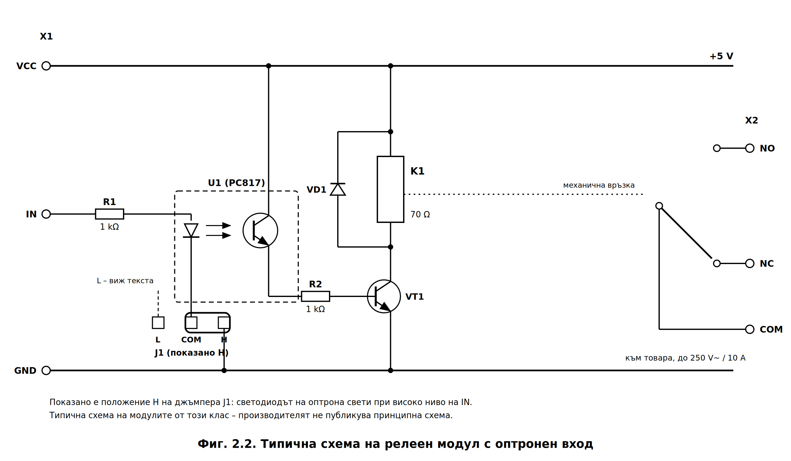{width=16cm}

Входният сигнал IN постъпва през токоограничаващ резистор (обикновено 1 kΩ) към светодиода
на оптрона (обикновено PC817 [23]). Джъмперът определя как е свързан светодиодът:

- в положение **H** катодът е свързан към масата и светодиодът свети при **високо** ниво на
  IN;
- в положение **L** анодът е свързан към +5 V и светодиодът свети при **ниско** ниво на IN.

Фототранзисторът на оптрона отпушва ключовия транзистор, който включва бобината на релето.
Паралелно на бобината е свързан защитен диод. Той осигурява затворен контур за тока при
изключване и ограничава самоиндукционното напрежение $u_L = -L\,di/dt$ (т. 2.4.4).

**Приет е режим H (активно високо ниво).** Изборът следва от две съображения:

1. **При нулиране и стартиране** изводите на ESP8266 са входове и нивото им се определя от
   подтеглящите резистори на платката. В режим H входът на модула не черпи ток, докато IN
   не е във високо ниво, и релето остава изключено.
2. **В режим L** входът е свързан към **+5 V** през светодиода и резистора. Така към извода
   на ESP8266 постъпва напрежение, по-високо от захранващото му (3,3 V). Освен това при
   нулиране, когато изводът е вход, релето може да се включи.

### 2.4.2. Съвместимост на входа с 3,3 V логика

Токът на входа при високо ниво се оценява при типичните стойности $R_{\text{вх}} = 1$ kΩ и
$V_F \approx 1{,}15$ V за инфрачервения светодиод на оптрона при малък ток:

$$I_{\text{вх}} = \frac{V_{OH} - V_F}{R_{\text{вх}}} = \frac{3{,}3 - 1{,}15}{1000} \approx 2{,}2\ \text{mA}$$

Това е **под една пета от допустимия ток на извода** ($I_{\max} = 12$ mA [11]). При четири
включени канала изводите отдават общо около 9 mA.

Коефициентът на предаване по ток на PC817 е поне 50 % [23]. Следователно
фототранзисторът осигурява поне 1,1 mA за управление на ключа. За бобина с ток 71,4 mA
(т. 2.4.3) това изисква коефициент на усилване на ключа

$$h_{FE} > \frac{I_K}{I_{C,\text{опт}}} = \frac{71{,}4}{1{,}1} \approx 65$$

Транзисторите, използвани в тези модули, изпълняват условието при типичните си параметри,
но **без голям запас** в най-неблагоприятния случай. Затова работата при 3,3 V на модули,
предназначени за 5 V логика, трябва да се провери. В макета четирите модула се задействат
надеждно, а токът на входа се определя с измерване (Глава 4).

### 2.4.3. Параметри на релето

**Таблица 2.2. Основни параметри на релето SRD-05VDC-SL-C** [19]

| Параметър | Стойност |
|---|---|
| Номинално напрежение на бобината | 5 V |
| Съпротивление на бобината | 70 Ω ± 10 % |
| Ток / мощност на бобината | 71,4 mA / 0,36 W |
| Напрежение на задействане (макс.) | 75 % от номиналното (3,75 V) |
| Напрежение на отпускане (мин.) | 10 % от номиналното (0,5 V) |
| Контакти | превключващи (COM, NO, NC), 10 A / 250 V~, 10 A / 30 V= |
| Време за задействане / отпускане | ≤ 10 ms / ≤ 5 ms |
| Изолация бобина – контакти | 1500 V~, 1 min |

Токът на бобината е:

$$I_K = \frac{U_K}{R_K} = \frac{5\ \text{V}}{70\ \Omega} = 71{,}4\ \text{mA}$$

Напрежението на задействане е 3,75 V. Релето се задейства надеждно и при пропадане на
шината +5 V с повече от 1 V спрямо действителното напрежение на VIN (около 4,9 V).

**Натоварване на контактите.** Стойността 10 A се отнася за активен товар. При индуктивни
товари (двигатели, компресори) и при товари с голям пусков ток (лампи с нажежаема жичка,
импулсни захранвания) допустимият ток е значително по-малък. Прекъсваемите товари от
т. 1.2.3 изискват внимание: бойлер с мощност 3 kW консумира около 13 A при 230 V. Такъв
товар **не може да се включва пряко** от контактите на модула – релето трябва да управлява
контактор с подходящ номинален ток.

### 2.4.4. Защитен диод

Бобината на релето е индуктивен товар. При изключване на ключа токът през нея не може да се
промени скокообразно и върху индуктивността възниква самоиндукционно напрежение. Без
защитен елемент то достига стотици волта и пробива ключовия транзистор.

Диодът в модула е свързан обратно паралелно на бобината и затваря тока след изключването.
При индуктивност на бобината от порядъка на 0,15 H (оценка) енергията, натрупана в
магнитното поле, и времеконстантата на затихване са:

$$W = \frac{1}{2} L I_K^2 = \frac{1}{2} \times 0{,}15 \times (71{,}4 \cdot 10^{-3})^2 \approx 0{,}38\ \text{mJ}$$

$$\tau_L = \frac{L}{R_K} = \frac{0{,}15}{70} \approx 2{,}1\ \text{ms}$$

Диодът удължава отпускането на релето с няколко милисекунди. За товари с топлинна инерция
това е без значение.

---

## 2.5. Органи за местно управление – бутони

### 2.5.1. Схема на свързване

Бутонът SB1 (извод D5) превключва реле 1, а SB2 (извод D6) изключва аварийно всички релета.
Двата бутона са свързани между извода и масата (**Фиг. 2.3, а**).

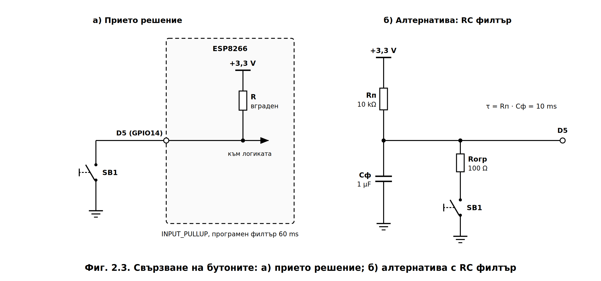{width=13cm}

Високото ниво при отпуснат бутон се осигурява от **вградения подтеглящ резистор** на
ESP8266, включен програмно с режима `INPUT_PULLUP` [24]. Съпротивлението му е от
порядъка на десетки килоома, затова токът при натиснат бутон е под 0,1 mA и е пренебрежим.

Изводите GPIO14 (D5) и GPIO12 (D6) нямат специални функции при стартиране и поддържат
прекъсвания. Това позволява **броене на всички фронтове** на сигнала и измерване на
контактното трептене (Глава 4).

### 2.5.2. Контактно трептене

При затваряне и отваряне на механичен контакт подвижната му част отскача многократно.
Продължителността на трептенето обикновено е от порядъка на няколко милисекунди и рядко
надхвърля 10 ms [25]. Без потискане едно натискане би предизвикало многократно
превключване на релето.

### 2.5.3. Програмно потискане и сравнение с RC филтър

В реализацията потискането е **програмно**. Новото състояние на бутона се приема едва когато
входът е останал непроменен поне **60 ms** (алгоритъмът е описан в Глава 3). Интервалът е
шест пъти по-дълъг от 10 ms и остава под 100 ms – границата, под която реакцията на
системата се възприема като мигновена [26].

За сравнение е разгледана алтернативата – **хардуерен RC филтър** (**Фиг. 2.3, б**) с
подтеглящ резистор $R_п = 10$ kΩ, кондензатор $C_ф = 1$ µF и токоограничаващ резистор
$R_{огр} = 100$ Ω. Времеконстантата при отпускане е:

$$\tau = R_п \cdot C_ф = 10 \cdot 10^{3} \times 1 \cdot 10^{-6} = 10\ \text{ms}$$

Праговите нива на входа на ESP8266 са $V_{IH} = 0{,}75\,V_{DD} = 2{,}475$ V и
$V_{IL} = 0{,}25\,V_{DD} = 0{,}825$ V [11]. Времето за реакция при отпускане и при натискане
е:

$$t_{\text{отп}} = \tau \ln\frac{V_{DD}}{V_{DD} - V_{IH}} = 10 \times \ln 4 = 13{,}9\ \text{ms}$$

$$t_{\text{нат}} = R_{огр} C_ф \ln\frac{V_{DD}}{V_{IL}} = 100\ \mu\text{s} \times \ln 4 = 139\ \mu\text{s}$$

Паразитен импулс с продължителност 5 ms изменя напрежението върху кондензатора с:

$$\Delta u = V_{DD}\left(1 - e^{-t_b/\tau}\right) = 3{,}3 \times \left(1 - e^{-0{,}5}\right) = 1{,}30\ \text{V} < V_{IH}$$

Следователно филтърът също потиска трептенето.

**Таблица 2.3. Сравнение на програмното и хардуерното потискане**

| Критерий | Програмно (прието) | RC филтър |
|---|---|---|
| Допълнителни елементи | няма | 3 на бутон |
| Закъснение при натискане | 60 ms (настройва се) | 139 µs |
| Промяна на параметрите | в програмата | смяна на елементи |
| Натоварване на процесора | проверка във всяка итерация (µs) | няма |
| Устойчивост при дълги проводници и смущения | по-ниска | по-висока |
| Измерване на трептенето чрез броене на фронтовете | възможно | филтърът скрива трептенето |

Следва, че за бутони, монтирани в непосредствена близост до платката, програмното потискане
е достатъчно и по-гъвкаво. RC филтър е препоръчителен при дълги проводници до бутоните или в
среда със силни електромагнитни смущения.

---

## 2.6. Измервателни канали

### 2.6.1. Датчик за температура и влажност DHT11

Датчикът се захранва с 3,3 V, а изводът за данни е свързан към D4 (GPIO2). Линията за
данни е с отворен дрейн и изисква подтеглящ резистор. Библиотеката на датчика включва
вградения подтеглящ резистор на извода преди всяко четене [27]. За проводници до
няколко десетки сантиметра, както е в макета, това е достатъчно. Производителят препоръчва
външен резистор 5 kΩ при кабел до 20 m [21].

**Протокол на обмена.** Времедиаграмата на едно четене е показана на **Фиг. 2.4**.

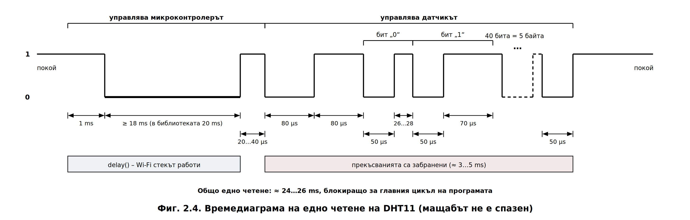{width=16cm}

1. **Старт.** Микроконтролерът задържа линията в ниско ниво поне 18 ms (библиотеката
   използва 20 ms, предшествани от 1 ms във високо ниво) и я освобождава.
2. **Отговор.** Датчикът отговаря с 80 µs ниско и 80 µs високо ниво.
3. **Данни – 40 бита.** Всеки бит започва с 50 µs ниско ниво, последвано от високо ниво с
   продължителност 26…28 µs за „0" или 70 µs за „1".
4. **Формат.** Петте байта са: цяла и дробна част на влажността, цяла и дробна част на
   температурата и контролна сума, равна на младшия байт от сбора на първите четири.

Продължителността на едно четене е:

$$t_{\text{четене}} \approx 1 + 20 + 0{,}16 + (3{,}0 \ldots 4{,}8) \approx 24{,}2 \ldots 26{,}0\ \text{ms}$$

Библиотеката приема 40-те бита при **забранени прекъсвания** (3…5 ms), а стартовия импулс
формира чрез `delay()` [27]. През това време Wi-Fi стекът продължава да работи. За
главния цикъл на програмата обаче цялото четене от около 25 ms е **блокиращо**. То определя
максималното време за цикъл, което се изследва в Глава 4.

**Таблица 2.4. Основни параметри на DHT11** [21]

| Параметър | Стойност |
|---|---|
| Захранващо напрежение | 3…5,5 V |
| Обхват: влажност / температура | 20…90 % RH / 0…50 °C |
| Точност: влажност / температура | ±5 % RH / ±2 °C |
| Разделителна способност | 1 % RH / 1 °C |
| Консумация: при измерване / в покой | 0,5…2,5 mA / 100…150 µA |
| Интервал между измерванията | поне 1 s (в програмата – 2 s) |

**Съвместимост с извода при стартиране.** GPIO2 трябва да е във високо ниво при стартиране
(т. 2.8). Линията на DHT11 в покой е във високо ниво, затова датчикът не пречи на
зареждането. Към GPIO2 е свързан и вграденият светодиод на модула ESP-12. Той примигва при
всяко четене на датчика – видим признак, че обменът протича.

### 2.6.2. Датчик за наличие на течност (HR202 с LM393)

Типичната схема на модула е показана на **Фиг. 2.5**.

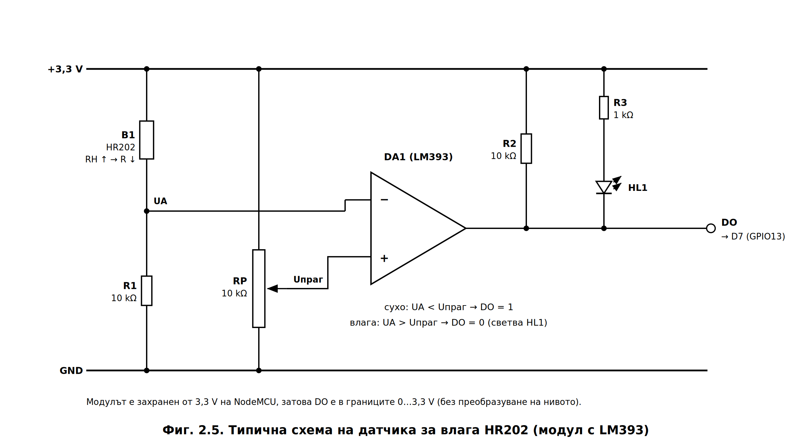{width=13cm}

HR202 и постоянен резистор образуват делител. Напрежението му постъпва на единия вход на
компаратора LM393, а на другия – праговото напрежение от потенциометъра. Изходът на LM393 е
с **отворен колектор** [22] и е изтеглен към захранването на модула с резистор 10 kΩ.
Модулът е захранен от 3,3 V на платката NodeMCU. Затова изходът DO се изменя между 0 и
3,3 V и се свързва към GPIO13 (D7) **без преобразуване на нивото**. При захранване от 5 V
високото ниво на DO би превишило допустимото за входовете на ESP8266 – захранването от
3,3 V е избрано съзнателно.

**Поведение в макета.** При сух датчик DO е във високо ниво. При попадане на течност
съпротивлението на HR202 спада под прага и DO преминава в ниско ниво. Програмата веднага
изключва всички релета и блокира включването им. Блокировката се сваля едва след 2 s
непрекъснато сухо състояние. Компараторът няма хистерезис (положителна обратна връзка),
затова близо до прага изходът му може да трепти. Задържането във времето изпълнява ролята
на хистерезис.

**Ограничения.** Влагочувствителните резистори се захранват с променливо напрежение, за да
се избегне поляризация. В модула се използва постоянно напрежение, което е приемливо за
праговото откриване на течност, но не и за точно измерване на влажността. Затова
влажността се измерва с DHT11, а HR202 служи **само като датчик за теч**.

Съществено е и поведението при неизправност. Изводът D7 е с вграден подтеглящ резистор,
затова при прекъснат проводник до модула входът се чете като „сухо" и защитата **не се
задейства**. За устройство, от което зависи безопасността, това е недостатък. Той може да
се отстрани, като активното ниво се обърне – сухото състояние да се сигнализира с ниско
ниво, така че прекъсването да води до блокировка. Друга възможност е следене на аналоговия
изход на модула за стойности извън допустимия обхват. Тези мерки са формулирани като насоки
за развитие.

### 2.6.3. Контрол на захранващото напрежение (A0)

Схемата на канала е показана на **Фиг. 2.6**.

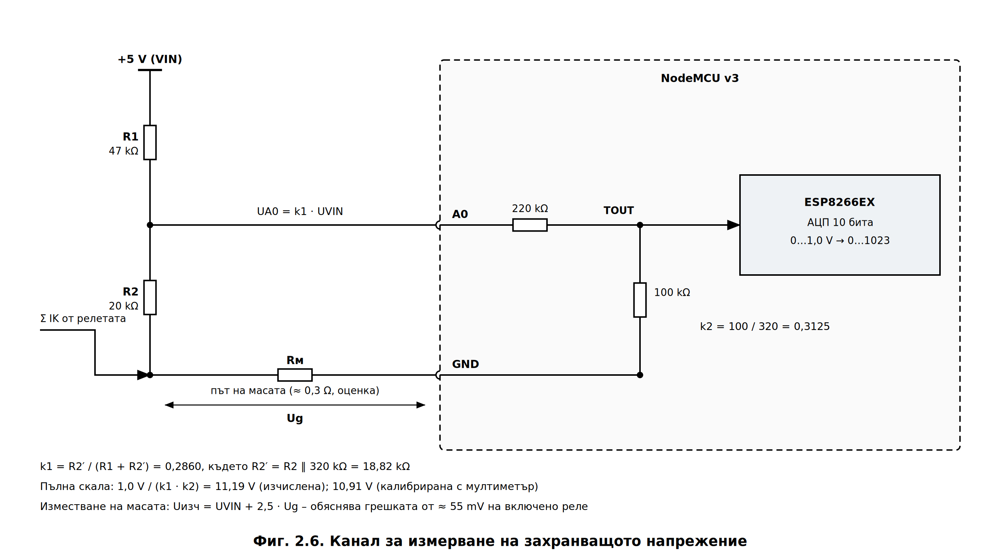{width=16cm}

Аналогово-цифровият преобразувател (АЦП) на ESP8266 е 10-битов и измерва напрежения
0…1,0 V на извода TOUT [11]. Платката NodeMCU съдържа вграден делител 220 kΩ / 100 kΩ, с
който обхватът на извода A0 става 0…3,2 V [20]. Външният делител R1 = 47 kΩ,
R2 = 20 kΩ разширява обхвата така, че да се измерва шината +5 V.

**Изчисляване на делителя.** Входното съпротивление на вградения делител,
$R_{\text{вх}} = 220 + 100 = 320$ kΩ, е свързано успоредно на R2 и не може да се пренебрегне:

$$R_2' = \frac{R_2 \cdot R_{\text{вх}}}{R_2 + R_{\text{вх}}} = \frac{20 \times 320}{20 + 320} = 18{,}82\ \text{k}\Omega$$

$$k_1 = \frac{R_2'}{R_1 + R_2'} = \frac{18{,}82}{47 + 18{,}82} = 0{,}2860, \qquad k_2 = \frac{100}{320} = 0{,}3125$$

Пълната скала на измерваното напрежение е:

$$U_{\text{VIN,max}} = \frac{U_{\text{АЦП,max}}}{k_1 k_2} = \frac{1{,}0}{0{,}2860 \times 0{,}3125} = 11{,}19\ \text{V}$$

Ако вграденият делител се пренебрегне, се получава $3{,}2 \times (47 + 20)/20 = 10{,}72$ V –
грешка от 4,2 %.

**Калибровка.** В програмата е използвана пълна скала **10,91 V**, определена
експериментално чрез сравнение с мултиметър. Тя е с 2,5 % по-малка от изчислената.
Разликата отговаря на опорно напрежение на АЦП около 0,975 V вместо 1,0 V. Обяснява се с
допуска на опорното напрежение и на резисторите. Именно такива отклонения налагат
калибровката с мултиметър.

**Параметри на канала.** Разделителната способност е 10,91 V / 1024 = 10,65 mV.
Програмата осреднява 10 последователни отчитания, което намалява случайния шум около
$\sqrt{10} \approx 3{,}2$ пъти. При $U_{\text{VIN}} = 5$ V напрежението на A0 е 1,43 V, а
отчетената стойност е около 469. Токът през делителя е 76 µA, а изходното му съпротивление –
$R_1 \parallel R_2' = 13{,}4$ kΩ. И двете стойности са без практическо значение за
енергийния баланс и за точността.

**Таблица 2.5. Параметри на канала за захранващото напрежение**

| Параметър | Стойност |
|---|---|
| Пълна скала – изчислена / калибрирана | 11,19 V / 10,91 V |
| Разделителна способност | 10,65 mV |
| Напрежение на A0 и отчет при $U_{\text{VIN}} = 5$ V | 1,43 V / ≈ 469 |
| Ток през делителя | 76 µA |
| Изходно съпротивление на делителя | 13,4 kΩ |

**Корекция при включени релета.** При калибровката е установено, че с всяко включено реле
изчисленото напрежение надвишава показанието на мултиметъра с около 55 mV. В програмата е
въведена съответна корекция. Физически обяснима причина е **изместването на масата**:
долният край на R2 е свързан към шината GND на макетната платка, по която тече и токът на
бобините към извода GND на NodeMCU. Ако този край е с $U_g$ над масата на ESP8266,
изчисленото напрежение е:

$$U_{\text{изч}} = U_{\text{VIN}} + \frac{1 - k_1}{k_1}\,U_g = U_{\text{VIN}} + 2{,}5\,U_g$$

Грешката от 55 mV на реле отговаря на $U_g \approx 22$ mV на реле. При ток около 75 mA на
модул това съответства на съпротивление на общия път на масата около 0,29 Ω – стойност,
типична за контактите на макетна платка и съединителните проводници. Хипотезата се
проверява в Глава 4 с измерване на $U_g$ между долния край на R2 и извода GND на NodeMCU.
Ако се потвърди, **схемното решение** е долният край на R2 да се свърже пряко към извода GND
на платката с отделен проводник. Тогава програмната корекция става излишна.

---

## 2.7. Захранване и енергиен баланс

Двата възела се захранват по USB с 5 V. Главният възел няма периферия и консумира до
около 180 mA. Подчиненият възел захранва и релейните модули, затова балансът му е
определящ.

**Таблица 2.6. Енергиен баланс на подчинения възел (най-неблагоприятен случай)**

| Консуматор | Ток, mA | Източник на данните |
|---|---|---|
| ESP8266EX – предаване по 802.11b (връх) | 170 | каталог [11] |
| Мост CH340 и светодиоди на платката | ≈ 10 | оценка |
| 4 × бобина на реле (4 × 71,4 mA) | 285,6 | каталог [19] |
| 4 × входна верига и светодиоди на модулите | ≈ 20 | оценка |
| DHT11 при измерване | 2,5 | каталог [21] |
| Модул HR202 + LM393 | ≈ 5 | оценка |
| Делител R1–R2 | 0,08 | изчисление |
| **Общо** | **≈ 493** | |

Сумарният ток при четири включени релета и предаване по радиоканала достига около
0,49 A. Порт USB 2.0 на персонален компютър гарантира 500 mA [28], т. е. **запасът е
практически нулев**. Затова подчиненият възел се захранва от **адаптер 5 V с ток поне 1 A**,
който осигурява двукратен запас. Средната консумация е по-малка, защото ESP8266 предава
само част от времето: при приемане консумира около 56 mA [11].

Токът на бобините протича от USB конектора през извода VIN до модулите и **не преминава през
стабилизатора**. Разсейваната мощност в AMS1117 [29] при ток на логическата част 180 mA и
напрежение на VIN около 4,9 V е:

$$P_{\text{стаб}} = (U_{\text{VIN}} - 3{,}3) \cdot I = (4{,}9 - 3{,}3) \times 0{,}18 \approx 0{,}29\ \text{W}$$

Стойността е допустима за корпус SOT-223 с медна площ на печатната платка.

**Буферен кондензатор C1 = 1000 µF / 16 V.** Свързан е между шината +5 V (VIN) и масата,
пред релейните модули. Той поема бързите изменения на тока – предаването по радиоканала и
превключването на релетата – преди те да достигнат захранващия път. Ако импулс от 100 mA с
продължителност 1 ms се поеме изцяло от кондензатора, напрежението се понижава с:

$$\Delta U = \frac{I \cdot \Delta t}{C} = \frac{0{,}1 \times 1 \cdot 10^{-3}}{1000 \cdot 10^{-6}} = 0{,}1\ \text{V}$$

Заедно със съпротивлението на захранващия път (кабел, конектори, макетна платка – от
порядъка на 0,5 Ω) кондензаторът образува нискочестотен филтър с времеконстанта
$\tau = R \cdot C \approx 0{,}5$ ms. Номиналното напрежение 16 V осигурява 3,2-кратен запас
спрямо 5 V. Натрупаната енергия е $W = \frac{1}{2} C U^2 = 12{,}5$ mJ.

> **Пусков ток.** Спецификацията USB 2.0 ограничава капацитета, който устройството
> представя на шината в момента на включване, до 10 µF [28]. Кондензатор 1000 µF се
> зарежда с пусков ток, ограничен само от съпротивлението на кабела. Това може да предизвика
> кратко пропадане на напрежението на порта. При захранване от адаптер това е без значение.
> В окончателно изделие се препоръчва схема за плавно включване.

---

## 2.8. Разпределение на изводите

Част от изводите на ESP8266 имат **специални функции при стартиране** (*boot straps*).
Нарушаването им прави зареждането на програмата невъзможно [30].

**Таблица 2.7. Ограничения на изводите на ESP8266**

| Извод | Означение | Ограничение |
|---|---|---|
| GPIO0 | D3 | високо ниво при стартиране (ниско – режим на програмиране); бутон FLASH |
| GPIO2 | D4 | високо ниво при стартиране; вграден светодиод |
| GPIO15 | D8 | ниско ниво при стартиране; на платката има подтеглящ към маса резистор |
| GPIO16 | D0 | без прекъсвания; само вграден резистор към маса |
| GPIO1 / GPIO3 | TX / RX | сериен интерфейс (UART) |
| GPIO6…GPIO11 | – | заети от SPI Flash паметта |

**Таблица 2.8. Разпределение на изводите на подчинения възел**

| Функция | Извод | GPIO | Обосновка |
|---|---|---|---|
| Реле 1 | D0 | GPIO16 | изход; не се нуждае от прекъсване |
| Реле 2 | D1 | GPIO5 | без ограничения при стартиране |
| Реле 3 | D2 | GPIO4 | без ограничения при стартиране |
| Реле 4 | D8 | GPIO15 | ниско ниво при стартиране съвпада с изключено реле |
| DHT11 | D4 | GPIO2 | линията в покой е във високо ниво – съвместимо със стартирането |
| Бутон SB1 | D5 | GPIO14 | без ограничения; прекъсване по фронт |
| Бутон SB2 | D6 | GPIO12 | без ограничения; прекъсване по фронт |
| HR202 (DO) | D7 | GPIO13 | без ограничения |
| Напрежение +5 V | A0 | TOUT | единственият аналогов вход |
| Конфигуриране | TX / RX | GPIO1 / GPIO3 | **оставени свободни** (т. 3.5 от заданието) |
| Свободен | D3 | GPIO0 | бутон FLASH на платката |

**Обосновка на приетите решения:**

**а) Релета 2 и 3 са на изводи без ограничения.** Реле 1 е на GPIO16, който е подходящ за
изход, но не поддържа прекъсвания и затова не е използван за бутон. При някои платки GPIO16
е кратко във високо ниво при подаване на захранване. Дали реле 1 щраква при включване, се
проверява в Глава 4.

**б) Реле 4 е преместено от GPIO0 (D3) на GPIO15 (D8).** В първата версия на макета реле 4
беше на GPIO0. При стартиране GPIO0 трябва да е във високо ниво. Той е изтеглен към 3,3 V с
резистор, а входът на модула в режим H е товар към маса. Нивото зависи от съотношението между
резистора на платката и входната верига на модула. С използвания модул то остава над прага
за „1" и платката зарежда. Това обаче е **негарантирана работна точка**: с друг модул или
при по-слаб подтеглящ резистор платката би стартирала в режим на програмиране. Освен това
натискането на бутона FLASH при включено реле дава изхода накъсо към маса.

GPIO15 изисква обратното – **ниско ниво** при стартиране. На платката има подтеглящ към маса
резистор, а входът на модула в режим H не издърпва нивото нагоре. Така изискването за
стартиране и изключеното състояние на релето съвпадат. Условието е джъмперът на модула да е
в положение H – в положение L входът тегли към +5 V и платката **не стартира**.

**в) DHT11 на GPIO2.** Изискването за високо ниво при стартиране е изпълнено от линията за
данни в покой.

**г) Бутоните са на GPIO14 и GPIO12.** Тези изводи поддържат прекъсвания и не влияят на
стартирането. **Фабричното нулиране** на конфигурацията се извършва чрез задържане на SB1
(D5) за 3 s при подаване на захранване. Бутонът FLASH (GPIO0) не се използва.

**д) Серийният интерфейс е свободен.** Изводите GPIO1 и GPIO3 остават за UART, през който
се извършва конфигурирането по т. 3.5 от заданието.

На главния възел се използват само USB и серийният интерфейс.

---

## 2.9. Принципна схема на подчинения възел

Обобщената принципна схема на подчинения възел е представена на **Фиг. 2.7**. Тя реализира
т. 4.3 от обяснителната записка и т. 5.2 от графичната част на заданието.

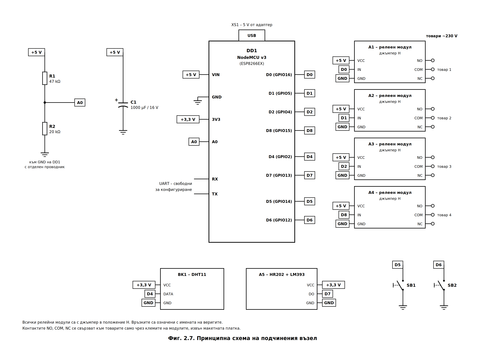{width=16cm}

Схемата е организирана по захранващите шини:

- **шина +5 V (VIN)** – захранва релейните модули A1…A4 и горния край на делителя R1–R2;
  между нея и масата е буферният кондензатор C1;
- **шина +3,3 V** – от стабилизатора на платката; захранва DHT11 и модула HR202;
- **обща маса (GND)** – обединява всички модули. Долният край на R2 е изведен отделно,
  съгласно извода в т. 2.6.3.

Връзките между изводите на NodeMCU и модулите са означени с **имената на веригите** (D0,
D1, D2, D8, D4, D5, D6, D7, A0), а не с начертани проводници. Така се избягват пресичанията
на линиите – приета практика при оформяне на принципни схеми. Модулите A1…A4 и A5 са
показани с изводите си за връзка, а вътрешните им схеми са дадени на Фиг. 2.2 и Фиг. 2.5.

---

## 2.10. Конструктивна реализация на макета

Макетът на подчинения възел е изграден върху **макетна платка без запояване** с
гъвкави съединителни проводници (**Фиг. 2.8**). Релейните модули, модулът HR202 и датчикът
DHT11 са свързани с проводници с накрайници. Главният възел е отделна платка NodeMCU,
захранена по USB.

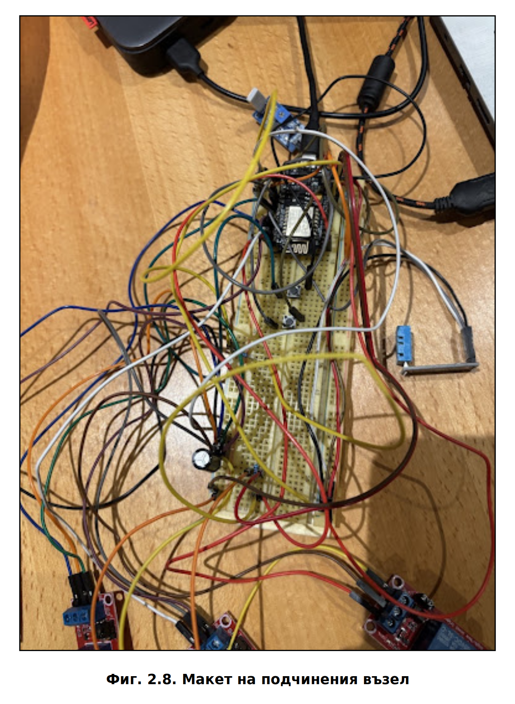{width=9cm}

Макетната платка позволява бързи промени – например преместването на реле 4 от D3 на D8, –
но има и ограничения:

- **преходното съпротивление на контактите** е от порядъка на десетки миллиома на контакт и
  се натрупва по пътя на тока. Това е вероятната причина за грешката при измерване на
  напрежението с включени релета (т. 2.6.3);
- **механичната надеждност** е ниска – проводниците могат да се разместят при вибрации;
- **мрежовото напрежение** не се допуска на макетната платка. Контактите на релетата се
  свързват към товарите само с клемите на модулите и с проводници за 230 V.

За окончателно изделие се препоръчват:

- печатна платка с отделен път на масата за релейната част и за измерването;
- предпазител и схема за плавно включване по захранването;
- контактори за товари над 10 A;
- кутия, отговаряща на изискванията за електрическа безопасност.

---

## 2.11. Изводи по Глава 2

1. Разработени са **блокова схема на хардуера** (Фиг. 2.1) и **принципна схема на
   подчинения възел** (Фиг. 2.7) по реализирания макет. Двата възела са на NodeMCU v3 и се
   захранват независимо по USB. Изпълнителната част е с четири релейни модула с оптронен
   вход.
2. Обоснован е режимът **H (активно високо ниво)** на релейните модули. Оценен е входният
   ток при 3,3 V – около 2,2 mA на канал, под една пета от допустимия за извода. Показано е,
   че запасът на ключа на модула при 3,3 V е малък и трябва да се провери с измерване.
3. Проверени са параметрите на релето SRD-05VDC-SL-C – ток на бобината 71,4 mA и напрежение
   на задействане 3,75 V. Установено е, че товари над 10 A (напр. бойлер 3 kW) изискват
   контактор.
4. Обосновано е **програмното потискане на трептенето** с интервал 60 ms и е сравнено с RC
   филтър ($\tau = 10$ ms, реакция 139 µs / 13,9 ms). Програмното решение е по-гъвкаво и
   позволява измерване на трептенето.
5. Описани са измервателните канали:
   - DHT11 – четене около 25 ms, което е блокиращо за главния цикъл;
   - HR202 с LM393 – захранен от 3,3 V за съвместимост на нивата; отбелязан е недостатъкът
     при прекъснат проводник;
   - делителят 47 kΩ / 20 kΩ – изчислена пълна скала 11,19 V при калибрирани 10,91 V
     (разлика 2,5 %), разделителна способност 10,65 mV.
6. Грешката от 55 mV на включено реле е обяснена с изместване на масата с около 22 mV на
   реле ($U_{\text{изч}} = U_{\text{VIN}} + 2{,}5\,U_g$). Предложено е схемно решение, което
   прави програмната корекция излишна.
7. Съставен е **енергийният баланс** – около 0,49 A в най-неблагоприятния случай. Това е на
   границата на порт USB 2.0 и обосновава захранването на подчинения възел от адаптер
   5 V / 1 A. Обоснован е буферният кондензатор 1000 µF / 16 V.
8. Обосновано е **разпределението на изводите** с отчитане на функциите им при стартиране,
   включително преместването на реле 4 от GPIO0 на GPIO15. Серийният интерфейс е оставен
   свободен съгласно т. 3.5 от заданието.


```{=openxml}
<w:p><w:r><w:br w:type="page"/></w:r></w:p>
```


# ГЛАВА ТРЕТА
# СОФТУЕРНО ПРОЕКТИРАНЕ НА СИСТЕМАТА

---

## 3.1. Организация на програмното осигуряване

Програмното осигуряване реализира т. 4.4 от заданието – алгоритъма на управляващата програма
– и т. 3.5 – конфигурирането по UART. Освен управлението на релетата, телеметрията и
защитата при течност програмите измерват сами показателите, които се изследват в Глава 4:
време за цикъл, закъснение и загуби на пакети, трептене на бутоните.

Програмата на всеки възел е един файл на C++ – около 1560 реда за главния (`Master.ino`) и
около 1080 реда за подчинения възел (`Slave.ino`). Описана е версия 3 на програмите, а
разликите спрямо версия 2 са посочени там, където са съществени. Използвано е ядрото Arduino
за ESP8266, версия 3.1.2 [24], което е надстройка над Non-OS SDK [31], и
библиотеките `ESP8266WiFi`, `espnow` [12], `EEPROM`, `ESP8266WebServer`,
`ESP8266mDNS`, `ArduinoOTA` и `DHT sensor library` 1.4.6 [27].

### 3.1.1. Модел на изпълнение

ESP8266 не изпълнява операционна система с приоритетни задачи. Ядрото извиква еднократно
`setup()`, а след това – многократно `loop()`. След всяко завършване на `loop()`, както и при
`delay()` и `yield()`, управлението се предава на SDK, който обслужва радиостека и TCP/IP.
Затова участъци от програмата с продължителност над 50 ms трябва да се избягват [24].

Приетият модел е **кооперативна многозадачност**. Всяка подсистема е функция, която се
извиква във всяка итерация на `loop()`, проверява дали има работа и връща управлението, без
да чака. Изчакването се реализира чрез сравнение на `millis()` или `micros()` със запомнен
момент. Разликата се изчислява с беззнакова аритметика и остава вярна и при препълването на
брояча (за `micros()` – на всеки $2^{32}$ µs ≈ 71,6 min).

Освен главния цикъл има още два контекста на изпълнение (**Фиг. 3.1**):

- **обратните функции на ESP-NOW** – извикват се от системния контекст на SDK между две
  итерации на `loop()` или по време на `delay()`. В тях не се допускат изчакване,
  продължителна работа и извеждане по UART [12, 24];
- **обработчиците на прекъсвания** от бутоните – изпълняват се веднага при фронта и трябва
  да са в оперативната памет за инструкции (атрибут `IRAM_ATTR`) [24].

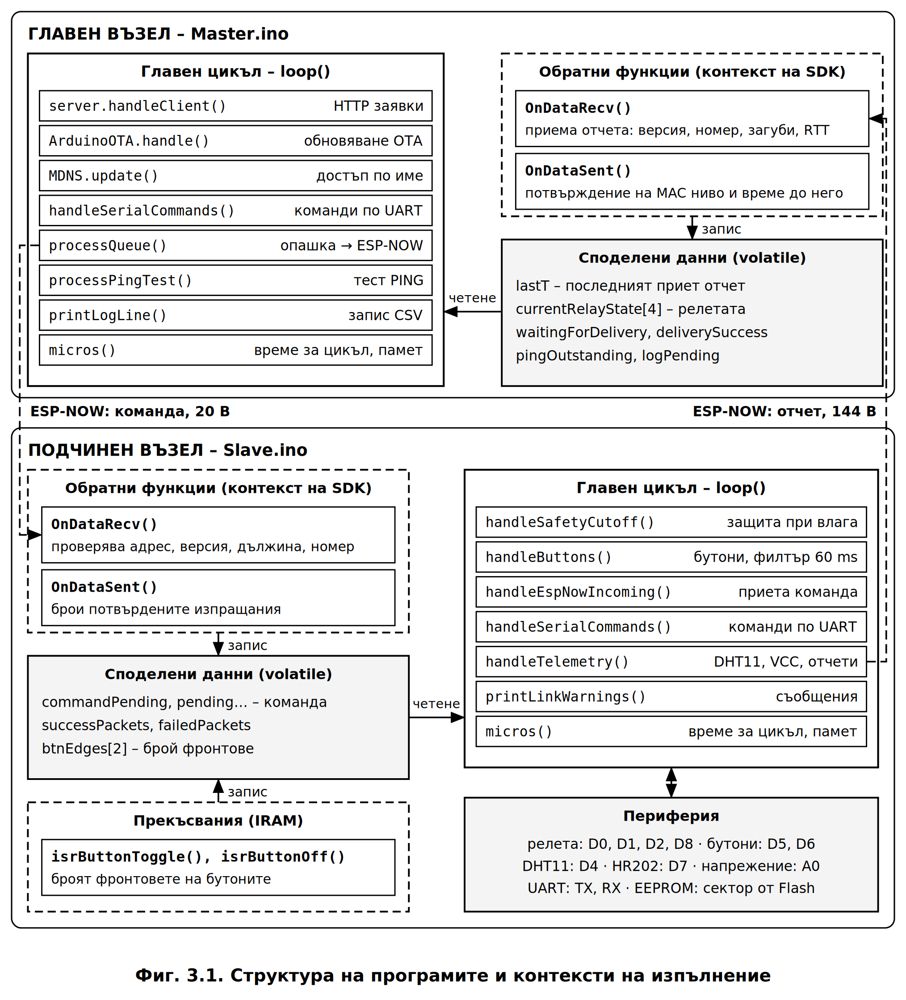{width=16cm}

Обменът между контекстите следва едно правило: **обратната функция и обработчикът на
прекъсване само записват данни и вдигат флаг, а действието се изпълнява в главния цикъл.**
Споделените променливи са обявени като `volatile`. Така изходите и серийният порт никога не
се достъпват едновременно от два контекста.

### 3.1.2. Изисквания към времето за цикъл

Горната граница на времето за изпълнение на една итерация се определя от три условия:
работата на радиостека (под 50 ms [24]); филтъра на бутоните, който приема ново
състояние след 60 ms без промяна (т. 2.5.3) и затова изисква многократна проверка на входа в
този интервал; и възприемането от потребителя – реакция до 100 ms изглежда мигновена
[26].

Единствената съзнателно блокираща операция е четенето на DHT11 – около 25 ms на всеки 2 s
(т. 2.6.1). Ако натискането съвпадне с него, промяната се отчита с до 25 ms закъснение, след
което тече интервалът на филтъра:

$$t_{\text{реакция,max}} \approx t_{\text{DHT}} + t_{\text{филтър}} = 25 + 60 = 85\ \text{ms} < 100\ \text{ms}$$

Промените спрямо версия 2 са обобщени в **Таблица 3.1**.

**Таблица 3.1. Операции с продължително изпълнение в подчинения възел**

| Операция | Версия 2 | Версия 3 |
|---|---|---|
| Четене на DHT11 | ≈ 25 ms на всеки 2 s | ≈ 25 ms на всеки 2 s |
| Измерване на напрежението (10 проби) | блокиращо, 10 × `delay(2)` ≈ 20 ms | неблокиращо, по една проба на итерация |
| Най-дълга итерация (оценка) | ≈ 45 ms | ≈ 25 ms |
| Отчитане на времето за цикъл | `millis()`, разделителна способност 1 ms | `micros()`, разделителна способност 1 µs |

---

## 3.2. Конфигуриране и енергонезависима памет

### 3.2.1. Структура на конфигурацията

ESP8266 няма вградена EEPROM памет. Библиотеката `EEPROM` зарежда в оперативната памет
отделен сектор от Flash паметта, а `commit()` го изтрива и записва наново [24].
Конфигурацията е структура от 244 B в главния и 24 B в подчинения възел (**Таблица 3.2**).

**Таблица 3.2. Конфигурационни параметри**

| Параметър | Възел | По подразбиране | Допустими стойности |
|---|---|---|---|
| Име на мрежата (SSID) / парола | Г | – | до 32 / до 64 знака |
| Име за mDNS | Г | `smarthome` | до 31 знака |
| MAC адрес на другия възел | Г, П | адресът в макета | `xx:xx:xx:xx:xx:xx` |
| Wi-Fi канал на подчинения възел | Г, П | 6 | 1…13 |
| Интервал на телеметрията | Г, П | 2000 ms | 500…60 000 ms |
| Корекция на напрежението | Г, П | 0 V | −2…+2 V |
| Парола за OTA | Г | `esp8266ota` | до 32 знака |
| Уеб потребител / парола; автентикация | Г | `admin` / `admin`; изкл. | до 16 / 32 знака; 0 или 1 |
| Праг за авария на връзката | Г | 10 s | 3…300 s |

*Г – главен възел; П – подчинен възел.*

Целостта на записа се проверява по три признака: **сигнатура** („HMC1" или „HMS1"), която
открива неинициализирана памет; **версия на формата**, която открива запис от друга версия на
програмата; и **контролна сума CRC-32** на останалите байтове, която открива повреда при
прекъсване на захранването по време на запис. Запис от версия 2 с вярна сигнатура и
контролна сума се **прехвърля** автоматично – разположението на полетата е същото, затова се
сменя само номерът на версията, а корекцията на напрежението се нулира, тъй като във версия 2
тя не се прилагаше. Във всички останали случаи се зареждат фабричните настройки. Записът във
Flash паметта се извършва само по команда, никога периодично, затова ограниченият брой
цикли на изтриване практически не се изчерпва.

### 3.2.2. Команден интерфейс по UART

Серийният интерфейс работи със 115 200 bit/s, формат 8N1. Всяка команда е ред текст
(**Таблица 3.3**), а алгоритъмът на обработката е даден на **Фиг. 3.2**.

**Таблица 3.3. Команди по UART**

| Команда | Действие | Възел |
|---|---|---|
| `SET SSID <име>`, `SET PASS <парола>`, `SET NAME <име>` | мрежа и име за mDNS | Г |
| `SET MAC`, `SET CHANNEL`, `SET INTERVAL`, `SET VCCOFFSET` | адрес на другия възел, канал, интервал, корекция | Г, П |
| `SET OTAPASS`, `SET WEBUSER`, `SET WEBPASS`, `SET WEBAUTH`, `SET LINKTIMEOUT` | защита на достъпа, праг за авария | Г |
| `SAVE`, `FACTORY` | запис в EEPROM; фабрични настройки и рестарт | Г, П |
| `PUSH` | изпраща интервала, корекцията и канала към подчинения възел | Г |
| `1`…`7`, `M`, `R<n> ON`, `R<n> OFF` | статус, релета, рестарт, конфигурация, измервания, меню | Г, П |
| `PING <n>`, `LOG ON`, `LOG OFF`, `RESET STATS` | тест на закъснението, запис във формат CSV, нулиране на броячите | Г (`RESET STATS` – и П) |

{width=16cm}

**Листинг 3.1. Разбор на командите `SET <ключ> <стойност>` (фрагмент)**

```cpp
  if (up.startsWith("SET ")) {              // up - редът в главни букви, raw - оригиналът
    int sp = raw.indexOf(' ', 4);           // интервалът след ключа
    String key = (sp < 0 ? raw.substring(4) : raw.substring(4, sp));
    String val = (sp < 0 ? String("") : raw.substring(sp + 1));
    key.trim(); key.toUpperCase(); val.trim();   // стойността запазва регистъра
    if (val.length() == 0) { Serial.println(F("Липсва стойност.")); return; }

    if (key == "SSID") {
      strncpy(cfg.ssid, val.c_str(), sizeof(cfg.ssid) - 1);
      cfg.ssid[sizeof(cfg.ssid) - 1] = 0;
    }
    else if (key == "CHANNEL") {
      int c = val.toInt();
      if (c >= 1 && c <= 13) cfg.wifiChannel = (uint8_t)c;
      else Serial.println(F("Допустим диапазон: 1-13."));
    }
    // ... останалите параметри по същия начин
    return;
  }
```

Реализацията има следните особености:

- **регистърът на стойността се запазва** – ключовите думи се сравняват в главни букви, а
  стойността се взема от оригиналния ред, защото SSID и паролите различават малки и главни
  букви;
- **стойностите се проверяват преди присвояването** (обхват, формат на MAC адреса), а
  текстовете се копират с `strncpy` до размера на полето, с явна завършваща нула;
- **паролите не се извеждат** – в ехото на командата и при показване на конфигурацията те
  са заменени с „***" и „(зададена)"; уеб интерфейсът също не ги предоставя;
- **приемането не блокира цикъла** – при липса на знаци функцията връща управлението веднага,
  а изчакването на непълен ред е ограничено до 50 ms. Затова терминалът трябва да изпраща целия
  ред наведнъж, както серийният монитор на Arduino или PuTTY с локално редактиране на реда.

Промените се правят в оперативната памет и се запазват със `SAVE`. Ако главният възел не се
свърже с мрежата за 20 s, той обслужва само UART още 120 s и се рестартира – така погрешно
въведени SSID или парола се поправят без повторно програмиране. Фабричните настройки на
подчинения възел се възстановяват и без компютър – със задържане на бутона SB1 за 3 s при
подаване на захранването (т. 2.8).

---

## 3.3. Комуникационен протокол по ESP-NOW

### 3.3.1. Съобщения

ESP-NOW пренася до 250 B полезни данни в кадър за управление по IEEE 802.11 от вида
„действие, специфично за производителя". Освен данните кадърът съдържа MAC заглавие,
идентификатори и контролна сума – общо 43 B [10, 12].

Обменът използва две структури, еднакви в двата възела: **отчет** от 144 B от подчинения
към главния възел (**Таблица 3.4**) и **команда** от 20 B в обратна посока
(**Таблица 3.5**). Структурите се предават като блок байтове без преобразуване, което е
допустимо, защото двата възела са с еднакъв процесор и компилатор. Ограничението от 250 B се
проверява при компилиране със `static_assert`.

**Таблица 3.4. Състав на отчета на подчинения възел (144 B)**

| Група | Съдържание | Размер |
|---|---|---|
| Заглавие | версии на протокола и програмата, вид на отчета, канал, пореден номер, номер на последната изпълнена команда | 12 B |
| Датчици и изходи | температура, влажност, валидност, HR202, блокировка, 4 релета, грешки на DHT11 | 17 B |
| Напрежение и конфигурация | сума на пробите от A0, напрежение, интервал, корекция | 12 B |
| Състояние на системата | време на работа, причина за последния рестарт | 36 B |
| Връзка и команди | потвърдени и непотвърдени изпращания, отхвърлени команди | 10 B |
| Време за цикъл | брой итерации, средно и най-голямо време за изпълнение, най-голям период, прозорец, максимум от стартирането | 24 B |
| Памет, бутони, защита | свободна памет и фрагментация; фронтове и натискания на бутоните; задействания и откази на защитата | 31 B |
| Подравняване | – | 2 B |

**Таблица 3.5. Видове команди на главния възел**

| Код | Команда | Действие в подчинения възел |
|---|---|---|
| 0 | `CMD_RELAY` | включва или изключва реле; включването се отказва при блокировка |
| 1 | `CMD_RESTART` | рестарт |
| 2 | `CMD_CONFIG` | запис на интервала, корекцията и канала; при нов канал – рестарт |
| 3 | `CMD_PING` | само отговор – за измерване на закъснението |
| 4 | `CMD_RESET_STATS` | нулира броячите на измерванията |

Всяка команда съдържа версията на протокола и пореден номер `seq`. Отчетите са три вида:
**периодичен** – на всеки интервал на телеметрията (2 s); **отговор на команда** – веднага
след изпълнението ѝ; **събитие** – след натискане на бутон, промяна на датчика за течност
или команда по UART, най-често веднъж на 50 ms.

**Време за предаване.** Горна оценка се получава при най-ниската скорост на IEEE 802.11b –
1 Mbit/s с дълга преамбюла от 192 µs [10]:

$$t_{\text{кадър}} = t_{\text{PLCP}} + \frac{8\,(L + 43)}{R} = 192\ \mu\text{s} + \frac{8 \times (144 + 43)\ \text{bit}}{1\ \text{Mbit/s}} = 1{,}69\ \text{ms}$$

За командата ($L$ = 20 B) времето е 0,70 ms. С кадъра за потвърждение (0,30 ms) един отчет
заема канала за около 2 ms, а една команда – за около 1 ms. При интервал 2 s периодичните
отчети заемат около **0,1 %** от времето на канала, т. е. практически не натоварват домашната
мрежа.

### 3.3.2. Надеждност на обмена

**Две нива на потвърждение.** Обратната функция `OnDataSent` съобщава дали приемникът е
потвърдил кадъра на MAC ниво. Това гарантира приемане от радиоинтерфейса, но не и обработка
от програмата [12]. Затова след всяка изпълнена команда подчиненият възел изпраща отчет
„отговор на команда" с номера ѝ (`ackSeq`) и с действителното състояние на релетата,
прочетено обратно от изходите. Главният възел приема състоянието на релетата **само от
отчетите** – подчиненият възел е единственият източник на истина.

**Проверка на приетите команди.** Подчиненият възел проверява адреса на подателя, версията
на протокола, дължината и поредния номер (**Листинг 3.2**). Отхвърлените команди се броят и
се предават в отчетите.

**Листинг 3.2. Приемане на команда в подчинения възел (фрагмент)**

```cpp
void OnDataRecv(uint8_t *mac, uint8_t *incomingData, uint8_t len) {
  if (!isBroadcastMac(cfg.peerMac) && memcmp(mac, cfg.peerMac, 6) != 0) {
    foreignMacSeen = true; cmdRejected++; return;           // не е от главния възел
  }
  if (len >= 1 && incomingData[0] != PROTO_VERSION) {     // друга версия на протокола
    badProtoSeen = incomingData[0]; cmdRejected++; return;
  }
  if (len != sizeof(incomingControl)) { cmdRejected++; return; }
  memcpy(&incomingControl, incomingData, sizeof(incomingControl));
  if (haveLastSeq && incomingControl.seq == lastSeq) {     // повторно приет пакет
    cmdRejected++; return;
  }
  lastSeq = incomingControl.seq;
  haveLastSeq = true;
  // ... само запомняне на полетата - командата се изпълнява в loop()
  commandPending = true;
}
```

**Идемпотентни команди.** `CMD_RELAY` съдържа желаното състояние, а не указание
„превключи". Повторното изпълнение дава същия резултат, а две бързи натискания в браузъра
преди пристигането на отчета не превключват релето обратно.

**Случаен начален пореден номер.** Главният възел номерира командите от случайно 32-битово
число (`ESP.random()`). Във версия 2 номерирането започваше от стойност, запазена в
конфигурацията, и след рестарт на главния възел първата команда можеше да бъде отхвърлена
като повторна. Сега вероятността за това е $2^{-32}$.

**Отчитане на загубите.** Отчетите се номерират последователно след всеки рестарт на
подчинения възел. Пропуск от $k$ номера увеличава брояча на загубените пакети с $k$, а
по-малък номер или по-малко време на работа означава рестарт. Ако отчет липсва по-дълго от
прага за авария (10 s), уеб страницата показва предупреждение.

### 3.3.3. Неблокираща опашка от команди

Командите на главния възел – от уеб интерфейса, UART, теста на закъснението и командите
`PUSH` и `RESET STATS` – се поставят в кръгова опашка с 12 места. Изпращането се управлява
от крайния автомат на **Фиг. 3.3**, който заменя блокиращото изчакване на потвърждението.

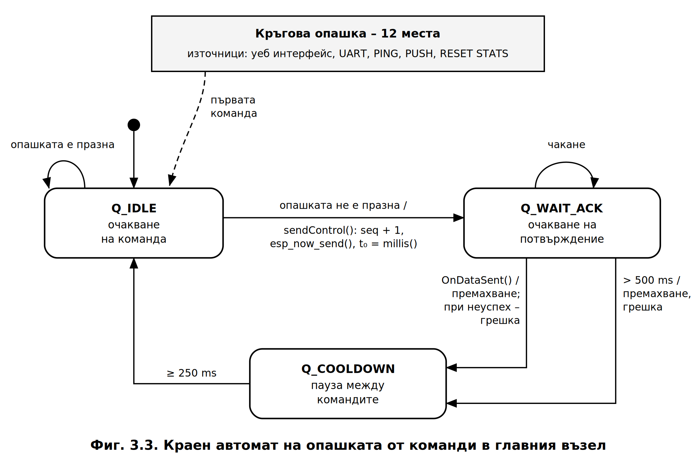{width=16cm}

Командата не се повтаря на приложно ниво – повторните предавания на MAC ниво се извършват от
радиоинтерфейса, а неуспехът се съобщава на потребителя. Показваното състояние остава
действителното, защото идва от отчетите. Изчакването от 500 ms само предпазва автомата от
блокиране, ако обратната функция не бъде извикана. Паузата от 250 ms между командите е
избрана така, че релетата да се включват едно след друго. Токът по шината +5 V нараства на
стъпки от 71,4 mA, а не от 286 mA едновременно, което е съществено при енергийния баланс на
границата на порт USB 2.0 (т. 2.7). Последователно се включват и товарите, затова пусковите
им токове се разпределят във времето. Цената е, че командата „включи всички" се изпълнява за
около 0,76 s.

### 3.3.4. Последователност на обмена

Пътят на една команда от браузъра до релето и обратно е показан на **Фиг. 3.4**.

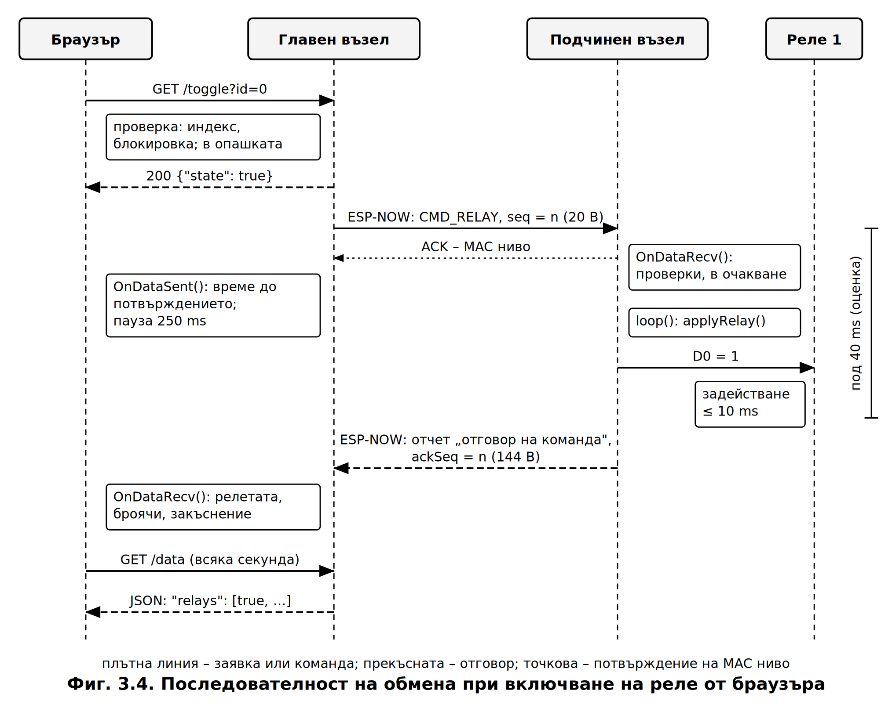{width=16cm}

Главният възел проверява допустимостта на командата, поставя я в опашката и веднага
отговаря на браузъра. Командата се изпраща в същата итерация на главния цикъл, а подчиненият
възел я изпълнява в следващата си итерация и в нея изпраща отчета. Закъснението до
задействането на релето е сума от предаването на командата (около 1 ms), изчакването на
итерацията на подчинения възел (обикновено под 1 ms, до 25 ms при четене на DHT11) и времето
за задействане на релето (до 10 ms [19]) – общо под 40 ms. Двупосочното закъснение
„команда – отчет", измервано с теста PING, се очаква да е няколко милисекунди и най-много
около 30 ms. Оценките се проверяват в Глава 4.

### 3.3.5. Синхронизация на работния канал

ESP8266 има един радиочестотен тракт, затова интерфейсът за станция и ESP-NOW работят на общ
канал (т. 1.1.6). Каналът на главния възел се определя от рутера, а подчиненият възел не е
свързан към мрежата. Затова той стартира **скрита точка за достъп**, чиято единствена задача
е да фиксира канала от конфигурацията:

```cpp
WiFi.mode(WIFI_AP_STA);
WiFi.softAP("Hidden_Slave", "", cfg.wifiChannel, 1);   // 1 - скрито име на мрежата
```

При стартиране главният възел сравнява канала на рутера с конфигурирания и при разлика
извежда предупреждение. Каналът на подчинения възел се сменя по UART или с `CMD_CONFIG`. Втората
възможност работи само докато двата възела са на общ канал, т. е. при планирана смяна –
първо се изпраща новият канал, а след това се сменя каналът на рутера. Рутерът трябва да
работи на **фиксиран канал**. Автоматичното търсене на канала е насока за развитие.

---

## 3.4. Уеб сървър и потребителски интерфейс

### 3.4.1. Организация и адреси

Главният възел използва синхронния сървър `ESP8266WebServer`. Заявките се обслужват от
`server.handleClient()` в главния цикъл, а всеки обработчик завършва бързо – поставя команда
в опашката или формира отговор. Уеб страницата (HTML, CSS и JavaScript, 17,5 kB) е записана
в програмната памет с атрибут `PROGMEM` и се изпраща с `send_P()` направо от Flash паметта,
без копиране в оперативната памет. Затова не е необходима файлова система, а страницата и
програмата се обновяват винаги заедно. Адресите са дадени в **Таблица 3.6**.

**Таблица 3.6. Адреси на уеб сървъра**

| Адрес | Параметри | Действие | Отговор / кодове за грешка |
|---|---|---|---|
| `/` | – | уеб страницата | HTML |
| `/data` | – | състояние, измервания, диагностика | JSON, ≈ 1 kB |
| `/config` | – | конфигурация, без паролите | JSON |
| `/toggle` | `id` = 0…3 | превключва реле | 400 – индекс; 403 – течност; 503 – пълна опашка |
| `/onAll`, `/offAll` | – | включва или изключва всички релета | 403 – течност |
| `/ping` | `n` = 1…1000 | стартира теста на закъснението | 409 – тестът се изпълнява |
| `/resetStats` | – | нулира броячите в двата възела | – |

Състоянието е представено като ресурс (`/data`), който страницата запитва периодично –
подход, близък до стила REST [32]. Действията обаче се извикват с метода GET, който
според семантиката на HTTP не бива да променя състоянието на сървъра [33]. В системата
рискът е малък, защото адресите се извикват само от скрипта на страницата, но в изделие
действията трябва да се изпълняват с метода POST.

### 3.4.2. Формиране на отговорите в JSON

Във версия 2 отговорът на `/data` се получаваше с долепване на обекти `String`. Всяка
секундна заявка заделяше и освобождаваше десетки блокове динамична памет, което при
непрекъсната работа води до фрагментиране. Във версия 3 отговорите се формират в
**статичен буфер от 2048 B** (**Листинг 3.3**). Текстовете се екранират съгласно RFC 8259, а
NaN и ±∞, които нямат представяне в JSON, се записват като `null` [34]. Съкращаването
на резултата се открива и при препълване сървърът връща код 500 с кратък валиден JSON –
браузърът никога не получава невалиден документ.

**Листинг 3.3. Форматиране в статичния буфер**

```cpp
__attribute__((format(printf, 1, 2)))     // компилаторът проверява аргументите
static void jsonPrintf(const char *fmt, ...) {
  if (jsonOverflow) return;
  size_t room = JSON_BUF_SIZE - jsonLen;
  va_list ap;
  va_start(ap, fmt);
  int n = vsnprintf(jsonBuf + jsonLen, room, fmt, ap);
  va_end(ap);
  if (n < 0 || (size_t)n >= room) { jsonOverflow = true; jsonBuf[jsonLen] = '\0'; return; }
  jsonLen += (size_t)n;
}
```

При типични стойности отговорът на `/data` е около 1 kB. Горната граница, получена при
най-големи стойности на всички броячи и най-дълги текстове, е около 1,4 kB – буферът има
резерв около 30 %.

### 3.4.3. Клиентска част, достъп и защита

При зареждане скриптът на страницата запитва веднъж `/config`, а след това всяка секунда –
`/data` чрез Fetch API [35], и обновява страницата без презареждане. Неуспешната заявка
означава, че главният възел е недостъпен, а флагът за авария в успешния отговор – че
подчиненият възел не изпраща данни. Показва се едно съобщение по приоритет: несъвместима
версия на протокола, авария на връзката, последна грешка при изпращане. Датчикът за течност
се показва като „СУХО", „МОКРО (БЛОКИРАНО)" или „СУХО (ИЗЧАКВАНЕ)" – през двете секунди до
свалянето на блокировката.

Главният възел обявява името си чрез mDNS [36] и LLMNR и е достъпен на адрес
`http://smarthome.local`. По избор достъпът се защитава с HTTP Basic автентикация, при която
паролата се предава кодирана, но не шифрирана [37] – приемливо в доверена домашна
мрежа, но не и в изделие. Главният възел се обновява безжично (OTA) с парола – изображението
от 393 kB се побира в областта за OTA от около 1 MB. Шифрирането на ESP-NOW със 128-битови
ключове е предвидено по избор [12] и в макета е изключено.

---

## 3.5. Измервания в подчинения възел

### 3.5.1. Температура, влажност и захранващо напрежение

DHT11 се чете в началото на всеки периодичен отчет, но не по-често от веднъж на 2 s. При
неуспешно четене се увеличава броячът на грешките и **се задържат последните валидни
стойности** – ако вместо тях се предаде нула, панелът би показал подвеждащите 0 °C. До първото
успешно четене в JSON се предава `null`.

Измерването на напрежението е разделено на стъпки, за да не блокира цикъла. След четенето на
DHT11 се стартира серия от 10 проби. Във всяка итерация се взема най-много една проба, ако от
предходната са изминали поне 2 ms, а след десетата се изпраща периодичният отчет
(**Фиг. 3.5, а**). Напрежението се изчислява с една обща функция за телеметрията и за UART:

$$U_{\text{VCC}} = \frac{\bar{N}_{A0}}{1024}\,U_{\text{FS}} - n\,\Delta U_{\text{р}} + U_{\text{кор}}$$

където $\bar{N}_{A0}$ е средният отчет на АЦП; $U_{\text{FS}}$ = 10,91 V – калибрираната пълна
скала (т. 2.6.3); $n$ – броят на включените релета; $\Delta U_{\text{р}}$ = 0,055 V –
грешката на едно включено реле; $U_{\text{кор}}$ – корекцията от конфигурацията. В отчета се
предава и сумата на пробите за калибровката в Глава 4.

При интервал 2 ms десетте проби обхващат около 20 ms – един период на мрежовото напрежение.
При равномерно разположение сумата на десет проби от синусоида с период 20 ms е нула:

$$\sum_{k=0}^{9} \sin\left(\frac{2\pi k}{10} + \varphi\right) = 0$$

Следователно освен случайния шум осредняването потиска и смущенията с честота 50 Hz. Тъй като
действителният интервал е малко над 2 ms, потискането е частично, но значително.

### 3.5.2. Време за цикъл и динамична памет

Програмата измерва с `micros()` две величини (**Фиг. 3.5, б**): **време за изпълнение**
$t_{\text{изп}}$ – от началото до края на `loop()`, и **период** $T$ – между началата на две
поредни итерации, който включва и обслужването на радиостека от SDK. В началото на `loop()`
се запомня моментът $t_0$ и се обновява най-големият период, а в края се натрупват броят на
итерациите, сумата и максимумът на $t_{\text{изп}} = t_{\text{край}} - t_0$.

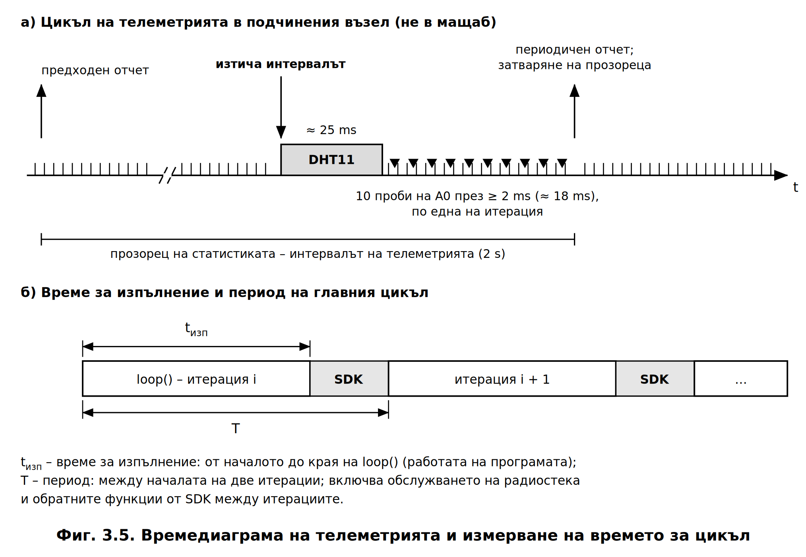{width=16cm}

Статистиката се натрупва в **прозорец** между два периодични отчета и се предава с отчета:
брой итерации $N$, средно и най-голямо $t_{\text{изп}}$, най-голям период и продължителност
на прозореца $t_{\text{пр}}$; честотата на итерациите е $f = N / t_{\text{пр}}$. Пази се и
най-голямото $t_{\text{изп}}$ от стартирането. Четенето на DHT11 е в началото на същия цикъл
на телеметрията, затова максимумът във всеки отчет показва пряко времето, през което
датчикът блокира програмата.

**Защо версия 2 показваше 0 ms.** Във версия 2 времето се измерваше с `millis()` в края на
`loop()`, след изпращането на телеметрията. В отчета попадаше продължителността на
*предходната* итерация – обикновена итерация от няколко микросекунди, която с разделителна
способност 1 ms се отчита като 0 ms. Итерацията с четенето на DHT11 и с блокиращото
измерване на напрежението (около 45 ms) никога не се предаваше. Това е **грешка в
методиката на измерване**, а не свойство на системата.

Главният възел измерва по същия начин собствения си цикъл, времето до потвърждението на MAC
ниво и двупосочното закъснение при теста PING – от изпращането на заявката до пристигането на
отчета с нейния номер. Двата възела следят и свободната динамична памет, най-малката ѝ
стойност от стартирането и фрагментацията. С `LOG ON` главният възел извежда по UART ред във
формат CSV за всеки периодичен отчет – основата за обработката в Глава 4.

---

## 3.6. Местно управление и защита при течност

### 3.6.1. Обработка на бутоните

Всеки бутон се обслужва от неблокиращ филтър (**Листинг 3.4**). Новото състояние се приема,
когато входът е непроменен повече от 60 ms. При натискане SB1 превключва реле 1, а SB2
изключва всички релета, след което се изпраща отчет за събитие.

**Листинг 3.4. Филтър срещу трептене и броене на фронтовете (бутон SB1)**

```cpp
void IRAM_ATTR isrButtonToggle() { btnEdges[0]++; }   // прекъсване по всеки фронт

void handleButtons() {
  unsigned long now = millis();
  bool r = digitalRead(BUTTON_TOGGLE_PIN);
  if (r != toggleLastRead) { toggleLastRead = r; toggleLastChange = now; }
  else if (now - toggleLastChange > DEBOUNCE_MS && r != toggleStable) {   // 60 ms
    toggleStable = r;
    noteButtonTransition(0);                 // фронтове от предходното приемане
    if (toggleStable == LOW) {               // натискане
      btnPresses[0]++;
      applyRelay(0, !currentRelayState[0]);  // при блокировка включването се отказва
      requestReport(REPORT_EVENT);
    }
  }
  // ... бутон SB2 (D6) - аналогично, изключва всички релета
}
```

Двата входа имат и прекъсване по всеки фронт, чийто обработчик само увеличава брояч. При
всяко прието превключване се изчислява колко фронта са отчетени от предходното и се запазва
най-голямата стойност. Без трептене на едно превключване съответства един фронт – всеки
следващ е отскок на контакта. Така трептенето се оценява без осцилоскоп (Глава 4), като броят е
долна граница, защото много близки фронтове се сливат.

### 3.6.2. Защитна блокировка при течност

Функцията на защитата е първа в главния цикъл. Поведението ѝ е описано с крайния автомат на
**Фиг. 3.6**.

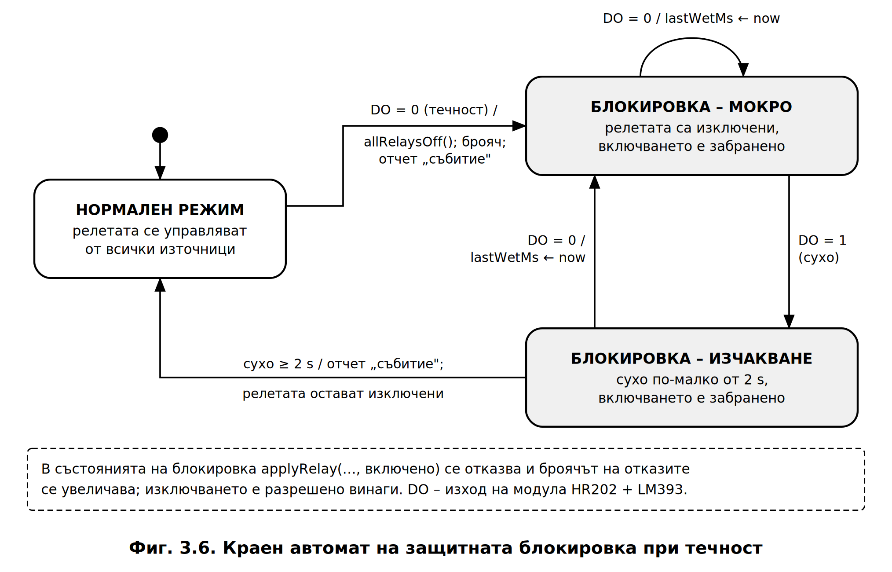{width=16cm}

Блокировката се задейства при първото отчитане на течност и изключва незабавно всички релета.
Тя се сваля едва след 2 s **непрекъснато** сухо състояние, което предпазва от трептенето на
изхода на компаратора около прага (т. 2.6.2). След свалянето ѝ релетата **не се включват
автоматично**. Докато блокировката е активна, всяко включване – от бутон, по UART или по
ESP-NOW – се отказва, а изключването е разрешено винаги. Проверката е на три нива: браузърът
не изпраща заявка, главният възел отговаря с код 403, а подчиненият възел отказва
изпълнението. Решаваща е проверката в подчинения възел – тя действа и без главния възел, и без
Wi-Fi мрежа.

Времето за реакция е сума от най-много един период на главния цикъл (до около 25 ms при
съвпадение с четенето на DHT11) и времето за отпускане на релето (до 5 ms [19]), т. е.
най-много около **30 ms**.

---

## 3.7. Алгоритъм на управляващата програма

Алгоритъмът на двата възела реализира т. 4.4 от заданието, а графичното му представяне е
лист 3 от графичната част (т. 5.3).

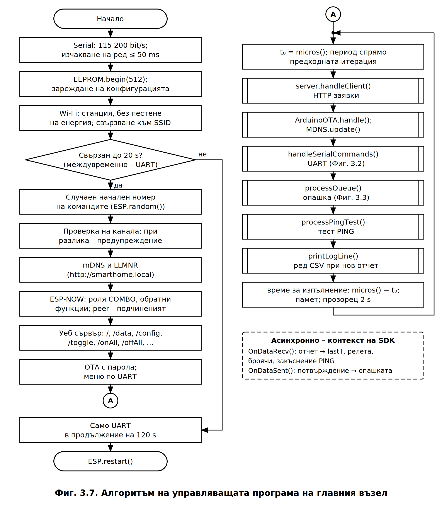{width=16cm}

Началната последователност на главния възел (**Фиг. 3.7**) включва зареждане на
конфигурацията и свързване към мрежата. Докато чака връзката, главният възел обслужва и
командите по UART, а ако връзка няма – преминава в конфигурационния прозорец (т. 3.2.2). След
свързването се избира случаен начален номер на командите, проверява се каналът и се
инициализират mDNS, ESP-NOW, уеб сървърът и безжичното обновяване. Режимът за пестене на
енергия на радиоинтерфейса е изключен, за да не се увеличава закъснението при приемане на
кадри.

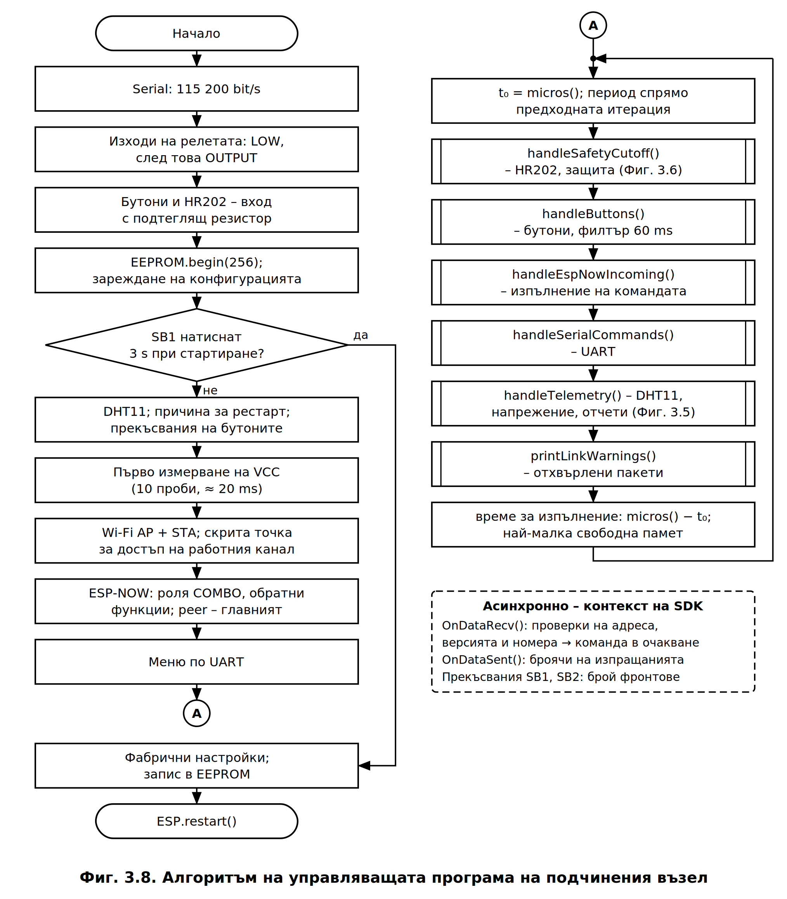{width=16cm}

В началната последователност на подчинения възел (**Фиг. 3.8**) изходите се установяват в
ниско ниво **преди** конфигурирането им като изходи, така че релетата не се задействат
кратковременно при подаване на захранването. Фабричното нулиране със задържан бутон се
проверява преди инициализацията на радиоинтерфейса, а първото измерване на напрежението се
извършва още в `setup()`, за да съдържа първият отчет валидна стойност. Редът на функциите в
главния цикъл следва приоритета им: първа е защитата при течност, следват бутоните, командите
по ESP-NOW и UART, а последна е телеметрията – така отчетът съдържа състоянието след всички
промени в същата итерация.

---

## 3.8. Проверка на програмата

Двете програми се компилират без предупреждения. Използваната памет е дадена в
**Таблица 3.7**.

**Таблица 3.7. Използвана памет (версия 3)**

| Памет | Главен възел | Подчинен възел | Достъпна |
|---|---|---|---|
| RAM – глобални и статични данни | 33 712 B (42 %) | 29 316 B (36 %) | 80 192 B |
| IRAM – код в оперативната памет | 60 831 B (92 %) | 60 747 B (92 %) | 65 536 B |
| Flash – програмен код | 356 644 B (34 %) | 271 980 B (25 %) | 1 048 576 B |

Високото запълване на IRAM се дължи на кеша на инструкциите (32 768 B) и на кода на ядрото и
SDK – приложната програма добавя само двата обработчика на прекъсвания. Паметта за данни на
главния възел е нараснала спрямо версия 2 (30 884 B) главно заради статичния буфер за JSON,
който е постоянен, за разлика от динамичните обекти `String`.

Част от поведението трудно се възпроизвежда на макета – препълването на `micros()`, загубата
на определени пакети, пакети от чужд адрес или с друга версия на протокола, препълването на
буфера за JSON. Затова **непроменените** файлове `Master.ino` и `Slave.ino` се компилират и на
персонален компютър заедно с имитация на програмния интерфейс на Arduino и ESP8266. В нея
времето е симулирано – брояч в микросекунди, който се увеличава от `delay()` и от всяка
хардуерна функция с типичното ѝ времетраене, – а изводите, АЦП, EEPROM, ESP-NOW, уеб сървърът
и серийният порт се имитират. Проверени са 114 условия за подчинения и 74 за главния възел,
сред тях прехвърлянето на конфигурация от версия 2, загубите и повторните пакети, защитата при
течност, трептенето на бутоните, теста PING и препълването на брояча на времето – всички са
изпълнени. Отговорите в JSON се проверяват със строг анализатор, а скриптът на уеб страницата
се изпълнява в Node.js с действителните отговори на главния възел – без грешки. Тестовете
проверяват **логиката** на програмата. Времената в симулацията са зададени, а не измерени,
затова времевите параметри и радиовръзката се проверяват експериментално в Глава 4.

---

## 3.9. Изводи по Глава 3

1. Програмите са изградени по модела на **кооперативната многозадачност**: обратните функции
   и обработчиците на прекъсвания само записват данни, а действията се изпълняват в главния
   цикъл.
2. Обосновано е изискването към времето за цикъл. Единствената блокираща операция е четенето
   на DHT11 (около 25 ms на 2 s), а реакцията на бутон е най-много около 85 ms. Спрямо версия 2
   най-дългата итерация е намалена от около 45 на около 25 ms.
3. Конфигурацията се съхранява в емулирана EEPROM с проверка по сигнатура, версия и CRC-32 и се
   прехвърля автоматично от версия 2. Командният интерфейс по UART проверява стойностите,
   запазва регистъра им и не извежда паролите.
4. Разработен е протокол по ESP-NOW с отчет от 144 B и команда от 20 B, потвърждение на две
   нива, идемпотентни команди, пореден номер със случайно начало и отчитане на загубите. Един
   отчет заема канала за около 2 ms (0,1 % при интервал 2 s).
5. Неблокиращата опашка с пауза 250 ms включва релетата и товарите последователно.
6. Уеб страницата се изпраща направо от Flash паметта, а отговорите в JSON се формират в
   статичен буфер с резерв около 30 %. Посочени са ограниченията – метод GET за действията и
   Basic автентикация без шифриране.
7. Вградени са средства за измерване на времето за цикъл (1 µs), паметта, закъснението,
   загубите на пакети и трептенето на бутоните – основата на Глава 4. Обяснен е артефактът
   „0 ms" във версия 2.
8. Защитната блокировка изключва релетата за не повече от около 30 ms, не ги включва
   автоматично и се проверява на три нива.
9. Разработен е алгоритъмът на управляващата програма на двата възела (т. 4.4 и т. 5.3 от
   заданието), проверен със 188 условия в тестове на персонален компютър.


```{=openxml}
<w:p><w:r><w:br w:type="page"/></w:r></w:p>
```


# ГЛАВА ЧЕТВЪРТА
# ЕКСПЕРИМЕНТАЛНИ И СИМУЛАЦИОННИ ИЗСЛЕДВАНИЯ

---

## 4.1. Цел и методи на изследването

Изследването проверява дали системата запазва правилното си поведение при неблагоприятни
условия: грешки и прекъсвания в радиоканала, повторно доставени кадри, рестарти на възлите,
трептене на бутоните и на изхода на датчика за течност, продължителна непрекъсната работа.
Използвани са три метода (**Таблица 4.1**):

- **проверка на макета** – работата на двата възела с версия 3 на програмите и калибровката
  на измерването на напрежението;
- **изчисление** – времената на обмена по IEEE 802.11 и енергийният бюджет на радиовръзката;
- **симулация на системата** – двете програми работят едновременно в симулирано време и
  обменят кадри през модел на радиоканала.

Симулацията позволява изпитвания, които на макета са трудно възпроизводими или изискват
много време – десетки хиляди повторения, зададен процент грешки в канала, рестарт в
определен момент, денонощна работа. Всички резултати в т. 4.4–4.7 са получени **чрез
симулация** и са означени като такива.

**Таблица 4.1. Изследвани показатели и методи**

| Показател | Метод |
|---|---|
| Работа на двата възела, реле 4 на извода D8 | проверка на макета |
| Калибровка на измерването на напрежението | проверка на макета (т. 2.6.3) |
| Закъснение на обмена, време до потвърждението | изчисление и симулация |
| Отчитане на загубите, съгласуваност на състоянието при грешки в канала | симулация |
| Бутони с трептене, защитна блокировка при течност | симулация |
| Денонощна работа с прекъсвания и рестарти | симулация |
| Обхват на радиовръзката | изчисление |

---

## 4.2. Проверка на макета

Двата възела са програмирани с версия 3 и работят заедно. Реле 4 се управлява нормално от
новия извод D8, което потвърждава практически решението от т. 2.8. Коефициентите за
измерването на напрежението – пълна скала 10,91 V и грешка 55 mV на включено реле – са
определени при изработването на макета чрез сравнение с мултиметър (т. 2.6.3).

Величините, които симулацията не моделира – напрежения и токове, обхват на радиовръзката,
поведение на динамичната памет, – се проверяват на макета с вградените средства за
измерване. Протоколът за това изпитване (опити Е1–Е12) е приложен към програмите.

---

## 4.3. Симулационен модел

Структурата на модела е показана на **Фиг. 4.1**. Непроменените файлове `Slave.ino` и
`Master.ino` се компилират на персонален компютър заедно с имитацията на хардуера от т. 3.8.
Всеки възел е отделна споделена библиотека със собствени изводи, EEPROM, сериен порт и
часовник с разделителна способност 1 µs. Рестартът на възел е ново зареждане на
библиотеката: оперативната памет се инициализира наново, а съдържанието на EEPROM се
запазва, както при реалния модул.

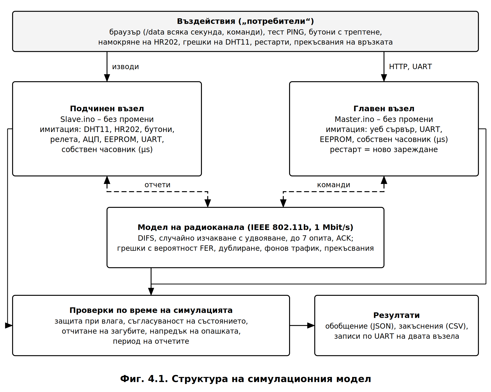{width=16cm}

Кадрите между възлите преминават през модел на радиоканала по IEEE 802.11b при 1 Mbit/s
[10]. Всеки опит за предаване започва след интервал DIFS и случайно изчакване, чиято
горна граница се удвоява при всяко повторение. Кадърът се губи с вероятност FER. Ако
потвърждението не пристигне, опитът се повтаря до 7 пъти – стойността по подразбиране в
стандарта. Моделирани са и загуба само на потвърждението, повторно доставяне на кадър до
програмата, фонов трафик от други станции и пълни прекъсвания на връзката. Обратните функции
на ESP-NOW се извикват между итерациите на главния цикъл, както при реалния модул.

Въздействията са: браузър, който запитва `/data` всяка секунда и подава команди; тест PING;
натискания на бутоните с 1…6 отскока през 0,1…1,6 ms [25]; намокряне на датчика с
трептене на изхода на компаратора; грешки при четенето на DHT11. По време на симулацията
непрекъснато се проверяват инвариантите: нито едно реле не е включено по време на
блокировка; състоянието на релетата в главния възел съвпада с действителното (проба на всеки
100 ms); броят на загубените отчети, отчетен от главния възел, съвпада със загубените в канала;
опашката от команди не блокира. Параметрите на модела са дадени в **Таблица 4.2**.

**Таблица 4.2. Параметри на симулационния модел**

| Параметър | Стойност |
|---|---|
| Скорост; PLCP; DIFS / SIFS / слот | 1 Mbit/s; 192 µs; 50 / 10 / 20 µs |
| Граница на случайното изчакване | 31…1023 слота, удвояване при повторение |
| Опити на MAC ниво | до 7 |
| Време на обратните функции | между итерациите на главния цикъл |
| Четене на DHT11 / проба на АЦП / запис в EEPROM | 25,5 ms / 90 µs / 30 ms |
| Време между итерациите (работа на SDK) | 20…200 µs според сценария |
| Общо симулирано време | 44 h в 11 сценария |

**Ограничения на модела.** Времената на хардуерните функции в Таблица 4.2 са зададени в
модела, а не измерени. Затова симулацията проверява логиката и времевото поведение при тези
стойности, но не и действителното време за изпълнение на ESP8266. Не се моделират
разпространението на радиовълните (заместено е с параметъра FER), протоколът TCP и
динамичната памет. Тези свойства се проверяват на макета.

---

## 4.4. Закъснение на обмена

### 4.4.1. Изчислена оценка

Един обмен „заявка – отговор" при теста PING е показан на **Фиг. 4.2**, а изчислените му
съставки при 1 Mbit/s – в **Таблица 4.3**.

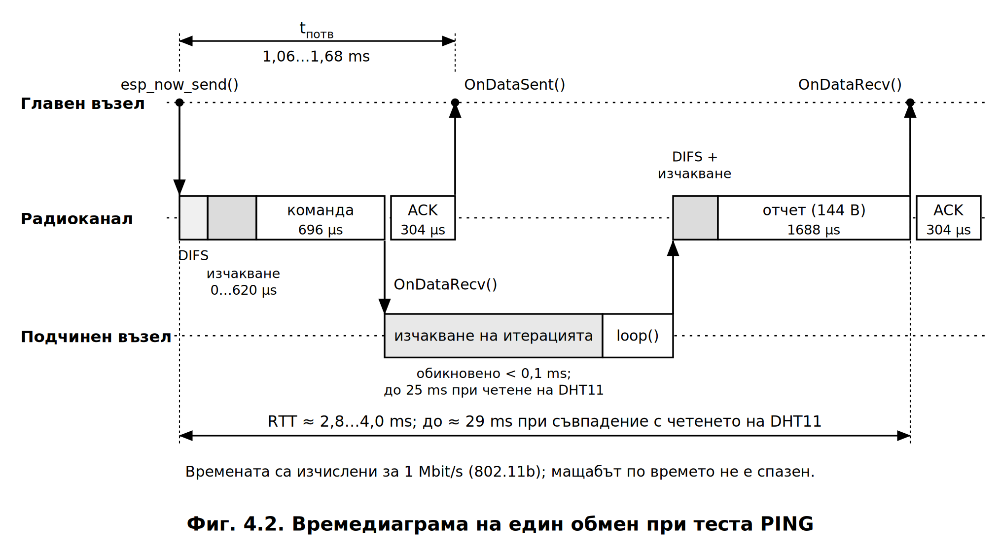{width=16cm}

**Таблица 4.3. Изчислени съставки на обмена при 1 Mbit/s**

| Съставка | Време, µs |
|---|---|
| Интервал DIFS | 50 |
| Случайно изчакване, 0…31 слота по 20 µs | 0…620 |
| Кадър с команда (20 + 43 B) | 696 |
| SIFS и кадър за потвърждение (14 B) | 10 + 304 |
| **Време до потвърждението $t_{\text{потв}}$** | **1060…1680** |
| Изчакване на итерацията на подчинения възел | обикновено под 100; до 25 000 при четене на DHT11 |
| DIFS и случайно изчакване преди отчета | 50…670 |
| Кадър с отчет (144 + 43 B) | 1688 |
| **Двупосочно закъснение RTT** | **≈ 2800…4000; до ≈ 29 000** |

Ако заявката пристигне, докато подчиненият възел чете DHT11, RTT нараства с до 25 ms. Делът на
такива заявки е равен на дела на времето, в което се чете датчикът:
$P \approx t_{\text{DHT}} / T_{\text{тел}} = 25 / 2000 = 1{,}25\ \%$.

### 4.4.2. Резултати от симулацията

Изпълнени са по около 14 000 последователни заявки при два режима на канала. Резултатите са
дадени в **Таблица 4.4**, а разпределенията – на **Фиг. 4.3**.

**Таблица 4.4. Закъснение по ESP-NOW (симулация, по 1 h)**

| Показател | Изчислено | Идеален канал | Зает канал: FER 20 %, фонов трафик 30 % |
|---|---|---|---|
| Заявки / загубени | – | 14 263 / 0 | 14 151 / 0 |
| $t_{\text{потв}}$ мин. / ср. / макс., ms | 1,06 / 1,37 / 1,68 | 1,12 / 1,43 / 4,14 | 1,12 / 3,17 / 49,2 |
| RTT мин. / медиана, ms | 2,8 / – | 2,86 / 3,48 | 2,86 / 5,28 |
| RTT ср. / 99 % / макс., ms | – / – / ≈ 29 | 3,65 / 8,62 / 28,2 | 6,47 / 24,6 / 51,7 |
| Дял на RTT > 10 ms | ≈ 0,93 % | 0,91 % | 11,5 % |

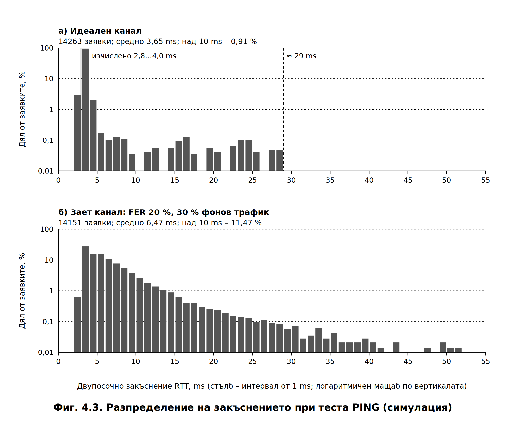{width=16cm}

При идеален канал симулацията потвърждава изчислението. Най-малкото RTT (2,86 ms) и средното
време до потвърждението (1,43 ms) се отличават от изчислените с по-малко от 5 %. Разликата
идва от времето до следващата итерация на главния цикъл. Разпределението е двугрупово
(Фиг. 4.3, а): 98 % от заявките са между 2,8 и 4,2 ms, а останалите са разпределени до
28,2 ms – случаите, в които заявката пристига по време на четенето на DHT11. Делът над 10 ms
(0,91 %) съвпада с очаквания за закъснения, по-големи от 6,5 ms, в рамките на 25-милисекундното
четене: $(25 - 6{,}5)/2000 \approx 0{,}93\ \%$.

При зает канал средното RTT се увеличава до 6,47 ms, а максималното – до 51,7 ms. Причините
са повторните предавания и удвояването на случайното изчакване. Нито една заявка не е
загубена. В 11 случая потвърждението на MAC ниво липсва, но командата е изпълнена и отчетът
е пристигнал – главният възел показва грешка, но показаното състояние остава вярно, защото
идва от отчета.

---

## 4.5. Устойчивост при грешки в радиоканала

### 4.5.1. Загуби, повторни кадри и съгласуваност на състоянието

Проведени са пет симулации по 2 h с вероятност за грешка на кадъра при един опит FER от 0 до
90 %, с команда от браузъра средно на всеки 10 s и с 0,2 % повторно доставени кадри
(**Таблица 4.5**). При 7 опита вероятността отчетът да бъде загубен на приложно ниво е
$\text{FER}^7$.

**Таблица 4.5. Работа при грешки в канала (симулация, по 2 h)**

| FER при един опит | 0 | 30 % | 50 % | 70 % | 90 % |
|---|---|---|---|---|---|
| Загубени отчети в канала | 0 от 4640 | 0 от 4681 | 25 от 4524 | 339 от 4499 | 2002 от 4146 |
| Очаквано по $\text{FER}^7$ | 0 | 0,02 % | 0,78 % | 8,2 % | 47,8 % |
| Загубени, отчетени от главния възел | 0 | 0 | 25 | 339 | 1999 + 3 |
| Повторни отчети: в канала / отчетени | 9 / 9 | 14 / 14 | 13 / 13 | 10 / 10 | 3 / 3 |
| Загубени команди | 0 | 0 | 8 | 79 | 549 |
| Повторни команди: доставени / отхвърлени | 4 / 4 | 0 / 0 | 1 / 1 | 1 / 1 | 0 / 0 |
| Съобщения за неуспешно изпращане | 0 | 13 | 107 | 507 | 1028 |
| Несъответствие на състоянието: дял / най-дълго | 0,03 % / 0,1 s | 0,06 % / 0,1 s | 0,24 % / 1,8 s | 0,94 % / 3,7 s | 6,6 % / 17,6 s |
| Средно $t_{\text{потв}}$, ms | 1,46 | 3,72 | 8,51 | 12,4 | 16,5 |

Резултатите показват следното:

- **Повторните предавания на MAC ниво скриват грешките в канала** до FER 30 % – не е загубен
  нито един отчет. Загубите растат стръмно едва при FER над 50 %, в съответствие с
  $\text{FER}^7$.
- **Отчитането на загубите е точно.** Главният възел открива всеки загубен отчет, след който е
  пристигнал поне един следващ. Трите неоткрити загуби при FER 90 % са последните отчети преди
  края на симулацията – те не могат да бъдат открити, защото след тях не е пристигнал отчет.
- **Всеки повторно доставен кадър е разпознат.** Повторните отчети се броят отделно, а
  повторните команди се отхвърлят и не се изпълняват втори път.
- **Показаното състояние се възстановява само.** При загубена команда или загубен отчет
  главният възел получава действителното състояние със следващия периодичен отчет. Затова
  несъответствието трае най-много няколко секунди – 1,8 s при FER 50 %. Дори при 48 % загуби
  то не остава трайно – най-дългото е 17,6 s, – а опашката от команди не блокира.
- При FER 30…90 % се появяват случаи, в които командата е изпълнена, но потвърждението е
  загубено. Потребителят вижда съобщение за грешка, а показаното състояние е вярно. Това е
  поведението, заложено в т. 3.3.3.

### 4.5.2. Оценка на обхвата

Грешката на кадъра зависи от мощността на приемания сигнал, т. е. от затихването по пътя.
При изходна мощност +20 dBm и чувствителност −98 dBm при 1 Mbit/s [11], антени с
усилване 0 dBi и запас за замиране 10 dB допустимото затихване е:

$$PL_{\text{доп}} = P_{\text{пред}} + G_{\text{пред}} + G_{\text{пр}} - S - M = 20 + 0 + 0 + 98 - 10 = 108\ \text{dB}$$

Затихването в сграда се описва с логаритмичния модел [38, 39]
$PL(d) = PL(1\ \text{m}) + N \lg d + L_{\text{прегр}}$, където $PL(1\ \text{m}) = 40{,}2$ dB при
2437 MHz, а $N \approx 28$ за жилищни сгради в обхвата 2,4 GHz [39]. От бюджета се
получава запасът, който остава за стените и плочите (**Таблица 4.6**).

**Таблица 4.6. Затихване и запас за преградите (изчисление)**

| Разстояние, m | 5 | 10 | 20 | 30 | 50 |
|---|---|---|---|---|---|
| Затихване без прегради, dB | 59,8 | 68,2 | 76,6 | 81,5 | 87,8 |
| Запас за прегради, dB | 48 | 40 | 31 | 26 | 20 |

Обхватът в жилище се определя от преградите, а не от разстоянието – на 20 m остават около
31 dB за загуби в стени и плочи. Когато сигналът приближи границата на чувствителността,
делът на грешните кадри расте. Според Таблица 4.5 системата продължава да работи с
възстановяващо се състояние дори при FER 70…90 %.

---

## 4.6. Местно управление и защита при течност

Резултатите от симулациите на бутоните и на защитата са дадени в **Таблица 4.7**.

**Таблица 4.7. Бутони и защитна блокировка (симулация)**

| Изпитване | Резултат |
|---|---|
| Нормални натискания (90…390 ms) с трептене, 2 h | 4692 от 4692 приети (SB1 – 3736, SB2 – 956) |
| Много кратки почуквания (20…45 ms) | 0 от 797 приети |
| Намокряния с трептене на изхода на компаратора, 3 h | 231 задействания при 231 намокряния |
| Намокряния без трептене, 3 h | 243 задействания при 243 намокряния |
| Опити за включване по време на блокировка – браузър / UART / бутон | 472 / 472 / 473 – всички отказани |
| Включено реле по време на блокировка | 0 случая |
| Време за реакция без трептене: медиана / 99 % / макс. | 0,25 / 15,6 / 25,5 ms |
| Време за реакция с трептене: медиана / 99 % / макс. | 0,25 / 27,8 / 45,7 ms |

Филтърът на бутоните приема всяко нормално натискане въпреки трептенето. Той отхвърля всички
почуквания, по-кратки от 60 ms. Трептенето на изхода на компаратора при намокряне и при
изсъхване не предизвиква допълнителни задействания и преждевременно сваляне на блокировката
– изискването за 2 s непрекъснато сухо състояние действа.

Времето за реакция обикновено е под 1 ms. Най-голямото време без трептене е 25,5 ms – колкото
продължава четенето на DHT11 в модела. Това потвърждава оценката от т. 3.6.2. При трептене
максимумът достига 45,7 ms. Причината е, че първият импулс на намокрянето е по-кратък от
текущото четене на датчика и завършва, преди програмата да провери входа. Блокировката се
задейства при следващия импулс. Постоянното намокряне винаги се открива при първата проверка.

---

## 4.7. Денонощна работа

Последната симулация обхваща 24 h работа с всички въздействия едновременно: FER 10 %, 10 %
фонов трафик, 0,1 % повторно доставени кадри, 1 % грешки при четене на DHT11, две прекъсвания
на връзката (30 s и 90 s), изключване на захранването на подчинения възел, рестарт на
подчинения възел по команда, рестарт на главния възел, 1486 команди от браузъра, поредица от
30 команди наведнъж, 554 натискания на бутоните (21 от тях по време на блокировка) и 21
намокряния. Резултатите са в **Таблица 4.8**.

**Таблица 4.8. Денонощна работа (симулация, 24 h)**

| Показател | Резултат |
|---|---|
| Изпратени отчети | 45 942 |
| Период на периодичните отчети: ср. / мин. / макс. | 2000,00 / 1999,78 / 2000,20 ms при около 20 препълвания на `micros()` |
| Загубени отчети (при прекъсванията) – в канала / отчетени | 61 / 61 |
| Повторни отчети – в канала / отчетени | 38 / 38 |
| Рестарти на подчинения възел – извършени / открити | 2 / 2 |
| Повторни команди – в канала / отхвърлени | 3 / 3 |
| Нови команди, отхвърлени след рестарта на главния възел | 0 |
| Предупреждение за авария: поява / изчезване | 10,6 s след началото / 1,6 s след края на прекъсването |
| Поредица от 30 команди | 12 приети, 18 с код 503 (пълна опашка) |
| Намокряния / задействания / включено реле при блокировка | 21 / 21 / 0 |
| Натискания: нормални / приети; кратки / приети | 511 / 511; 43 / 0 |
| Грешки на DHT11 / показана температура 0 °C | 482 / 0 случая |
| Препълвания на буфера за JSON / блокиране на опашката | 0 / 0 |
| Несъответствие на състоянието извън прекъсванията и първите 5 s след рестарт: дял / най-дълго | 0,01 % / 1,1 s |

Всички загуби на отчети са по време на двете прекъсвания и главният възел ги отчита точно.
Отчитането остава точно и след рестартите на двата възела. Предупреждението за авария се
появява около 10 s след началото на прекъсването – колкото е прагът – и изчезва с първия отчет
след него. Единственото по-дълго несъответствие на състоянието (1,1 s) е веднага след
30-секундното прекъсване. Командите, подадени по време на прекъсването, се губят, а
действителното състояние пристига с първия периодичен отчет. Периодът на отчетите остава
2 s с отклонение под 0,25 ms и при препълванията на брояча `micros()`.

---

## 4.8. Изводи по Глава 4

1. Макетът работи с версия 3 на програмите, а реле 4 се управлява от извода D8. Системата е
   изследвана и чрез симулация, в която двете непроменени програми работят заедно в
   симулирано време – общо 44 h в 11 сценария.
2. Изчисленото закъснение е потвърдено. При идеален канал RTT е 2,86…4,2 ms за 98 % от
   заявките, а при съвпадение с четенето на DHT11 – до 28,2 ms (0,91 % от заявките над 10 ms).
   При зает канал средното RTT е 6,47 ms, като не е загубена нито една заявка.
3. Повторните предавания на MAC ниво скриват грешките в канала до FER 30 %. При по-голям FER
   главният възел отчита загубите точно, повторните кадри се разпознават, а показаното
   състояние се възстановява със следващия отчет – за 1,8 s при FER 50 %.
4. Филтърът на бутоните приема всички нормални натискания и отхвърля всички почуквания под
   60 ms. Защитната блокировка се задейства при всяко намокряне, отказва всички опити за
   включване и не допуска нито едно включено реле. Времето за реакция без трептене е най-много
   25,5 ms.
5. При денонощна работа с прекъсвания, рестарти и грешки отчитането на загубите е точно,
   предупреждението за авария се появява и изчезва навреме, а опашката и буферът за JSON не се
   препълват и не блокират.
6. Резултатите показват, че програмите са устойчиви в рамките на модела. Напреженията и
   токовете, обхватът на радиовръзката и поведението на динамичната памет се проверяват на
   макета по приложения протокол.


```{=openxml}
<w:p><w:r><w:br w:type="page"/></w:r></w:p>
```


# ЗАКЛЮЧЕНИЕ

---

## 1. Обобщение на изпълнението на поставените задачи

В дипломната работа е проектирана, реализирана и изследвана двувъзлова микроконтролерна
система за управление на дома с потребителски интерфейс по стандарта IEEE 802.11.
Съответствието между поставените в т. 1.3.2 задачи и постигнатите резултати е представено в
**Таблица 5.1**.

**Таблица 5.1. Изпълнение на поставените задачи**

| № | Задача | Резултат | Раздел |
|---|---|---|---|
| 1 | Литературно проучване и избор на протоколи | Сравнени пет технологии; обоснован избор на IEEE 802.11 + ESP-NOW | 1.1 |
| 2 | Блокова схема на хардуера | Два възела на NodeMCU v3 с независимо захранване; релейни модули с оптронен вход | 2.2, Фиг. 2.1 |
| 3 | Принципна схема с изчисления | Съвместимост на модулите с 3,3 V логика; делител за шината +5 V; енергиен баланс; разпределение на изводите | 2.4–2.9, Фиг. 2.7 |
| 4 | Алгоритъм за конфигуриране по UART | Конфигурация в емулирана EEPROM с проверка по сигнатура, версия и CRC-32; команди `SET SSID`, `SET PASS` и др. | 3.2, Фиг. 3.2 |
| 5 | Обмен по ESP-NOW | Протокол с потвърждение на две нива и отчитане на загубите; неблокираща опашка | 3.3, Фиг. 3.3, Фиг. 3.4 |
| 6 | Уеб сървър | Страница във Flash паметта; JSON в статичен буфер; асинхронни заявки чрез Fetch API | 3.4 |
| 7 | Неблокиращ главен цикъл | Най-дълга итерация около 25 ms; защитна блокировка; вградено измерване на времето за цикъл | 3.1, 3.5–3.7, Фиг. 3.7, Фиг. 3.8 |
| 8 | Експериментално и симулационно изследване | Проверка на макета; съвместна симулация на двете програми – 44 h в 11 сценария | 4.1–4.7 |
| 9 | Изводи и насоки | Настоящото заключение | — |

Всички точки от обяснителната записка (т. 4.1–4.5 от заданието) и от графичната част
(т. 5.1–5.3) са покрити.

---

## 2. Основни количествени резултати

**Хардуерно проектиране.** Релейните модули с оптронен вход, предназначени за 5 V логика, се
управляват от изходите на ESP8266 в режим с активно високо ниво при входен ток около 2,2 mA на
канал – под една пета от допустимия за извода. Енергийният баланс на подчинения възел достига
около **0,49 A** и обосновава захранването му от адаптер 5 V / 1 A. Делителят 47 kΩ / 20 kΩ
разширява обхвата на A0 до изчислени 11,19 V при калибрирани 10,91 V и разделителна
способност 10,65 mV. Грешката от 55 mV на включено реле е обяснена с изместване на масата с
около 22 mV на реле. Реле 4 е преместено от GPIO0 на GPIO15, с което е отстранена
негарантираната работна точка при стартиране.

**Софтуерно проектиране.** Най-дългата итерация на главния цикъл е намалена от около 45 ms във
версия 2 до около **25 ms** – времето за четене на DHT11 – под препоръчаната граница от 50 ms
за радиостека. Отчетът по ESP-NOW е 144 B и заема радиоканала за около 2 ms, т. е. около
0,1 % от времето при интервал 2 s. Отговорите на уеб сървъра се формират в статичен буфер от
2 kB, а най-големият възможен отговор е около 1,4 kB.

**Изследване на системата.** Съвместната симулация на двете непроменени програми с модел на
радиоканала показва:

- двупосочно закъснение **2,86…4,2 ms за 98 % от заявките** и до 28,2 ms при съвпадение с
  четенето на DHT11, в съгласие с изчислената оценка 2,8…4,0 ms; при зает канал – средно
  6,47 ms без загубени заявки;
- повторните предавания скриват грешките в канала до FER 30 %. При по-голям FER главният
  възел отчита всяка откриваема загуба точно, а показаното състояние се възстановява със
  следващия отчет – за не повече от 1,8 s при FER 50 %;
- всички 4692 нормални натискания на бутоните са приети, а всички 797 почуквания под 60 ms –
  отхвърлени;
- при 495 намокряния защитната блокировка се задейства всеки път и не допуска нито едно
  включено реле; времето за реакция без трептене е най-много **25,5 ms**;
- при денонощна работа с прекъсвания, рестарти и грешки отчитането на загубите остава точно, а
  предупреждението за авария се появява 10,6 s след началото на прекъсването и изчезва 1,6 s
  след края му.

**Радиовръзка.** Енергийният бюджет дава допустимо затихване 108 dB. На 20 m в жилищна сграда
остават около 31 dB за загуби в стени и плочи – обхватът се определя от преградите, а не от
разстоянието.

---

## 3. Научно-приложни приноси

**Първи принос.** Обоснована е **хибридна двуслойна комуникационна архитектура**. В нея
универсалната съвместимост на IEEE 802.11 се използва на приложно ниво за връзка с
потребителя, а ниската латентност на същия стандарт – на връзково ниво чрез ESP-NOW. Показано
е, че общоприетият довод за високата консумация на Wi-Fi е валиден само за възли с батерийно
захранване. При устройства, комутиращи товари от порядъка на киловати, делът на управляващата
електроника е под **0,05 %**.

**Втори принос.** Показано е как готови модули за 5 V логика и изводи със специални функции
при стартиране се съчетават с ESP8266 **без допълнителни елементи**. Това се постига с избор на
активното ниво на релейните модули, захранване на компаратора на датчика за течност от 3,3 V и
разпределение на изводите, при което изискванията за стартиране съвпадат с изключеното
състояние на релетата. Грешката при измерването на захранващото напрежение е обяснена
физически – с изместване на масата, – а не само коригирана програмно.

**Трети принос.** Разработен е протокол за обмен по ESP-NOW с **потвърждение на две нива**,
идемпотентни команди и отчитане на загубите, съчетан с **вградени средства за измерване** на
времето за цикъл, закъснението, загубите на пакети и трептенето на бутоните. Показано е, че
показанието „0 ms" за времето за цикъл в предходната версия е грешка в методиката на
измерване, а не свойство на системата.

**Четвърти принос.** Предложен е метод за изследване на устойчивостта чрез **съвместна
симулация на непроменените програми на двата възела** с модел на радиоканала по IEEE 802.11.
Методът позволява повторяеми изпитвания, които на макета са трудно постижими – десетки хиляди
повторения, зададен процент грешки в канала, рестарт в определен момент, денонощна работа. Той
проверява непрекъснато инвариантите на безопасността и на съгласуваността на състоянието.

**Пети принос.** Системата е **позиционирана като изпълнителен слой на локален енергиен
мениджмънт** при домашно зареждане на електромобил. Количествено е показано, че при еднофазно
присъединяване 25 A и зареждане с 16 A остава резерв от едва **2070 W** – недостатъчен дори за
един бойлер, – а прекъсването на бойлера за три часа понижава температурата му с **под 2 °C**
поради топлинна времеконстанта от 84 h.

---

## 4. Насоки за бъдещо развитие

**4.1. Изпитване на макета с измервателни уреди.** Симулационните резултати следва да бъдат
потвърдени на макета по протокола към програмите: напрежения и токове на релейните модули,
обхват на радиовръзката при различни прегради, поведение на динамичната памет при
продължителна работа.

**4.2. Токов трансформатор за автоматично засичане на зареждането.** Това е най-същественото
функционално разширение, тъй като затваря управляващия контур. Съгласно т. 1.3.3 текущата
реализация изисква превключването да бъде инициирано от потребителя. Неинвазивен токов
трансформатор (например SCT-013) към главния извод би позволил системата **самостоятелно да
разпознава започнало зареждане** и да изключва прекъсваемите товари.

**4.3. Контролер за зарядна станция и фотоволтаична система.** Генератор на сигнала *Control
Pilot* съгласно IEC 61851-1 би позволил **динамично управление на тока за зареждане** вместо
дискретно изключване на товари. Измерването на излишъка от собствено производство би
позволило изместване на товарите към периодите на максимална генерация.

**4.4. Защита на достъпа.** Шифрирането на ESP-NOW следва да бъде включено по подразбиране.
Действията в уеб интерфейса трябва да се изпълняват с метода POST, а достъпът – да се защити с
HTTPS и сесийна автентикация. Паролите по подразбиране трябва да се сменят при първото
включване.

**4.5. Безопасно поведение на датчика за течност при повреда.** Активното ниво на датчика може
да се обърне така, че прекъснат проводник да води до блокировка, а не до състояние „сухо".

**4.6. Автоматично търсене на работния канал.** При загуба на връзката подчиненият възел може
последователно да опитва каналите 1…13, докато получи отговор от главния възел. Така отпада
изискването рутерът да работи на фиксиран канал.

**4.7. Преход към Matter/Thread и локална аналитика.** ESP32 с поддръжка на **Matter** би
осигурил съвместимост с екосистемите на водещите производители. Свободната област от 2 MB във
Flash паметта позволява натрупване на измерените стойности във файлова система, например
LittleFS [40], и анализ на енергийното потребление.

---

## 5. Заключителна оценка

Поставената цел е постигната. Разработена е система, която осигурява управление на четири
независими товара, измерване на температура и влажност, контрол на захранващото напрежение и
защита при течност. Тя е достъпна от произволно потребителско устройство **без допълнителен
хардуер, без инсталиране на приложение и без зависимост от облачна услуга**, при себестойност
от порядъка на няколко десетки лева.

Изследването показва, че програмите запазват правилното си поведение при грешки и прекъсвания
в радиоканала, повторно доставени кадри, рестарти на възлите и трептене на входовете.
Защитната блокировка действа при всяко намокряне. Приложената методика – избраните стойности са
изведени от явно формулирани ограничения, програмата сама измерва показателите си, а
устойчивостта се проверява със симулация на реалния код – прави разработката
**възпроизводима** и позволява целенасоченото ѝ надграждане в посоките, очертани в раздел 4.


```{=openxml}
<w:p><w:r><w:br w:type="page"/></w:r></w:p>
```


# ИЗПОЛЗВАНА ЛИТЕРАТУРА

*Източниците са номерирани по реда на първото им цитиране в текста съгласно
БДС ISO 690. Позоваванията в изложението са дадени в квадратни скоби.*

1. EN 50090. *Home and Building Electronic Systems (HBES).* CENELEC.
2. ISO/IEC 14543-3. *Home electronic systems (HES) architecture (KNX).* ISO/IEC.
3. RFC 7228. *Terminology for Constrained-Node Networks.* IETF, 2014.
4. RFC 4944. *Transmission of IPv6 Packets over IEEE 802.15.4 Networks.* IETF, 2007.
5. RFC 7252. *The Constrained Application Protocol (CoAP).* IETF, 2014.
6. IEEE Std 802.15.4-2020. *Standard for Low-Rate Wireless Networks.* IEEE, 2020.
7. Bluetooth SIG. *Bluetooth Core Specification, Version 5.3.* 2021.
8. Connectivity Standards Alliance. *Matter Specification, Version 1.0.* CSA, 2022.
9. Thread Group. *Thread 1.3 Specification.* 2022.
10. IEEE Std 802.11-2020. *Part 11: Wireless LAN MAC and PHY Specifications.* IEEE, 2021.
11. Espressif Systems. *ESP8266EX Datasheet.* Version 7.0, 2023.
12. Espressif Systems. *ESP-NOW User Guide.*
13. IEC 61851-1:2017. *Electric vehicle conductive charging system – Part 1: General requirements.* IEC.
14. EN 60898-1. *Circuit-breakers for overcurrent protection for household and similar installations.* CENELEC.
15. ISO 15118-2:2014. *Road vehicles – Vehicle to grid communication interface – Part 2: Network and application protocol requirements.* ISO.
16. Open Charge Alliance. *Open Charge Point Protocol (OCPP) 2.0.1 – Part 2: Specification.*
17. EN 50160:2010. *Voltage characteristics of electricity supplied by public distribution networks.* CENELEC.
18. Nanjing Qinheng Microelectronics (WCH). *CH340 – USB to Serial Chip – Datasheet.*
19. Ningbo Songle Relay Co. *SRD Series Relay (SRD-05VDC-SL-C) – Datasheet.*
20. NodeMCU Team. *NODEMCU DEVKIT V1.0 – Schematic.* GitHub: nodemcu/nodemcu-devkit-v1.0, 2015.
21. Aosong Electronics. *DHT11 Humidity & Temperature Sensor – Datasheet.*
22. Texas Instruments. *LMx93-N, LM2903-N Low-Power, Low-Offset Voltage, Dual Comparators (LM393) – Datasheet.*
23. Sharp Corporation. *PC817 Series – DIP 4-pin General Purpose Photocoupler – Datasheet.*
24. ESP8266 Community. *Arduino core for ESP8266 – Documentation.*
25. Ganssle, J. G. *A Guide to Debouncing.* The Ganssle Group, 2004 (rev. 2008).
26. Nielsen, J. *Usability Engineering.* Boston: Academic Press, 1993.
27. Adafruit Industries. *DHT-sensor-library – Arduino library for DHT11, DHT22 and similar sensors.* Version 1.4.6, GitHub.
28. USB Implementers Forum. *Universal Serial Bus Specification, Revision 2.0.* 2000.
29. Advanced Monolithic Systems. *AMS1117 – 1A Low Dropout Voltage Regulator – Datasheet.*
30. Espressif Systems. *ESP8266 Hardware Design Guidelines.* Version 2.6, 2023.
31. Espressif Systems. *ESP8266 Non-OS SDK API Reference.* Version 3.0.
32. Fielding, R. T. *Architectural Styles and the Design of Network-based Software Architectures.* PhD dissertation, University of California, Irvine, 2000.
33. RFC 9110. *HTTP Semantics.* IETF, 2022.
34. RFC 8259. *The JavaScript Object Notation (JSON) Data Interchange Format.* IETF, 2017.
35. WHATWG. *Fetch Living Standard.*
36. RFC 6762. *Multicast DNS.* IETF, 2013.
37. RFC 7617. *The 'Basic' HTTP Authentication Scheme.* IETF, 2015.
38. Rappaport, T. S. *Wireless Communications: Principles and Practice.* 2nd ed., Prentice Hall, 2002.
39. ITU-R P.1238. *Propagation data and prediction methods for the planning of indoor radiocommunication systems.* International Telecommunication Union.
40. ARM Ltd. *littlefs – A little fail-safe filesystem designed for microcontrollers.*

---

**Общо: 40 заглавия** – 22 стандарта и спецификации, 9 каталожни
листа и документация на елементи и 9 други източника (програмна документация,
монографии и дисертации).


```{=openxml}
<w:p><w:r><w:br w:type="page"/></w:r></w:p>
```


# ПРИЛОЖЕНИЕ А

## Графична част – листове 1…3

Листовете са изпълнени във формат A1 (841 × 594 mm) с основен надпис по ЕСКД.
Тук са дадени в умален вид; оригиналите са приложени отделно.

{width=16cm}

**Лист 1. Блокова схема на хардуера (т. 5.1)**


```{=openxml}
<w:p><w:r><w:br w:type="page"/></w:r></w:p>
```


{width=16cm}

**Лист 2. Принципна електрическа схема (т. 5.2)**


```{=openxml}
<w:p><w:r><w:br w:type="page"/></w:r></w:p>
```


{width=16cm}

**Лист 3. Алгоритъм на управляващата програма (т. 5.3)**
