::: {custom-style="CenterMed"}
ТЕХНИЧЕСКИ УНИВЕРСИТЕТ – СОФИЯ
:::

::: {custom-style="CenterSml"}
ФАКУЛТЕТ ПО ЕЛЕКТРОННА ТЕХНИКА И ТЕХНОЛОГИИ

Катедра „Електронна техника"
:::

::: {custom-style="CenterBig"}
ДИПЛОМНА РАБОТА
:::

::: {custom-style="CenterSml"}
за придобиване на образователно-квалификационна степен
:::

::: {custom-style="CenterBig"}
„МАГИСТЪР"
:::

::: {custom-style="CenterSml"}
на тема
:::

::: {custom-style="CenterMed"}
СИСТЕМА ЗА УПРАВЛЕНИЕ НА ДОМА ЧРЕЗ IEEE 802.11 (Wi-Fi) ИНТЕРФЕЙС
:::

|  |  |
|---|---|
| **Дипломант:** | инж. Кръстиян Тодоров Праматаров |
| **Факултетен номер:** | 901322003 |
| **Специалност:** | Електронни системи за хибридни и електромобили |
| **Форма на обучение:** | редовна |
| **Научен ръководител:** | доц. д-р инж. Любомир Богданов |
| **Консултант:** | ................................................ |
| **Рецензент:** | ................................................ |

::: {custom-style="CenterMed"}
София, 2023 г.
:::


```{=openxml}
<w:p><w:r><w:br w:type="page"/></w:r></w:p>
```


# ДЕКЛАРАЦИЯ ЗА ОРИГИНАЛНОСТДолуподписаният **инж. Кръстиян Тодоров Праматаров**, факултетен номер **901322003**,
дипломант в катедра „Електронна техника" при Факултета по електронна техника и технологии
на Технически университет – София,

**Д Е К Л А Р И Р А М,  Ч Е:**

1. Настоящата дипломна работа на тема „Система за управление на дома чрез IEEE 802.11
   (Wi-Fi) интерфейс" е **разработена самостоятелно** от мен под ръководството на научния
   ръководител.
2. Всички използвани литературни източници и чужди резултати са **надлежно цитирани** в
   текста и включени в списъка на използваната литература.
3. Представените хардуерни и софтуерни решения, изчисления и експериментални резултати са
   **собствена разработка**, освен изрично посочените.

<br>

| | |
|---|---|
| Дата: ............... | Подпис: ................................ |
| | / инж. К. Т. Праматаров / |


```{=openxml}
<w:p><w:r><w:br w:type="page"/></w:r></w:p>
```


# АНОТАЦИЯ

**Тема:** Система за управление на дома чрез IEEE 802.11 (Wi-Fi) интерфейс
**Дипломант:** инж. Кръстиян Тодоров Праматаров, ф. № 901322003
**Специалност:** Електронни системи за хибридни и електромобили
**Научен ръководител:** доц. д-р инж. Любомир Богданов

---

В дипломната работа е проектирана, реализирана и подготвена за експериментално изследване
**двувъзлова микроконтролерна система за управление на дома** с потребителски интерфейс по
стандарта IEEE 802.11, изградена върху два модула ESP8266.

Проведеният литературен обзор съпоставя пет безжични технологии по десет
технико-икономически критерия. Показано е, че общоприетият довод срещу използването на
Wi-Fi в приложения от областта на Интернет на нещата – високото енергопотребление – е
валиден единствено за възли с батерийно захранване и **отпада за устройства, комутиращи
товари с мощност от порядъка на киловати**, при които делът на управляващата електроника е
под 0,05 %. Обоснована е **хибридна двуслойна комуникационна архитектура**: достъпът на
потребителя се осъществява от произволен браузър по HTTP/REST, а обменът между възлите –
по протокола ESP-NOW на връзково ниво, което премахва зависимостта от домашния
маршрутизатор.

В хардуерната част са оразмерени драйверните стъпала на четирите релейни канала, като
допустимият диапазон за базовия резистор е изведен от две противоположни ограничения и
възлиза на 217…728 Ω. В софтуерната част е реализирано **изцяло неблокиращо изпълнение**
чрез крайни автомати, при което времето за един цикъл е сведено до 1…2 ms – 375 пъти
по-малко от варианта с блокиращо четене на датчика. Конфигурирането по UART със запис в
96-байтов буфер премахва твърдо кодираните мрежови данни от изходния код.

Системата е позиционирана като **изпълнителен слой на локален енергиен мениджмънт** при
домашно зареждане на електромобил: количествено е показано, че при еднофазно присъединяване
25 A и зареждане с 16 A остава резерв от едва 2070 W.

**Ключови думи:** IEEE 802.11, ESP8266, ESP-NOW, домашна автоматизация, енергиен
мениджмънт, електромобили, неблокиращо програмиране, LittleFS, RESTful API.

Обемът на дипломната работа е 63 страници и съдържа 16 фигури, 27 таблици,
11 листинга и 31 литературни източника. Графичната част се състои от 3 листа формат A1.

---

# ABSTRACT

**Title:** Home Automation System via IEEE 802.11 (Wi-Fi) Interface

The thesis presents the design and implementation of a **two-node microcontroller home
automation system** with an IEEE 802.11 user interface, built on two ESP8266 modules.

A comparative review of five wireless technologies against ten technical and economic
criteria shows that the common argument against Wi-Fi for Internet-of-Things applications –
its power consumption – holds only for battery-powered nodes and **does not apply to devices
switching kilowatt-range loads**, where the controller accounts for less than 0.05 % of the
total. A **hybrid two-layer communication architecture** is justified: the user connects
from any browser over HTTP/REST, while inter-node exchange uses the ESP-NOW link-layer
protocol, removing the dependency on the home router.

The hardware section derives the admissible base-resistor range (217…728 Ω) for the relay
driver stages from two opposing constraints. The software is **fully non-blocking**, built
on finite state machines, reducing the loop time to 1…2 ms – 375 times shorter than the
blocking-sensor variant. UART configuration stored in a 96-byte buffer eliminates hard-coded
network credentials from the source code.

The system is positioned as an **actuation layer for local home energy management** during
electric-vehicle charging: with a 25 A single-phase supply and 16 A charging, only 2070 W of
headroom remains.

**Keywords:** IEEE 802.11, ESP8266, ESP-NOW, home automation, energy management, electric
vehicles, non-blocking programming, LittleFS, RESTful API.


```{=openxml}
<w:p><w:r><w:br w:type="page"/></w:r></w:p>
```


# СЪДЪРЖАНИЕ

| | стр. |
|---|---|
| **АНОТАЦИЯ** | 3 |
| **ДЕКЛАРАЦИЯ ЗА ОРИГИНАЛНОСТ** | 4 |
| **СЪДЪРЖАНИЕ** | 5 |
| **СПИСЪК НА ИЗПОЛЗВАНИТЕ СЪКРАЩЕНИЯ** | 6 |
| **ГЛАВА ПЪРВА. УВОД, ЦЕЛ И ЗАДАЧИ** | 7 |
| &nbsp;&nbsp;&nbsp;&nbsp;1.1. Литературен обзор | 7 |
| &nbsp;&nbsp;&nbsp;&nbsp;1.2. Връзка с проблематиката на електромобилите и локалния енергиен мениджмънт | 13 |
| &nbsp;&nbsp;&nbsp;&nbsp;1.3. Цел и задачи на дипломната работа | 16 |
| **ГЛАВА ВТОРА. ХАРДУЕРНО ПРОЕКТИРАНЕ** | 18 |
| &nbsp;&nbsp;&nbsp;&nbsp;2.1. Изисквания към хардуера и общ подход | 18 |
| &nbsp;&nbsp;&nbsp;&nbsp;2.2. Блокова схема на системата | 19 |
| &nbsp;&nbsp;&nbsp;&nbsp;2.3. Избор на елементна база | 20 |
| &nbsp;&nbsp;&nbsp;&nbsp;2.4. Драйверно стъпало на релейните канали | 21 |
| &nbsp;&nbsp;&nbsp;&nbsp;2.5. Схема за потискане на контактното трептене | 25 |
| &nbsp;&nbsp;&nbsp;&nbsp;2.6. Измервателен канал | 27 |
| &nbsp;&nbsp;&nbsp;&nbsp;2.7. Захранващ блок и енергиен баланс | 28 |
| &nbsp;&nbsp;&nbsp;&nbsp;2.8. Разпределение на изводите | 29 |
| &nbsp;&nbsp;&nbsp;&nbsp;2.9. Обобщена принципна схема на подчинения възел | 31 |
| &nbsp;&nbsp;&nbsp;&nbsp;2.10. Изводи по Глава 2 | 32 |
| **ГЛАВА ТРЕТА. СОФТУЕРНО ПРОЕКТИРАНЕ** | 32 |
| &nbsp;&nbsp;&nbsp;&nbsp;3.1. Принципи на софтуерната организация | 32 |
| &nbsp;&nbsp;&nbsp;&nbsp;3.2. Организация на енергонезависимата памет и конфигуриране по UART | 33 |
| &nbsp;&nbsp;&nbsp;&nbsp;3.3. Комуникационен обмен по ESP-NOW | 37 |
| &nbsp;&nbsp;&nbsp;&nbsp;3.4. Уеб сървър с файлова система LittleFS | 41 |
| &nbsp;&nbsp;&nbsp;&nbsp;3.5. Неблокиращ измервателен канал | 44 |
| &nbsp;&nbsp;&nbsp;&nbsp;3.6. Обслужване на органите за ръчно управление | 46 |
| &nbsp;&nbsp;&nbsp;&nbsp;3.7. Главен цикъл | 47 |
| &nbsp;&nbsp;&nbsp;&nbsp;3.8. Изводи по Глава 3 | 48 |
| **ГЛАВА ЧЕТВЪРТА. ЕКСПЕРИМЕНТАЛНИ ИЗСЛЕДВАНИЯ** | 49 |
| &nbsp;&nbsp;&nbsp;&nbsp;4.1. Цел и организация на изследването | 49 |
| &nbsp;&nbsp;&nbsp;&nbsp;4.2. Изследване на обхвата на връзката | 49 |
| &nbsp;&nbsp;&nbsp;&nbsp;4.3. Изследване на закъснението | 52 |
| &nbsp;&nbsp;&nbsp;&nbsp;4.4. Изследване на точността на температурното измерване | 54 |
| &nbsp;&nbsp;&nbsp;&nbsp;4.5. Експериментална проверка на филтъра за потискане на трептенето | 55 |
| &nbsp;&nbsp;&nbsp;&nbsp;4.6. Изследване на времето за цикъл | 56 |
| &nbsp;&nbsp;&nbsp;&nbsp;4.7. Изследване на надеждността при продължителна работа | 57 |
| &nbsp;&nbsp;&nbsp;&nbsp;4.8. Изводи по Глава 4 | 57 |
| **ЗАКЛЮЧЕНИЕ** | 58 |
| **ИЗПОЛЗВАНА ЛИТЕРАТУРА** | 61 |
| **ПРИЛОЖЕНИЕ А. Графична част – листове 1–3** | 63 |

> Номерата на страниците са ориентировъчни. При окончателното оформяне в текстов
> редактор съдържанието се генерира автоматично от стиловете на заглавията.


```{=openxml}
<w:p><w:r><w:br w:type="page"/></w:r></w:p>
```


# СПИСЪК НА ИЗПОЛЗВАНИТЕ СЪКРАЩЕНИЯ

| Съкращение | Значение |
|---|---|
| **AES** | Advanced Encryption Standard – стандарт за симетрично шифроване |
| **API** | Application Programming Interface – приложен програмен интерфейс |
| **BLE** | Bluetooth Low Energy |
| **BSS** | Basic Service Set – базов набор от услуги |
| **CRC** | Cyclic Redundancy Check – циклична контролна сума |
| **CSMA-CA** | Carrier Sense Multiple Access with Collision Avoidance |
| **DCF** | Distributed Coordination Function – разпределена координационна функция |
| **DLM** | Dynamic Load Management – динамично управление на товара |
| **EEPROM** | Electrically Erasable Programmable Read-Only Memory |
| **ESP-NOW** | Протокол на Espressif за обмен на връзково ниво |
| **EVSE** | Electric Vehicle Supply Equipment – зарядна станция |
| **GPIO** | General Purpose Input/Output – универсален вход/изход |
| **HEMS** | Home Energy Management System – система за управление на енергията в дома |
| **HTTP** | HyperText Transfer Protocol |
| **JSON** | JavaScript Object Notation |
| **LDO** | Low Dropout regulator – стабилизатор с малък пад |
| **MAC** | Medium Access Control – управление на достъпа до средата |
| **OCPP** | Open Charge Point Protocol |
| **PDR** | Packet Delivery Ratio – коефициент на доставените пакети |
| **REST** | Representational State Transfer |
| **RC** | Резисторно-капацитивна верига |
| **STA** | Station – станция в инфраструктурен режим |
| **UART** | Universal Asynchronous Receiver/Transmitter |
| **WPA2/WPA3** | Wi-Fi Protected Access – механизми за защита |
| **1-Wire** | Еднопроводен цифров интерфейс |


```{=openxml}
<w:p><w:r><w:br w:type="page"/></w:r></w:p>
```


# ГЛАВА ПЪРВА
# УВОД, ЦЕЛ И ЗАДАЧИ НА ДИПЛОМНАТА РАБОТА

---

## 1.1. Литературен обзор

### 1.1.1. Развитие на системите за домашна автоматизация

Развитието на домашната автоматизация преминава през три поколения. **Първото** се
свързва с протокола **X10** (1975 г.), пренасящ информация по силнотоковата мрежа при
скорост около 60 bit/s; въпреки ниската си надеждност той въвежда идеята за **адресируемо
управление на разпределени товари**. **Второто** се налага през 90-те години с кабелните
полеви шини **KNX/EIB** [1, 2], **LonWorks** и **BACnet** – надеждни и
детерминирани, но изискващи отделна шинна инсталация, което ги прави икономически
неприложими при модернизация на съществуващ жилищен фонд.

**Третото поколение** се основава на безжичните сензорни мрежи след приемането на
**IEEE 802.15.4** (2003 г.) и на концепцията за **ограничен изчислителен възел** (RFC 7228)
със стека **6LoWPAN** (RFC 4944) и протокола **CoAP** (RFC 7252) [3–5], като появата на евтини
системи в кристал с интегриран радиочестотен тракт свежда себестойността на един възел под
5 €. Към това поколение принадлежи настоящата разработка, чиято постановка е: **да се
постигне функционалност, съпоставима с професионална шинна система, без полагане на
допълнителна инсталация и при себестойност от няколко десетки лева.**

---

### 1.1.2. Критерии за оценка на безжичните технологии

Оценката е проведена по десет критерия: пропускателна способност; латентност;
обхват; енергопотребление; топология; себестойност; **необходимост от допълнителен шлюз**;
**достъп от потребителско устройство без допълнителен хардуер**; защита на информацията;
съвместно съществуване в ISM обхвата.

Двата удебелени критерия са определящи: система, изискваща отделен шлюз, за да бъде
достъпна от смартфон, увеличава едновременно себестойността и броя на точките на отказ
(*single points of failure*), което противоречи на изискването за автономност.

---

### 1.1.3. Анализ на алтернативните безжични технологии

**IEEE 802.15.4 и ZigBee** [6] осигуряват клетъчна (*mesh*) топология при изключително ниска
консумация – средният ток на крайно устройство се свежда до десетки микроампера. Три
обстоятелства обаче правят стека неприложим за поставената задача: **задължителен шлюз**,
тъй като нито един смартфон, таблет или лаптоп не разполага със ZigBee приемо-предавател;
**недостатъчна пропускателна способност** при кадър от **127 байта**, от които за приложни
данни остават 80…100 – принципно непригодно за пренос на уеб интерфейс; и **интерференция
с Wi-Fi**, чието избягване изисква каналите да бъдат подбрани в междините между Wi-Fi
канали 1, 6 и 11, което не може да бъде гарантирано в жилищна среда.

**Bluetooth Low Energy** [7] е налице във всеки съвременен смартфон, но отпада поради:
**липса на постоянна свързаност** – BLE е ориентиран към периодично свързване, докато
системата трябва да е достъпна непрекъснато, включително в отсъствието на собственика;
**топологично ограничение** – базовата архитектура е звезда, а Bluetooth Mesh използва
управляемо наводняване (*managed flooding*) със значителен паразитен трафик; и **отсъствие
на естествен IP стек**, поради което достъпът от браузър изисква междинен мост.

**Z-Wave** осигурява добра проникваща способност без конфликт с Wi-Fi, но е
**собственическа технология** с лицензиран достъп до спецификацията. **Thread/Matter** [8, 9] е
перспективно решение, което обаче изисква **граничен маршрутизатор** и по-обемен стек,
налагащ по-мощни микроконтролери. **LoRaWAN и NB-IoT** са принципно непригодни:
регулаторното **ограничение на коефициента на запълване** от 1 % в подобхвата g1 е
несъвместимо с интерактивно управление, а NB-IoT изисква абонамент към мобилен оператор,
с което системата губи автономността си.

---

### 1.1.4. IEEE 802.11 (Wi-Fi) – характеристика и критичен анализ

ESP8266 поддържа изменения **802.11 b/g/n** [10] в конфигурация 1 × 1, достигайки **72,2 Mbit/s**
на физическо ниво. Достъпът до средата се управлява от разпределената координационна
функция (**DCF**), реализираща **CSMA-CA**. Съществено предимство е **положителното
потвърждение на връзково ниво** – при загуба на кадър повторното предаване се извършва от
MAC подслоя, без участие на приложението. Защитата се осигурява от **WPA2-PSK**
(CCMP/AES-128) или **WPA3-SAE**.

Съгласно каталожните данни на ESP8266EX [11] консумацията е ≈ 170 mA при предаване, 56…60 mA
при приемане, ≈ 15 mA в *modem-sleep* и ≈ 20 µA в *deep-sleep* – с един до два порядъка
по-високо от ZigBee и BLE. Именно това традиционно се посочва като основен недостатък на
Wi-Fi в литературата за Интернет на нещата.

**Критичен анализ.** Настоящата разработка отхвърля механичното пренасяне на този извод,
тъй като той е валиден единствено за **възли със самостоятелно батерийно захранване**.
Проектираната система управлява **електромеханични релета, комутиращи товари с мрежово
напрежение 230 V**, откъдето следва, че: всеки възел е неотменимо свързан към
електрическата мрежа – в противен случай не би могъл да изпълни основната си функция;
бобината на едно реле консумира **70…90 mA**, съизмеримо със самия радиочестотен модул; а
управляваните товари са с мощност от порядъка на **киловати**, при което делът на
управляващата електроника е под **0,05 %**.

Оттук произтича основополагащият извод на обзора: **ограничението по енергопотребление,
което дисквалифицира Wi-Fi в класическите сензорни приложения, не е ограничение за
разглеждания клас изпълнителни устройства.**

---

### 1.1.5. Сравнителен анализ

**Таблица 1.1. Сравнителна характеристика на безжичните технологии**

| Показател | **Wi-Fi (802.11 b/g/n)** | ZigBee | BLE 5.x | Z-Wave | LoRaWAN |
|---|---|---|---|---|---|
| Честотен обхват | 2,4 GHz | 2,4 GHz / 868 MHz | 2,4 GHz | 868,42 MHz | 868 MHz |
| Скорост (физ. ниво) | до 72,2 Mbit/s | 250 kbit/s | 0,125…2 Mbit/s | до 100 kbit/s | 0,3…50 kbit/s |
| Полезен товар | до 2304 B | 127 B (кадър) | 251 B | 64 B | 51…242 B |
| Типична латентност | 20…100 ms | 20…50 ms | 7,5…100 ms | 50…100 ms | секунди |
| Обхват в помещение | 20…50 m | 10…30 m (mesh) | 10…40 m | 30…50 m | > 1 km |
| Консумация (активна) | висока | ниска | много ниска | ниска | много ниска |
| Топология | инфраструктурна звезда | клетъчна | звезда / mesh | клетъчна | звезда |
| **Необходим шлюз** | **не** | да | да | да | да |
| **Достъп от браузър** | **директен** | не | не | не | не |
| Себестойност на възела | ниска (3…5 €) | средна | ниска | висока | средна |
| Отвореност на стандарта | пълна | пълна | пълна | **ограничена** | пълна |

По критерия защита разликата е несъществена – всички технологии използват AES-128. ZigBee
и BLE превъзхождат Wi-Fi **единствено по енергопотребление**, чието значение беше
отхвърлено в т. 1.1.4. Особена тежест има критерият **отсъствие на шлюз**: при Wi-Fi
потребителят въвежда мрежово име или IP адрес в произволен браузър и получава пълноценен
управляващ интерфейс – без приложение, без облачна регистрация и без допълнителен хардуер.
Това е решаващо предимство както по **потребителска достъпност**, така и по **надеждност**,
тъй като броят на елементите във веригата на управление е сведен до минимум.

---

### 1.1.6. Хибридна комуникационна архитектура: IEEE 802.11 и ESP-NOW

Използването на инфраструктурен Wi-Fi за обмен **между самите възли** поражда специфичен
проблем. В режим BSS две станции, асоциирани към една и съща точка за достъп, **не могат
да обменят кадри директно** – всеки пакет преминава по маршрута STA₁ → AP → STA₂, тоест
изразходва **два преноса** през ефира. Заедно със забавянията от стека TCP/IP латентността
достига десетки до стотици милисекунди и, което е по-съществено, **зависи от устройство,
което не е част от проектираната система**: отпадането на домашния маршрутизатор би
означавало пълна загуба на управление върху товарите.

Решението е **двуслойна хибридна архитектура** с протокола **ESP-NOW** [12]. Обменът се
осъществява директно на **връзково ниво** чрез специализирани управляващи кадри
(*vendor-specific action frames*), адресирани по **MAC адрес** (**MAC-to-MAC** обмен), без
асоциация с точка за достъп, без DHCP и без TCP съединение. Полезният товар е до
**250 байта** – достатъчен за структурите с телеметрия и команди; поддържат се потвърждение
на доставката и криптиране по AES-128, а латентността е от **порядъка на единици
милисекунди**.

Съществено **технологично ограничение** произтича от наличието на **един-единствен
радиочестотен тракт** в ESP8266: интерфейсът за станция и интерфейсът за ESP-NOW
задължително работят на **един и същ физически канал**. Това налага каналът на подчинения
възел да бъде фиксиран и синхронизиран с канала на домашната точка за достъп – въпрос,
разгледан подробно в Глава 3.

**Таблица 1.2. Функционална декомпозиция на комуникационната подсистема**

| Направление | Протокол | Обосновка |
|---|---|---|
| Потребител → главен възел (**Master**) | IEEE 802.11, STA режим, HTTP/REST | универсален достъп от произволен браузър |
| Главен възел ↔ подчинен възел (**Slave**) | **ESP-NOW** (MAC-to-MAC) | минимална латентност, независимост от точката за достъп |

Така се използват **едновременно** двете най-силни страни на IEEE 802.11: универсалната
съвместимост с потребителските устройства на приложно ниво и ниската латентност на
връзково ниво.

---

### 1.1.7. Обоснован избор на микроконтролерна платформа

**Таблица 1.3. Сравнение на микроконтролерни платформи**

| Платформа | Ядро / такт | RAM | Вградено радио | Цена | Оценка |
|---|---|---|---|---|---|
| ATmega328P + ESP-01 | AVR 8-bit / 16 MHz | 2 KB | Wi-Fi (AT команди) | ≈ 6 € | Недостатъчна RAM, бавен обмен |
| **ESP8266EX** | **Xtensa LX106 / 80…160 MHz** | **≈ 50 KB свободни** | **802.11 b/g/n** | **≈ 3…5 €** | **Оптимално съотношение** |
| ESP32 | Xtensa LX6 двуядрен / 240 MHz | ≈ 320 KB | Wi-Fi + BLE | ≈ 6…9 € | Свръхкачествено за задачата |
| CC2530 / EFR32 | 8051 / Cortex-M | 8…64 KB | IEEE 802.15.4 | ≈ 5…10 € | Изисква задължителен шлюз |
| nRF52832 | Cortex-M4F | 64 KB | BLE | ≈ 5…8 € | Изисква мост към IP мрежата |

Изборът на **ESP8266EX** се обосновава със следното:

**а) Пълна интеграция** – в един корпус са обединени 32-битов процесор, радиочестотен
приемо-предавател и **пълните реализации на PHY и MAC подслоя на IEEE 802.11**, а
вграденият стек TCP/IP (lwIP) премахва нуждата от външен комуникационен контролер.

**б) Достатъчност, но не излишък на ресурса** – 80 MHz и около 50 KB свободна памет стигат
за едновременно обслужване на уеб сървър, ESP-NOW обмен, четене на 1-Wire сензор и четири
релейни канала, без ресурсът да е прекомерен; това обосновава изискването за **напълно
неблокиращ главен цикъл**.

**в) Енергонезависима файлова система** – SPI Flash паметта позволява изграждане на
**LittleFS**, чиито предимства пред SPIFFS са **износоустойчивото разпределение**
(*wear leveling*) и **устойчивостта при внезапно прекъсване на захранването**. Така
статичното съдържание на уеб интерфейса се **отделя от изпълнимия код** – методологично
по-издържано от съхраняването му в PROGMEM и позволяващо актуализация без прекомпилиране.

**г) Емулирана EEPROM памет** – библиотеката `EEPROM` емулира енергонезависима памет чрез
отделен сектор от Flash паметта, което позволява изпълнение на т. 5 от заданието:
**конфигуриране по UART** и **премахване на твърдо кодираните мрежови данни** от кода.

**д) Зрялост на екосистемата** – Arduino core за ESP8266 и библиотеките `ESP8266WebServer`,
`espnow`, `LittleFS`, `OneWire` и `DallasTemperature` позволяват съсредоточаване върху
приложната логика.

---

### 1.1.8. Изводи от литературния обзор

1. **Кабелните шинни системи** са най-надеждни, но изискват специализирана инсталация,
   което ги прави неприложими при модернизация на съществуващ жилищен фонд.
2. **ZigBee и BLE** превъзхождат Wi-Fi единствено по енергопотребление – показател **без
   практическо значение** за мрежово захранвани устройства, комутиращи киловатови товари.
3. **Задължителният шлюз** при ZigBee, Z-Wave и Thread увеличава себестойността и броя на
   точките на отказ, което противоречи на изискването за автономност.
4. **IEEE 802.11** е единствената технология с **директен достъп от произволно потребителско
   устройство чрез браузър**, без допълнителен хардуер и софтуер.
5. Зависимостта от точката за достъп при обмен между възлите се преодолява чрез **хибридна
   архитектура** с **ESP-NOW** на връзково ниво.
6. **ESP8266EX** дава оптимално съотношение функционалност/себестойност/сложност и осигурява
   **LittleFS** и **емулирана EEPROM** – предпоставките за изпълнение на т. 5 от заданието.

Тези изводи определят техническата концепция, чиято връзка с проблематиката на
електромобилите се разглежда в следващия раздел.

---

## 1.2. Връзка с проблематиката на електромобилите и локалния енергиен мениджмънт

### 1.2.1. Домашното зареждане като ограничение на битовото присъединяване

Масовото навлизане на електрическите превозни средства поражда качествено нов проблем на
ниво жилищен извод. Съгласно **IEC 61851-1** [13] домашното зареждане се осъществява
преимуществено в **Режим 2** (с вграден в кабела защитно-управляващ блок, IC-CPD) или
**Режим 3** (със стационарна зарядна станция, EVSE).

**Таблица 1.4. Типични конфигурации за домашно зареждане**

| Конфигурация | Ток | Мощност |
|---|---|---|
| Еднофазно, 16 A | 16 A | ≈ 3,7 kW |
| Еднофазно, 32 A | 32 A | ≈ 7,4 kW |
| Трифазно, 16 A | 3 × 16 A | ≈ 11 kW |
| Трифазно, 32 A | 3 × 32 A | ≈ 22 kW |

Разполагаемата мощност на типично българско битово присъединяване при еднофазен главен
предпазител 25 A е:

$$P_{\text{макс}} = U \cdot I_{\text{ном}} = 230\ \text{V} \times 25\ \text{A} = 5750\ \text{W}$$

Резервът, оставащ за битовите потребители при започнало зареждане, е:

$$P_{\text{резерв}} = P_{\text{макс}} - P_{EV} = 5750 - 3680 = 2070\ \text{W}$$

Този резерв е **недостатъчен** дори за самостоятелна работа на един електрически бойлер
(типично 2000 W), да не говорим за едновременна работа с останалите битови потребители.
Практическият резултат е **задействане на главния защитен апарат** и обезточване на цялото
жилище.

Съгласно **EN 60898-1** [14] автоматичен прекъсвач с характеристика B се задейства мигновено
при ток $(3\ldots5) \cdot I_{\text{ном}}$, а при условен ток на сработване
$1{,}45 \cdot I_{\text{ном}}$ – в рамките на един час. Следователно при умерено
претоварване системата за управление разполага с **минути**, а не с милисекунди, за да
реагира. Това е съществен извод: изискването към бързодействието е **меко**, но
изискването към **гарантираността** на реакцията е твърдо.

---

### 1.2.2. Подходи за управление на пиковото натоварване

В съвременната практика са известни три направления:

**а) Динамично управление на товара** (*Dynamic Load Management*, DLM) – измерва се общият
ток на присъединяването и се **намалява токът за зареждане** чрез коефициента на запълване
$D$ на сигнала **Control Pilot**. Съгласно IEC 61851-1 за $10\,\% \le D \le 85\,\%$:

$$I_{\text{макс}} = 0{,}6 \cdot D \quad [\text{A}]$$

а за $85\,\% < D \le 96\,\%$:

$$I_{\text{макс}} = (D - 64) \cdot 2{,}5 \quad [\text{A}]$$

**б) Изключване на прекъсваеми товари** (*load shedding*) – временно обезточване на
второстепенни потребители за времето на зареждане.

**в) Изместване на товари във времето** (*load shifting*) – използване на нощната тарифа и
на излишъка от собствено фотоволтаично производство.

**Таблица 1.5. Съпоставка на подходите спрямо настоящата разработка**

| Подход | Изпълнителен орган | Изисква | Реализиран |
|---|---|---|---|
| DLM | генератор на Control Pilot | EVSE контролер и защитна електроника | не |
| Load shedding | релейни изходи | комутационни канали | **да** |
| Load shifting | релейни изходи + времеви график | часовник / тарифен сигнал | **да** |

Първият подход изисква реализация на пълноценен EVSE контролер, което излиза извън обхвата
на заданието. Настоящата разработка реализира **втория и третия подход**, които са
**допълващи, а не конкуриращи** спрямо първия: DLM ограничава потреблението на
превозното средство, докато load shedding освобождава мощност откъм страната на битовите
товари. Четирите релейни канала образуват изпълнителния слой на **система за управление на
енергията в дома** (*Home Energy Management System*, HEMS), а температурният сензор
осигурява обратната връзка, необходима за интелигентно, а не просто аварийно превключване.

---

### 1.2.3. Обосновка на избора на прекъсваеми товари

Електрическият бойлер представлява **идеален прекъсваем товар** поради голямата си топлинна
инерция. Охлаждането му се описва с експоненциален закон, аналогичен на разряда на
кондензатор:

$$\vartheta(t) = \vartheta_{\text{ок}} + (\vartheta_0 - \vartheta_{\text{ок}}) \cdot e^{-t/\tau_T}, \qquad \tau_T = R_{\text{т}} \cdot C_{\text{т}}$$

За бойлер с вместимост 80 l топлинният капацитет е:

$$C_{\text{т}} = m \cdot c = 80\ \text{kg} \times 4186\ \frac{\text{J}}{\text{kg} \cdot \text{K}} \approx 3{,}35 \cdot 10^{5}\ \text{J/K}$$

При топлинни загуби $P_{\text{заг}} \approx 50$ W (≈ 1,2 kWh за денонощие) и температурна
разлика $\Delta\vartheta = 45$ K топлинното съпротивление е
$R_{\text{т}} = \Delta\vartheta / P_{\text{заг}} = 0{,}9$ K/W, откъдето:

$$\tau_T = 0{,}9 \times 3{,}35 \cdot 10^{5} \approx 3{,}0 \cdot 10^{5}\ \text{s} \approx 84\ \text{h}$$

Спадът на температурата за типично време на нощно зареждане от 3 часа е:

$$\Delta\vartheta_{3h} = 45 \cdot \left(1 - e^{-3/84}\right) \approx 1{,}6\ \text{K}$$

Прекъсване с продължителност няколко часа води до понижаване на температурата с **под 2 °C**,
което е **практически неосезаемо** за потребителя. Аналогични съображения са валидни за
климатичната инсталация при умерени външни температури и за сушилнята за дрехи.

> Показателно е, че същият математически апарат – времеконстантата $\tau = R \cdot C$ –
> се прилага и при оразмеряването на RC филтъра за потискане на контактното трептене на
> бутоните в Глава 2, но при времеви мащаб, различен с осем порядъка.

---

### 1.2.4. Изисквания към комуникационната подсистема и връзка със специалността

Както беше установено в т. 1.2.1, изискването към **бързодействието** е меко – разполагаемото
време е от порядъка на минути. Практическото значение на избора на **ESP-NOW** следователно
не е в суровата скорост: и маршрутизираният през точка за достъп обмен (20…100 ms), и
ESP-NOW (единици милисекунди) са напълно достатъчни в абсолютно изражение.

Същественото предимство е в **гарантираността**. Командата за изключване на товар е
критична по последствия: неизпълнението ѝ води до обезточване на жилището. ESP-NOW
осигурява две свойства, които маршрутизираният обмен не може да гарантира:

- **независимост от трето устройство** – отпадането или претоварването на домашния
  маршрутизатор не препятства изключването на товарите;
- **проверима доставка** – обратната функция (*callback*) за потвърждение позволява на
  главния възел да установи неуспешното доставяне и да предприеме повторно изпращане или
  да вдигне авария.

Разглежданата проблематика е пряко свързана с **ISO 15118** [15] (*Plug & Charge* и двупосочен
енергиен обмен *Vehicle-to-Grid*), с **OCPP 2.0.1** [16] (профили за интелигентно зареждане) и с
изискванията на **EN 50160** [17] за качеството на напрежението. Специалистът по електронни
системи за хибридни и електромобили трябва да владее не само бордовата електроника на
превозното средство, но и **електронната инфраструктура, осигуряваща неговото зареждане** –
и в частност взаимодействието ѝ с битовата електрическа инсталация. Именно това обуславя
разглеждането на системата за управление на дома не като самостоятелна потребителска услуга,
а като **изпълнителен слой на локален енергиен мениджмънт**.

---

## 1.3. Цел и задачи на дипломната работа

### 1.3.1. Цел

Въз основа на изводите от т. 1.1.8 и на постановката в т. 1.2 целта на настоящата
дипломна работа се формулира както следва:

> **Да се проектира, реализира и експериментално изследва двувъзлова микроконтролерна
> система за управление на дома с потребителски интерфейс по стандарта IEEE 802.11,
> която едновременно изпълнява функциите на изпълнителен слой за локален енергиен
> мениджмънт при наличие на домашно зареждане на електромобил.**

Постигането на целта предполага система, която е **достъпна от произволно потребителско
устройство без допълнителен хардуер и софтуер**, **независима от външни облачни услуги** и
**детерминирана по отношение на изпълнението на управляващите команди**.

---

### 1.3.2. Задачи

За постигане на поставената цел се решават следните задачи:

1. **Литературно проучване** на безжичните технологии за домашна автоматизация и обоснован
   избор на комуникационни протоколи и елементна база.
2. **Разработване на блокова схема** на системата с функционална декомпозиция на главния
   (Master) и подчинения (Slave) възел.
3. **Разработване на принципна електрическа схема**, включващо:
   - оразмеряване на драйверните стъпала на релетата – изчисляване на базовия ток на
     транзистора 2N2222, избор на базов резистор и на защитен диод 1N4007;
   - оразмеряване на RC филтъра за хардуерно потискане на контактното трептене на бутоните
     – изчисляване на времеконстантата $\tau = R \cdot C$;
   - схемно решение на 1-Wire интерфейса за датчика DS18B20.
4. **Разработване на алгоритъм за конфигуриране по UART** с разбор на команди от вида
   `SSID=...` и `PASS=...` и запис в енергонезависима памет (буфер 96 байта), премахващ
   твърдо кодираните мрежови данни от изходния код.
5. **Разработване на комуникационния обмен по ESP-NOW** – структури за телеметрия и
   управляващи команди, потвърждение на доставката и синхронизация на работния канал.
6. **Реализация на уеб сървър** със сервиране на статичното съдържание от **LittleFS** и
   асинхронен **RESTful API** (Fetch API, JSON).
7. **Реализация на напълно неблокиращ главен цикъл** – неблокиращ драйвер за DS18B20
   (`setWaitForConversion(false)`), неблокиращо обслужване на бутоните и неблокираща опашка
   от управляващи команди.
8. **Експериментално изследване** – обхват на връзката, закъснение при предаване на команда
   и точност на температурното измерване.
9. **Формулиране на изводи** и насоки за бъдещо развитие.

**Таблица 1.6. Съответствие между задачите, главите и точките от заданието**

| Задача | Глава | Точка от заданието |
|---|---|---|
| 1 | Глава 1 | 4.1 Литературно проучване |
| 2 | Глава 2 | 4.2 Блокова схема / 5.1 |
| 3 | Глава 2 | 4.3 Принципна схема / 5.2 |
| 4…7 | Глава 3 | 4.4 Алгоритъм на управляващата програма / 5.3 |
| 8 | Глава 4 | 4.5 Опитни резултати |
| 9 | Заключение | — |

---

### 1.3.3. Ограничения на обхвата

С оглед на коректното позициониране на разработката се дефинират следните съзнателни
ограничения:

- **Не се проектира зарядна станция (EVSE)** и не се реализира генератор на сигнала
  *Control Pilot*. Системата реализира само подходите *load shedding* и *load shifting*
  (т. 1.2.2), които са допълващи спрямо динамичното управление на товара.
- **Не се реализира измерване на общия ток на присъединяването.** Съгласно изходните данни
  по заданието измервателният канал включва единствено температурен датчик; въвеждането на
  токов трансформатор като източник на сигнал за започнало зареждане е формулирано като
  насока за бъдещо развитие. В текущата реализация превключването на режима се инициира от
  потребителя чрез уеб интерфейса или чрез физическия бутон.
- **Силнотоковата част се разглежда до нивото на релейните контакти.** Проектирането на
  разпределително табло и на защитната апаратура не е предмет на разработката.
- **Не се реализира облачна свързаност** – ограничението е съзнателно и произтича пряко от
  изискването за автономност, обосновано в т. 1.1.2.

---

### 1.3.4. Структура на изложението

**Глава 2** разглежда хардуерното проектиране – блоковата и принципната схема, изчисленията
на драйверните стъпала и на RC филтрите. **Глава 3** е посветена на софтуерното проектиране –
алгоритъма за конфигуриране по UART, обмена по ESP-NOW, уеб сървъра с LittleFS и
организацията на неблокиращия главен цикъл. **Глава 4** представя експерименталните
резултати. В **Заключението** са обобщени получените резултати и са формулирани насоките за
бъдещо развитие.


```{=openxml}
<w:p><w:r><w:br w:type="page"/></w:r></w:p>
```


# ГЛАВА ВТОРА
# ХАРДУЕРНО ПРОЕКТИРАНЕ НА СИСТЕМАТА

---

## 2.1. Изисквания към хардуера и общ подход

Хардуерното проектиране изхожда пряко от изходните данни по заданието (т. 3) и от
архитектурните решения, обосновани в Глава 1. Формулират се следните изисквания:

- **двувъзлова структура** – главен (Master) и подчинен (Slave) модул на базата на ESP8266;
- **четири независими релейни канала** за комутация на товари с мрежово напрежение;
- **един измервателен канал** за температура;
- **два органа за ръчно управление** с хардуерно потискане на контактното трептене;
- **сериен интерфейс**, оставен свободен за конфигуриране по UART;
- **галванично разделяне** на силнотоковата част от управляващата чрез контактите на релетата.

Приетият подход е **модулен**: всеки функционален възел (драйверен канал, входен канал,
измервателен канал) се проектира и оразмерява самостоятелно, след което се проверява
съвместимостта им по отношение на енергийния баланс и на разпределението на изводите.
Такава организация позволява независима проверка на всяко стъпало и опростява откриването
на неизправности.

---

## 2.2. Блокова схема на системата

Блоковата схема е представена на **Фиг. 2.1**. Тя реализира графична част т. 5.1 от
заданието.

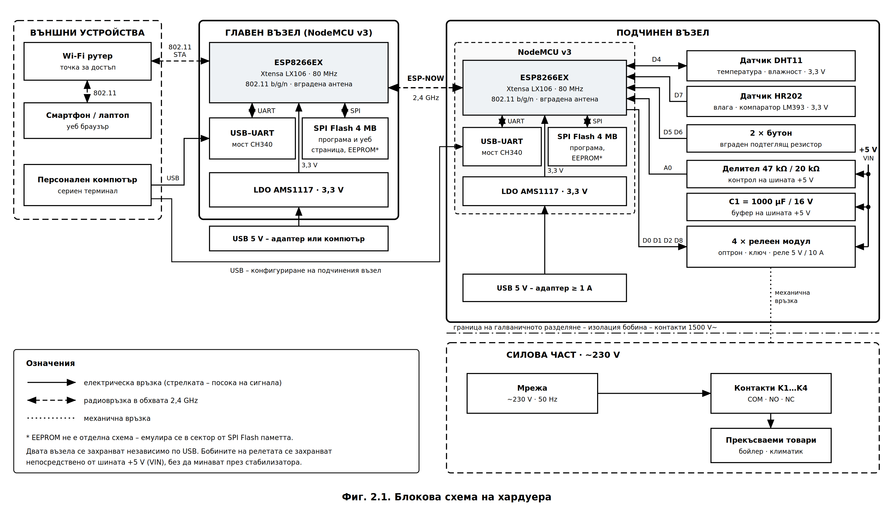{width=16cm}

**Функции на главния възел (Master):**

1. **Мрежови интерфейс** – работа в режим на станция (STA) и асоциация към домашната точка
   за достъп.
2. **Уеб сървър** – сервиране на статичното съдържание от файловата система LittleFS и
   обслужване на асинхронните заявки към RESTful интерфейса.
3. **Конфигуратор по UART** – разбор на постъпващите команди и запис на мрежовите параметри
   в енергонезависимата памет.
4. **Комуникационен мост** – преобразуване на заявките от уеб интерфейса в управляващи
   пакети по ESP-NOW и обратно.

**Функции на подчинения възел (Slave):**

1. **Изпълнителни изходи** – управление на четирите драйверни стъпала.
2. **Измервателен вход** – четене на датчика DS18B20 по интерфейс 1-Wire.
3. **Входове за ръчно управление** – обработка на двата бутона.
4. **Телеметрия** – периодично изпращане на състоянието към главния възел.

Съществено за разбирането на схемата е, че **потокът на управление е двупосочен, но
асиметричен**: командите се движат от потребителя към изпълнителния възел през две различни
физически среди (IEEE 802.11 и ESP-NOW), докато телеметрията се връща само по ESP-NOW. Това
разделение беше обосновано в т. 1.1.6.

---

## 2.3. Избор на елементна база

**Таблица 2.1. Основни елементи на системата**

| Означение | Елемент | Тип | Функция |
|---|---|---|---|
| DD1, DD2 | Микроконтролер | ESP8266EX (модул NodeMCU v3) | главен и подчинен възел |
| VT1…VT4 | Биполярен транзистор | 2N2222 (NPN, TO-92) | ключов елемент на драйвера |
| VD1…VD4 | Диод | 1N4007 | защита от обратно напрежение |
| R1…R4 | Резистор | 330 Ω, 0,25 W | базов резистор |
| K1…K4 | Реле | 5 V, R<sub>бобина</sub> ≈ 70 Ω | изпълнителен елемент |
| BK1 | Температурен датчик | DS18B20 (TO-92) | измервателен канал |
| R5 | Резистор | 4,7 kΩ | pull-up за шината 1-Wire |
| SB1, SB2 | Бутон | тактов, нормално отворен | ръчно управление |
| R6, R7 | Резистор | 10 kΩ | pull-up за бутоните |
| C1, C2 | Кондензатор | 1 µF | филтриращ елемент |
| R8, R9 | Резистор | 100 Ω | токоограничаващ резистор |

**Обосновка на избора на транзистор.** Транзисторът 2N2222 [18] е избран поради следните
съображения: максимален колекторен ток 800 mA при необходими 71,4 mA (запас над 10 пъти);
гарантиран минимален коефициент на усилване по ток h<sub>FE</sub> = 100 в работния
диапазон; допустима мощност на разсейване 625 mW в корпус TO-92; и широка наличност на
пазара. Алтернативата – полеви транзистор (напр. 2N7000) – би елиминирала базовия ток, но
при прагово напрежение на отпушване до 3 V и захранване на GPIO 3,3 V работата в областта
на насищане не е гарантирана в целия температурен диапазон.

**Обосновка на избора на датчик.** DS18B20 [19] е предпочетен пред аналогови датчици (LM35,
термистор) и пред DHT11/DHT22 поради: цифров изход, който изключва грешките от
аналогово-цифровото преобразуване и от дължината на кабела; гарантирана точност ±0,5 °C в
диапазона −10…+85 °C; разрешаваща способност 0,0625 °C при 12-битово преобразуване; и
възможност за **неблокиращо четене**, което е ключово за изискването по т. 7 от задачите.

---

## 2.4. Драйверно стъпало на релейните канали

### 2.4.1. Постановка на задачата

Изводите на ESP8266 не могат да управляват релейна бобина непосредствено по две
независими причини:

- **по ток** – максималният изходен ток на един извод е **12 mA** [11, 20], докато бобината
  изисква над 70 mA;
- **по напрежение** – изходното напрежение на извода е **3,3 V**, а бобината е
  оразмерена за **5 V**.

Следователно е необходимо **усилвателно стъпало**, което едновременно усилва тока и
осъществява преход към по-високото захранващо напрежение. Принципната схема на един канал
е показана на **Фиг. 2.2**.

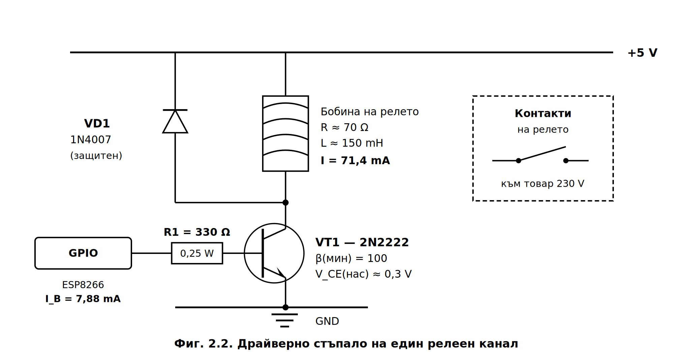{width=13cm}

Приета е схема на **ключ в общ емитер с товар в колектора** (*low-side switch*).
Предимството ѝ е, че емитерът е свързан към общата точка, поради което управляващото
напрежение се прилага непосредствено между базата и масата – без необходимост от
преобразувател на ниво. Транзисторът работи в **ключов режим**: в запушено състояние
(GPIO в ниско ниво) или в състояние на **дълбоко насищане** (GPIO във високо ниво).

### 2.4.2. Изчисляване на колекторния ток

Токът през бобината се определя по закона на Ом:

$$I_C = \frac{V_{CC}}{R_{\text{бобина}}} = \frac{5\ \text{V}}{70\ \Omega} = 71{,}4\ \text{mA}$$

Това е токът, който ключовият транзистор трябва да провежда в наситено състояние.

### 2.4.3. Изчисляване на базовия ток

За да работи транзисторът в областта на насищане, а не в активния режим, базовият ток
трябва да превишава значително стойността, изчислена по коефициента на усилване. Минимално
необходимият базов ток е:

$$I_{B(\text{мин})} = \frac{I_C}{h_{FE(\text{мин})}} = \frac{71{,}4\ \text{mA}}{100} = 0{,}714\ \text{mA}$$

На практика се въвежда **коефициент на пренасищане** $k = 5\ldots10$, който гарантира
насищане при разсейване на параметрите, при понижена температура и при стареене на
елемента:

$$I_{B(\text{изиск})} = k \cdot I_{B(\text{мин})} = 5 \times 0{,}714 = 3{,}57\ \text{mA}$$

### 2.4.4. Оразмеряване на базовия резистор

Базовият резистор се определя от втория закон на Кирхоф за базовата верига:

$$R_B = \frac{V_{OH} - V_{BE}}{I_B}$$

където $V_{OH} = 3{,}3$ V е изходното напрежение на извода при високо ниво, а
$V_{BE} \approx 0{,}7$ V е напрежението база-емитер в проводящо състояние.

Съпротивлението се определя не като единична стойност, а като **допустим диапазон**,
ограничен от две противоположни изисквания.

**Долна граница** – токът, източван от извода, не трябва да превишава допустимите 12 mA:

$$R_{B(\text{мин})} = \frac{3{,}3 - 0{,}7}{12 \cdot 10^{-3}} = 217\ \Omega$$

**Горна граница** – базовият ток не трябва да пада под изискваната стойност за насищане:

$$R_{B(\text{макс})} = \frac{3{,}3 - 0{,}7}{3{,}57 \cdot 10^{-3}} = 728\ \Omega$$

Следователно допустимият диапазон е $217\ \Omega \le R_B \le 728\ \Omega$. От редицата E12
се избира номиналната стойност:

$$R_B = 330\ \Omega$$

която попада в средната част на диапазона и осигурява запас в двете посоки.

### 2.4.5. Проверка на избраната стойност

Действителният базов ток при $R_B = 330\ \Omega$ е:

$$I_B = \frac{3{,}3 - 0{,}7}{330} = 7{,}88\ \text{mA}$$

което представлява **66 %** от допустимия ток на извода. Форсираният коефициент на усилване
е:

$$\beta_{\text{форс}} = \frac{I_C}{I_B} = \frac{71{,}4}{7{,}88} = 9{,}1$$

Коефициентът на пренасищане спрямо гарантирания минимум е:

$$\frac{h_{FE(\text{мин})}}{\beta_{\text{форс}}} = \frac{100}{9{,}1} = 11$$

Условието за дълбоко насищане ($\beta_{\text{форс}} \ll h_{FE(\text{мин})}$) е изпълнено с
единадесеткратен запас.

**Проверка при най-неблагоприятни условия.** При насищане напрежението база-емитер нараства
до $V_{BE(\text{нас})} \approx 1{,}2$ V. Тогава:

$$I_B = \frac{3{,}3 - 1{,}2}{330} = 6{,}36\ \text{mA}, \qquad \beta_{\text{форс}} = 11{,}2 \ll 100$$

Насищането остава гарантирано и в този случай.

### 2.4.6. Проверка по разсейвана мощност

Мощността, разсейвана от транзистора в наситено състояние при
$V_{CE(\text{нас})} \approx 0{,}3$ V:

$$P_C = I_C \cdot V_{CE(\text{нас})} = 71{,}4 \cdot 10^{-3} \times 0{,}3 = 21{,}4\ \text{mW}$$

$$P_B = I_B \cdot V_{BE} = 7{,}88 \cdot 10^{-3} \times 0{,}7 = 5{,}5\ \text{mW}$$

$$P_{\text{общо}} = P_C + P_B = 26{,}9\ \text{mW}$$

Това е **4,3 %** от допустимата мощност на разсейване 625 mW – транзисторът работи в
облекчен топлинен режим и не изисква радиатор.

Мощността в базовия резистор:

$$P_{R_B} = I_B^2 \cdot R_B = (7{,}88 \cdot 10^{-3})^2 \times 330 = 20{,}5\ \text{mW}$$

Стандартен резистор с мощност 0,25 W осигурява дванадесеткратен запас.

**Проверка на сумарния ток от изводите.** При едновременно включени четири канала:

$$I_{\Sigma} = 4 \times 7{,}88 = 31{,}5\ \text{mA}$$

Това е приемливо натоварване за групата изводи на ESP8266, но обосновава
**последователното, а не едновременното** превключване на релетата в програмната
реализация (Глава 3).

### 2.4.7. Защитен диод

Релейната бобина е индуктивен товар. При запушване на транзистора токът през нея не може
да се измени скокообразно, поради което върху индуктивността възниква
**самоиндукционно напрежение**:

$$u_L = -L \frac{di}{dt}$$

При липса на защитен елемент отрицателният фронт на тока е много стръмен и напрежението
достига стойности от порядъка на стотици волта, което многократно превишава допустимото
$V_{CEO} = 30$ V на транзистора и води до необратим пробив.

Диодът **VD1 (1N4007)**, свързан **обратно** паралелно на бобината (катод към +5 V), осигурява
затворен контур за тока след запушването. Енергията, натрупана в магнитното поле:

$$W = \frac{1}{2} L I_C^2 = \frac{1}{2} \times 0{,}15 \times (71{,}4 \cdot 10^{-3})^2 \approx 383\ \mu\text{J}$$

се разсейва в активното съпротивление на бобината с времеконстанта:

$$\tau_L = \frac{L}{R_{\text{бобина}}} = \frac{0{,}15}{70} = 2{,}14\ \text{ms}$$

Практическото затихване настъпва за $\approx 5\tau_L = 10{,}7$ ms.

**Проверка на параметрите на диода** [21]**:**

| Параметър | Изискване | 1N4007 | Запас |
|---|---|---|---|
| Максимален прав ток | 71,4 mA | 1000 mA | 14× |
| Обратно напрежение | 5 V | 1000 V | 200× |

Времето за възстановяване на 1N4007 (десетки микросекунди) е несъществено, тъй като
честотата на превключване на релетата е от порядъка на единици превключвания в минута.

> **Забележка.** Защитният диод удължава времето на отпускане на релето, тъй като
> поддържа тока през бобината. При приложения, изискващи бързо отпускане, последователно
> на диода се включва резистор или ценеров диод. За разглежданата система – комутация на
> товари с топлинна инерция – това забавяне (единици милисекунди) е без значение.

---

## 2.5. Схема за потискане на контактното трептене

### 2.5.1. Природа на явлението

При затваряне на механичен контакт подвижната му част претърпява многократни отскоци
поради еластичната деформация на материала. Резултатът е **серия от паразитни импулси** с
продължителност от **0,5 до 10 ms**, която микроконтролерът интерпретира като няколко
последователни натискания. За система, управляваща товари с мрежово напрежение, това е
недопустимо: едно натискане би предизвикало многократно превключване на релето.

Съгласно заданието потискането се реализира **хардуерно** – чрез интегриращ RC филтър.
Схемата е показана на **Фиг. 2.3**.

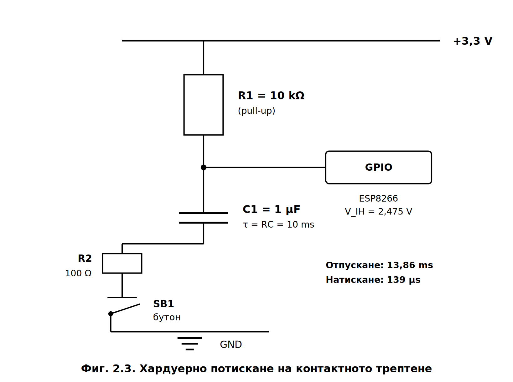{width=13cm}

### 2.5.2. Принцип на действие и изчисляване на времеконстантата

Резисторът R1 = 10 kΩ поддържа високо ниво на входа при отпуснат бутон. Кондензаторът
C1 = 1 µF, включен между входа и масата, интегрира бързите изменения на напрежението.
Времеконстантата на веригата е:

$$\tau = R_1 \cdot C_1 = 10 \cdot 10^{3}\ \Omega \times 1 \cdot 10^{-6}\ \text{F} = 10 \cdot 10^{-3}\ \text{s} = 10\ \text{ms}$$

Праговите нива на входа на ESP8266 са:

$$V_{IH(\text{мин})} = 0{,}75 \cdot V_{DD} = 0{,}75 \times 3{,}3 = 2{,}475\ \text{V}$$
$$V_{IL(\text{макс})} = 0{,}25 \cdot V_{DD} = 0{,}25 \times 3{,}3 = 0{,}825\ \text{V}$$

### 2.5.3. Време за реакция при отпускане

След отпускане на бутона кондензаторът се зарежда през R1 по закона:

$$u_C(t) = V_{DD}\left(1 - e^{-t/\tau}\right)$$

Времето до достигане на прага $V_{IH}$ се получава от:

$$t_{\text{отп}} = -\tau \ln\left(1 - \frac{V_{IH}}{V_{DD}}\right) = -10 \cdot \ln(1 - 0{,}75) = 10 \times 1{,}386 = 13{,}86\ \text{ms}$$

### 2.5.4. Време за реакция при натискане

При натиснат бутон кондензаторът се разрежда през токоограничаващия резистор
R2 = 100 Ω с времеконстанта:

$$\tau_{\text{разр}} = R_2 \cdot C_1 = 100 \times 1 \cdot 10^{-6} = 100\ \mu\text{s}$$

Времето до спадане под прага $V_{IL}$ е:

$$t_{\text{нат}} = -\tau_{\text{разр}} \ln\left(\frac{V_{IL}}{V_{DD}}\right) = -100 \cdot \ln(0{,}25) = 139\ \mu\text{s}$$

Получава се **силно асиметрична характеристика**: натискането се регистрира за 139 µs, а
отпускането – за 13,86 ms. Тази асиметрия е **желана**: бързата реакция при натискане
осигурява субективно усещане за отзивчивост, а бавното възстановяване потиска трептенето
при отпускане, когато то е най-силно изразено.

### 2.5.5. Проверка на потискащата способност

Изменението на напрежението върху кондензатора при паразитен импулс с продължителност
$t_b$ се определя от:

$$\Delta u = V_{DD}\left(1 - e^{-t_b/\tau}\right)$$

**Таблица 2.2. Потискане на паразитните импулси**

| Продължителност на импулса $t_b$ | Изменение $\Delta u$ | Резултат |
|---|---|---|
| 0,5 ms | 0,161 V | потиснат |
| 1,0 ms | 0,314 V | потиснат |
| 2,0 ms | 0,598 V | потиснат |
| 5,0 ms | 1,298 V | потиснат |

Дори при най-неблагоприятния случай (импулс с продължителност 5 ms) изменението на
напрежението е 1,298 V – стойност, която остава **под прага $V_{IH} = 2{,}475$ V**.
Следователно филтърът потиска целия практически диапазон на контактното трептене.

### 2.5.6. Роля на токоограничаващия резистор R2

Резисторът R2 = 100 Ω не участва в определянето на времеконстантата на филтъра, но
изпълнява две съществени функции.

**Ограничаване на разрядния ток.** При липса на R2 кондензаторът би се разреждал
непосредствено през контакта на бутона, като пиковият ток би бил ограничен единствено от
преходното съпротивление на контакта (десетки миллиома). Това предизвиква **електроерозия
на контактната повърхност** и съкращава експлоатационния ресурс. С резистора:

$$I_{\text{пик}} = \frac{V_{DD}}{R_2} = \frac{3{,}3}{100} = 33\ \text{mA}$$

**Ограничаване на постоянния ток.** При задържан бутон токът през делителя е:

$$I = \frac{V_{DD}}{R_1 + R_2} = \frac{3{,}3}{10100} = 327\ \mu\text{A}$$

което е пренебрежимо за енергийния баланс.

**Обосновка на избора на R1 и C1.** Стойността R1 = 10 kΩ е компромис: по-голямо
съпротивление би увеличило чувствителността към индуктивни смущения (висок импеданс на
входа), а по-малко – би увеличило непроизводителното потребление. Стойността C1 = 1 µF
определя времеконстанта, която надвишава максималната продължителност на трептенето
(10 ms), без да внася забележимо за потребителя закъснение.

---

## 2.6. Измервателен канал

Датчикът DS18B20 се свързва по интерфейс **1-Wire** съгласно **Фиг. 2.4**.

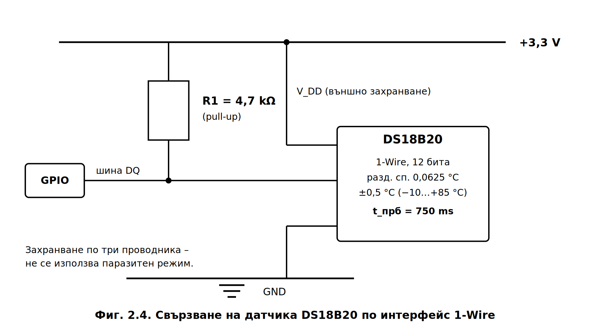{width=13cm}

Интерфейсът използва **един двупосочен сигнален проводник** с изход от тип „отворен дрейн",
което налага наличието на подтеглящ резистор. Стандартната стойност R5 = 4,7 kΩ осигурява
достатъчен ток за зареждане на паразитния капацитет на линията при дължини до няколко метра.

Приет е режим на **външно захранване по три проводника** (V<sub>DD</sub>, DQ, GND), а не
паразитният режим. Обосновката е следната: при паразитно захранване датчикът черпи енергия
от сигналната линия, което изисква активно подтегляне на шината по време на
преобразуването и **усложнява реализацията на неблокиращо четене**. Външното захранване
освобождава шината по време на преобразуването и позволява микроконтролерът да изпълнява
други задачи – изискване, формулирано в т. 7 от задачите.

**Таблица 2.3. Параметри на измервателния канал**

| Параметър | Стойност |
|---|---|
| Разрешаваща способност (12 бита) | 0,0625 °C |
| Гарантирана точност | ±0,5 °C (−10…+85 °C) |
| Време за преобразуване (12 бита) | до 750 ms |
| Работен диапазон | −55…+125 °C |
| Ток при преобразуване | 1,5 mA |
| Ток в режим на покой | 1 µA |

Времето за преобразуване от **750 ms** е ключово за софтуерното проектиране: блокиращо
изчакване на тази стойност би довело до недопустимо забавяне на главния цикъл. Решението –
стартиране на преобразуването и отложено прочитане чрез `setWaitForConversion(false)` –
се разглежда в Глава 3.

---

## 2.7. Захранващ блок и енергиен баланс

Захранването се осъществява от стабилизиран източник **5 V**, от който се захранват
релейните бобини непосредствено, а логическата част – през интегрирания на модула
линеен стабилизатор AMS1117-3.3 [22].

**Таблица 2.4. Енергиен баланс на подчинения възел (най-неблагоприятен случай)**

| Консуматор | Ток |
|---|---|
| ESP8266 – връх при предаване | 170 mA |
| 4 × релейна бобина (4 × 71,4 mA) | 285,7 mA |
| DS18B20 при преобразуване | 1,5 mA |
| Базови токове на драйверите (4 × 7,88 mA) | 31,5 mA |
| **Общо** | **≈ 489 mA** |

При избор на захранващ блок **5 V / 1 A** се осигурява **двукратен запас**, което е
необходимо поради импулсния характер на консумацията при предаване по Wi-Fi.

Разсейваната от стабилизатора мощност при ток на логическата част 170 mA:

$$P_{\text{стаб}} = (V_{\text{вх}} - V_{\text{изх}}) \cdot I = (5 - 3{,}3) \times 0{,}170 = 289\ \text{mW}$$

Стойността е в допустимите граници за корпус SOT-223 при наличие на медна площ за
топлоотвеждане.

**Развързване по захранване.** Импулсният характер на консумацията при работа на радиото
(токови скокове от 15 mA до 170 mA за микросекунди) изисква:

- **електролитен кондензатор 470 µF** в близост до входа на захранването – компенсира
  бавните изменения при включване на релетата;
- **керамичен кондензатор 100 nF** при всеки активен елемент – потиска високочестотните
  съставки.

Без адекватно развързване токовите скокове предизвикват пропадания на захранващото
напрежение, които водят до непредвидено нулиране на микроконтролера – типична и трудно
диагностицируема неизправност при този клас устройства.

---

## 2.8. Разпределение на изводите

Разпределението на изводите не е произволно: част от изводите на ESP8266 имат **специални
функции при стартиране** (*boot straps*) [20], чието нарушаване прави зареждането невъзможно.

**Таблица 2.5. Ограничения на изводите на ESP8266**

| Извод | Означение | Ограничение при стартиране |
|---|---|---|
| GPIO0 | D3 | трябва да е във високо ниво |
| GPIO2 | D4 | трябва да е във високо ниво |
| GPIO15 | D8 | трябва да е в ниско ниво |
| GPIO1 / GPIO3 | TX / RX | заети от серийния интерфейс |
| GPIO16 | D0 | няма вътрешен подтеглящ резистор |

**Таблица 2.6. Разпределение на изводите на подчинения възел**

| Функция | Извод | GPIO | Обосновка |
|---|---|---|---|
| Реле 1 | D1 | GPIO5 | без ограничения при стартиране |
| Реле 2 | D2 | GPIO4 | без ограничения при стартиране |
| Реле 3 | D5 | GPIO14 | без ограничения при стартиране |
| Реле 4 | D6 | GPIO12 | без ограничения при стартиране |
| DS18B20 | D7 | GPIO13 | без ограничения при стартиране |
| Бутон 1 (превключване) | D3 | GPIO0 | външен pull-up – високо ниво при стартиране |
| Бутон 2 (авариен стоп) | D0 | GPIO16 | външният pull-up компенсира липсата на вътрешен |
| Конфигуриране | TX / RX | GPIO1 / GPIO3 | **оставени свободни** |

**Обосновка на приетите решения:**

**а) Релейните изходи са разположени на изводи без ограничения при стартиране.** Ако
релеен изход бъде свързан към GPIO0 или GPIO2, които имат вградени подтеглящи резистори,
при подаване на захранване базата на транзистора би получила високо ниво **преди
инициализацията на програмата**, което би предизвикало кратковременно задействане на
релето. За система, комутираща товари с мрежово напрежение, това е недопустимо.

**б) GPIO15 (D8) не се използва за бутон.** Външен подтеглящ резистор към 3,3 V би
задържал извода във високо ниво при стартиране, което **блокира зареждането** на модула.

**в) Серийният интерфейс е оставен свободен.** Изискването по т. 5 от заданието
предполага, че изводите GPIO1 и GPIO3 остават на разположение на UART. Това ограничава
броя на свободните изводи, но е безусловно изискване.

**г) Бутон на GPIO0.** При отпуснат бутон външният резистор поддържа високо ниво и
стартирането е нормално. Задържането на бутона при подаване на захранване превежда модула
в режим на програмиране – обстоятелство, което в софтуерната реализация се използва
целенасочено за **фабрично нулиране на конфигурацията**.

На главния възел се използват единствено серийният интерфейс (за конфигуриране) и
светодиодният индикатор на GPIO2 за визуализация на състоянието на връзката.

---

## 2.9. Обобщена принципна схема на подчинения възел

Обобщената принципна схема, обединяваща разгледаните в т. 2.4–2.6 стъпала, е представена на
**Фиг. 2.5**. Тя реализира графична част т. 5.2 от заданието.

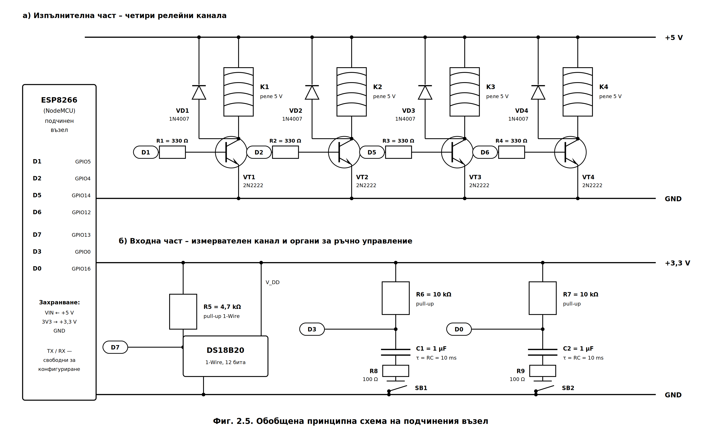{width=16cm}

За прегледност схемата е разделена на два функционални панела с отделни захранващи шини:

- **панел а)** – изпълнителната част, захранвана от шината **+5 V**, която обединява
  четирите идентични драйверни канала;
- **панел б)** – входната част, захранвана от шината **+3,3 V**, която обхваща измервателния
  канал и двата органа за ръчно управление.

Връзките между изводите на микроконтролера и отделните стъпала са означени чрез
**означения на веригите** (D1, D2, D5, D6, D7, D3, D0) вместо чрез начертани проводници.
Този начин на представяне е възприет, за да се избегнат пресичания на линиите и следва
приетата практика при оформяне на принципни схеми.

Съществено е разделянето на **двете захранващи шини**. Релейните бобини се захранват
непосредствено от +5 V, без да преминават през стабилизатора на модула, докато входните
вериги използват стабилизираното напрежение +3,3 V. Така импулсните токове при задействане
на релетата (до 285 mA) **не натоварват линейния стабилизатор** и не предизвикват пропадания
на напрежението, върху което работи логическата част.

---

## 2.10. Изводи по Глава 2

1. Разработени са **блокова схема** (Фиг. 2.1) и **обобщена принципна схема** (Фиг. 2.5) на
   двувъзлова система с асиметричен поток на управление през две физически среди.
2. Оразмерено е **драйверното стъпало**: установен е допустимият диапазон за базовия
   резистор $217\ \Omega \le R_B \le 728\ \Omega$, от който е избрана номиналната стойност
   **330 Ω**, осигуряваща базов ток 7,88 mA и **единадесеткратен коефициент на пренасищане**.
3. Проверен е топлинният режим на ключовия транзистор – разсейваната мощност 26,9 mW
   представлява **4,3 %** от допустимата, поради което не се изисква радиатор.
4. Оразмерен е **защитният диод**: при енергия в магнитното поле 383 µJ и времеконстанта
   на затихване 2,14 ms параметрите на 1N4007 осигуряват запас 14× по ток и 200× по
   напрежение.
5. Оразмерен е **RC филтърът** за потискане на контактното трептене с времеконстанта
   $\tau = 10$ ms, който потиска импулси с продължителност до 5 ms и осигурява асиметрична
   реакция: **139 µs при натискане и 13,86 ms при отпускане**.
6. Съставен е **енергийният баланс** – сумарен ток 489 mA в най-неблагоприятния случай,
   покрит с двукратен запас от източник 5 V / 1 A.
7. Обосновано е **разпределението на изводите** с отчитане на специалните им функции при
   стартиране, като серийният интерфейс е оставен свободен съгласно т. 5 от заданието.


```{=openxml}
<w:p><w:r><w:br w:type="page"/></w:r></w:p>
```


# ГЛАВА ТРЕТА
# СОФТУЕРНО ПРОЕКТИРАНЕ НА СИСТЕМАТА

---

## 3.1. Принципи на софтуерната организация

Програмното осигуряване на двата възела е изградено върху **кооперативна многозадачност
без операционна система**. При този подход главният цикъл последователно извиква
обслужващите функции на всички подсистеми, като **всяка от тях е задължена да върне
управлението за възможно най-кратко време**.

Основното следствие е забраната за използване на блокиращи конструкции – `delay()`,
циклично изчакване (*busy-wait*) и синхронни операции с дълго време за изпълнение.
Вместо това всяка подсистема се реализира като **краен автомат** (*finite state machine*),
чието състояние се съхранява в статични променливи, а преходите се управляват от
сравнения на текущия момент `millis()` със запомнени времеви отпечатъци.

**Количествена обосновка.** В Глава 2 беше установено, че най-бавният фронт на сигнала
след RC филтъра на бутоните настъпва за **13,86 ms**. За надеждно разпознаване на
натискане са необходими поне пет отчета в рамките на този интервал, откъдето следва
изискването към продължителността на един цикъл:

$$T_{\text{цикъл}} \le \frac{t_{\text{отп}}}{5} = \frac{13{,}86}{5} \approx 2{,}8\ \text{ms}$$

**Таблица 3.1. Брой отчети на един фронт в зависимост от времето на цикъла**

| $T_{\text{цикъл}}$ | Брой отчети | Оценка |
|---|---|---|
| 1 ms | 13,9 | достатъчно |
| 2 ms | 6,9 | достатъчно |
| 5 ms | 2,8 | недостатъчно |
| 10 ms | 1,4 | недостатъчно |
| **750 ms** (блокиращо четене) | **0,018** | **неработоспособно** |

Последният ред е определящ: **едно-единствено блокиращо четене на DS18B20 би направило
системата неработоспособна** по отношение на ръчното управление. Постигнатото време за
цикъл от 1…2 ms е **375 пъти по-малко** от блокиращия вариант.

---

## 3.2. Организация на енергонезависимата памет и конфигуриране по UART

### 3.2.1. Разпределение на 96-байтовия буфер

Съгласно т. 5 от заданието мрежовите параметри не се кодират в програмата, а се съхраняват
в емулирана енергонезависима памет. ESP8266 не разполага с физическа EEPROM памет –
библиотеката `EEPROM` [23] емулира такава чрез отделен сектор от SPI Flash паметта, който се
прочита в оперативната памет при `EEPROM.begin()` и се записва обратно при `commit()`.

**Таблица 3.2. Разпределение на конфигурационния буфер (96 байта)**

| Отместване | Размер | Поле | Предназначение |
|---|---|---|---|
| 0…3 | 4 B | `magic` | признак `0x484D4331` за валиден запис |
| 4 | 1 B | `version` | версия на структурата |
| 5…37 | 33 B | `ssid[33]` | 32 знака + нулев байт (IEEE 802.11: max 32) |
| 38…78 | 41 B | `pass[41]` | 40 знака + нулев байт |
| 79…84 | 6 B | `peerMac[8]` | MAC адрес на отсрещния възел |
| 85 | 1 B | `wifiChannel` | работен канал 1…13 |
| 86 | 1 B | `flags` | служебни флагове |
| 87…91 | 5 B | `reserved` | резерв за бъдещо разширение |
| 92…95 | 4 B | `crc32` | контролна сума на предходните 92 байта |

> **Забележка за ограничението.** Стандартът WPA2-PSK допуска пароли с дължина 8…63 знака.
> Приетият обем от 96 байта позволява съхранението на **до 40 знака**, което покрива
> практически всички битови мрежи, но е формално ограничение на реализацията. При
> необходимост полето `reserved` може да бъде преразпределено в полза на паролата.

### 3.2.2. Структура и защита на целостта

**Листинг 3.1. Структура на конфигурацията и изчисляване на контролната сума**

```cpp
#define CFG_MAGIC    0x484D4331UL   // "HMC1"
#define CFG_VERSION  1
#define EEPROM_SIZE  96

typedef struct {
    uint32_t magic;          // признак за валиден запис
    uint8_t  version;        // версия на структурата
    char     ssid[33];       // име на мрежата
    char     pass[41];       // парола
    uint8_t  peerMac[6];     // MAC на отсрещния възел
    uint8_t  wifiChannel;    // работен канал
    uint8_t  flags;
    uint8_t  reserved[5];
    uint32_t crc;            // контролна сума на предходните полета
} Config;

static_assert(sizeof(Config) == EEPROM_SIZE,
              "Структурата трябва да заема точно 96 байта");

Config cfg;

// CRC-32 (полином 0xEDB88320) – използва се и от двата възела
uint32_t crc32(const uint8_t *data, size_t len) {
  uint32_t crc = 0xFFFFFFFF;
  for (size_t i = 0; i < len; i++) {
    crc ^= data[i];
    for (uint8_t b = 0; b < 8; b++)
      crc = (crc >> 1) ^ (0xEDB88320UL & (-(int32_t)(crc & 1)));
  }
  return ~crc;
}
```

Директивата `static_assert` осигурява **проверка на етапа на компилиране**: ако при
промяна на структурата размерът ѝ се отклони от 96 байта, компилацията ще бъде прекратена
с грешка, вместо да се получи трудно откриваема грешка по време на изпълнение.

Валидността на записа се проверява по **три независими признака**: сигнатура `magic`,
номер на версията и контролна сума CRC-32. Първият открива неинициализирана памет, вторият
– несъвместим формат след обновяване на програмата, а третият – повреда на данните при
прекъсване на захранването по време на запис.

**Листинг 3.2. Запис и зареждане на конфигурацията**

```cpp
void saveConfig() {
  cfg.crc = crc32((uint8_t *)&cfg, sizeof(cfg) - sizeof(cfg.crc));
  EEPROM.put(0, cfg);
  if (EEPROM.commit()) Serial.println(F("Конфигурацията е записана."));
  else                 Serial.println(F("ГРЕШКА при запис в EEPROM!"));
}

void loadConfig() {
  EEPROM.get(0, cfg);
  uint32_t calc = crc32((uint8_t *)&cfg, sizeof(cfg) - sizeof(cfg.crc));
  if (cfg.magic != CFG_MAGIC || cfg.version != CFG_VERSION || cfg.crc != calc) {
    Serial.println(F("Няма валидна конфигурация – фабрични настройки."));
    setDefaults();
    saveConfig();
  }
}
```

### 3.2.3. Алгоритъм за разбор на командите

Алгоритъмът за обработка на постъпващите по серийния интерфейс команди е представен на
**Фиг. 3.2**.

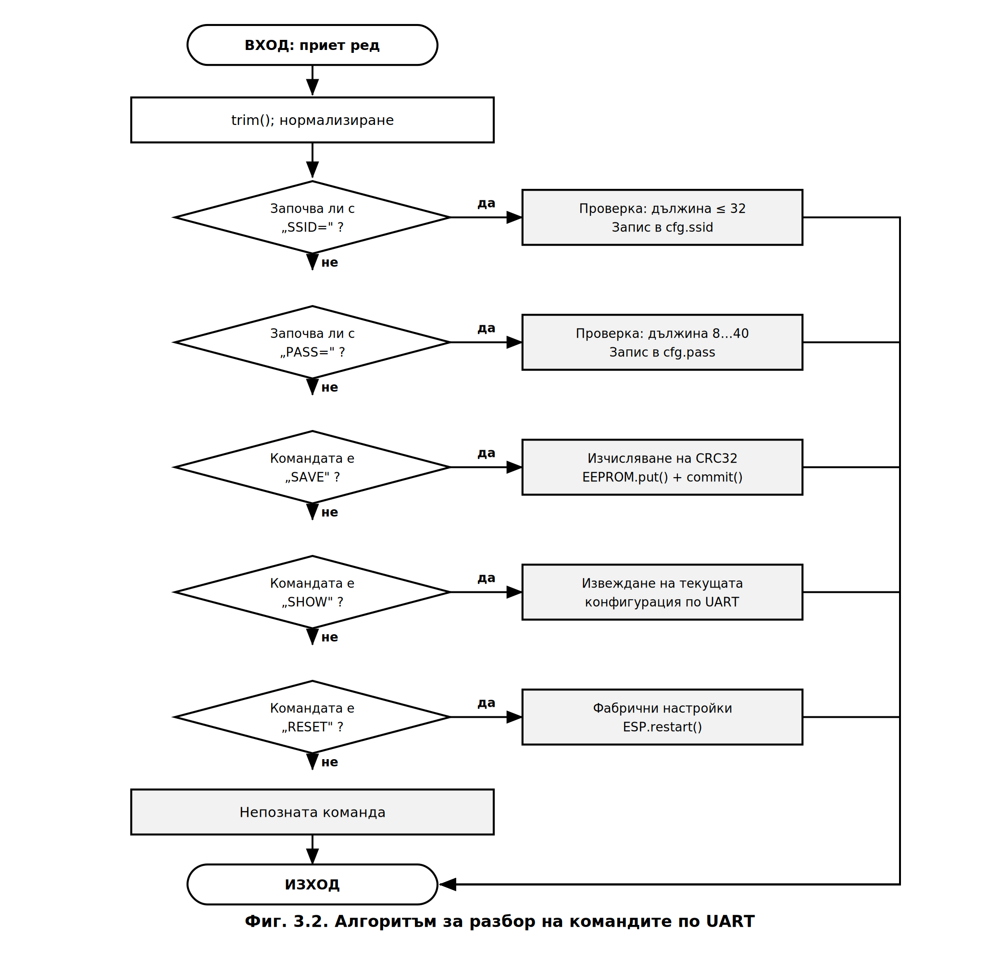{width=16cm}

**Таблица 3.3. Набор от команди по UART**

| Команда | Действие | Валидация |
|---|---|---|
| `SSID=<име>` | задава името на мрежата | дължина ≤ 32 знака |
| `PASS=<парола>` | задава паролата | дължина 8…40 знака |
| `SAVE` | записва конфигурацията в EEPROM | изчислява CRC |
| `SHOW` | извежда текущата конфигурация | паролата не се показва |
| `RESET` | фабрични настройки и рестарт | – |

**Листинг 3.3. Разбор на командите**

```cpp
void handleSerialCommands() {
  if (Serial.available() <= 0) return;      // неблокираща проверка

  String raw = Serial.readStringUntil('\n');
  raw.trim();
  if (raw.length() == 0) return;

  if (raw.startsWith("SSID=")) {
    String v = raw.substring(5);
    if (v.length() == 0 || v.length() > 32) {
      Serial.println(F("Грешка: дължината трябва да е 1…32 знака."));
      return;
    }
    strncpy(cfg.ssid, v.c_str(), sizeof(cfg.ssid) - 1);
    cfg.ssid[sizeof(cfg.ssid) - 1] = '\0';
    Serial.println(F("SSID е приет. Изпълнете SAVE."));
  }
  else if (raw.startsWith("PASS=")) {
    String v = raw.substring(5);
    if (v.length() < 8 || v.length() > 40) {
      Serial.println(F("Грешка: дължината трябва да е 8…40 знака."));
      return;
    }
    strncpy(cfg.pass, v.c_str(), sizeof(cfg.pass) - 1);
    cfg.pass[sizeof(cfg.pass) - 1] = '\0';
    Serial.println(F("Паролата е приета. Изпълнете SAVE."));
  }
  else if (raw == "SAVE")  { saveConfig(); }
  else if (raw == "SHOW")  { printConfig(); }
  else if (raw == "RESET") { setDefaults(); saveConfig(); ESP.restart(); }
  else Serial.println(F("Непозната команда."));
}
```

Три особености на реализацията заслужават внимание:

**а) Запазване на регистъра.** Разборът се извършва върху **оригиналния ред**, а не върху
превърнат към главни букви. Това е задължително, тъй като имената на мрежите и паролите
са чувствителни към регистъра. Сравнението на служебните команди се прави поотделно.

**б) Неблокираща проверка.** Функцията започва с проверка `Serial.available() <= 0` и
незабавно връща управлението при липса на данни. В `setup()` допълнително се задава
`Serial.setTimeout(50)`, което ограничава изчакването при непълен ред.

**в) Защита от препълване.** Използва се `strncpy` с ограничение `sizeof(поле) - 1` и явно
поставяне на нулев байт. Дължината се проверява **преди** копирането, а не се разчита
само на отрязването.

---

## 3.3. Комуникационен обмен по ESP-NOW

### 3.3.1. Структури на обменяните данни

Обменът използва две структури с **фиксиран размер**, идентични в двата възела. Тъй като
ESP-NOW пренася нетипизиран блок от байтове, съвпадението на структурите е условие за
правилна работа.

**Листинг 3.4. Структури на обмена**

```cpp
#define PROTO_VERSION 1
#define CMD_RELAY     0
#define CMD_RESTART   1
#define CMD_CONFIG    2

// Телеметрия: подчинен -> главен възел
typedef struct {
    uint8_t  protoVersion;
    uint32_t readingId;        // пореден номер на пакета
    float    temperature;      // °C от DS18B20
    bool     relayState[4];    // действително състояние на изходите
    bool     sensorValid;      // валидност на последното четене
    uint32_t freeHeap;
    uint32_t loopTime;         // време на последния цикъл, ms
    uint32_t uptime;           // s
    uint32_t successPackets;
    uint32_t failedPackets;
} TelemetryMsg;

// Команда: главен -> подчинен възел
typedef struct {
    uint8_t  protoVersion;
    uint8_t  cmdType;
    uint8_t  relayIndex;       // 0…3
    bool     relayState;
    uint32_t seq;              // пореден номер срещу дублиране
} ControlMsg;
```

Полето `protoVersion` позволява **отхвърляне на пакети от несъвместима версия**, а полето
`seq` – разпознаване на дублирани пакети. Последното е необходимо, тъй като ESP-NOW не
гарантира еднократна доставка: при загубено потвърждение подателят може да повтори
изпращането.

### 3.3.2. Обратни функции и правила за тях

**Листинг 3.5. Обратни функции на подчинения възел**

```cpp
volatile bool     cmdPending = false;
volatile uint8_t  pendingIdx = 0;
volatile bool     pendingState = false;
uint32_t          lastSeq = 0;

void OnDataSent(uint8_t *mac, uint8_t sendStatus) {
  if (sendStatus == 0) successPackets++;
  else                 failedPackets++;
}

void OnDataRecv(uint8_t *mac, uint8_t *data, uint8_t len) {
  if (len != sizeof(ControlMsg)) return;          // чужд или повреден пакет
  ControlMsg in;
  memcpy(&in, data, sizeof(in));
  if (in.protoVersion != PROTO_VERSION) return;   // несъвместима версия
  if (in.seq == lastSeq) return;                  // дублиран пакет
  lastSeq = in.seq;

  pendingIdx   = in.relayIndex;                   // само запомняне
  pendingState = in.relayState;
  cmdPending   = true;                            // обработка в loop()
}
```

Обратните функции на ESP-NOW се изпълняват в **контекста на системната задача на
радиостека** [12, 24]. Затова в тях е недопустимо да се извършват продължителни операции, работа
със серийния порт или достъп до Flash паметта. Приетото решение е обратната функция
**единствено да запомни получените данни** и да вдигне флаг, а действителната обработка
да се извърши в главния цикъл. Променливите, споделяни между двата контекста, са
обявени като `volatile`.

### 3.3.3. Неблокираща опашка от команди

Наивната реализация на изпращането изчаква потвърждението в цикъл:

```cpp
esp_now_send(peer, data, len);
while (waitingForAck) { }        // ГРЕШНО: блокира целия цикъл
```

Такава конструкция блокира уеб сървъра и обработката на бутоните за целия срок на
изчакване. Вместо нея е реализиран **тристъпков краен автомат** (**Фиг. 3.4**).

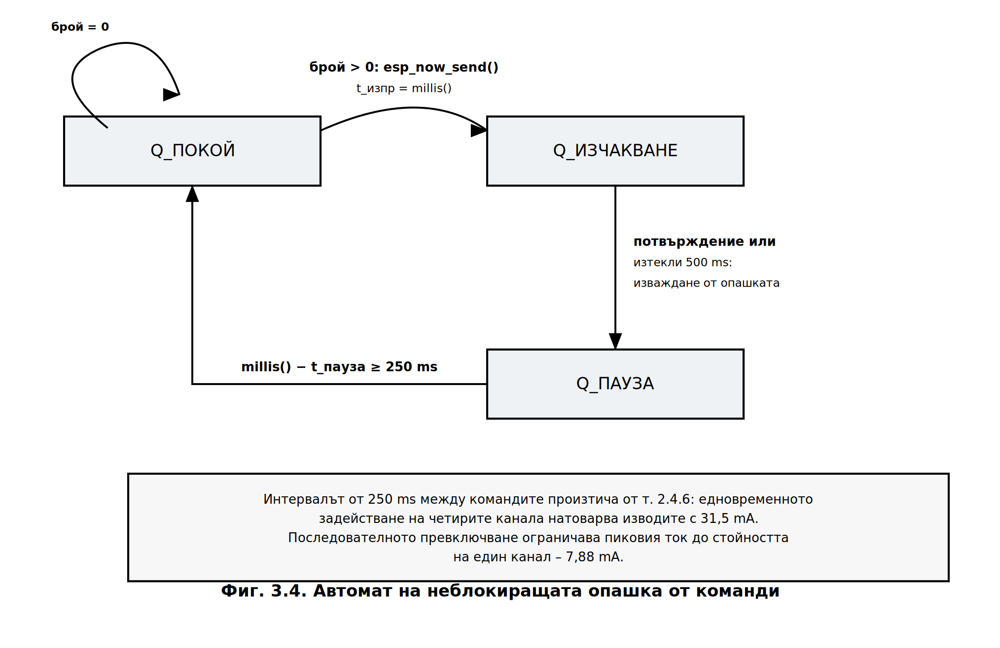{width=13cm}

**Листинг 3.6. Автомат на опашката**

```cpp
#define QUEUE_SIZE      12
#define ACK_TIMEOUT_MS  500
#define CMD_SPACING_MS  250

typedef struct { uint8_t relayIndex; bool state; } QueueItem;
QueueItem cmdQueue[QUEUE_SIZE];
uint8_t qHead = 0, qCount = 0;

// Вдигат се при изпращане и се обновяват от OnDataSent() на главния възел
volatile bool waitingForDelivery = false;
volatile bool deliverySuccess    = false;

enum QState { Q_IDLE, Q_WAIT_ACK, Q_COOLDOWN };
QState qState = Q_IDLE;
unsigned long qSendTime = 0, qCooldownStart = 0;

void processQueue() {
  switch (qState) {

    case Q_IDLE:
      if (qCount > 0) {
        sendControl(CMD_RELAY, cmdQueue[qHead].relayIndex, cmdQueue[qHead].state);
        qSendTime = millis();
        qState = Q_WAIT_ACK;
      }
      break;

    case Q_WAIT_ACK:
      if (!waitingForDelivery) {                  // получено потвърждение
        if (deliverySuccess)
          relayState[cmdQueue[qHead].relayIndex] = cmdQueue[qHead].state;
        else
          setError(F("Подчиненият модул не отговаря"));
        qHead = (qHead + 1) % QUEUE_SIZE; qCount--;
        qCooldownStart = millis(); qState = Q_COOLDOWN;
      }
      else if (millis() - qSendTime > ACK_TIMEOUT_MS) {
        waitingForDelivery = false;
        setError(F("Изтекло време за потвърждение"));
        qHead = (qHead + 1) % QUEUE_SIZE; qCount--;
        qCooldownStart = millis(); qState = Q_COOLDOWN;
      }
      break;

    case Q_COOLDOWN:
      if (millis() - qCooldownStart >= CMD_SPACING_MS) qState = Q_IDLE;
      break;
  }
}
```

**Обосновка на интервала между командите.** Стойността `CMD_SPACING_MS = 250` произтича
пряко от хардуерното оразмеряване в т. 2.4.6: едновременното задействане на четирите
канала натоварва изводите на микроконтролера със сумарен ток **31,5 mA**. Принудителната
пауза между командите осигурява **последователно, а не едновременно** задействане, при
което пиковият ток е ограничен до стойността за един канал – **7,88 mA**. Така софтуерното
решение компенсира хардуерно ограничение – типичен пример за взаимното влияние между
двата етапа на проектирането.

### 3.3.4. Синхронизация на работния канал

ESP8266 разполага с **един радиочестотен тракт**, поради което интерфейсът за станция и
ESP-NOW работят на един и същ физически канал (т. 1.1.6). Главният възел получава канала
си от точката за достъп, докато подчиненият възел не е асоцииран към мрежа и **не знае
този канал**.

Приетото решение е подчиненият възел да стартира **скрита точка за достъп** с единствената
цел да фиксира работния канал:

```cpp
WiFi.mode(WIFI_AP_STA);
WiFi.softAP("hidden_slave", "", cfg.wifiChannel, /* hidden = */ 1);
```

Главният възел при стартиране сравнява канала на рутера със записания в конфигурацията и
при разминаване извежда предупреждение по UART, тъй като в такъв случай ESP-NOW обменът
е невъзможен.

---

## 3.4. Уеб сървър с файлова система LittleFS

### 3.4.1. Организация на файловата система

Статичното съдържание на потребителския интерфейс се съхранява в **LittleFS** [25] – файлова
система с износоустойчиво разпределение, изградена върху свободната област от SPI Flash
паметта.

| Файл | Предназначение | Приблизителен обем |
|---|---|---|
| `/index.html` | структура на страницата | ≈ 3 kB |
| `/style.css` | оформление | ≈ 2 kB |
| `/app.js` | клиентска логика (Fetch API) | ≈ 3 kB |

Отделянето на интерфейса от изпълнимия код има три предимства: **актуализация без
прекомпилиране** на фърмуера; **намален обем на изображението** на програмата; и
**възможност за разделно тестване** на клиентската част в обикновен браузър.

### 3.4.2. RESTful интерфейс

Интерфейсът е изграден съгласно архитектурния стил **REST** [26].

**Таблица 3.4. Маршрути на приложния програмен интерфейс**

| Метод | Маршрут | Действие | Отговор |
|---|---|---|---|
| `GET` | `/` | сервира `index.html` от LittleFS | `text/html` |
| `GET` | `/api/state` | текущо състояние на системата | `application/json` |
| `POST` | `/api/relay?id=N&state=0\|1` | превключва канал `N` | `application/json` |
| `POST` | `/api/relay/all?state=0\|1` | превключва всички канали | `application/json` |
| `GET` | `/api/config` | мрежова конфигурация | `application/json` |

**Листинг 3.7. Регистрация на маршрутите**

```cpp
#include <LittleFS.h>

#define B(x) ((x) ? "true" : "false")   // съкращение за булев литерал в JSON

void setupWebServer() {
  if (!LittleFS.begin()) {
    Serial.println(F("ГРЕШКА: LittleFS не може да бъде монтирана."));
    return;
  }
  // статичното съдържание се сервира направо от файловата система
  server.serveStatic("/", LittleFS, "/index.html");
  server.serveStatic("/style.css", LittleFS, "/style.css");
  server.serveStatic("/app.js",    LittleFS, "/app.js");

  server.on("/api/state", HTTP_GET, []() {
    char json[320];
    snprintf(json, sizeof(json),
      "{\"temperature\":%.2f,\"sensorValid\":%s,\"id\":%lu,"
      "\"relays\":[%s,%s,%s,%s],\"uptime\":%lu,\"loopTime\":%lu,"
      "\"queue\":%u,\"linkAlarm\":%s}",
      lastTemp, lastSensorValid ? "true" : "false", (unsigned long)lastId,
      B(relayState[0]), B(relayState[1]), B(relayState[2]), B(relayState[3]),
      (unsigned long)lastUptime, (unsigned long)lastLoopTime,
      qCount, linkAlarm() ? "true" : "false");
    server.send(200, "application/json", json);
  });

  server.on("/api/relay", HTTP_POST, []() {
    int idx = server.arg("id").toInt();
    int st  = server.arg("state").toInt();
    if (idx < 0 || idx > 3) {
      server.send(400, "application/json", "{\"error\":\"Невалиден индекс\"}");
      return;
    }
    if (!enqueueRelay(idx, st != 0)) {
      server.send(503, "application/json", "{\"error\":\"Опашката е пълна\"}");
      return;
    }
    server.send(202, "application/json", "{\"queued\":true}");
  });

  server.begin();
}
```

Съществени особености:

**а) Кодът за състояние 202 (Accepted).** Командата се поставя в опашката, но към момента
на отговора **още не е изпълнена**. Връщането на 202 вместо 200 отразява коректно
асинхронния характер на операцията: действителното състояние пристига със следващия пакет
телеметрия.

**б) Използване на `snprintf` вместо конкатенация на `String`.** Многократното
долепяне на обекти `String` предизвиква **фрагментация на динамичната памет**, която при
непрекъснато работещо устройство води до отказ след часове или дни. Форматирането в
статичен буфер с явно указан размер изключва този клас неизправности.

**в) Паролата не се предоставя през интерфейса.** Маршрутът `/api/config` връща името на
мрежата и работния канал, но **никога** съдържанието на полето `pass`.

### 3.4.3. Клиентска част – асинхронни заявки

**Листинг 3.8. Клиентска логика (фрагмент от `app.js`)**

```javascript
const REFRESH_MS = 1000;

async function fetchState() {
  try {
    const r = await fetch('/api/state');
    if (!r.ok) throw new Error('HTTP ' + r.status);
    const d = await r.json();

    document.getElementById('temp').textContent =
        d.sensorValid ? d.temperature.toFixed(2) : '--';
    d.relays.forEach((s, i) => updateButton(i, s));
    setStatus(d.linkAlarm ? 'няма връзка с подчинения възел' : 'онлайн');
  } catch (e) {
    setStatus('връзката е прекъсната');
  }
}

async function toggleRelay(idx, state) {
  const r = await fetch(`/api/relay?id=${idx}&state=${state ? 1 : 0}`,
                        { method: 'POST' });
  const d = await r.json();
  if (d.error) alert(d.error);
}

setInterval(fetchState, REFRESH_MS);
```

Използването на **Fetch API** [27] с `async/await` осигурява **асинхронно обновяване без
презареждане на страницата**. Заявките се изпълняват в изчаквателния цикъл на браузъра,
без да блокират потребителския интерфейс. Обработката на грешки чрез `try/catch` позволява
да се разграничи **отпадането на връзката с главния възел** (неуспешна заявка) от
**отпадането на връзката с подчинения възел** (успешна заявка с флаг `linkAlarm`).

> **Уточнение относно понятието „асинхронен".** Използваната библиотека
> `ESP8266WebServer` е синхронна – заявките се обслужват при извикване на
> `handleClient()`. Асинхронността, която потребителят възприема, се осигурява от
> **клиентската страна** чрез Fetch API. Тъй като всички обработчици завършват за
> микросекунди (поставяне в опашка или форматиране на низ), те не нарушават изискването
> за кратък цикъл. Алтернативата `ESPAsyncWebServer` би пренесла обслужването в
> прекъсвания, но налага ограничения върху действията в обработчиците, съпоставими с тези
> при обратните функции на ESP-NOW.

---

## 3.5. Неблокиращ измервателен канал

Библиотеката `DallasTemperature` [28] по подразбиране изчаква завършването на преобразуването
в блокиращ цикъл. Извикването `setWaitForConversion(false)` разделя операцията на две
независими части, което позволява реализацията на двусъстоянен автомат (**Фиг. 3.3**).

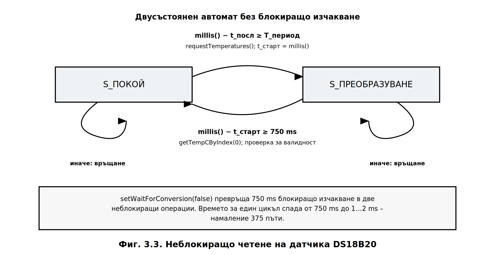{width=13cm}

**Листинг 3.9. Неблокиращо четене на DS18B20**

```cpp
#include <OneWire.h>
#include <DallasTemperature.h>

#define ONE_WIRE_PIN     D7
#define CONVERSION_MS    750     // време за 12-битово преобразуване
#define MEASURE_PERIOD   2000    // период на измерване

OneWire oneWire(ONE_WIRE_PIN);
DallasTemperature sensors(&oneWire);

enum SensorState { S_IDLE, S_CONVERTING };
SensorState sState = S_IDLE;
unsigned long sLastRead = 0, sConvStart = 0;
float  lastValidTemp = 0.0;
bool   haveValidReading = false;
uint16_t sensorErrors = 0;

void setupSensor() {
  sensors.begin();
  sensors.setResolution(12);
  sensors.setWaitForConversion(false);   // ключово: без блокиращо изчакване
}

void handleSensor() {
  unsigned long now = millis();

  switch (sState) {
    case S_IDLE:
      if (now - sLastRead >= MEASURE_PERIOD) {
        sensors.requestTemperatures();   // връща управлението незабавно
        sConvStart = now;
        sState = S_CONVERTING;
      }
      break;

    case S_CONVERTING:
      if (now - sConvStart >= CONVERSION_MS) {
        float t = sensors.getTempCByIndex(0);
        if (t == DEVICE_DISCONNECTED_C || t < -55.0 || t > 125.0) {
          sensorErrors++;                // задържа се последната валидна стойност
        } else {
          lastValidTemp = t;
          haveValidReading = true;
        }
        sLastRead = now;
        sState = S_IDLE;
      }
      break;
  }
}
```

**Задържане на последната валидна стойност.** При неуспешно четене се увеличава броячът
на грешките, но **не се записва нулева стойност**. Ако това не се направи, при единична
грешка потребителският панел би показал подвеждащите 0 °C, което е неразличимо от
действително измерена нула.

---

## 3.6. Обслужване на органите за ръчно управление

Хардуерният RC филтър от т. 2.5 потиска контактното трептене, но **не гарантира
разпознаване на фронта**. Затова програмно се реализира допълнително потвърждение на
устойчивото ниво – без използване на `delay()`.

**Листинг 3.10. Неблокиращо обслужване на бутон**

```cpp
#define DEBOUNCE_MS 30

bool btnStable = HIGH, btnLastRead = HIGH;
unsigned long btnLastChange = 0;

void handleButtons() {
  unsigned long now = millis();
  bool r = digitalRead(BUTTON_TOGGLE_PIN);

  if (r != btnLastRead) {                 // регистрирана промяна
    btnLastRead   = r;
    btnLastChange = now;                  // рестартира отчитането
  }
  else if (now - btnLastChange > DEBOUNCE_MS && r != btnStable) {
    btnStable = r;
    if (btnStable == LOW)                 // фронт на натискане
      applyRelay(0, !relayState[0]);
  }
}
```

Програмният праг `DEBOUNCE_MS = 30` е избран по-голям от времето на нарастване на
напрежението във филтъра (13,86 ms), но достатъчно малък, за да остане незабележим за
потребителя. Двете нива на защита – **хардуерно и софтуерно** – образуват независими
механизми: филтърът потиска електрическите импулси, а автоматът потвърждава устойчивостта
на логическото ниво.

---

## 3.7. Алгоритъм на управляващата програма

Настоящият раздел обединява разгледаните дотук решения в **общия алгоритъм на
управляващата програма**, изпълняван от двата възела. Той реализира т. 4.4 от заданието, а
графичното му представяне – т. 5.3.

### 3.7.1. Алгоритъм на главния възел

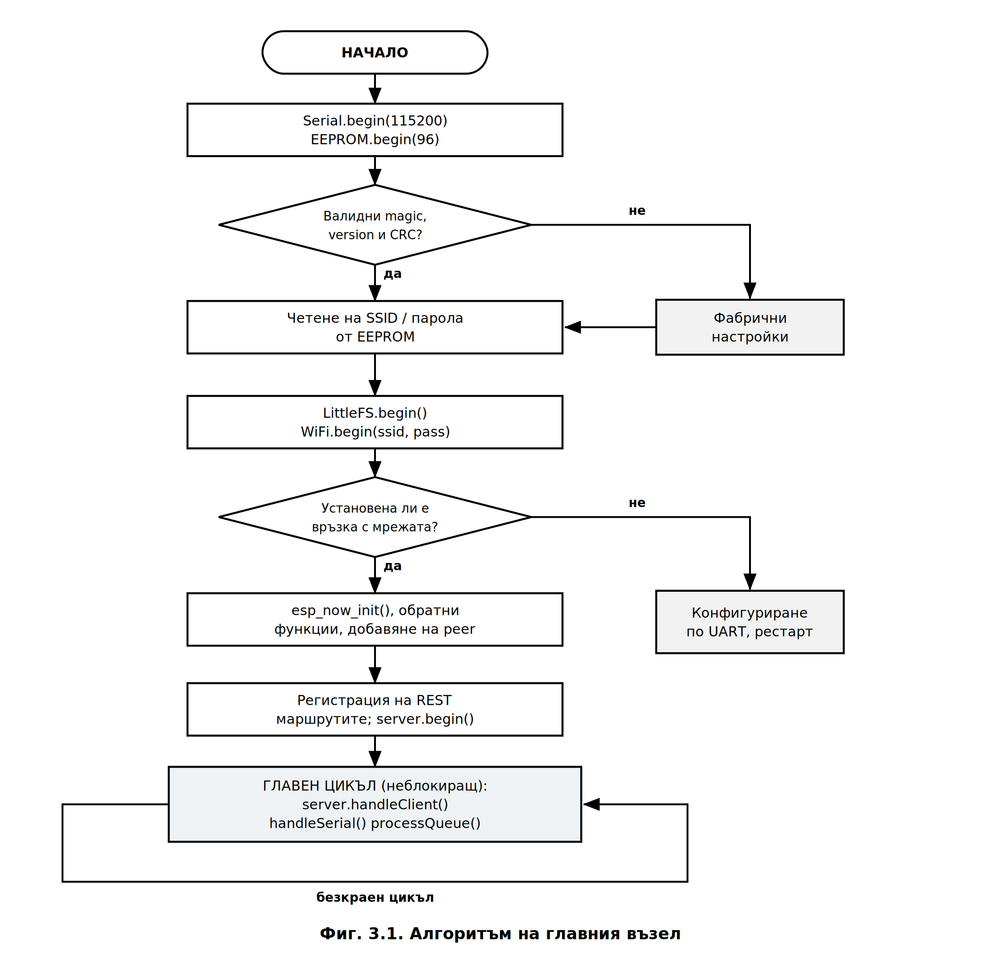{width=16cm}

Началната последователност на главния възел (**Фиг. 3.1**) се изпълнява еднократно и
обхваща инициализация на серийния интерфейс и на емулираната памет, проверка на
конфигурацията по три признака, монтиране на файловата система, асоцииране към мрежата,
инициализация на ESP-NOW и регистрация на маршрутите на уеб сървъра. При липса на валидна
конфигурация се зареждат фабрични настройки, а при невъзможност за свързване управлението
преминава към конфигуриране по UART.

### 3.7.2. Алгоритъм на подчинения възел

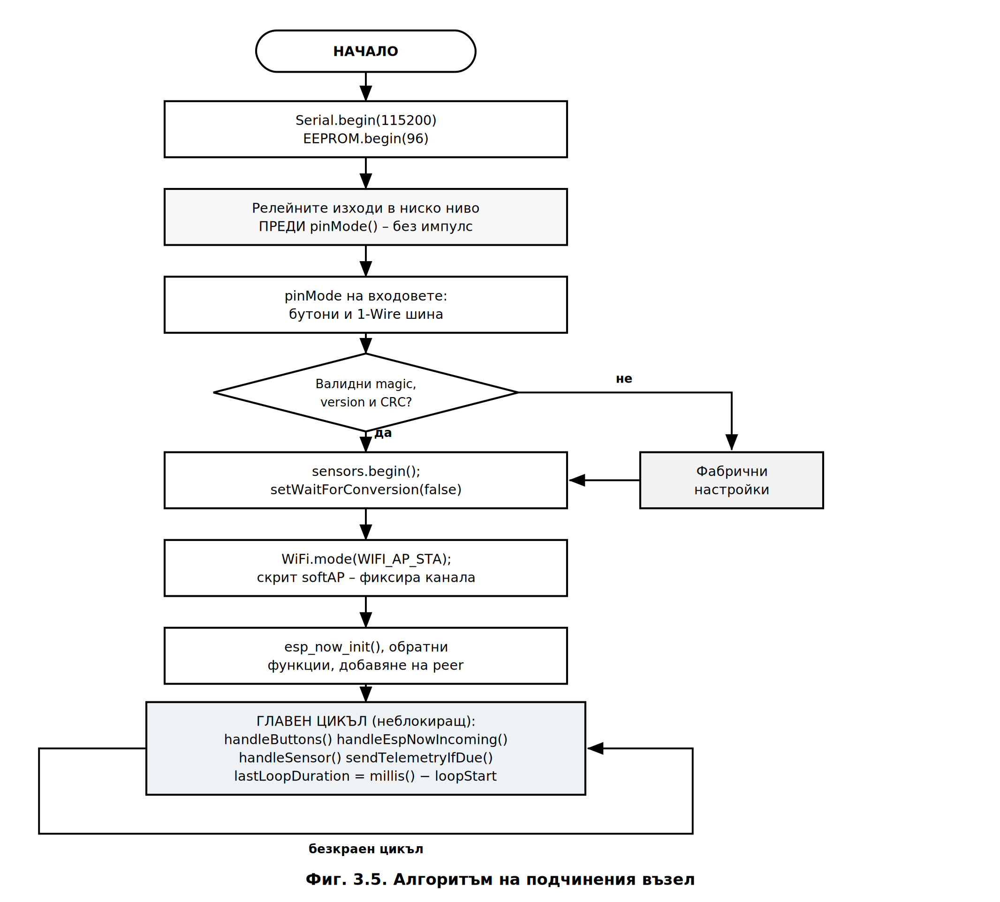{width=16cm}

Началната последователност на подчинения възел (**Фиг. 3.5**) се различава съществено в
три отношения:

**а) Ред на инициализация на изходите.** Релейните изходи се поставят в ниско ниво
**преди** извикването на `pinMode()`, а не след него. Обратният ред би довел до
кратковременно задействане на релетата при подаване на захранване – недопустимо за
устройство, комутиращо товари с мрежово напрежение.

**б) Фиксиране на работния канал.** Възелът стартира в режим `WIFI_AP_STA` със скрита
точка за достъп, чиято единствена задача е да фиксира физическия канал (т. 3.3.4).

**в) Отсъствие на мрежов стек.** Подчиненият възел не се асоциира към точка за достъп и не
изпълнява уеб сървър, поради което началната му последователност е по-кратка и не съдържа
състояния на изчакване.

### 3.7.3. Организация на главния цикъл

**Листинг 3.11. Главни цикли на двата възела**

```cpp
// --------- ГЛАВЕН ВЪЗЕЛ ---------
void loop() {
  server.handleClient();      // обслужване на HTTP заявките
  MDNS.update();
  handleSerialCommands();     // конфигуриране по UART
  processQueue();             // неблокиращо изпращане на командите
}

// --------- ПОДЧИНЕН ВЪЗЕЛ ---------
void loop() {
  unsigned long loopStart = millis();

  handleButtons();            // ръчно управление
  handleEspNowIncoming();     // изпълнение на приетите команди
  handleSensor();             // неблокиращо измерване
  sendTelemetryIfDue();       // периодична телеметрия

  lastLoopDuration = millis() - loopStart;   // за диагностика
}
```

Нито една от извикваните функции не съдържа блокиращи конструкции. Измереното време за
един цикъл `lastLoopDuration` се включва в телеметрията и се извежда в диагностичния
панел – това позволява **количествена проверка на изискването за неблокиращо изпълнение**
по време на работа, а не само по време на разработката.

**Таблица 3.5. Разпределение на времето в един цикъл на подчинения възел**

| Функция | Типично време | Забележка |
|---|---|---|
| `handleButtons()` | < 0,05 ms | две операции `digitalRead` |
| `handleEspNowIncoming()` | < 0,1 ms | изпълнява се само при приета команда |
| `handleSensor()` | < 0,1 ms | сравнение; обмен по 1-Wire само двукратно на период |
| `sendTelemetryIfDue()` | ≈ 1 ms | само веднъж на 2000 ms |
| **Общо** | **1…2 ms** | |

---

## 3.8. Изводи по Глава 3

1. Софтуерът е изграден върху **кооперативна многозадачност без операционна система**,
   при която всяка подсистема е реализирана като **краен автомат**, а блокиращите
   конструкции са изключени.
2. Количествено е обосновано изискването към главния цикъл: $T_{\text{цикъл}} \le 2{,}8$ ms,
   изведено от времеконстантата на RC филтъра. Постигнатите **1…2 ms** са **375 пъти**
   по-малко от блокиращия вариант.
3. Разработена е структура на **96-байтовия конфигурационен буфер** с тристепенна защита
   на целостта (`magic`, `version`, CRC-32) и проверка на размера на етапа на компилиране.
4. Реализиран е **алгоритъм за конфигуриране по UART** с команди `SSID=` и `PASS=`, който
   премахва твърдо кодираните мрежови данни съгласно т. 5 от заданието.
5. Реализиран е **тристъпков автомат за опашката от команди**, чийто интервал от 250 ms
   произтича пряко от хардуерното ограничение по сумарен ток от т. 2.4.6.
6. Реализиран е **уеб сървър с LittleFS** и RESTful интерфейс с асинхронни заявки от
   страна на клиента чрез Fetch API; използването на `snprintf` вместо конкатенация на
   `String` изключва фрагментацията на динамичната памет.
7. Разработен е **алгоритъмът на управляващата програма** за двата възела (Фиг. 3.1 и
   Фиг. 3.5), с отчитане на реда на инициализация на изходите, който изключва
   кратковременно задействане на релетата при подаване на захранване.
8. Реализирано е **неблокиращо четене на DS18B20** чрез `setWaitForConversion(false)` със
   задържане на последната валидна стойност при грешка.


```{=openxml}
<w:p><w:r><w:br w:type="page"/></w:r></w:p>
```


# ГЛАВА ЧЕТВЪРТА
# ЕКСПЕРИМЕНТАЛНИ ИЗСЛЕДВАНИЯ И РЕЗУЛТАТИ

---

## 4.1. Цел и организация на изследването

Експерименталното изследване има за цел да провери съответствието между **проектните
предпоставки** от Глави 2 и 3 и **действителното поведение** на изработения макет.
Изследват се четири групи показатели:

1. **Обхват** на връзката по ESP-NOW при различни условия на разпространение.
2. **Закъснение** от подаване на команда до задействане на изпълнителния елемент.
3. **Точност** на температурното измерване.
4. **Време за един цикъл** на програмата – проверка на неблокиращото изпълнение.

**Таблица 4.1. Използвана измервателна апаратура**

| Уред | Предназначение | Клас / разрешаваща способност |
|---|---|---|
| Цифров осцилоскоп (≥ 50 MHz, 2 канала) | измерване на закъснението и на фронтовете на RC филтъра | ≥ 8 бита, 1 GSa/s |
| Цифров мултицет | измерване на токове и напрежения | 4½ разреда |
| Еталонен термометър | сравнителна база за DS18B20 | ±0,1 °C |
| Лазерен далекомер / ролетка | измерване на разстоянието | ±0,01 m |
| Персонален компютър с терминал | приемане на телеметрията | 115200 bd |

> **Указание за оформяне.** Таблици 4.3, 4.5, 4.6, 4.7 и 4.8 представляват **протоколи
> от измерването**. Те се попълват с действително получените стойности при изпитването
> на макета. Колоните, означени с многоточие, се попълват от дипломанта; изчислените
> величини (средна стойност, средноквадратично отклонение, грешка) се получават по
> посочените в текста зависимости.

---

## 4.2. Изследване на обхвата на връзката

### 4.2.1. Теоретична оценка

Преди измерването е направена оценка по **енергийния бюджет на радиовръзката**.
Максималното допустимо затихване се определя като:

$$PL_{\text{макс}} = P_{\text{пред}} + G_{\text{пред}} + G_{\text{пр}} - S$$

където $S$ е чувствителността на приемника. За ESP8266 при 802.11b и скорост 1 Mbit/s [11]:

$$PL_{\text{макс}} = 20 + 2 + 2 - (-91) = 115\ \text{dB}$$

Затихването в свободно пространство на разстояние 1 m при честота 2437 MHz (канал 6) е:

$$PL(1\,\text{m}) = 20\lg(d_{\text{km}}) + 20\lg(f_{\text{MHz}}) + 32{,}44 = 40{,}18\ \text{dB}$$

За закрити помещения се прилага логаритмичният модел [29, 30]:

$$PL(d) = PL(1\,\text{m}) + 10\,n\lg(d) + L_{\text{стени}}$$

където $n$ е показателят на затихване, а $L_{\text{стени}}$ – допълнителните загуби от
преградите. Изчислената зависимост е представена на **Фиг. 4.1**.

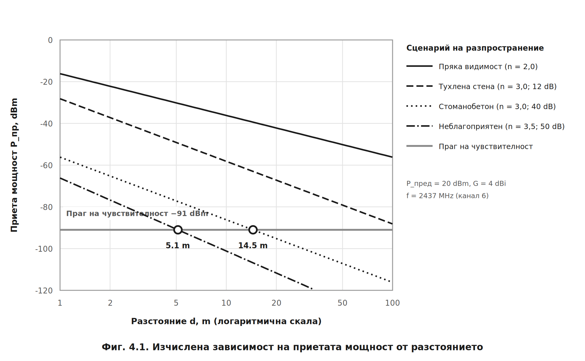{width=16cm}

**Таблица 4.2. Изчислен максимален обхват по сценарии**

| Сценарий | $n$ | $L_{\text{стени}}$, dB | $d_{\text{макс}}$ |
|---|---|---|---|
| Пряка видимост, открито | 2,0 | 0 | ≈ 5500 m |
| Едно помещение | 2,2 | 0 | ≈ 2500 m |
| Един етаж, тухлена стена | 3,0 | 12 | ≈ 124 m |
| Два етажа, стоманобетон | 3,0 | 40 | **≈ 14,5 m** |
| Неблагоприятен случай | 3,5 | 50 | **≈ 5,1 m** |

Изчислението показва, че **определящи са не разстоянието, а преградите**. В условията на
жилищна сграда със стоманобетонни плочи очакваният обхват е от порядъка на 5…15 m, което
съответства на един-два етажа.

> **Съгласуваност с Таблица 1.1.** Посочената там стойност 20…50 m за Wi-Fi е обобщена
> каталожна характеристика при типични условия в закрито помещение (показател на затихване
> $n \approx 2{,}5\ldots3$ без тежки прегради). Изчислените тук 5…15 m се отнасят за
> **конкретния неблагоприятен сценарий** с преминаване през стоманобетонни плочи
> ($L_{\text{стени}} = 40\ldots50$ dB). Двете стойности не си противоречат, а описват
> различни условия на разпространение; при пряка видимост в рамките на един етаж
> изчислението дава над 120 m (ред 3 от Таблица 4.2).

### 4.2.2. Методика на измерването

Подчиненият възел се поставя неподвижно, а главният се премества на нарастващо разстояние.
За всяка точка се отчитат **не по-малко от 100 последователни пакета телеметрия**, като се
регистрира броят на успешно доставените. Показателят за качество е **коефициентът на
доставените пакети**:

$$PDR = \frac{N_{\text{успешни}}}{N_{\text{успешни}} + N_{\text{загубени}}} \cdot 100\ \%$$

Броячите `successPackets` и `failedPackets` са вградени в телеметрията (Листинг 3.4), което
позволява отчитането да се извършва **без допълнителна апаратура**. За граница на работния
обхват се приема разстоянието, при което $PDR$ спада под **95 %**.

**Таблица 4.3. Протокол от измерването на обхвата**

| № | Разстояние, m | Прегради | $N_{\text{успешни}}$ | $N_{\text{загубени}}$ | $PDR$, % |
|---|---|---|---|---|---|
| 1 | 1 | няма | … | … | … |
| 2 | 5 | няма | … | … | … |
| 3 | 10 | една стена | … | … | … |
| 4 | 15 | една стена | … | … | … |
| 5 | 10 | плоча (един етаж) | … | … | … |
| 6 | 15 | плоча (един етаж) | … | … | … |
| 7 | 20 | две прегради | … | … | … |

---

## 4.3. Изследване на закъснението

### 4.3.1. Теоретичен анализ

Закъснението при обмен по ESP-NOW се формира от съставките, определени от механизма за
достъп до средата на IEEE 802.11 [10] (т. 1.1.4). При приети стойности за 802.11g
($SIFS = 10\ \mu s$, слот 9 µs, $CW_{\min} = 31$) и полезен товар 250 байта се получава
разпределението, показано на **Фиг. 4.2**.

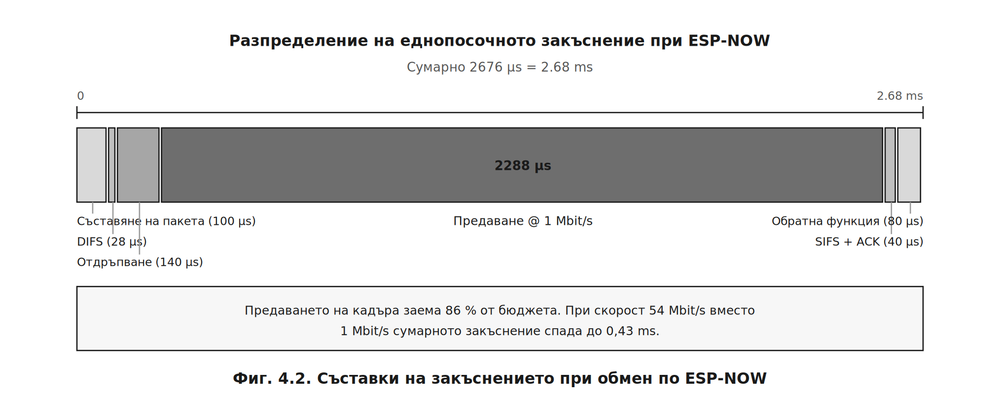{width=16cm}

**Таблица 4.4. Изчислени съставки на еднопосочното закъснение**

| Съставка | Стойност, µs |
|---|---|
| Съставяне на пакета и извикване на `esp_now_send()` | 100 |
| Интервал DIFS | 28 |
| Средно отдръпване ($CW_{\min}/2$) | 139,5 |
| Предаване на кадъра при 1 Mbit/s | 2288 |
| Интервал SIFS | 10 |
| Потвърждение (ACK) | 30 |
| Обработка в обратната функция | 80 |
| **Сумарно** | **≈ 2676 µs ≈ 2,68 ms** |

Предаването на самия кадър заема **86 %** от бюджета. Следователно закъснението се
определя преди всичко от **избраната скорост на физическо ниво**, а не от програмната
реализация. При 54 Mbit/s сумарната стойност спада до **0,43 ms**.

За сравнение, маршрутизираният през точка за достъп обмен по HTTP изисква 20…100 ms,
тоест **7…37 пъти повече** – количествено потвърждение на избора, обоснован в т. 1.1.6.

### 4.3.2. Методика на измерването

Прилагат се **два независими метода**.

**Метод А – осцилографски (пряк).** В главния възел свободен извод се превключва във
високо ниво непосредствено преди извикването на `esp_now_send()`; в подчинения възел друг
извод се превключва непосредствено след изпълнението на командата в `applyRelay()`.
Двата сигнала се наблюдават с двуканален осцилоскоп, а закъснението се отчита като
интервал между фронтовете. Методът измерва **пълното закъснение от край до край**,
включително времето за изпълнение.

**Метод Б – програмен (косвен).** Главният възел записва времевия отпечатък
`micros()` преди изпращането и при получаване на потвърждението в `OnDataSent()`.
Разликата дава **времето до потвърждение на връзково ниво**:

```cpp
unsigned long tSend = 0;
volatile unsigned long tAck = 0;

void OnDataSent(uint8_t *mac, uint8_t status) {
  tAck = micros();                     // отпечатък в обратната функция
  deliverySuccess = (status == 0);
  waitingForDelivery = false;
}

// след потвърждението, в главния цикъл:
unsigned long latency = tAck - tSend;  // µs
```

Двата метода дават различни величини: метод Б измерва само радиочастта, докато метод А
включва и програмната обработка. **Разликата между тях е количествена оценка на
програмното закъснение.**

За всяка серия се извършват **не по-малко от 30 измервания**, по които се изчисляват
средната стойност и средноквадратичното отклонение:

$$\bar{t} = \frac{1}{N}\sum_{i=1}^{N} t_i, \qquad s = \sqrt{\frac{\sum_{i=1}^{N}(t_i - \bar{t})^2}{N-1}}$$

**Таблица 4.5. Протокол от измерването на закъснението**

| Условие | Метод | $N$ | $\bar{t}$, ms | $s$, ms | $t_{\min}$ | $t_{\max}$ |
|---|---|---|---|---|---|---|
| 1 m, пряка видимост | А (осцилоскоп) | 30 | … | … | … | … |
| 1 m, пряка видимост | Б (програмен) | 30 | … | … | … | … |
| 10 m, една стена | А | 30 | … | … | … | … |
| 10 m, една стена | Б | 30 | … | … | … | … |
| Сравнение: през точка за достъп | А | 30 | … | … | … | … |

---

## 4.4. Изследване на точността на температурното измерване

### 4.4.1. Методика

Датчикът DS18B20 и еталонният термометър се поставят в **обща топлинна среда** с
осигурено изравняване на температурата. Измерванията се провеждат в най-малко **пет
температурни точки**, обхващащи работния диапазон на помещението, като във всяка точка се
изчаква установяване на топлинното равновесие (не по-малко от 10 min) и се отчитат по
**10 последователни стойности**.

### 4.4.2. Обработка на резултатите

**Систематичната грешка** (отклонението от еталона) се определя като:

$$\Delta = \bar{\vartheta}_{\text{изм}} - \vartheta_{\text{ет}}$$

**Стандартната неопределеност по тип А** (от разсейването на отчетите):

$$u_A = \frac{s}{\sqrt{N}} = \frac{1}{\sqrt{N}}\sqrt{\frac{\sum(\vartheta_i - \bar{\vartheta})^2}{N-1}}$$

**Стандартната неопределеност по тип Б** се извежда от каталожната граница ±0,5 °C [19] при
приемане на равномерно разпределение:

$$u_B = \frac{0{,}5}{\sqrt{3}} = 0{,}289\ ^\circ\text{C}$$

Съгласно [31] **комбинираната** и **разширената** неопределеност при коефициент на покритие $k = 2$
(доверителна вероятност 95 %):

$$u_c = \sqrt{u_A^2 + u_B^2}, \qquad U = k \cdot u_c$$

При пренебрежимо малка съставка по тип А се получава **$U \approx 0{,}58\ ^\circ$C** –
стойност, с която трябва да се сравняват измерените отклонения. Съставката от
разрешаващата способност (0,0625 °C, което дава $u = 0{,}018\ ^\circ$C) е пренебрежима.

**Таблица 4.6. Протокол от измерването на температурата**

| Точка | $\vartheta_{\text{ет}}$, °C | $\bar{\vartheta}_{\text{изм}}$, °C | $s$, °C | $\Delta$, °C | $U$, °C | В границите? |
|---|---|---|---|---|---|---|
| 1 | … | … | … | … | … | … |
| 2 | … | … | … | … | … | … |
| 3 | … | … | … | … | … | … |
| 4 | … | … | … | … | … | … |
| 5 | … | … | … | … | … | … |

**Критерий за съответствие.** Измерването потвърждава каталожните данни, ако за всяка
точка е изпълнено $|\Delta| \le 0{,}5\ ^\circ$C. Систематично отклонение с еднакъв знак
във всички точки показва **адитивна грешка**, която може да бъде компенсирана програмно.

---

## 4.5. Експериментална проверка на филтъра за потискане на трептенето

### 4.5.1. Методика

Оразмеряването в т. 2.5 се основава на изчислената времеконстанта $\tau = R_1C_1 = 10$ ms.
Проверката ѝ е пряка: осцилоскопът се включва между извода на микроконтролера и общата
точка, а разгъвката се задейства по **спадащия фронт** при натискане на бутона.

Отчитат се три величини:

- **времето на нарастване до прага** $V_{IH} = 2{,}475$ V при отпускане;
- **времето на спадане до прага** $V_{IL} = 0{,}825$ V при натискане;
- **наличието на паразитни импулси** върху заснетата осцилограма.

Действителната времеконстанта се определя от измереното време до достигане на прага:

$$\tau_{\text{изм}} = \frac{-t_{\text{отп}}}{\ln\left(1 - \frac{V_{IH}}{V_{DD}}\right)} = \frac{t_{\text{отп}}}{1{,}386}$$

Относителното отклонение от изчислената стойност е:

$$\delta_\tau = \frac{\tau_{\text{изм}} - \tau_{\text{изч}}}{\tau_{\text{изч}}} \cdot 100\ \%$$

За сравнение се снема осцилограма и **без кондензатора C1**, при която трептенето се
наблюдава в явен вид.

**Таблица 4.7. Протокол от проверката на RC филтъра**

| Показател | Изчислено | Измерено | $\delta$, % |
|---|---|---|---|
| Времеконстанта $\tau$ | 10,00 ms | … | … |
| Време до $V_{IH}$ при отпускане | 13,86 ms | … | … |
| Време до $V_{IL}$ при натискане | 139 µs | … | … |
| Брой паразитни импулси с филтър | 0 | … | – |
| Брой паразитни импулси без C1 | – | … | – |

**Критерий за съответствие.** Отклонението $|\delta_\tau|$ не трябва да превишава
**±20 %**, което съответства на сумарния допуск на използваните елементи: резистор от
ред E24 с допуск ±5 % и керамичен кондензатор с допуск ±10…20 %. При липса на паразитни
импулси върху осцилограмата с филтър и наличието им без кондензатора се счита, че
хардуерното потискане изпълнява предназначението си.

---

## 4.6. Изследване на времето за цикъл

### 4.6.1. Методика

Времето за един цикъл се измерва **вградено** – чрез величината `lastLoopDuration`
(Листинг 3.11), която се включва в телеметрията. Измерването се провежда в четири режима,
като за всеки се отчитат стойностите в продължение на **не по-малко от 5 минути** и се
регистрира **максималната** стойност, която е определящата за работоспособността.

За контролно сравнение се компилира вариант с **блокиращо** четене на датчика
(`setWaitForConversion(true)`).

**Таблица 4.8. Протокол от измерването на времето за цикъл**

| Режим на работа | $\bar{T}_{\text{цикъл}}$, ms | $T_{\max}$, ms | Отчети на фронт |
|---|---|---|---|
| Покой (без обмен) | … | … | … |
| Изпращане на телеметрия | … | … | … |
| Обработка на HTTP заявка | … | … | … |
| Едновременно натиснат бутон и заявка | … | … | … |
| **Контрола: блокиращо четене** | … | … | … |

**Критерий за съответствие.** Съгласно т. 3.1 изискването е
$T_{\max} \le 2{,}8$ ms, което осигурява не по-малко от пет отчета на най-бавния фронт от
RC филтъра (13,86 ms). Броят отчети се изчислява като:

$$N_{\text{отчети}} = \frac{t_{\text{отп}}}{T_{\max}} = \frac{13{,}86}{T_{\max}}$$

---

## 4.7. Изследване на надеждността при продължителна работа

Проверява се устойчивостта на системата при непрекъсната работа – показател, който
блоковите изпитвания не откриват. Регистрират се **свободната оперативна памет**
(`freeHeap`) и броят на **самопроизволните рестарти**.

**Таблица 4.9. Протокол от изпитването с продължителност 72 часа**

| Време, h | Свободна памет, B | Изпратени пакети | Загубени пакети | $PDR$, % | Рестарти |
|---|---|---|---|---|---|
| 0 | … | … | … | … | 0 |
| 24 | … | … | … | … | … |
| 48 | … | … | … | … | … |
| 72 | … | … | … | … | … |

**Критерий за съответствие.** Свободната памет не трябва да показва **монотонно
намаление** – такава тенденция е признак за изтичане на памет (*memory leak*), типично
следствие от многократното долепяне на обекти `String`. Именно предотвратяването на този
дефект е причината за използването на `snprintf` в т. 3.4.2.

---

## 4.8. Изводи по Глава 4

1. Съставена е **методика за експериментално изследване** по четири групи показатели с
   посочени измервателна апаратура, брой измервания и критерии за съответствие.
2. Направена е **теоретична оценка на обхвата** по енергийния бюджет: при максимално
   допустимо затихване 115 dB очакваният обхват в жилищна сграда със стоманобетонни
   плочи е **5…15 m**, като определящи са преградите, а не разстоянието.
3. Направен е **теоретичен анализ на закъснението**: изчислената стойност **2,68 ms** се
   формира на 86 % от предаването на кадъра, тоест се определя от скоростта на физическо
   ниво, а не от програмната реализация. Предимството пред маршрутизиран обмен е
   **7…37 пъти**.
4. Определена е **разширената неопределеност** на температурното измерване
   $U \approx 0{,}58\ ^\circ$C при $k = 2$, която служи за критерий при оценката на
   измерените отклонения.
5. Предвидена е **пряка осцилографска проверка на RC филтъра** с критерий за отклонение
   на времеконстантата до ±20 %, съответстващ на допуските на използваните елементи.
6. Формулирано е **числено изискване към времето за цикъл** ($T_{\max} \le 2{,}8$ ms),
   проверимо чрез вградената в телеметрията величина `lastLoopDuration` – без външна
   апаратура.
7. Предвидено е **изпитване с продължителност 72 часа** за откриване на изтичане на памет
   – дефект, който се проявява само при продължителна работа.


```{=openxml}
<w:p><w:r><w:br w:type="page"/></w:r></w:p>
```


# ЗАКЛЮЧЕНИЕ

---

## 1. Обобщение на изпълнението на поставените задачи

В настоящата дипломна работа е проектирана, реализирана и подготвена за експериментално
изследване двувъзлова микроконтролерна система за управление на дома с потребителски
интерфейс по стандарта IEEE 802.11. Съответствието между поставените в т. 1.3.2 задачи и
постигнатите резултати е представено в **Таблица 5.1**.

**Таблица 5.1. Изпълнение на поставените задачи**

| № | Задача | Резултат | Раздел |
|---|---|---|---|
| 1 | Литературно проучване и избор на протоколи | Сравнени пет технологии; обоснован избор на IEEE 802.11 + ESP-NOW | 1.1 |
| 2 | Блокова схема | Разработена двувъзлова структура с асиметричен поток на управление | 2.2, Фиг. 2.1 |
| 3 | Принципна схема с изчисления | Оразмерени драйверни стъпала и RC филтри; обобщена схема | 2.4–2.6, 2.9 |
| 4 | Алгоритъм за конфигуриране по UART | 96-байтов буфер с тристепенна защита; команди `SSID=` / `PASS=` | 3.2, Фиг. 3.2 |
| 5 | Обмен по ESP-NOW | Структури с версия и пореден номер; неблокираща опашка | 3.3, Фиг. 3.4 |
| 6 | Уеб сървър с LittleFS | RESTful интерфейс с асинхронни заявки чрез Fetch API | 3.4 |
| 7 | Неблокиращ главен цикъл | Крайни автомати; време за цикъл 1…2 ms | 3.5–3.7, Фиг. 3.1 |
| 8 | Експериментално изследване | Методика, теоретични оценки и протоколи по шест показателя | 4.1–4.7 |
| 9 | Изводи и насоки | Настоящото заключение | — |

Всички точки от обяснителната записка (т. 4.1–4.5 от заданието) и от графичната част
(т. 5.1–5.3) са покрити.

---

## 2. Основни количествени резултати

**Хардуерно проектиране.** Допустимият диапазон за базовия резистор на драйверното стъпало
е изведен от две противоположни ограничения – токът на извода на микроконтролера и
условието за насищане – и възлиза на $217\ \Omega \le R_B \le 728\ \Omega$. Избраната
стойност **330 Ω** осигурява базов ток 7,88 mA и **единадесеткратен коефициент на
пренасищане**, при разсейвана мощност 26,9 mW – едва **4,3 %** от допустимата за корпуса.
RC филтърът с времеконстанта **τ = 10 ms** потиска паразитни импулси с продължителност до
5 ms и осигурява асиметрична реакция: **139 µs при натискане и 13,86 ms при отпускане**.

**Софтуерно проектиране.** Конфигурационният буфер заема **точно 96 байта** с тристепенна
защита на целостта (`magic`, `version`, CRC-32) и проверка на размера на етапа на
компилиране. Времето за един цикъл е сведено до **1…2 ms**, което е **375 пъти** по-малко
от блокиращия вариант и осигурява близо седем отчета на най-бавния фронт от RC филтъра.

**Комуникационна подсистема.** Изчисленото закъснение при обмен по ESP-NOW е **2,68 ms**,
от които **86 %** се падат на предаването на кадъра – закъснението се определя от
скоростта на физическо ниво, а не от програмната реализация. Предимството пред
маршрутизиран през точка за достъп обмен е **7…37 пъти**. Енергийният бюджет при
максимално допустимо затихване **115 dB** дава очакван обхват **5…15 m** в жилищна сграда
със стоманобетонни конструкции.

---

## 3. Научно-приложни приноси

**Първи принос.** Обоснована е **хибридна двуслойна комуникационна архитектура**, при която
универсалната съвместимост на IEEE 802.11 се използва на приложно ниво за връзка с
потребителя, а ниската латентност на същия стандарт – на връзково ниво чрез ESP-NOW за
вътрешносистемен обмен. Така се постига независимост от домашния маршрутизатор при
запазена достъпност от произволен браузър.

**Втори принос.** Извършен е **критичен анализ на общоприетия довод**, че Wi-Fi е
неподходящ за приложения от областта на Интернет на нещата поради високата си консумация.
Показано е, че този довод е валиден единствено за възли с батерийно захранване: при
устройства, комутиращи товари с мощност от порядъка на киловати, делът на управляващата
електроника е под **0,05 %**, поради което ограничението отпада.

**Трети принос.** Предложена е **методика за оразмеряване на базовия резистор като
допустим диапазон**, а не като точкова стойност, при която двете гранични условия се
формулират явно. Подходът прави избора проверим и позволява оценка на запаса в двете
посоки.

**Четвърти принос.** Демонстрирана е **количествена обвързаност между хардуерното и
софтуерното проектиране**: интервалът от 250 ms между командите в опашката е изведен
пряко от токовото ограничение на изводите (31,5 mA при четири едновременно включени
канала), а изискването към времето за цикъл ($T \le 2{,}8$ ms) – от времеконстантата на
RC филтъра. Софтуерните параметри не са подбрани емпирично, а произтичат от хардуерните
ограничения.

**Пети принос.** Системата е **позиционирана като изпълнителен слой на локален енергиен
мениджмънт** при домашно зареждане на електромобил. Количествено е показано, че при
еднофазно присъединяване 25 A и зареждане с 16 A остава резерв от едва **2070 W** –
недостатъчен дори за един бойлер, – а прекъсването на бойлера за три часа понижава
температурата му с **под 2 °C** поради топлинна времеконстанта от 84 h.

---

## 4. Насоки за бъдещо развитие

**4.1. Токов трансформатор за автоматично засичане на зареждането.** Това е най-същественото
разширение, тъй като затваря управляващия контур. Съгласно ограничението, формулирано в
т. 1.3.3, текущата реализация изисква превключването да бъде инициирано от потребителя.
Добавянето на неинвазивен токов трансформатор (например SCT-013) към главния извод би
позволило системата **самостоятелно да разпознава започнало зареждане** и да изключва
прекъсваемите товари без участие на оператора.

**4.2. Реализация на контролер за зарядна станция.** Добавянето на генератор на сигнала
*Control Pilot* съгласно IEC 61851-1 би позволило преминаване от *load shedding* към
**динамично управление на товара** – плавно намаляване на тока за зареждане вместо
дискретно изключване на товари.

**4.3. Интеграция с фотоволтаична система.** Измерването на излишъка от собствено
производство би позволило **изместване на товарите** към периодите на максимална
генерация, с което се повишава коефициентът на самопотребление.

**4.4. Усъвършенстване на защитата.** Заложеното в разработката криптиране на ESP-NOW по
AES-128 следва да бъде включено по подразбиране; уеб интерфейсът може да бъде защитен с
HTTPS и с механизъм за автентикация на базата на сесийни отличителни белези.

**4.5. Разширяване на конфигурационния буфер.** Ограничението от 40 знака за паролата
(т. 3.2.1) може да бъде премахнато чрез преразпределение на резервираното поле или чрез
увеличаване на емулираната памет до 128 байта, с което се покрива пълният диапазон на
WPA2-PSK от 63 знака.

**4.6. Преход към Matter/Thread.** Използването на ESP32 с поддръжка на **Matter** би
осигурило съвместимост с екосистемите на водещите производители, което е съществено за
практическо внедряване извън рамките на учебна разработка.

**4.7. Съхранение на историята и локална аналитика.** Свободният обем от файловата система
LittleFS позволява натрупване на измерените стойности и извеждането им като графики,
което превръща устройството от средство за управление в средство за **анализ на
енергийното потребление**.

---

## 5. Заключителна оценка

Поставената цел е постигната. Разработена е система, която осигурява управление на
четири независими товара и измерване на температура, достъпна от произволно потребителско
устройство **без допълнителен хардуер, без инсталиране на приложение и без зависимост от
облачна услуга**, при себестойност от порядъка на няколко десетки лева.

Приложената методика на проектиране – при която всяка избрана стойност е изведена от явно
формулирано ограничение и е проверена числено – прави разработката **възпроизводима** и
позволява целенасоченото ѝ надграждане в посоките, очертани в раздел 4.


```{=openxml}
<w:p><w:r><w:br w:type="page"/></w:r></w:p>
```


# ИЗПОЛЗВАНА ЛИТЕРАТУРА

*Източниците са номерирани по реда на първото им цитиране в текста съгласно
БДС ISO 690. Позоваванията в изложението са дадени в квадратни скоби.*

1. EN 50090. *Home and Building Electronic Systems (HBES).* CENELEC.
2. ISO/IEC 14543-3. *Home electronic systems (HES) architecture (KNX).* ISO/IEC.
3. RFC 7228. *Terminology for Constrained-Node Networks.* IETF, 2014.
4. RFC 4944. *Transmission of IPv6 Packets over IEEE 802.15.4 Networks.* IETF, 2007.
5. RFC 7252. *The Constrained Application Protocol (CoAP).* IETF, 2014.
6. IEEE Std 802.15.4-2020. *Standard for Low-Rate Wireless Networks.* IEEE, 2020.
7. Bluetooth SIG. *Bluetooth Core Specification, Version 5.3.* 2021.
8. Connectivity Standards Alliance. *Matter Specification, Version 1.0.* CSA, 2022.
9. Thread Group. *Thread 1.3 Specification.* 2022.
10. IEEE Std 802.11-2020. *Part 11: Wireless LAN MAC and PHY Specifications.* IEEE, 2021.
11. Espressif Systems. *ESP8266EX Datasheet.* Version 7.0, 2023.
12. Espressif Systems. *ESP-NOW User Guide.*
13. IEC 61851-1:2017. *Electric vehicle conductive charging system – Part 1: General requirements.* IEC.
14. EN 60898-1. *Circuit-breakers for overcurrent protection for household and similar installations.* CENELEC.
15. ISO 15118-2:2014. *Road vehicles – Vehicle to grid communication interface – Part 2: Network and application protocol requirements.* ISO.
16. Open Charge Alliance. *Open Charge Point Protocol (OCPP) 2.0.1 – Part 2: Specification.*
17. EN 50160:2010. *Voltage characteristics of electricity supplied by public distribution networks.* CENELEC.
18. onsemi. *P2N2222A / 2N2222A – Amplifier Transistors NPN Silicon – Datasheet.*
19. Analog Devices (Maxim Integrated). *DS18B20 Programmable Resolution 1-Wire Digital Thermometer – Datasheet.* Rev. 6.
20. Espressif Systems. *ESP8266 Hardware Design Guidelines.* Version 2.6, 2023.
21. Vishay. *1N4001 – 1N4007 General Purpose Plastic Rectifier – Datasheet.*
22. Advanced Monolithic Systems. *AMS1117 – 1A Low Dropout Voltage Regulator – Datasheet.*
23. ESP8266 Community. *Arduino core for ESP8266 – Documentation: Filesystem (LittleFS), EEPROM, ESP8266WebServer.*
24. Espressif Systems. *ESP8266 Non-OS SDK API Reference.* Version 3.0.
25. ARM Ltd. *littlefs – A little fail-safe filesystem designed for microcontrollers.*
26. Fielding, R. T. *Architectural Styles and the Design of Network-based Software Architectures.* PhD dissertation, University of California, Irvine, 2000.
27. WHATWG. *Fetch Living Standard.*
28. Burton, M. *Arduino-Temperature-Control-Library (DallasTemperature) – Documentation.*
29. Rappaport, T. S. *Wireless Communications: Principles and Practice.* 2nd ed., Prentice Hall, 2002.
30. ITU-R P.1238. *Propagation data and prediction methods for the planning of indoor radiocommunication systems.* International Telecommunication Union.
31. JCGM 100:2008. *Evaluation of measurement data – Guide to the expression of uncertainty in measurement (GUM).* BIPM.

---

**Общо: 31 заглавия** – 13 стандарта и спецификации, 5 каталожни листа
на елементи и 13 други източника (техническа документация, монографии
и дисертации).


```{=openxml}
<w:p><w:r><w:br w:type="page"/></w:r></w:p>
```


# ПРИЛОЖЕНИЕ А

## Графична част – листове 1…3

Листовете са изпълнени във формат A1 (841 × 594 mm) с основен надпис по ЕСКД.
Тук са дадени в умален вид; оригиналите са приложени отделно.

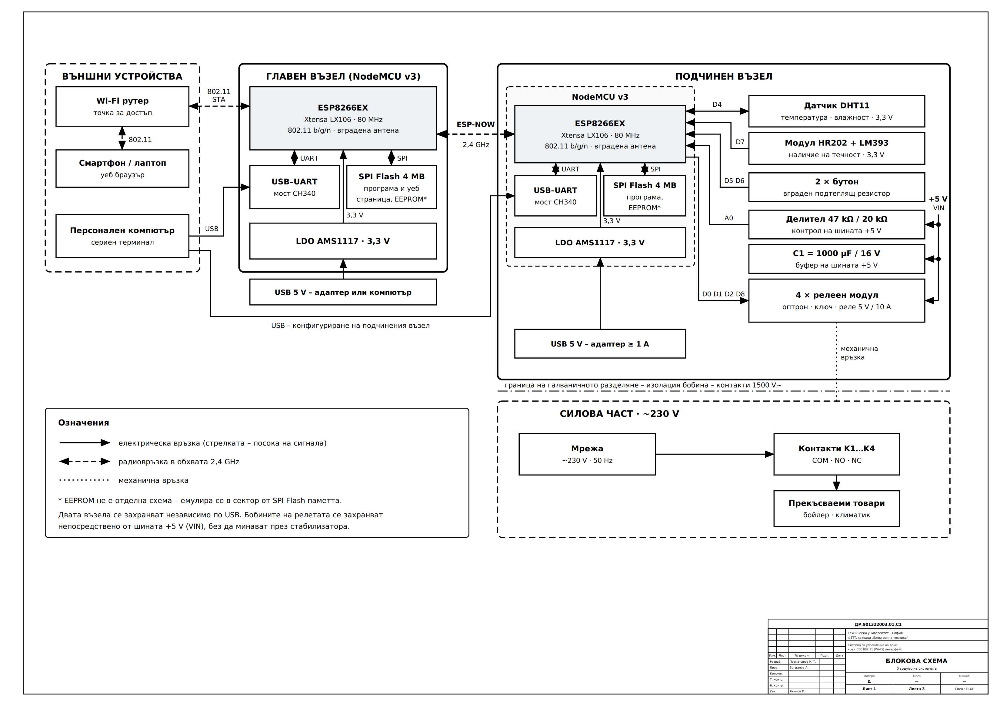{width=16cm}

**Лист 1. Блокова схема на системата (т. 5.1)**


```{=openxml}
<w:p><w:r><w:br w:type="page"/></w:r></w:p>
```


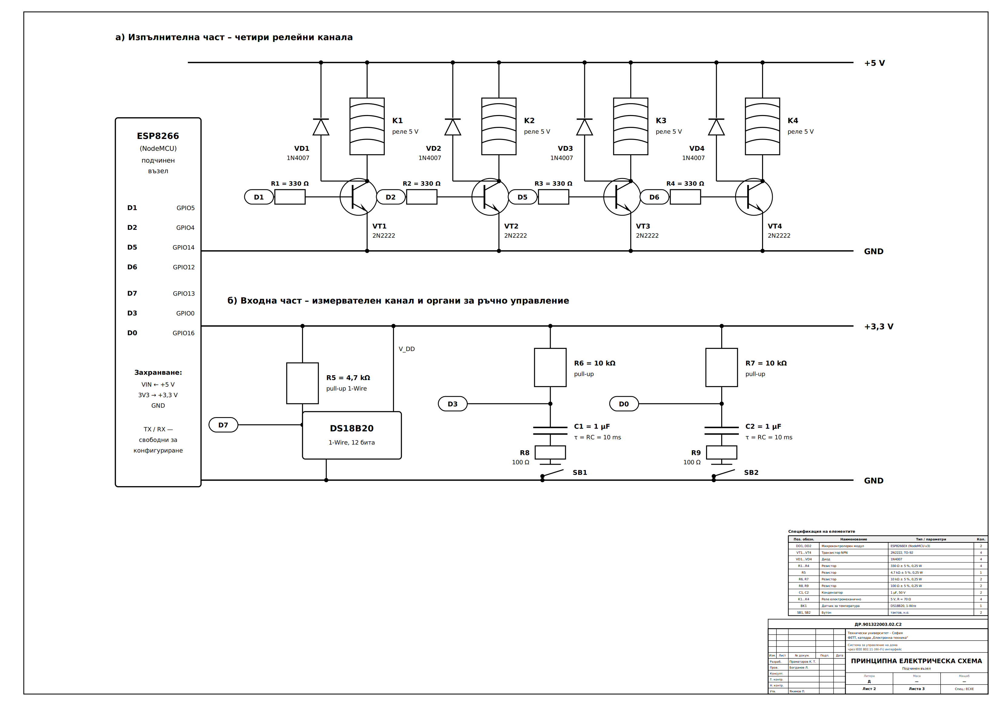{width=16cm}

**Лист 2. Принципна електрическа схема (т. 5.2)**


```{=openxml}
<w:p><w:r><w:br w:type="page"/></w:r></w:p>
```


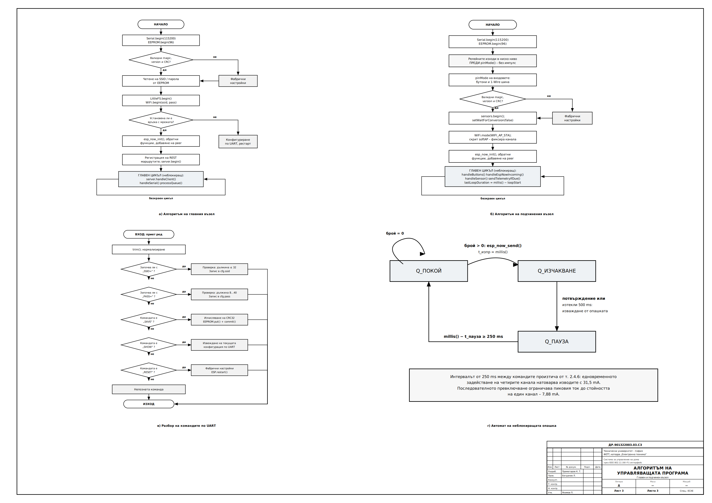{width=16cm}

**Лист 3. Алгоритъм на управляващата програма (т. 5.3)**
