```{=openxml}
<w:p><w:pPr><w:spacing w:before="0" w:after="0" w:line="20" w:lineRule="exact"/><w:ind w:left="0" w:right="0" w:firstLine="0"/><w:jc w:val="center"/></w:pPr><w:r><w:drawing><wp:anchor distT="0" distB="0" distL="0" distR="0" simplePos="0" relativeHeight="0" behindDoc="1" locked="1" layoutInCell="0" allowOverlap="1"><wp:simplePos x="0" y="0"/><wp:positionH relativeFrom="margin"><wp:align>center</wp:align></wp:positionH><wp:positionV relativeFrom="margin"><wp:align>center</wp:align></wp:positionV><wp:extent cx="5760720" cy="6144260"/><wp:effectExtent l="0" t="0" r="0" b="0"/><wp:wrapNone/><wp:docPr id="9101" name="Воден знак"/><wp:cNvGraphicFramePr/><a:graphic><a:graphicData uri="http://schemas.openxmlformats.org/drawingml/2006/picture"><pic:pic><pic:nvPicPr><pic:cNvPr id="9101" name="Воден знак"/><pic:cNvPicPr/></pic:nvPicPr><pic:blipFill><a:blip r:embed="rIdTpWm"/><a:stretch><a:fillRect/></a:stretch></pic:blipFill><pic:spPr><a:xfrm><a:off x="0" y="0"/><a:ext cx="5760720" cy="6144260"/></a:xfrm><a:prstGeom prst="rect"><a:avLst/></a:prstGeom></pic:spPr></pic:pic></a:graphicData></a:graphic></wp:anchor></w:drawing></w:r></w:p><w:tbl><w:tblPr><w:tblW w:w="9072" w:type="dxa"/><w:jc w:val="center"/><w:tblBorders><w:top w:val="nil"/><w:left w:val="nil"/><w:bottom w:val="nil"/><w:right w:val="nil"/><w:insideH w:val="nil"/><w:insideV w:val="nil"/></w:tblBorders><w:tblLayout w:type="fixed"/><w:tblCellMar><w:left w:w="0" w:type="dxa"/><w:right w:w="0" w:type="dxa"/></w:tblCellMar><w:tblLook w:val="0000"/></w:tblPr><w:tblGrid><w:gridCol w:w="1474"/><w:gridCol w:w="6124"/><w:gridCol w:w="1474"/></w:tblGrid><w:tr><w:tc><w:tcPr><w:tcW w:w="1474" w:type="dxa"/><w:vAlign w:val="center"/></w:tcPr><w:p><w:pPr><w:spacing w:before="0" w:after="0" w:line="240" w:lineRule="auto"/><w:ind w:left="0" w:right="0" w:firstLine="0"/><w:jc w:val="center"/></w:pPr><w:r><w:drawing><wp:inline distT="0" distB="0" distL="0" distR="0"><wp:extent cx="834888" cy="890704"/><wp:effectExtent l="0" t="0" r="0" b="0"/><wp:docPr id="9102" name="Лого на ТУ – София"/><wp:cNvGraphicFramePr><a:graphicFrameLocks noChangeAspect="1"/></wp:cNvGraphicFramePr><a:graphic><a:graphicData uri="http://schemas.openxmlformats.org/drawingml/2006/picture"><pic:pic><pic:nvPicPr><pic:cNvPr id="9102" name="Лого на ТУ – София"/><pic:cNvPicPr/></pic:nvPicPr><pic:blipFill><a:blip r:embed="rIdTpTu"/><a:stretch><a:fillRect/></a:stretch></pic:blipFill><pic:spPr><a:xfrm><a:off x="0" y="0"/><a:ext cx="834888" cy="890704"/></a:xfrm><a:prstGeom prst="rect"><a:avLst/></a:prstGeom></pic:spPr></pic:pic></a:graphicData></a:graphic></wp:inline></w:drawing></w:r></w:p></w:tc><w:tc><w:tcPr><w:tcW w:w="6124" w:type="dxa"/><w:vAlign w:val="center"/></w:tcPr><w:p><w:pPr><w:pBdr><w:bottom w:val="single" w:sz="8" w:space="2" w:color="17365D"/></w:pBdr><w:spacing w:before="0" w:after="40" w:line="240" w:lineRule="auto"/><w:ind w:left="0" w:right="0" w:firstLine="0"/><w:jc w:val="center"/></w:pPr><w:r><w:rPr><w:rFonts w:ascii="Calibri" w:hAnsi="Calibri" w:cs="Calibri"/><w:color w:val="17365D"/><w:sz w:val="36"/><w:szCs w:val="36"/></w:rPr><w:t xml:space="preserve">ТЕХНИЧЕСКИ УНИВЕРСИТЕТ-СОФИЯ</w:t></w:r></w:p><w:p><w:pPr><w:spacing w:before="0" w:after="0" w:line="240" w:lineRule="auto"/><w:ind w:left="0" w:right="0" w:firstLine="0"/><w:jc w:val="center"/></w:pPr><w:r><w:rPr><w:rFonts w:ascii="Calibri" w:hAnsi="Calibri" w:cs="Calibri"/><w:b/><w:bCs/><w:color w:val="17365D"/><w:sz w:val="28"/><w:szCs w:val="28"/></w:rPr><w:t xml:space="preserve">ФАКУЛТЕТ ПО ЕЛЕКТРОННА ТЕХНИКА</w:t></w:r></w:p><w:p><w:pPr><w:spacing w:before="0" w:after="0" w:line="240" w:lineRule="auto"/><w:ind w:left="0" w:right="0" w:firstLine="0"/><w:jc w:val="center"/></w:pPr><w:r><w:rPr><w:rFonts w:ascii="Calibri" w:hAnsi="Calibri" w:cs="Calibri"/><w:b/><w:bCs/><w:color w:val="17365D"/><w:sz w:val="28"/><w:szCs w:val="28"/></w:rPr><w:t xml:space="preserve">И ТЕХНОЛОГИИ</w:t></w:r></w:p></w:tc><w:tc><w:tcPr><w:tcW w:w="1474" w:type="dxa"/><w:vAlign w:val="center"/></w:tcPr><w:p><w:pPr><w:spacing w:before="0" w:after="0" w:line="240" w:lineRule="auto"/><w:ind w:left="0" w:right="0" w:firstLine="0"/><w:jc w:val="center"/></w:pPr></w:p></w:tc></w:tr></w:tbl><w:p><w:pPr><w:spacing w:before="2600" w:after="120" w:line="276" w:lineRule="auto"/><w:ind w:left="0" w:right="0" w:firstLine="0"/><w:jc w:val="center"/></w:pPr><w:r><w:rPr><w:rFonts w:ascii="Times New Roman" w:hAnsi="Times New Roman" w:cs="Times New Roman"/><w:b/><w:bCs/><w:spacing w:val="18"/><w:sz w:val="72"/><w:szCs w:val="72"/></w:rPr><w:t xml:space="preserve">ДИПЛОМНА РАБОТА</w:t></w:r></w:p><w:p><w:pPr><w:spacing w:before="0" w:after="200" w:line="276" w:lineRule="auto"/><w:ind w:left="0" w:right="0" w:firstLine="0"/><w:jc w:val="center"/></w:pPr><w:r><w:rPr><w:rFonts w:ascii="Times New Roman" w:hAnsi="Times New Roman" w:cs="Times New Roman"/><w:b/><w:bCs/><w:spacing w:val="10"/><w:sz w:val="36"/><w:szCs w:val="36"/></w:rPr><w:t xml:space="preserve">за придобиване на ОКС „Магистър“ по „Електронни системи за хибридни и електромобили“ от ПН: 5.2 Електротехника, електроника и автоматика</w:t></w:r></w:p><w:p><w:pPr><w:spacing w:before="560" w:after="200" w:line="276" w:lineRule="auto"/><w:ind w:left="0" w:right="0" w:firstLine="0"/><w:jc w:val="center"/></w:pPr><w:r><w:rPr><w:rFonts w:ascii="Times New Roman" w:hAnsi="Times New Roman" w:cs="Times New Roman"/><w:b/><w:bCs/><w:sz w:val="36"/><w:szCs w:val="36"/></w:rPr><w:t xml:space="preserve">Тема: </w:t></w:r><w:r><w:rPr><w:rFonts w:ascii="Times New Roman" w:hAnsi="Times New Roman" w:cs="Times New Roman"/><w:b/><w:bCs/><w:i/><w:iCs/><w:sz w:val="36"/><w:szCs w:val="36"/></w:rPr><w:t xml:space="preserve">„Система за управление на дома чрез IEEE 802.11 (Wi-Fi) интерфейс“</w:t></w:r></w:p><w:p><w:pPr><w:spacing w:before="2500" w:after="200" w:line="276" w:lineRule="auto"/><w:ind w:left="0" w:right="0" w:firstLine="0"/><w:jc w:val="left"/></w:pPr><w:r><w:rPr><w:rFonts w:ascii="Times New Roman" w:hAnsi="Times New Roman" w:cs="Times New Roman"/><w:b/><w:bCs/><w:sz w:val="28"/><w:szCs w:val="28"/></w:rPr><w:t xml:space="preserve">Изготвил</w:t></w:r><w:r><w:rPr><w:rFonts w:ascii="Times New Roman" w:hAnsi="Times New Roman" w:cs="Times New Roman"/><w:sz w:val="28"/><w:szCs w:val="28"/></w:rPr><w:t xml:space="preserve">: </w:t></w:r><w:r><w:rPr><w:rFonts w:ascii="Times New Roman" w:hAnsi="Times New Roman" w:cs="Times New Roman"/><w:i/><w:iCs/><w:sz w:val="28"/><w:szCs w:val="28"/></w:rPr><w:t xml:space="preserve">инж. Кръстиян Тодоров Праматаров</w:t></w:r></w:p><w:p><w:pPr><w:spacing w:before="0" w:after="200" w:line="276" w:lineRule="auto"/><w:ind w:left="0" w:right="0" w:firstLine="0"/><w:jc w:val="left"/></w:pPr><w:r><w:rPr><w:rFonts w:ascii="Times New Roman" w:hAnsi="Times New Roman" w:cs="Times New Roman"/><w:b/><w:bCs/><w:sz w:val="28"/><w:szCs w:val="28"/></w:rPr><w:t xml:space="preserve">Факултетен №</w:t></w:r><w:r><w:rPr><w:rFonts w:ascii="Times New Roman" w:hAnsi="Times New Roman" w:cs="Times New Roman"/><w:sz w:val="28"/><w:szCs w:val="28"/></w:rPr><w:t xml:space="preserve">: </w:t></w:r><w:r><w:rPr><w:rFonts w:ascii="Times New Roman" w:hAnsi="Times New Roman" w:cs="Times New Roman"/><w:i/><w:iCs/><w:sz w:val="28"/><w:szCs w:val="28"/></w:rPr><w:t xml:space="preserve">901322003</w:t></w:r></w:p><w:p><w:pPr><w:spacing w:before="360" w:after="200" w:line="276" w:lineRule="auto"/><w:ind w:left="0" w:right="0" w:firstLine="0"/><w:jc w:val="left"/></w:pPr><w:r><w:rPr><w:rFonts w:ascii="Times New Roman" w:hAnsi="Times New Roman" w:cs="Times New Roman"/><w:b/><w:bCs/><w:sz w:val="28"/><w:szCs w:val="28"/></w:rPr><w:t xml:space="preserve">Научен ръководител</w:t></w:r><w:r><w:rPr><w:rFonts w:ascii="Times New Roman" w:hAnsi="Times New Roman" w:cs="Times New Roman"/><w:sz w:val="28"/><w:szCs w:val="28"/></w:rPr><w:t xml:space="preserve">: </w:t></w:r><w:r><w:rPr><w:rFonts w:ascii="Times New Roman" w:hAnsi="Times New Roman" w:cs="Times New Roman"/><w:sz w:val="28"/><w:szCs w:val="28"/></w:rPr><w:t xml:space="preserve">доц. д-р инж. Любомир Богданов</w:t></w:r></w:p><w:p><w:pPr><w:pageBreakBefore/><w:spacing w:before="0" w:after="0" w:line="20" w:lineRule="exact"/><w:ind w:left="0" w:right="0" w:firstLine="0"/><w:jc w:val="center"/></w:pPr><w:r><w:drawing><wp:anchor distT="0" distB="0" distL="0" distR="0" simplePos="0" relativeHeight="0" behindDoc="1" locked="1" layoutInCell="0" allowOverlap="1"><wp:simplePos x="0" y="0"/><wp:positionH relativeFrom="margin"><wp:align>center</wp:align></wp:positionH><wp:positionV relativeFrom="margin"><wp:align>center</wp:align></wp:positionV><wp:extent cx="5760720" cy="6144260"/><wp:effectExtent l="0" t="0" r="0" b="0"/><wp:wrapNone/><wp:docPr id="9111" name="Воден знак"/><wp:cNvGraphicFramePr/><a:graphic><a:graphicData uri="http://schemas.openxmlformats.org/drawingml/2006/picture"><pic:pic><pic:nvPicPr><pic:cNvPr id="9111" name="Воден знак"/><pic:cNvPicPr/></pic:nvPicPr><pic:blipFill><a:blip r:embed="rIdTpWm"/><a:stretch><a:fillRect/></a:stretch></pic:blipFill><pic:spPr><a:xfrm><a:off x="0" y="0"/><a:ext cx="5760720" cy="6144260"/></a:xfrm><a:prstGeom prst="rect"><a:avLst/></a:prstGeom></pic:spPr></pic:pic></a:graphicData></a:graphic></wp:anchor></w:drawing></w:r></w:p><w:tbl><w:tblPr><w:tblW w:w="9072" w:type="dxa"/><w:jc w:val="center"/><w:tblBorders><w:top w:val="nil"/><w:left w:val="nil"/><w:bottom w:val="nil"/><w:right w:val="nil"/><w:insideH w:val="nil"/><w:insideV w:val="nil"/></w:tblBorders><w:tblLayout w:type="fixed"/><w:tblCellMar><w:left w:w="0" w:type="dxa"/><w:right w:w="0" w:type="dxa"/></w:tblCellMar><w:tblLook w:val="0000"/></w:tblPr><w:tblGrid><w:gridCol w:w="1474"/><w:gridCol w:w="6124"/><w:gridCol w:w="1474"/></w:tblGrid><w:tr><w:tc><w:tcPr><w:tcW w:w="1474" w:type="dxa"/><w:vAlign w:val="center"/></w:tcPr><w:p><w:pPr><w:spacing w:before="0" w:after="0" w:line="240" w:lineRule="auto"/><w:ind w:left="0" w:right="0" w:firstLine="0"/><w:jc w:val="center"/></w:pPr><w:r><w:drawing><wp:inline distT="0" distB="0" distL="0" distR="0"><wp:extent cx="834888" cy="890704"/><wp:effectExtent l="0" t="0" r="0" b="0"/><wp:docPr id="9112" name="Лого на ТУ – София"/><wp:cNvGraphicFramePr><a:graphicFrameLocks noChangeAspect="1"/></wp:cNvGraphicFramePr><a:graphic><a:graphicData uri="http://schemas.openxmlformats.org/drawingml/2006/picture"><pic:pic><pic:nvPicPr><pic:cNvPr id="9112" name="Лого на ТУ – София"/><pic:cNvPicPr/></pic:nvPicPr><pic:blipFill><a:blip r:embed="rIdTpTu"/><a:stretch><a:fillRect/></a:stretch></pic:blipFill><pic:spPr><a:xfrm><a:off x="0" y="0"/><a:ext cx="834888" cy="890704"/></a:xfrm><a:prstGeom prst="rect"><a:avLst/></a:prstGeom></pic:spPr></pic:pic></a:graphicData></a:graphic></wp:inline></w:drawing></w:r></w:p></w:tc><w:tc><w:tcPr><w:tcW w:w="6124" w:type="dxa"/><w:vAlign w:val="center"/></w:tcPr><w:p><w:pPr><w:pBdr><w:bottom w:val="single" w:sz="8" w:space="2" w:color="17365D"/></w:pBdr><w:spacing w:before="0" w:after="40" w:line="240" w:lineRule="auto"/><w:ind w:left="0" w:right="0" w:firstLine="0"/><w:jc w:val="center"/></w:pPr><w:r><w:rPr><w:rFonts w:ascii="Calibri" w:hAnsi="Calibri" w:cs="Calibri"/><w:color w:val="17365D"/><w:sz w:val="36"/><w:szCs w:val="36"/></w:rPr><w:t xml:space="preserve">TECHNICAL UNIVERSITY OF SOFIA</w:t></w:r></w:p><w:p><w:pPr><w:spacing w:before="0" w:after="0" w:line="240" w:lineRule="auto"/><w:ind w:left="0" w:right="0" w:firstLine="0"/><w:jc w:val="center"/></w:pPr><w:r><w:rPr><w:rFonts w:ascii="Calibri" w:hAnsi="Calibri" w:cs="Calibri"/><w:b/><w:bCs/><w:color w:val="17365D"/><w:sz w:val="28"/><w:szCs w:val="28"/></w:rPr><w:t xml:space="preserve">FACULTY OF ELECTRONIC ENGINEERING</w:t></w:r></w:p><w:p><w:pPr><w:spacing w:before="0" w:after="0" w:line="240" w:lineRule="auto"/><w:ind w:left="0" w:right="0" w:firstLine="0"/><w:jc w:val="center"/></w:pPr><w:r><w:rPr><w:rFonts w:ascii="Calibri" w:hAnsi="Calibri" w:cs="Calibri"/><w:b/><w:bCs/><w:color w:val="17365D"/><w:sz w:val="28"/><w:szCs w:val="28"/></w:rPr><w:t xml:space="preserve">AND TECHNOLOGIES</w:t></w:r></w:p></w:tc><w:tc><w:tcPr><w:tcW w:w="1474" w:type="dxa"/><w:vAlign w:val="center"/></w:tcPr><w:p><w:pPr><w:spacing w:before="0" w:after="0" w:line="240" w:lineRule="auto"/><w:ind w:left="0" w:right="0" w:firstLine="0"/><w:jc w:val="center"/></w:pPr></w:p></w:tc></w:tr></w:tbl><w:p><w:pPr><w:spacing w:before="2600" w:after="120" w:line="276" w:lineRule="auto"/><w:ind w:left="0" w:right="0" w:firstLine="0"/><w:jc w:val="center"/></w:pPr><w:r><w:rPr><w:rFonts w:ascii="Times New Roman" w:hAnsi="Times New Roman" w:cs="Times New Roman"/><w:b/><w:bCs/><w:spacing w:val="18"/><w:sz w:val="72"/><w:szCs w:val="72"/></w:rPr><w:t xml:space="preserve">MASTER’S THESIS</w:t></w:r></w:p><w:p><w:pPr><w:spacing w:before="0" w:after="200" w:line="276" w:lineRule="auto"/><w:ind w:left="0" w:right="0" w:firstLine="0"/><w:jc w:val="center"/></w:pPr><w:r><w:rPr><w:rFonts w:ascii="Times New Roman" w:hAnsi="Times New Roman" w:cs="Times New Roman"/><w:b/><w:bCs/><w:spacing w:val="10"/><w:sz w:val="36"/><w:szCs w:val="36"/></w:rPr><w:t xml:space="preserve">“Electronic Systems for Hybrid and Electric Vehicles”, Professional Field: 5.2 Electrical Engineering, Electronics and Automation</w:t></w:r></w:p><w:p><w:pPr><w:spacing w:before="560" w:after="200" w:line="276" w:lineRule="auto"/><w:ind w:left="0" w:right="0" w:firstLine="0"/><w:jc w:val="center"/></w:pPr><w:r><w:rPr><w:rFonts w:ascii="Times New Roman" w:hAnsi="Times New Roman" w:cs="Times New Roman"/><w:b/><w:bCs/><w:sz w:val="36"/><w:szCs w:val="36"/></w:rPr><w:t xml:space="preserve">Topic: </w:t></w:r><w:r><w:rPr><w:rFonts w:ascii="Times New Roman" w:hAnsi="Times New Roman" w:cs="Times New Roman"/><w:b/><w:bCs/><w:i/><w:iCs/><w:sz w:val="36"/><w:szCs w:val="36"/></w:rPr><w:t xml:space="preserve">“Home Control System via IEEE 802.11 (Wi-Fi) Interface”</w:t></w:r></w:p><w:p><w:pPr><w:spacing w:before="2500" w:after="200" w:line="276" w:lineRule="auto"/><w:ind w:left="0" w:right="0" w:firstLine="0"/><w:jc w:val="left"/></w:pPr><w:r><w:rPr><w:rFonts w:ascii="Times New Roman" w:hAnsi="Times New Roman" w:cs="Times New Roman"/><w:b/><w:bCs/><w:sz w:val="28"/><w:szCs w:val="28"/></w:rPr><w:t xml:space="preserve">Submitted by</w:t></w:r><w:r><w:rPr><w:rFonts w:ascii="Times New Roman" w:hAnsi="Times New Roman" w:cs="Times New Roman"/><w:sz w:val="28"/><w:szCs w:val="28"/></w:rPr><w:t xml:space="preserve">: </w:t></w:r><w:r><w:rPr><w:rFonts w:ascii="Times New Roman" w:hAnsi="Times New Roman" w:cs="Times New Roman"/><w:i/><w:iCs/><w:sz w:val="28"/><w:szCs w:val="28"/></w:rPr><w:t xml:space="preserve">Krastiyan Todorov Pramatarov</w:t></w:r></w:p><w:p><w:pPr><w:spacing w:before="0" w:after="200" w:line="276" w:lineRule="auto"/><w:ind w:left="0" w:right="0" w:firstLine="0"/><w:jc w:val="left"/></w:pPr><w:r><w:rPr><w:rFonts w:ascii="Times New Roman" w:hAnsi="Times New Roman" w:cs="Times New Roman"/><w:b/><w:bCs/><w:sz w:val="28"/><w:szCs w:val="28"/></w:rPr><w:t xml:space="preserve">Faculty №</w:t></w:r><w:r><w:rPr><w:rFonts w:ascii="Times New Roman" w:hAnsi="Times New Roman" w:cs="Times New Roman"/><w:sz w:val="28"/><w:szCs w:val="28"/></w:rPr><w:t xml:space="preserve">: </w:t></w:r><w:r><w:rPr><w:rFonts w:ascii="Times New Roman" w:hAnsi="Times New Roman" w:cs="Times New Roman"/><w:i/><w:iCs/><w:sz w:val="28"/><w:szCs w:val="28"/></w:rPr><w:t xml:space="preserve">901322003</w:t></w:r></w:p><w:p><w:pPr><w:spacing w:before="360" w:after="200" w:line="276" w:lineRule="auto"/><w:ind w:left="0" w:right="0" w:firstLine="0"/><w:jc w:val="left"/><w:sectPr><w:pgSz w:w="11906" w:h="16838"/><w:pgMar w:top="1417" w:right="1417" w:bottom="1417" w:left="1417" w:header="708" w:footer="708" w:gutter="0"/><w:pgNumType w:start="1"/><w:cols w:space="708"/><w:docGrid w:linePitch="360"/></w:sectPr></w:pPr><w:r><w:rPr><w:rFonts w:ascii="Times New Roman" w:hAnsi="Times New Roman" w:cs="Times New Roman"/><w:b/><w:bCs/><w:sz w:val="28"/><w:szCs w:val="28"/></w:rPr><w:t xml:space="preserve">Supervisor</w:t></w:r><w:r><w:rPr><w:rFonts w:ascii="Times New Roman" w:hAnsi="Times New Roman" w:cs="Times New Roman"/><w:sz w:val="28"/><w:szCs w:val="28"/></w:rPr><w:t xml:space="preserve">: </w:t></w:r><w:r><w:rPr><w:rFonts w:ascii="Times New Roman" w:hAnsi="Times New Roman" w:cs="Times New Roman"/><w:sz w:val="28"/><w:szCs w:val="28"/></w:rPr><w:t xml:space="preserve">Assoc. Prof. Lyubomir Bogdanov, PhD</w:t></w:r></w:p>
```


```{=openxml}
<w:p><w:pPr><w:pStyle w:val="CenterMed"/><w:spacing w:before="0"/></w:pPr><w:r><w:t xml:space="preserve">ЗАДАНИЕ ЗА ДИПЛОМНА РАБОТА</w:t></w:r></w:p><w:p><w:pPr><w:pStyle w:val="CenterSml"/><w:spacing w:before="480"/></w:pPr><w:r><w:t xml:space="preserve">Тук се поставя утвърденото задание с подписи и печат (сканирано копие).</w:t></w:r></w:p>
```


```{=openxml}
<w:p><w:r><w:br w:type="page"/></w:r></w:p>
```


# ДЕКЛАРАЦИЯ ЗА АВТЕНТИЧНОСТ

Долуподписаният **инж. Кръстиян Тодоров Праматаров**, факултетен номер **901322003**,
дипломант в катедра „Електронна техника" при Факултета по електронна техника и технологии
на Технически университет – София,

::: {custom-style="Centered"}
**Д Е К Л А Р И Р А М,  Ч Е:**
:::

1. Настоящата дипломна работа на тема „Система за управление на дома чрез IEEE 802.11
   (Wi-Fi) интерфейс" е **автентична** – разработена е самостоятелно от мен под
   ръководството на научния ръководител и не е представяна за придобиване на друга
   образователно-квалификационна степен.
2. Всички използвани литературни източници и чужди резултати са **надлежно цитирани** в
   текста и включени в списъка на използваната литература.
3. Представените хардуерни и софтуерни решения, изчисления, симулационни и експериментални
   резултати са **собствена разработка**, освен изрично посочените.

::: {custom-style="Signature"}
Дата: ....................
:::

::: {custom-style="Signature"}
Подпис: ....................
:::

::: {custom-style="Signature"}
/ инж. К. Т. Праматаров /
:::


```{=openxml}
<w:p><w:r><w:br w:type="page"/></w:r></w:p>
```


# СЪДЪРЖАНИЕ

```{=openxml}
<w:p><w:pPr><w:pStyle w:val="TOC1"/></w:pPr><w:r><w:t xml:space="preserve">СПИСЪК НА ИЗПОЛЗВАНИТЕ СЪКРАЩЕНИЯ</w:t></w:r><w:r><w:tab/></w:r><w:r><w:t xml:space="preserve">7</w:t></w:r></w:p><w:p><w:pPr><w:pStyle w:val="TOC1"/></w:pPr><w:r><w:t xml:space="preserve">УВОД</w:t></w:r><w:r><w:tab/></w:r><w:r><w:t xml:space="preserve">8</w:t></w:r></w:p><w:p><w:pPr><w:pStyle w:val="TOC1"/></w:pPr><w:r><w:t xml:space="preserve">ГЛАВА ПЪРВА. ЛИТЕРАТУРНО ПРОУЧВАНЕ</w:t></w:r><w:r><w:tab/></w:r><w:r><w:t xml:space="preserve">10</w:t></w:r></w:p><w:p><w:pPr><w:pStyle w:val="TOC2"/></w:pPr><w:r><w:t xml:space="preserve">1.1. Безжични технологии за домашна автоматизация</w:t></w:r><w:r><w:tab/></w:r><w:r><w:t xml:space="preserve">10</w:t></w:r></w:p><w:p><w:pPr><w:pStyle w:val="TOC2"/></w:pPr><w:r><w:t xml:space="preserve">1.2. Връзка с проблематиката на електромобилите и локалния енергиен мениджмънт</w:t></w:r><w:r><w:tab/></w:r><w:r><w:t xml:space="preserve">15</w:t></w:r></w:p><w:p><w:pPr><w:pStyle w:val="TOC2"/></w:pPr><w:r><w:t xml:space="preserve">1.3. Изводи от литературното проучване</w:t></w:r><w:r><w:tab/></w:r><w:r><w:t xml:space="preserve">18</w:t></w:r></w:p><w:p><w:pPr><w:pStyle w:val="TOC1"/></w:pPr><w:r><w:t xml:space="preserve">ГЛАВА ВТОРА. ХАРДУЕРНО ПРОЕКТИРАНЕ</w:t></w:r><w:r><w:tab/></w:r><w:r><w:t xml:space="preserve">19</w:t></w:r></w:p><w:p><w:pPr><w:pStyle w:val="TOC2"/></w:pPr><w:r><w:t xml:space="preserve">2.1. Изисквания и избор на метод на работа</w:t></w:r><w:r><w:tab/></w:r><w:r><w:t xml:space="preserve">19</w:t></w:r></w:p><w:p><w:pPr><w:pStyle w:val="TOC2"/></w:pPr><w:r><w:t xml:space="preserve">2.2. Блокова схема на хардуера</w:t></w:r><w:r><w:tab/></w:r><w:r><w:t xml:space="preserve">19</w:t></w:r></w:p><w:p><w:pPr><w:pStyle w:val="TOC2"/></w:pPr><w:r><w:t xml:space="preserve">2.3. Избор на елементна база</w:t></w:r><w:r><w:tab/></w:r><w:r><w:t xml:space="preserve">21</w:t></w:r></w:p><w:p><w:pPr><w:pStyle w:val="TOC2"/></w:pPr><w:r><w:t xml:space="preserve">2.4. Изпълнителна част – релейни модули</w:t></w:r><w:r><w:tab/></w:r><w:r><w:t xml:space="preserve">23</w:t></w:r></w:p><w:p><w:pPr><w:pStyle w:val="TOC2"/></w:pPr><w:r><w:t xml:space="preserve">2.5. Органи за местно управление – бутони</w:t></w:r><w:r><w:tab/></w:r><w:r><w:t xml:space="preserve">25</w:t></w:r></w:p><w:p><w:pPr><w:pStyle w:val="TOC2"/></w:pPr><w:r><w:t xml:space="preserve">2.6. Измервателни канали</w:t></w:r><w:r><w:tab/></w:r><w:r><w:t xml:space="preserve">27</w:t></w:r></w:p><w:p><w:pPr><w:pStyle w:val="TOC2"/></w:pPr><w:r><w:t xml:space="preserve">2.7. Захранване и енергиен баланс</w:t></w:r><w:r><w:tab/></w:r><w:r><w:t xml:space="preserve">31</w:t></w:r></w:p><w:p><w:pPr><w:pStyle w:val="TOC2"/></w:pPr><w:r><w:t xml:space="preserve">2.8. Разпределение на изводите</w:t></w:r><w:r><w:tab/></w:r><w:r><w:t xml:space="preserve">33</w:t></w:r></w:p><w:p><w:pPr><w:pStyle w:val="TOC2"/></w:pPr><w:r><w:t xml:space="preserve">2.9. Принципна схема на подчинения възел</w:t></w:r><w:r><w:tab/></w:r><w:r><w:t xml:space="preserve">34</w:t></w:r></w:p><w:p><w:pPr><w:pStyle w:val="TOC2"/></w:pPr><w:r><w:t xml:space="preserve">2.10. Конструктивна реализация на макета</w:t></w:r><w:r><w:tab/></w:r><w:r><w:t xml:space="preserve">35</w:t></w:r></w:p><w:p><w:pPr><w:pStyle w:val="TOC2"/></w:pPr><w:r><w:t xml:space="preserve">2.11. Анализ на точността</w:t></w:r><w:r><w:tab/></w:r><w:r><w:t xml:space="preserve">36</w:t></w:r></w:p><w:p><w:pPr><w:pStyle w:val="TOC2"/></w:pPr><w:r><w:t xml:space="preserve">2.12. Икономически показатели</w:t></w:r><w:r><w:tab/></w:r><w:r><w:t xml:space="preserve">38</w:t></w:r></w:p><w:p><w:pPr><w:pStyle w:val="TOC2"/></w:pPr><w:r><w:t xml:space="preserve">2.13. Изводи по Глава 2</w:t></w:r><w:r><w:tab/></w:r><w:r><w:t xml:space="preserve">39</w:t></w:r></w:p><w:p><w:pPr><w:pStyle w:val="TOC1"/></w:pPr><w:r><w:t xml:space="preserve">ГЛАВА ТРЕТА. СОФТУЕРНО ПРОЕКТИРАНЕ</w:t></w:r><w:r><w:tab/></w:r><w:r><w:t xml:space="preserve">40</w:t></w:r></w:p><w:p><w:pPr><w:pStyle w:val="TOC2"/></w:pPr><w:r><w:t xml:space="preserve">3.1. Организация на програмното осигуряване</w:t></w:r><w:r><w:tab/></w:r><w:r><w:t xml:space="preserve">40</w:t></w:r></w:p><w:p><w:pPr><w:pStyle w:val="TOC2"/></w:pPr><w:r><w:t xml:space="preserve">3.2. Конфигуриране и енергонезависима памет</w:t></w:r><w:r><w:tab/></w:r><w:r><w:t xml:space="preserve">43</w:t></w:r></w:p><w:p><w:pPr><w:pStyle w:val="TOC2"/></w:pPr><w:r><w:t xml:space="preserve">3.3. Комуникационен протокол по ESP-NOW</w:t></w:r><w:r><w:tab/></w:r><w:r><w:t xml:space="preserve">45</w:t></w:r></w:p><w:p><w:pPr><w:pStyle w:val="TOC2"/></w:pPr><w:r><w:t xml:space="preserve">3.4. Уеб сървър и потребителски интерфейс</w:t></w:r><w:r><w:tab/></w:r><w:r><w:t xml:space="preserve">50</w:t></w:r></w:p><w:p><w:pPr><w:pStyle w:val="TOC2"/></w:pPr><w:r><w:t xml:space="preserve">3.5. Измервания в подчинения възел</w:t></w:r><w:r><w:tab/></w:r><w:r><w:t xml:space="preserve">51</w:t></w:r></w:p><w:p><w:pPr><w:pStyle w:val="TOC2"/></w:pPr><w:r><w:t xml:space="preserve">3.6. Местно управление и защита при влага</w:t></w:r><w:r><w:tab/></w:r><w:r><w:t xml:space="preserve">54</w:t></w:r></w:p><w:p><w:pPr><w:pStyle w:val="TOC2"/></w:pPr><w:r><w:t xml:space="preserve">3.7. Алгоритъм на управляващата програма</w:t></w:r><w:r><w:tab/></w:r><w:r><w:t xml:space="preserve">55</w:t></w:r></w:p><w:p><w:pPr><w:pStyle w:val="TOC2"/></w:pPr><w:r><w:t xml:space="preserve">3.8. Проверка на програмата</w:t></w:r><w:r><w:tab/></w:r><w:r><w:t xml:space="preserve">58</w:t></w:r></w:p><w:p><w:pPr><w:pStyle w:val="TOC2"/></w:pPr><w:r><w:t xml:space="preserve">3.9. Изводи по Глава 3</w:t></w:r><w:r><w:tab/></w:r><w:r><w:t xml:space="preserve">59</w:t></w:r></w:p><w:p><w:pPr><w:pStyle w:val="TOC1"/></w:pPr><w:r><w:t xml:space="preserve">ГЛАВА ЧЕТВЪРТА. ЕКСПЕРИМЕНТАЛНИ И СИМУЛАЦИОННИ ИЗСЛЕДВАНИЯ</w:t></w:r><w:r><w:tab/></w:r><w:r><w:t xml:space="preserve">60</w:t></w:r></w:p><w:p><w:pPr><w:pStyle w:val="TOC2"/></w:pPr><w:r><w:t xml:space="preserve">4.1. Цел и методи на изследването</w:t></w:r><w:r><w:tab/></w:r><w:r><w:t xml:space="preserve">60</w:t></w:r></w:p><w:p><w:pPr><w:pStyle w:val="TOC2"/></w:pPr><w:r><w:t xml:space="preserve">4.2. Проверка на макета</w:t></w:r><w:r><w:tab/></w:r><w:r><w:t xml:space="preserve">60</w:t></w:r></w:p><w:p><w:pPr><w:pStyle w:val="TOC2"/></w:pPr><w:r><w:t xml:space="preserve">4.3. Симулационен модел</w:t></w:r><w:r><w:tab/></w:r><w:r><w:t xml:space="preserve">61</w:t></w:r></w:p><w:p><w:pPr><w:pStyle w:val="TOC2"/></w:pPr><w:r><w:t xml:space="preserve">4.4. Закъснение на обмена</w:t></w:r><w:r><w:tab/></w:r><w:r><w:t xml:space="preserve">63</w:t></w:r></w:p><w:p><w:pPr><w:pStyle w:val="TOC2"/></w:pPr><w:r><w:t xml:space="preserve">4.5. Устойчивост при грешки в радиоканала</w:t></w:r><w:r><w:tab/></w:r><w:r><w:t xml:space="preserve">66</w:t></w:r></w:p><w:p><w:pPr><w:pStyle w:val="TOC2"/></w:pPr><w:r><w:t xml:space="preserve">4.6. Местно управление и защита при влага</w:t></w:r><w:r><w:tab/></w:r><w:r><w:t xml:space="preserve">67</w:t></w:r></w:p><w:p><w:pPr><w:pStyle w:val="TOC2"/></w:pPr><w:r><w:t xml:space="preserve">4.7. Денонощна работа</w:t></w:r><w:r><w:tab/></w:r><w:r><w:t xml:space="preserve">68</w:t></w:r></w:p><w:p><w:pPr><w:pStyle w:val="TOC2"/></w:pPr><w:r><w:t xml:space="preserve">4.8. Изводи по Глава 4</w:t></w:r><w:r><w:tab/></w:r><w:r><w:t xml:space="preserve">70</w:t></w:r></w:p><w:p><w:pPr><w:pStyle w:val="TOC1"/></w:pPr><w:r><w:t xml:space="preserve">ЗАКЛЮЧЕНИЕ</w:t></w:r><w:r><w:tab/></w:r><w:r><w:t xml:space="preserve">71</w:t></w:r></w:p><w:p><w:pPr><w:pStyle w:val="TOC1"/></w:pPr><w:r><w:t xml:space="preserve">ИЗПОЛЗВАНА ЛИТЕРАТУРА</w:t></w:r><w:r><w:tab/></w:r><w:r><w:t xml:space="preserve">74</w:t></w:r></w:p><w:p><w:pPr><w:pStyle w:val="TOC1"/></w:pPr><w:r><w:t xml:space="preserve">АНОТАЦИЯ</w:t></w:r><w:r><w:tab/></w:r><w:r><w:t xml:space="preserve">77</w:t></w:r></w:p><w:p><w:pPr><w:pStyle w:val="TOC1"/></w:pPr><w:r><w:t xml:space="preserve">ПРИЛОЖЕНИЕ А. Графична част</w:t></w:r><w:r><w:tab/></w:r><w:r><w:t xml:space="preserve">78</w:t></w:r></w:p><w:p><w:pPr><w:pStyle w:val="TOC1"/></w:pPr><w:r><w:t xml:space="preserve">ПРИЛОЖЕНИЕ Б. Програмно осигуряване</w:t></w:r><w:r><w:tab/></w:r><w:r><w:t xml:space="preserve">82</w:t></w:r></w:p>
```


```{=openxml}
<w:p><w:r><w:br w:type="page"/></w:r></w:p>
```


# СПИСЪК НА ИЗПОЛЗВАНИТЕ СЪКРАЩЕНИЯ

| Съкращение | Значение |
|---|---|
| **AES** | Advanced Encryption Standard – стандарт за симетрично шифроване |
| **API** | Application Programming Interface – приложен програмен интерфейс |
| **BLE** | Bluetooth Low Energy |
| **BSS** | Basic Service Set – базов набор от услуги |
| **CRC** | Cyclic Redundancy Check – циклична контролна сума |
| **CSMA-CA** | Carrier Sense Multiple Access with Collision Avoidance |
| **DCF** | Distributed Coordination Function – разпределена координационна функция |
| **DLM** | Dynamic Load Management – динамично управление на товара |
| **EEPROM** | Electrically Erasable Programmable Read-Only Memory |
| **ESP-NOW** | Протокол на Espressif за директен обмен на канално (MAC) ниво |
| **EVSE** | Electric Vehicle Supply Equipment – зарядна станция |
| **FER** | Frame Error Rate – вероятност за грешка в кадъра |
| **GPIO** | General Purpose Input/Output – универсален вход/изход |
| **HEMS** | Home Energy Management System – система за управление на енергията в дома |
| **HTTP** | HyperText Transfer Protocol |
| **JSON** | JavaScript Object Notation |
| **MAC** | Medium Access Control – управление на достъпа до средата |
| **mDNS** | Multicast DNS – разпознаване на имена в локалната мрежа |
| **OCPP** | Open Charge Point Protocol |
| **OTA** | Over-The-Air – безжично обновяване на програмата |
| **RC** | Резисторно-капацитивна верига |
| **REST** | Representational State Transfer |
| **RH** | Relative Humidity – относителна влажност |
| **RTT** | Round-Trip Time – двупосочно закъснение |
| **SDK** | Software Development Kit – комплект за разработка на програми |
| **SPI** | Serial Peripheral Interface – сериен периферен интерфейс |
| **SSID** | Service Set Identifier – име на безжичната мрежа |
| **STA** | Station – станция в инфраструктурен режим |
| **TCP/IP** | Transmission Control Protocol / Internet Protocol |
| **UART** | Universal Asynchronous Receiver/Transmitter |
| **USB** | Universal Serial Bus – универсална серийна шина |
| **WPA2** | Wi-Fi Protected Access 2 – защита на безжичната връзка |
| **АЦП** | Аналогово-цифров преобразувател |


```{=openxml}
<w:p><w:r><w:br w:type="page"/></w:r></w:p>
```


# УВОД

Системите за домашна автоматизация са преминали от кабелни шинни инсталации към безжични
устройства, изградени с евтини микроконтролери с вграден радиомодул. С навлизането на
електромобилите се появява и нова задача – разпределянето на ограничената мощност на
битовото присъединяване. При еднофазен главен предпазител 25 A и домашно зареждане с 16 A
за останалите потребители остават около 2 kW, колкото е мощността на един бойлер
(т. 1.2.1). Затова е полезно второстепенните товари да могат да се изключват по време на
зареждането, включително от разстояние.

За връзка с потребителя е избран IEEE 802.11 (Wi-Fi). Смартфонът или лаптопът се свързват с
устройството през уеб браузър – не са нужни допълнителен хардуер или специално приложение.
Микроконтролерът ESP8266 поддържа Wi-Fi и освен това позволява пряк обмен между два модула
по протокола ESP-NOW.

**Цел.** Да се проектира, реализира и изследва двувъзлова микроконтролерна система за
управление на дома с потребителски интерфейс по стандарта IEEE 802.11. Системата трябва да
може да служи и като изпълнителна част на локален енергиен мениджмънт при домашно зареждане
на електромобил.

**Изходни данни.** Според заданието системата се изгражда с два микроконтролера ESP8266 –
главен и подчинен, температурен датчик с интерфейс по избор, четири електромеханични релета,
два механични бутона и конфигуриране по UART. Използван е датчикът DHT11, който измерва и
относителната влажност. За защита при теч е добавен втори датчик – HR202.

**Задачи.**

1. Литературно проучване и избор на комуникационни протоколи и елементна база
   (т. 4.1 от заданието).
2. Блокова схема на хардуера – функции на блоковете и сигнали между тях (т. 4.2, т. 5.1).
3. Принципна схема на подчинения възел с изчисления, анализ на точността и на
   икономическите показатели (т. 4.3, т. 5.2).
4. Алгоритъм за конфигуриране по UART със запис в енергонезависима памет (т. 4.4).
5. Обмен по ESP-NOW с потвърждение на доставката и отчитане на загубите.
6. Уеб сървър с асинхронен програмен интерфейс (Fetch API, JSON).
7. Неблокиращ главен цикъл с опашка от команди и защитна блокировка при влага (т. 4.4,
   т. 5.3).
8. Експериментално и симулационно изследване на системата (т. 4.5).
9. Изводи и насоки за бъдещо развитие.

**Ограничения.** Зарядна станция не се проектира и общият ток на присъединяването не се
измерва – товарите се изключват по команда на потребителя. Силнотоковата част не е
изградена: в макета контактите на релетата не са свързани към мрежата 230 V. Системата не
използва облачни услуги.

**Структура.** В Глава 1 са обобщени резултатите от литературното проучване. Глава 2 описва
хардуера – блоковата и принципната схема, изчисленията, анализа на точността и
себестойността, а Глава 3 – програмите на двата възела. В Глава 4 са проверката на макета и
симулационното изследване. Графичната част (листове 1–3) е в Приложение А, а структурите на
данните и фрагменти от програмите – в Приложение Б.


```{=openxml}
<w:p><w:r><w:br w:type="page"/></w:r></w:p>
```


# ГЛАВА ПЪРВА
# ЛИТЕРАТУРНО ПРОУЧВАНЕ

## 1.1. Безжични технологии за домашна автоматизация

### 1.1.1. Развитие на системите за домашна автоматизация

Първите системи за домашна автоматизация използват силнотоковата мрежа за пренос на
команди. Най-известният пример е протоколът X10 от 1975 г. Скоростта му е от порядъка на
десетки bit/s, а надеждността – ниска, но с него се появява идеята товарите в дома да имат
адреси и да се управляват от едно място. През 90-те години се разпространяват кабелните
полеви шини KNX/EIB [1, 2], LonWorks и BACnet. Те са надеждни и детерминирани, но изискват
отделна шинна инсталация, която е скъпа, когато сградата вече е построена.

Следващата стъпка са безжичните сензорни мрежи. Стандартът IEEE 802.15.4 е приет през
2003 г., а за устройства с ограничени ресурси са разработени стекът 6LoWPAN и протоколът
CoAP [3–5]. Системите в кристал с вграден радиомодул намаляват цената на един възел под
5 €. Настоящата разработка е от този вид. Целта е функционалност, близка до тази на шинна
система, без нова инсталация и при себестойност от няколко десетки евро.

### 1.1.2. Критерии за сравнение

Технологиите са сравнени по пропускателна способност, латентност, обхват,
енергопотребление, топология, себестойност, нужда от шлюз, достъп от потребителско
устройство без допълнителен хардуер, защита на информацията и съвместна работа с други
устройства в обхвата 2,4 GHz. За тази задача най-голяма тежест имат два от критериите –
нуждата от шлюз и достъпът от смартфон или лаптоп без допълнителен хардуер. Шлюзът оскъпява
системата и е още едно устройство, от чиято работа зависи управлението.

### 1.1.3. Алтернативни безжични технологии

IEEE 802.15.4 и ZigBee [6] позволяват клетъчна (*mesh*) топология при много ниска
консумация – средният ток на заспиващо крайно устройство е от порядъка на десетки
микроампера. За разглежданата задача обаче имат три недостатъка. Смартфоните и лаптопите
нямат ZigBee радиомодул, затова е нужен шлюз. Кадърът е до 127 байта, от които за
приложни данни остават около 80…100, а това е малко за пренос на уеб интерфейс. Освен това
ZigBee работи в обхвата на Wi-Fi и каналите му трябва да се подберат между Wi-Fi каналите
1, 6 и 11, което в жилищна сграда не винаги е възможно.

Bluetooth Low Energy [7] се поддържа от всеки съвременен смартфон, но връзката е с
устройство в непосредствена близост. За достъп отдалеч или от уеб браузър е нужен мост към
IP мрежата. Основната топология е звезда. Bluetooth Mesh увеличава обхвата чрез управляемо
наводняване (*managed flooding*), при което един и същ пакет се препредава от много възли.

Z-Wave работи под 1 GHz и не се смущава от Wi-Fi, но също изисква контролер (шлюз), а
спецификацията му дълго време не е била публично достъпна. Стекът на Matter [8] е
по-обемен и се изпълнява на по-мощни микроконтролери, а мрежата Thread [9] се свързва с IP
мрежата на дома чрез граничен маршрутизатор. LoRaWAN и NB-IoT са предназначени за друг клас
задачи. В подобхвата g1 при 868 MHz коефициентът на запълване е ограничен до 1 %, което не
позволява интерактивно управление, а NB-IoT изисква абонамент към мобилен оператор.

### 1.1.4. IEEE 802.11 (Wi-Fi)

ESP8266 поддържа 802.11 b/g/n [10] с една антена и скорост до 72,2 Mbit/s на физическо
ниво. Достъпът до средата се управлява от разпределената координационна функция (DCF),
която използва CSMA-CA. Важно предимство е положителното потвърждение на канално (MAC)
ниво: ако кадър се загуби, MAC подслоят го предава повторно, без участие на приложението.
Връзката с точката за достъп се защитава с WPA2-PSK (CCMP/AES-128).

Недостатъкът на Wi-Fi е консумацията. По каталожните данни на ESP8266EX [11] токът е около
170 mA при предаване, 50…56 mA при приемане, около 15 mA в режим *modem-sleep* и около
20 µA в режим *deep-sleep*. Това е в пъти повече, отколкото при ZigBee и BLE, затова в
литературата за Интернет на нещата Wi-Fi обикновено се смята за неподходящ за възли с
батерийно захранване.

Възлите на проектираната система не са батерийни – захранват се от адаптери 5 V. Бобината
на едно реле консумира 70…90 mA, колкото и самият радиомодул. Електрониката консумира общо
около 2 W (т. 2.12), а товарите, за които е предназначена системата, са от порядъка на
киловати, така че делът ѝ е около 0,1 % и по-малко. При такива устройства по-високата
консумация на Wi-Fi не е пречка.

### 1.1.5. Сравнение

Основните параметри на технологиите са събрани в **Таблица 1.1**.

**Таблица 1.1. Сравнителна характеристика на безжичните технологии**

| Показател | Wi-Fi (802.11 b/g/n) | ZigBee | BLE 5.x | Z-Wave | LoRaWAN |
|---|---|---|---|---|---|
| Честотен обхват | 2,4 GHz | 2,4 GHz / 868 MHz | 2,4 GHz | 868,42 MHz | 868 MHz |
| Скорост (физ. ниво) | до 72,2 Mbit/s | 250 kbit/s | 0,125…2 Mbit/s | до 100 kbit/s | 0,3…50 kbit/s |
| Полезен товар | до 2304 B | 127 B (кадър) | 251 B | 64 B | 51…242 B |
| Типична латентност | 20…100 ms | 20…50 ms | 7,5…100 ms | 50…100 ms | секунди |
| Обхват в помещение | 20…50 m | 10…30 m (mesh) | 10…40 m | 30…50 m | > 1 km |
| Консумация (активна) | висока | ниска | много ниска | ниска | много ниска |
| Топология | инфраструктурна звезда | клетъчна | звезда / mesh | клетъчна | звезда |
| Необходим шлюз | не | да | да | да | да |
| Достъп от браузър | директен | не | не | не | не |
| Себестойност на възела | ниска (3…5 €) | средна | ниска | висока | средна |
| Отвореност на стандарта | пълна | пълна | пълна | ограничена | пълна |

По защита на информацията разликата е малка – всички технологии използват AES-128. ZigBee и
BLE имат предимство по енергопотребление, но то е важно само при батерийно захранване
(т. 1.1.4). За тази задача по-важно е, че Wi-Fi не изисква шлюз. Потребителят въвежда името
или IP адреса на устройството в браузъра и получава интерфейса за управление, без да
инсталира приложение и без регистрация в облачна услуга. Между потребителя и системата
остава само домашната точка за достъп.

### 1.1.6. Обмен между възлите: IEEE 802.11 и ESP-NOW

Ако двата възела обменят данни през домашната точка за достъп, в режим BSS те не могат да
си изпращат кадри пряко. Всеки пакет минава по пътя STA₁ → AP → STA₂, т. е. се предава два
пъти в ефира. Към това се добавя обработката в стека TCP/IP. Закъснението става десетки
милисекунди и зависи от маршрутизатора, който не е част от системата.

Затова за обмена между възлите е използван протоколът ESP-NOW [12]. Данните се предават
директно на канално ниво чрез управляващи кадри от вида „действие, специфично за
производителя“ (*vendor-specific action frames*), адресирани по MAC адрес. Не са нужни
асоциация с точка за достъп, DHCP или TCP съединение. Полезният товар е до 250 байта, което
стига за телеметрията и командите. Протоколът поддържа потвърждение на доставката и
шифриране с AES-128, а закъснението е няколко милисекунди. Потребителят продължава да
достига до главния възел през домашната мрежа, защото главният възел е свързан към нея като
станция.

ESP8266 има само един радиочестотен тракт. Интерфейсът за станция и ESP-NOW работят на
един и същ канал, затова каналът на подчинения възел трябва да съвпада с канала на
домашната точка за достъп (т. 3.3.5). Разпределението на функциите е дадено в
**Таблица 1.2**.

**Таблица 1.2. Разпределение на функциите на обмена**

| Направление | Протокол | Причина за избора |
|---|---|---|
| Потребител → главен възел (Master) | IEEE 802.11, режим STA, HTTP | достъп от произволен браузър |
| Главен ↔ подчинен възел (Slave) | ESP-NOW (MAC-to-MAC) | малко закъснение, без зависимост от точката за достъп |

### 1.1.7. Избор на микроконтролерна платформа

Разгледаните платформи са сравнени в **Таблица 1.3**.

**Таблица 1.3. Сравнение на микроконтролерни платформи**

| Платформа | Ядро / такт | RAM | Вградено радио | Цена | Оценка |
|---|---|---|---|---|---|
| ATmega328P + ESP-01 | AVR 8-bit / 16 MHz | 2 KB | Wi-Fi (AT команди) | ≈ 6 € | малко RAM, бавен обмен |
| ESP8266EX | Xtensa LX106 / 80…160 MHz | ≈ 50 KB свободни | 802.11 b/g/n | ≈ 3…5 € | избрана |
| ESP32 | Xtensa LX6 двуядрен / 240 MHz | ≈ 320 KB | Wi-Fi + BLE | ≈ 6…9 € | повече ресурси, отколкото са нужни |
| CC2530 / EFR32 | 8051 / Cortex-M | 8…64 KB | IEEE 802.15.4 | ≈ 5…10 € | изисква шлюз |
| nRF52832 | Cortex-M4F | 64 KB | BLE | ≈ 5…8 € | изисква мост към IP мрежата |

Избран е ESP8266EX. Той съдържа в един корпус 32-битов процесор, радиочестотния тракт, MAC
подслоя на IEEE 802.11 и стек TCP/IP (lwIP). Тактовата честота 80 MHz и около 50 KB свободна
оперативна памет стигат за уеб сървър, обмен по ESP-NOW, два датчика и четири релейни
канала, ако главният цикъл не блокира. Развойната платка има 4 MB Flash памет и програмата
се обновява заедно с уеб страницата, включително безжично (OTA). Емулираната EEPROM в сектор
от Flash паметта позволява мрежовите настройки да се въвеждат по UART, вместо да са записани
в програмата (т. 3.5 от заданието). За ядрото Arduino има готови библиотеки за уеб сървър,
ESP-NOW, EEPROM, OTA, mDNS и DHT11. ESP32 също би изпълнил задачата, но е по-скъп, а
допълнителните му ресурси тук не се използват.

## 1.2. Връзка с проблематиката на електромобилите и локалния енергиен мениджмънт

### 1.2.1. Мощност на битовото присъединяване при домашно зареждане

Стандартът IEC 61851-1 [13] определя режимите на зареждане на електромобили. У дома се
използват Режим 2 – с блок за управление и защита, вграден в кабела (IC-CPD), и Режим 3 –
със стационарна зарядна станция (EVSE). Типичните конфигурации са дадени в
**Таблица 1.4**.

**Таблица 1.4. Типични конфигурации за домашно зареждане**

| Конфигурация | Ток | Мощност |
|---|---|---|
| Еднофазно, 16 A | 16 A | ≈ 3,7 kW |
| Еднофазно, 32 A | 32 A | ≈ 7,4 kW |
| Трифазно, 16 A | 3 × 16 A | ≈ 11 kW |
| Трифазно, 32 A | 3 × 32 A | ≈ 22 kW |

При еднофазно присъединяване с главен предпазител 25 A разполагаемата мощност е:

$$P_{\text{макс}} = U \cdot I_{\text{ном}} = 230\ \text{V} \times 25\ \text{A} = 5750\ \text{W}$$

При зареждане с 16 A за останалите потребители остават:

$$P_{\text{резерв}} = P_{\text{макс}} - P_{EV} = 5750 - 3680 = 2070\ \text{W}$$

Това е колкото мощността на един електрически бойлер (обикновено 2…3 kW). Ако по време на
зареждането се включат и други мощни уреди, токът надхвърля 25 A и след известно време
главният прекъсвач изключва цялото жилище.

Според EN 60898-1 [14] автоматичен прекъсвач с характеристика B изключва мигновено при ток
$(3\ldots5) \cdot I_{\text{ном}}$, а при условния ток на сработване
$1{,}45 \cdot I_{\text{ном}}$ – в рамките на един час. При умерено претоварване следователно
има време от порядъка на минути, за да се изключи някой товар. От системата не се иска
бърза реакция, но командата за изключване трябва да бъде изпълнена сигурно.

### 1.2.2. Подходи за ограничаване на пиковата мощност

В практиката се използват три подхода.

**а) Динамично управление на товара** (*Dynamic Load Management*, DLM). Измерва се общият
ток на присъединяването и се намалява токът за зареждане чрез коефициента на запълване $D$
на сигнала Control Pilot. Съгласно IEC 61851-1 за $10\,\% \le D \le 85\,\%$:

$$I_{\text{макс}} = 0{,}6 \cdot D \quad [\text{A}]$$

а за $85\,\% < D \le 96\,\%$:

$$I_{\text{макс}} = (D - 64) \cdot 2{,}5 \quad [\text{A}]$$

**б) Изключване на прекъсваеми товари** (*load shedding*) – временно прекъсване на
електрозахранването на второстепенни консуматори за времето на зареждане.

**в) Изместване на товари във времето** (*load shifting*) – включване на товарите при нощна
тарифа или при излишък от собствено фотоволтаично производство.

**Таблица 1.5. Подходите и настоящата разработка**

| Подход | Изпълнителен орган | Изисква | В разработката |
|---|---|---|---|
| DLM | генератор на Control Pilot | контролер на зарядна станция и защитна електроника | не |
| Load shedding | релейни изходи | комутационни канали | да – по команда на потребителя |
| Load shifting | релейни изходи и график | часовник или тарифен сигнал | не – само ръчно превключване |

DLM изисква контролер на зарядна станция и излиза извън заданието. Разработката осигурява
изпълнителната част на втория подход – четирите релейни канала изключват второстепенни
консуматори по команда на потребителя. Изместване на товарите във времето е възможно само
ръчно, защото системата няма часовник и график. DLM и изключването на товари не си пречат:
първият намалява мощността на зареждане, а второто освобождава мощност откъм битовите
консуматори. В по-голяма система за управление на енергията в дома (*Home Energy Management
System*, HEMS) релейните канали биха били изпълнителната част. Датчикът DHT11 показва
температурата и влажността в помещението, а HR202 дава сигнал за защитно изключване при
теч.

### 1.2.3. Прекъсваеми товари

Електрическият бойлер може да се изключва за няколко часа, защото има голяма топлинна
инерция. Охлаждането му се описва с експоненциален закон, подобен на разряда на
кондензатор:

$$\vartheta(t) = \vartheta_{\text{ок}} + (\vartheta_0 - \vartheta_{\text{ок}}) \cdot e^{-t/\tau_T}, \qquad \tau_T = R_{\text{т}} \cdot C_{\text{т}}$$

За бойлер с вместимост 80 l топлинният капацитет е:

$$C_{\text{т}} = m \cdot c = 80\ \text{kg} \times 4186\ \frac{\text{J}}{\text{kg} \cdot \text{K}} \approx 3{,}35 \cdot 10^{5}\ \text{J/K}$$

При топлинни загуби $P_{\text{заг}} \approx 50$ W (около 1,2 kWh за денонощие) и температурна
разлика $\Delta\vartheta = 45$ K топлинното съпротивление е
$R_{\text{т}} = \Delta\vartheta / P_{\text{заг}} = 0{,}9$ K/W, откъдето:

$$\tau_T = 0{,}9 \times 3{,}35 \cdot 10^{5} \approx 3{,}0 \cdot 10^{5}\ \text{s} \approx 84\ \text{h}$$

За три часа нощно зареждане температурата спада с:

$$\Delta\vartheta_{3h} = 45 \cdot \left(1 - e^{-3/84}\right) \approx 1{,}6\ \text{K}$$

Прекъсване от няколко часа понижава температурата на водата с под 2 °C, което потребителят
практически не забелязва. По подобен начин може да се изключва климатикът при умерени
външни температури, а работата на сушилнята за дрехи може да се отложи.

### 1.2.4. Изисквания към обмена и връзка със специалността

Тъй като има време от порядъка на минути (т. 1.2.1), скоростта на обмена не е решаваща – и
обменът през маршрутизатора (20…100 ms), и ESP-NOW (няколко милисекунди) са достатъчно
бързи. Важното е командата да бъде изпълнена гарантирано, тъй като неизпълнена команда за
изключване може да доведе до задействане на главния прекъсвач и прекъсване на
електрозахранването в жилището. ESP-NOW не зависи от домашния маршрутизатор, а обратната
функция за потвърждение позволява на главния възел да разбере, че командата не е
доставена, и да съобщи на потребителя.

Темата е свързана със специалността „Електронни системи за хибридни и електромобили“ чрез
домашното зареждане. По-широката рамка включва стандартите ISO 15118 [15] (обмен между
автомобила и зарядната станция, *Plug & Charge*, *Vehicle-to-Grid*), OCPP 2.0.1 [16]
(управление на зарядни станции) и EN 50160 [17] (качество на напрежението). В работата те
не се прилагат пряко, но описват средата, в която би работила система за управление на
товарите в дома.

## 1.3. Изводи от литературното проучване

1. Кабелните шинни системи са надеждни, но изискват отделна инсталация и затова рядко се
   използват в жилища, които вече са построени.
2. ZigBee и BLE консумират по-малко от Wi-Fi, но това е важно само за възли с батерийно
   захранване. Възлите на системата се захранват от мрежови адаптери.
3. ZigBee, Z-Wave и Thread изискват шлюз, който оскъпява системата и е още едно
   устройство, от което зависи управлението.
4. От разгледаните технологии само IEEE 802.11 позволява достъп от смартфон или лаптоп
   чрез браузър, без допълнителен хардуер и софтуер.
5. Зависимостта от точката за достъп при обмена между възлите се преодолява с протокола
   ESP-NOW на канално ниво.
6. ESP8266EX има достатъчно ресурси за задачата при ниска цена, а емулираната EEPROM и
   Flash паметта от 4 MB позволяват конфигуриране по UART и безжично обновяване.
7. При домашно зареждане на електромобил има време от порядъка на минути, за да се изключи
   товар, но изключването трябва да е сигурно. Бойлерът е подходящ прекъсваем товар – за
   три часа температурата му спада с под 2 °C.


```{=openxml}
<w:p><w:r><w:br w:type="page"/></w:r></w:p>
```


# ГЛАВА ВТОРА
# ХАРДУЕРНО ПРОЕКТИРАНЕ

## 2.1. Изисквания и избор на метод на работа

Хардуерът е проектиран по изходните данни от заданието (т. 3) и по изводите от
литературното проучване (т. 1.3). Изискванията са: двувъзлова структура на базата на ESP8266
(т. 3.1); температурен датчик с интерфейс по избор (т. 3.2) – избран е DHT11, който измерва и
относителната влажност; четири електромеханични релета (т. 3.3); два механични бутона
(т. 3.4); конфигуриране по UART (т. 3.5). Освен това са добавени защита при влага с втори
датчик – HR202 с компаратор LM393, и контрол на захранващото напрежение на релейната част
през аналоговия вход A0.

Приет е модулен метод. Релейните канали и датчиците са масово произвеждани модули, а
двата възела са изградени с развойни платки NodeMCU v3. Модулите съдържат готови схемни
решения и макетът може да се сглоби без запояване. Затова в проектирането основното
внимание е върху съвместимостта между модулите – логическите нива, енергийния баланс при
захранване по USB и функциите на изводите при стартиране.

## 2.2. Блокова схема на хардуера

Блоковата схема е представена на **Фиг. 2.1**. Тя реализира т. 4.2 от обяснителната
записка и т. 5.1 от графичната част на заданието.

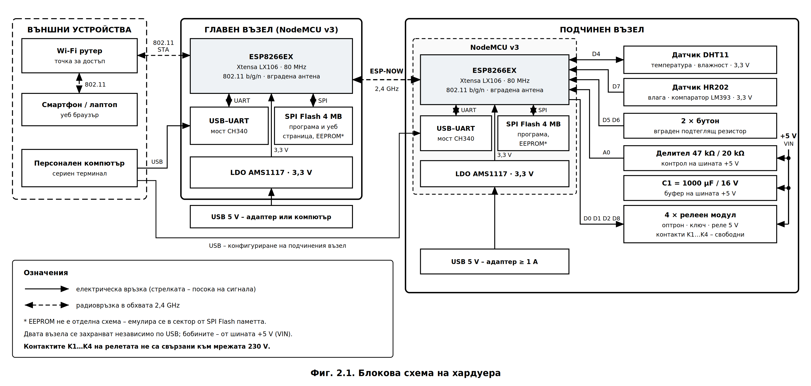{width=15.5cm}

**Главен възел.** Развойната платка NodeMCU v3 съдържа системата в кристал ESP8266EX
(процесорно ядро Xtensa LX106, 80 MHz, радиочестотен тракт по IEEE 802.11 b/g/n [11]),
SPI Flash памет 4 MB за програмата, уеб страницата и емулираната EEPROM, мост USB–UART CH340
за конфигурирането по т. 3.5 [18] и стабилизатор AMS1117 за 3,3 V. Главният възел няма
външна периферия. Той е свързан към домашната точка за достъп в режим на станция (STA) и към
подчинения възел по ESP-NOW.

**Подчинен възел.** Към същия тип платка са свързани четири релейни модула (D0, D1, D2, D8,
захранване от шината +5 V), датчиците DHT11 (D4) и HR202 (D7), захранени от 3,3 V, два бутона
към масата (D5, D6), делителят R1–R2 към аналоговия вход A0 и буферният кондензатор C1 на
шината +5 V. Токовете на бобините на релетата не минават през стабилизатора.

**Изходи на релетата.** В макета контактите на релетата (COM, NO, NC) не са свързани към
мрежата 230 V. Превключването се наблюдава по светодиодите на модулите и по щракването на
релетата. Ако към контактите се свържат товари с мрежово напрежение, границата на
галванично разделяне е между бобината и контактите (изолация 1500 V~ [19]). При
едноканалните модули входната и релейната част обикновено имат обща маса, затова оптронът
не се разглежда като граница на безопасност.

Командите от браузъра стигат до главния възел по IEEE 802.11, а оттам до подчинения – по
ESP-NOW. Отчетите на подчинения възел се връщат по ESP-NOW и браузърът ги получава от
главния възел по HTTP. Параметрите на сигналите между блоковете са обобщени в
**Таблица 2.1**.

**Таблица 2.1. Сигнали между блоковете**

| Сигнал | Между блоковете | Вид и нива | Изисквания |
|---|---|---|---|
| HTTP, JSON | браузър ↔ главен възел | IEEE 802.11 b/g/n, TCP/IP през точката за достъп | асинхронни заявки; отговор до 2 kB |
| ESP-NOW | главен ↔ подчинен възел | кадри на канално (MAC) ниво, 2,4 GHz, общ канал с точката за достъп | полезни данни до 250 B; потвърждение на MAC ниво |
| UART | компютър ↔ възел | 115 200 bit/s, 8N1, през моста USB–UART | текстови команди, завършващи с нов ред |
| IN1…IN4 | D0, D1, D2, D8 → A1…A4 | 0 / 3,3 V, активно високо ниво | около 2,2 mA на канал; ниско ниво при стартиране |
| DATA | D4 ↔ BK1 (DHT11) | еднопроводна линия, отворен дрейн, 3,3 V | четене около 25 ms, не по-често от 1 s |
| DO | A5 (HR202) → D7 | 0 / 3,3 V, отворен колектор; 0 – влага | проверка във всяка итерация; задържане 2 s |
| SB1, SB2 | бутони → D5, D6 | към масата, вграден подтеглящ резистор | трептене до около 10 ms; филтър 60 ms |
| A0 | делител R1–R2 → A0 | 0…1 V на входа на АЦП (0…11 V на шината) | 10 проби; разделителна способност 10,65 mV |
| +5 V, +3,3 V | USB → VIN; AMS1117 → датчиците | 5 V ± 5 % [20]; 3,3 V | до около 0,49 A за подчинения възел |

## 2.3. Избор на елементна база

Избраните елементи са дадени в **Таблица 2.2**.

**Таблица 2.2. Основни елементи на системата**

| Означение | Елемент | Тип / параметри | Функция |
|---|---|---|---|
| DD1, DD2 | Развойна платка | NodeMCU v3 (ESP8266EX, CH340, AMS1117) | подчинен (DD1) и главен (DD2) възел |
| A1…A4 | Релеен модул | 1 канал, 5 V, оптронен вход с избор H/L, реле SRD-05VDC-SL-C | изпълнителни елементи |
| BK1 | Датчик за температура и влажност | DHT11, еднопроводен цифров интерфейс | измервателен канал |
| A5 | Датчик за влага (модул) | HR202 + компаратор LM393, цифров изход DO | защитна блокировка |
| SB1, SB2 | Бутон | тактов, 6 × 6 mm, 4 извода, нормално отворен | местно управление |
| R1 | Резистор | 47 kΩ, 0,25 W | горно рамо на делителя |
| R2 | Резистор | 20 kΩ, 0,25 W | долно рамо на делителя |
| C1 | Кондензатор | електролитен, 1000 µF / 16 V | буфер на шината +5 V |

**Развойна платка NodeMCU v3.** Освен ESP8266EX платката съдържа всичко, което е нужно за
самостоятелна работа – стабилизатор, мост USB–UART, бутони RST и FLASH, вграден делител на
аналоговия вход и изводи със стъпка 2,54 mm за макетна платка [21].

**Релейни модули с оптронен вход.** Използвани са готови модули вместо собствено
транзисторно стъпало. Те имат вграден защитен диод, светлинна индикация, джъмпер за избор на
активното ниво и оптронен вход, който черпи от извода само няколко милиампера. Вътрешната им
схема не е документирана от производителя, затова в т. 2.4 е разгледана типичната схема на
такъв модул.

**DHT11 вместо DS18B20.** Първоначално е разгледан DS18B20 (1-Wire, ±0,5 °C). Избран е
DHT11 [22], защото измерва и относителната влажност, работи при 3,3 V и използва един извод.
Недостатъците му са по-ниската точност и блокиращото четене от около 25 ms (т. 2.6.1).

**Датчик за влага HR202.** HR202 (по каталога на производителя – HR202L) е влагочувствителен
резистор [23], чието съпротивление спада рязко, когато върху него попадне вода. Компараторът
LM393 [24] превръща това изменение в цифров сигнал. Прагът се настройва с потенциометъра на
модула така, че модулът да реагира на намокряне, а не на обичайната влажност в помещението.

**Бутони, R1–R2 и C1.** Тактовите бутони 6 × 6 mm са свързани между извода и масата.
Изводите на бутона са съединени вътрешно по двойки и ако бутонът се постави завъртян на 90°,
той е постоянно „натиснат“. Стойностите на R1, R2 и C1 са избрани в т. 2.6.3 и т. 2.7.

## 2.4. Изпълнителна част – релейни модули

### 2.4.1. Типична схема на модула и избор на активното ниво

Типичната схема на едноканален релеен модул с оптронен вход и избор на активното ниво е
показана на **Фиг. 2.2**.

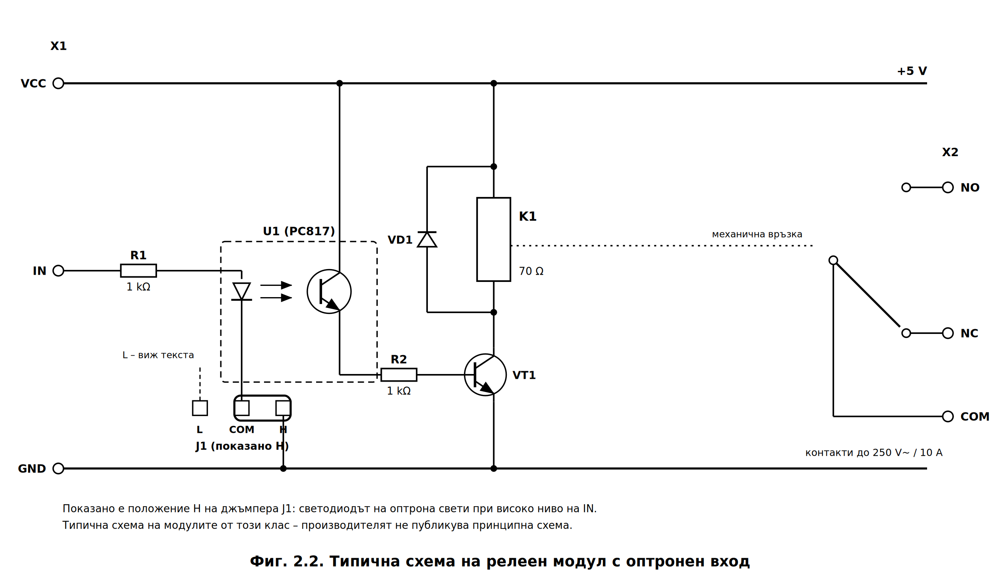{width=15.5cm}

Входният сигнал IN постъпва през резистор (обикновено 1 kΩ) към светодиода на оптрона
(обикновено PC817 [25]). В положение H на джъмпера катодът е свързан към масата и
светодиодът свети при високо ниво на IN, а в положение L анодът е свързан към +5 V и
светодиодът свети при ниско ниво. Фототранзисторът на оптрона отпушва ключовия транзистор,
който включва бобината на релето; паралелно на бобината е свързан защитен диод.

**Приет е режим H (активно високо ниво).** При нулиране и стартиране изводите на ESP8266 са
входове и в режим H релето остава изключено. В режим L входът е свързан към +5 V през
светодиода и към извода на ESP8266 би постъпило напрежение над 3,3 V, а при нулиране релето
би могло да се включи.

### 2.4.2. Съвместимост на входа с 3,3 V логика

Токът на входа при високо ниво се оценява при типичните стойности $R_{\text{вх}} = 1$ kΩ и
$V_F \approx 1{,}15$ V за инфрачервения светодиод на оптрона при малък ток:

$$I_{\text{вх}} = \frac{V_{OH} - V_F}{R_{\text{вх}}} = \frac{3{,}3 - 1{,}15}{1000} \approx 2{,}2\ \text{mA}$$

Това е под една пета от допустимия ток на извода ($I_{\max} = 12$ mA [11]). При четири
включени канала изводите отдават общо около 9 mA.

Коефициентът на предаване по ток на PC817 е поне 50 % [25], следователно фототранзисторът
дава поне 1,1 mA за управление на ключа. За бобина с ток 71,4 mA (т. 2.4.3) ключът трябва да
има коефициент на усилване

$$h_{FE} > \frac{I_K}{I_{C,\text{опт}}} = \frac{71{,}4}{1{,}1} \approx 65$$

Транзисторите в тези модули изпълняват условието при типичните си параметри, но запасът не
е голям. В макета четирите модула се задействат надеждно при 3,3 V.

### 2.4.3. Параметри на релето

Релето SRD-05VDC-SL-C има бобина за 5 V със съпротивление 70 Ω, напрежение на задействане
до 75 % от номиналното и превключващи контакти за 10 A / 250 V~ [19]. Токът на бобината е:

$$I_K = \frac{U_K}{R_K} = \frac{5\ \text{V}}{70\ \Omega} = 71{,}4\ \text{mA}$$

Напрежението на задействане е най-много 3,75 V. Релето се задейства и ако шината +5 V
пропадне с повече от 1 V спрямо действителното напрежение на VIN (около 4,9 V).

**Натоварване на контактите.** В макета контактите не са натоварени. При свързване на товари
стойността 10 A се отнася за активен товар; при индуктивни товари и товари с голям пусков ток
допустимият ток е значително по-малък. Бойлер с мощност 3 kW консумира около 13 A и не може
да се включва пряко – релето би управлявало контактор.

### 2.4.4. Защитен диод

Без защитен елемент самоиндукционното напрежение при изключване на бобината може да
достигне стотици волта и да пробие ключовия транзистор. Диодът затваря тока на бобината след
изключването. При индуктивност от порядъка на 0,15 H (оценка) енергията в магнитното поле и
времеконстантата са:

$$W = \frac{1}{2} L I_K^2 = \frac{1}{2} \times 0{,}15 \times (71{,}4 \cdot 10^{-3})^2 \approx 0{,}38\ \text{mJ}$$

$$\tau_L = \frac{L}{R_K} = \frac{0{,}15}{70} \approx 2{,}1\ \text{ms}$$

Диодът удължава отпускането на релето с няколко милисекунди, което за товари с топлинна
инерция няма значение.

## 2.5. Органи за местно управление – бутони

### 2.5.1. Схема на свързване и контактно трептене

Бутонът SB1 (D5) превключва реле 1, а SB2 (D6) изключва аварийно всички релета. Двата бутона
са свързани между извода и масата (**Фиг. 2.3, а**). Високото ниво при отпуснат бутон се
осигурява от вградения подтеглящ резистор, включен с режима `INPUT_PULLUP` [26]. Изводите
GPIO14 и GPIO12 поддържат прекъсвания, което позволява да се броят фронтовете и да се оцени
трептенето. Трептенето на механичен контакт обикновено продължава няколко милисекунди и
рядко надхвърля 10 ms [27].

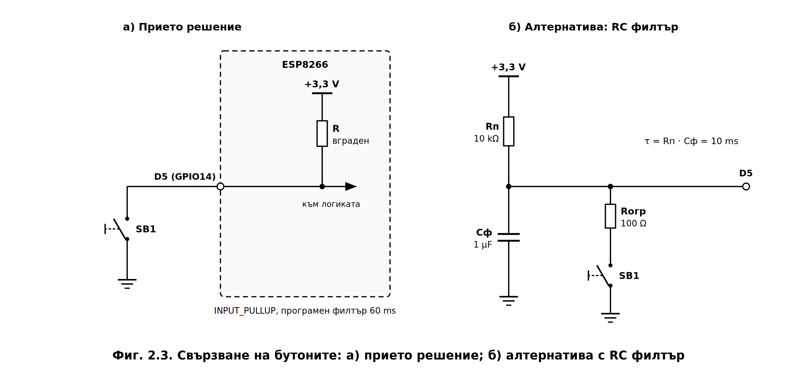{width=13cm}

### 2.5.2. Програмно потискане и сравнение с RC филтър

В реализацията трептенето се потиска програмно. Новото състояние на бутона се приема едва
когато входът е останал непроменен поне 60 ms (алгоритъмът е описан в Глава 3). Интервалът е
шест пъти по-дълъг от 10 ms и остава под 100 ms – границата, под която реакцията на
системата се възприема като мигновена [28].

За сравнение е разгледан хардуерен RC филтър (**Фиг. 2.3, б**) с подтеглящ резистор
$R_п = 10$ kΩ, кондензатор $C_ф = 1$ µF и токоограничаващ резистор $R_{огр} = 100$ Ω.
Времеконстантата при отпускане е:

$$\tau = R_п \cdot C_ф = 10 \cdot 10^{3} \times 1 \cdot 10^{-6} = 10\ \text{ms}$$

Праговите нива на входа на ESP8266 са $V_{IH} = 0{,}75\,V_{DD} = 2{,}475$ V и
$V_{IL} = 0{,}25\,V_{DD} = 0{,}825$ V [11]. Времето за реакция при отпускане и при натискане
е:

$$t_{\text{отп}} = \tau \ln\frac{V_{DD}}{V_{DD} - V_{IH}} = 10 \times \ln 4 = 13{,}9\ \text{ms}$$

$$t_{\text{нат}} = R_{огр} C_ф \ln\frac{V_{DD}}{V_{IL}} = 100\ \mu\text{s} \times \ln 4 = 139\ \mu\text{s}$$

Паразитен импулс с продължителност 5 ms изменя напрежението върху кондензатора с:

$$\Delta u = V_{DD}\left(1 - e^{-t_b/\tau}\right) = 3{,}3 \times \left(1 - e^{-0{,}5}\right) = 1{,}30\ \text{V} < V_{IH}$$

Следователно и филтърът потиска трептенето.

**Таблица 2.3. Сравнение на програмното и хардуерното потискане**

| Критерий | Програмно (прието) | RC филтър |
|---|---|---|
| Допълнителни елементи | няма | 3 на бутон |
| Закъснение при натискане | 60 ms (настройва се) | 139 µs |
| Промяна на параметрите | в програмата | смяна на елементи |
| Натоварване на процесора | проверка във всяка итерация (µs) | няма |
| Устойчивост при дълги проводници и смущения | по-ниска | по-висока |
| Измерване на трептенето чрез броене на фронтовете | възможно | филтърът скрива трептенето |

За бутони близо до платката програмното потискане е достатъчно и позволява параметрите да
се сменят без промяна на схемата. При дълги проводници или силни смущения е по-добре да се
използва RC филтър.

## 2.6. Измервателни канали

### 2.6.1. Датчик за температура и влажност DHT11

Датчикът работи при захранване 3…5,5 V и има точност ±2 °C и ±5 % RH при разделителна
способност 1 °C и 1 % RH [22]. Захранва се с 3,3 V, а линията за данни (отворен дрейн) е
свързана към D4 (GPIO2). Библиотеката включва вградения подтеглящ резистор на извода преди
всяко четене [29], което е достатъчно за проводници до няколко десетки сантиметра. При кабел
до 20 m производителят препоръчва външен резистор 5 kΩ [22].

**Протокол на обмена.** Времедиаграмата на едно четене е показана на **Фиг. 2.4**.

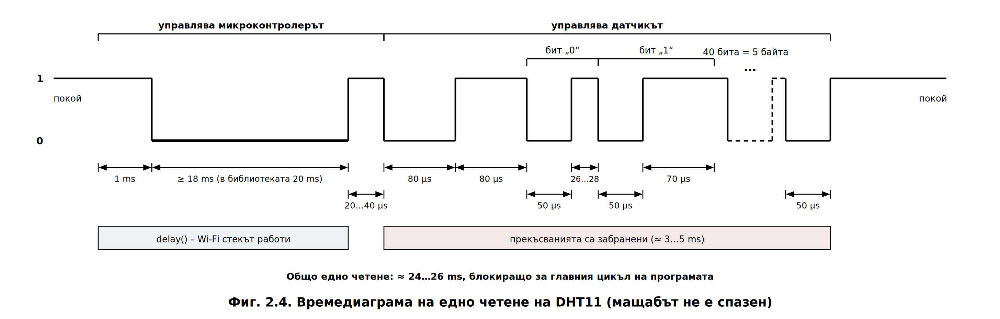{width=13cm}

Микроконтролерът задържа линията в ниско ниво поне 18 ms (библиотеката използва 20 ms,
предшествани от 1 ms във високо ниво). Датчикът отговаря с 80 µs ниско и 80 µs високо ниво и
предава 40 бита – влажност, температура и контролна сума. Всеки бит започва с 50 µs ниско
ниво, последвано от 26…28 µs („0“) или 70 µs („1“) високо ниво.

Продължителността на едно четене е:

$$t_{\text{четене}} \approx 1 + 20 + 0{,}16 + (3{,}0 \ldots 4{,}8) \approx 24{,}2 \ldots 26{,}0\ \text{ms}$$

Библиотеката приема 40-те бита при забранени прекъсвания (3…5 ms), а стартовия импулс
формира с `delay()` [29]. Wi-Fi стекът продължава да работи, но за главния цикъл цялото
четене от около 25 ms е блокиращо и определя най-голямото време за цикъл. Линията на DHT11 в
покой е във високо ниво, както изисква GPIO2 при стартиране (т. 2.8).

### 2.6.2. Датчик за влага HR202 (модул с компаратор LM393)

Типичната схема на модула е показана на **Фиг. 2.5**.

HR202 (съпротивление около 31 kΩ при 60 % RH и 25 °C [23]) и постоянен резистор образуват
делител, чието напрежение LM393 сравнява с праговото напрежение от потенциометъра. Изходът
на LM393 е с отворен колектор [24] и е изтеглен с 10 kΩ към захранването на модула. Модулът
е захранен от 3,3 V, затова изходът DO се изменя между 0 и 3,3 V и се свързва към GPIO13 (D7)
без преобразуване на нивото. При захранване 5 V високото ниво би било над допустимото за
ESP8266.

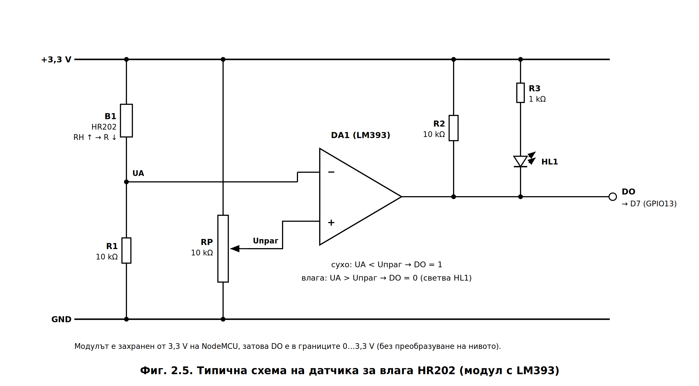{width=13cm}

**Поведение в макета.** При сух датчик DO е във високо ниво, а при намокряне преминава в
ниско. Програмата веднага изключва всички релета и блокира включването им. Блокировката се
сваля едва след 2 s непрекъснато сухо състояние. Компараторът няма хистерезис и близо до
прага изходът му може да трепти – задържането във времето изпълнява ролята на хистерезис.

**Ограничения.** Производителят предписва захранване с променливо напрежение до 1,5 V с
честота 500 Hz…2 kHz [23], за да не се поляризира чувствителният слой. Модулът използва
постоянно напрежение. Това е приемливо, когато трябва само да се открие намокряне, но не и
за точно измерване на влажността. Затова влажността се измерва с DHT11, а HR202 се използва
като прагов датчик за защитната блокировка.

**Поведение при неизправност.** Изводът D7 използва вградения подтеглящ резистор. При
прекъснат проводник входът се чете като „сухо“ и защитата не се задейства. Недостатъкът
може да се отстрани с обърнато активно ниво, при което прекъсването води до блокировка –
това е една от насоките за развитие.

### 2.6.3. Контрол на захранващото напрежение (A0)

Схемата на канала е показана на **Фиг. 2.6**.

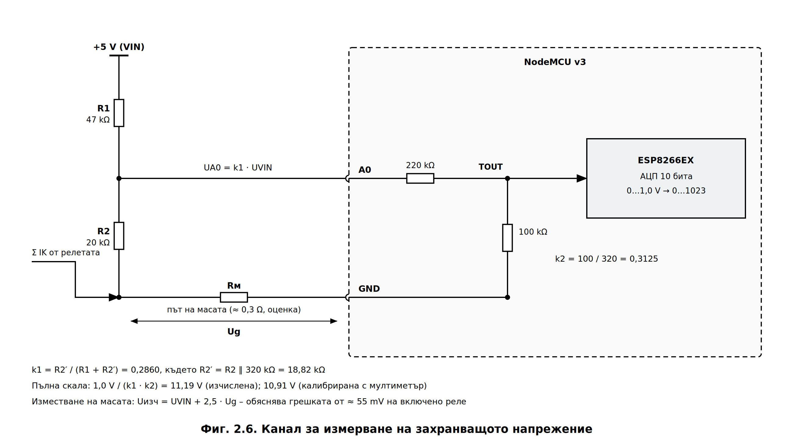{width=15.5cm}

Аналогово-цифровият преобразувател (АЦП) на ESP8266 е 10-битов и измерва напрежения
0…1,0 V на извода TOUT [11]. Платката NodeMCU съдържа вграден делител 220 kΩ / 100 kΩ, с
който обхватът на извода A0 става 0…3,2 V [21]. Външният делител R1 = 47 kΩ,
R2 = 20 kΩ разширява обхвата така, че да може да се измерва шината +5 V.

**Изчисляване на делителя.** Входното съпротивление на вградения делител,
$R_{\text{вх}} = 220 + 100 = 320$ kΩ, е свързано успоредно на R2 и не може да се пренебрегне:

$$R_2' = \frac{R_2 \cdot R_{\text{вх}}}{R_2 + R_{\text{вх}}} = \frac{20 \times 320}{20 + 320} = 18{,}82\ \text{k}\Omega$$

$$k_1 = \frac{R_2'}{R_1 + R_2'} = \frac{18{,}82}{47 + 18{,}82} = 0{,}2860, \qquad k_2 = \frac{100}{320} = 0{,}3125$$

Пълната скала на измерваното напрежение е:

$$U_{\text{VIN,max}} = \frac{U_{\text{АЦП,max}}}{k_1 k_2} = \frac{1{,}0}{0{,}2860 \times 0{,}3125} = 11{,}19\ \text{V}$$

Ако вграденият делител се пренебрегне, се получава $3{,}2 \times (47 + 20)/20 = 10{,}72$ V –
грешка от 4,2 %.

**Калибровка.** В програмата е използвана пълна скала 10,91 V, определена чрез сравнение с
мултиметър. Тя е с 2,5 % по-малка от изчислената заради допуските на опорното напрежение и
на резисторите (т. 2.11). Разделителната способност е 10,91 V / 1024 = 10,65 mV, а
осредняването на 10 проби намалява случайния шум около 3,2 пъти. При $U_{\text{VIN}} = 5$ V
отчетът е около 469, а токът през делителя (76 µA) е пренебрежим.

**Корекция при включени релета.** При калибровката се оказва, че с всяко включено реле
изчисленото напрежение надвишава показанието на мултиметъра с около 55 mV. В програмата е
въведена съответна корекция. Вероятната причина е изместването на масата: в макета долният
край на R2 е свързан към шината GND на макетната платка, по която тече и токът на бобините.
Ако този край е с $U_g$ над масата на ESP8266, изчисленото напрежение е:

$$U_{\text{изч}} = U_{\text{VIN}} + \frac{1 - k_1}{k_1}\,U_g = U_{\text{VIN}} + 2{,}5\,U_g$$

Грешката от 55 mV на реле отговаря на $U_g \approx 22$ mV на реле, т. е. на съпротивление на
общия път на масата около 0,29 Ω при ток около 75 mA на модул. Такова съпротивление е
възможно при контактите на макетна платка. Предположението може да се провери с измерване
на $U_g$ между долния край на R2 и извода GND на NodeMCU. Решението е долният край на R2 да
се свърже с отделен проводник пряко към извода GND на NodeMCU, както е показано на
принципната схема (Фиг. 2.7). Тогава корекцията в програмата трябва да се нулира.

## 2.7. Захранване и енергиен баланс

Двата възела се захранват по USB с 5 V. Главният възел няма периферия и консумира до
около 180 mA. Подчиненият възел захранва и релейните модули, затова по-важен е неговият
баланс.

**Таблица 2.4. Енергиен баланс на подчинения възел (най-неблагоприятен случай)**

| Консуматор | Ток, mA | Източник на данните |
|---|---|---|
| ESP8266EX – предаване по 802.11b (връх) | 170 | каталог [11] |
| Мост CH340 и светодиоди на платката | ≈ 10 | оценка |
| 4 × бобина на реле (4 × 71,4 mA) | 285,6 | каталог [19] |
| 4 × входна верига и светодиоди на модулите | ≈ 20 | оценка |
| DHT11 при измерване | 2,5 | каталог [22] |
| Датчик за влага HR202 (модул с LM393) | ≈ 5 | оценка |
| Делител R1–R2 | 0,08 | изчисление |
| **Общо** | **≈ 493** | |

При четири включени релета и предаване по радиоканала токът достига около 0,49 A. Порт
USB 2.0 на персонален компютър гарантира 500 mA [20], т. е. запас практически няма. Затова
подчиненият възел се захранва от адаптер 5 V с ток поне 1 A, който дава двукратен запас.
Средната консумация е по-малка, защото ESP8266 предава само част от времето – при приемане
консумира около 56 mA [11].

Токът на бобините минава от USB конектора през извода VIN до модулите и не преминава през
стабилизатора. Разсейваната мощност в AMS1117 [30] при ток на логическата част 180 mA и
напрежение на VIN около 4,9 V е:

$$P_{\text{стаб}} = (U_{\text{VIN}} - 3{,}3) \cdot I = (4{,}9 - 3{,}3) \times 0{,}18 \approx 0{,}29\ \text{W}$$

Стойността е допустима за корпус SOT-223 с медна площ на печатната платка.

**Буферен кондензатор C1 = 1000 µF / 16 V.** Свързан е между шината +5 V и масата пред
релейните модули и поема бързите изменения на тока при предаване по радиоканала и при
превключване на релетата. Импулс от 100 mA с продължителност 1 ms понижава напрежението му с:

$$\Delta U = \frac{I \cdot \Delta t}{C} = \frac{0{,}1 \times 1 \cdot 10^{-3}}{1000 \cdot 10^{-6}} = 0{,}1\ \text{V}$$

Заедно със съпротивлението на захранващия път (около 0,5 Ω) кондензаторът образува
нискочестотен филтър с времеконстанта около 0,5 ms. Номиналното напрежение 16 V дава
3,2-кратен запас. Спецификацията USB 2.0 допуска до 10 µF капацитет при включване [20],
затова при захранване от порт на компютър е възможно кратко пропадане на напрежението. При
захранване от адаптер това няма значение.

## 2.8. Разпределение на изводите

Част от изводите на ESP8266 имат специални функции при стартиране (*boot straps*): GPIO0 и
GPIO2 трябва да са във високо ниво, а GPIO15 – в ниско. GPIO1 и GPIO3 са на серийния
интерфейс, а GPIO6…GPIO11 са заети от SPI Flash паметта. Ако тези условия не са изпълнени,
програмата не може да се зареди [31]. Приетото разпределение е дадено в **Таблица 2.5**.

**Таблица 2.5. Разпределение на изводите на подчинения възел**

| Функция | Извод | GPIO | Обосновка |
|---|---|---|---|
| Реле 1 | D0 | GPIO16 | изход; не се нуждае от прекъсване |
| Реле 2 | D1 | GPIO5 | без ограничения при стартиране |
| Реле 3 | D2 | GPIO4 | без ограничения при стартиране |
| Реле 4 | D8 | GPIO15 | ниско ниво при стартиране съвпада с изключено реле |
| DHT11 | D4 | GPIO2 | линията в покой е във високо ниво – съвместимо със стартирането |
| Бутон SB1 | D5 | GPIO14 | без ограничения; прекъсване по фронт |
| Бутон SB2 | D6 | GPIO12 | без ограничения; прекъсване по фронт |
| HR202 (DO) | D7 | GPIO13 | без ограничения |
| Напрежение +5 V | A0 | TOUT | единственият аналогов вход |
| Конфигуриране | TX / RX | GPIO1 / GPIO3 | оставени свободни (т. 3.5 от заданието) |
| Свободен | D3 | GPIO0 | бутон FLASH на платката |

**Реле 4 е преместено от GPIO0 (D3) на GPIO15 (D8).** В първата версия реле 4 беше на GPIO0,
който при стартиране трябва да е във високо ниво, а входът на модула в режим H е товар към
маса. С използвания модул нивото остава над прага за „1“, но това не е гарантирано – с друг
модул платката би стартирала в режим на програмиране, а натискането на бутона FLASH при
включено реле свързва изхода накъсо към маса. GPIO15 изисква ниско ниво при стартиране.
Това съвпада с изключеното състояние на релето, ако джъмперът е в положение H; в положение L
платката не стартира.

Реле 1 е на GPIO16, който не поддържа прекъсвания и затова не е използван за бутон. При някои
платки той е за кратко във високо ниво при включване, което може да предизвика кратко
щракване на релето. Бутоните са на GPIO14 и GPIO12, които поддържат прекъсвания. Фабричните
настройки се възстановяват със задържане на SB1 за 3 s при подаване на захранване. На
главния възел се използват само USB и серийният интерфейс.

## 2.9. Принципна схема на подчинения възел

Обобщената принципна схема на подчинения възел е представена на **Фиг. 2.7**. Тя реализира
т. 4.3 от обяснителната записка и т. 5.2 от графичната част на заданието.

Шината +5 V (VIN) захранва релейните модули A1…A4 и горния край на делителя R1–R2, а между
нея и масата е буферният кондензатор C1. Шината +3,3 V от стабилизатора на платката захранва
двата датчика – DHT11 и HR202. На принципната схема долният край на R2 е свързан с отделен
проводник към масата на DD1, за да не влияе на измерването падът на напрежение от тока на
бобините по общата шина GND (т. 2.6.3). В макета R2 все още е свързан към шината GND на
макетната платка и затова програмата прилага корекцията от 55 mV на включено реле. Връзките
са означени с имената на веригите, а не с начертани проводници, за да няма пресичания на
линиите. Вътрешните схеми на модулите са дадени на Фиг. 2.2 и Фиг. 2.5, а схемата на модула
A5 с чувствителния елемент B1 (HR202) е показана и на лист 2 от графичната част.

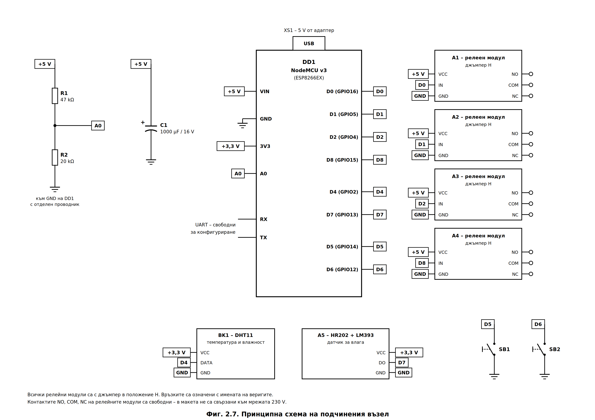{width=15.5cm}

## 2.10. Конструктивна реализация на макета

Макетът на подчинения възел е изграден върху макетна платка без запояване с гъвкави
съединителни проводници (**Фиг. 2.8**). Релейните модули и двата датчика – DHT11 и HR202 –
са свързани с проводници с накрайници. Главният възел е отделна платка NodeMCU, захранена
по USB.

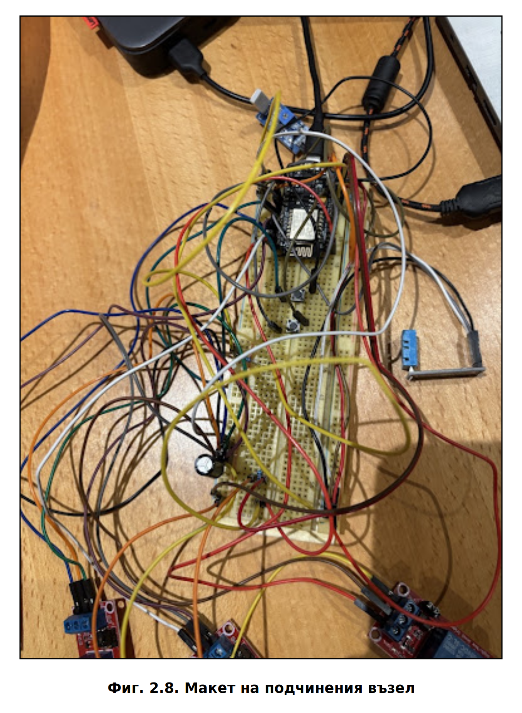{width=7.5cm}

Макетната платка позволява бързи промени, например преместването на реле 4 от D3 на D8. От
друга страна, преходното съпротивление на контактите ѝ се натрупва по пътя на тока
(вероятната причина за грешката от т. 2.6.3), а механичната ѝ надеждност е ниска. Макетът
работи изцяло с ниско напрежение (5 V от USB адаптерите) – контактите на релетата не са
свързани към мрежата 230 V. За окончателно изделие, в което релетата комутират реални
товари, са нужни печатна платка с отделен път на масата за релейната част, предпазител и
схема за плавно включване, контактори за товари над 10 A и кутия, отговаряща на
изискванията за електрическа безопасност.

## 2.11. Анализ на точността

Измерваните величини и оценката на грешките им са обобщени в **Таблица 2.6**.

**Канал за захранващото напрежение.** Коефициентът $k_1$ на делителя зависи от R1 и R2 с
чувствителност

$$\frac{\Delta k_1}{k_1} = \frac{R_1}{R_1 + R_2'}\left(\frac{\Delta R_2'}{R_2'} - \frac{\Delta R_1}{R_1}\right), \qquad \frac{\Delta R_2'}{R_2'} = \frac{R_{\text{вх}}}{R_2 + R_{\text{вх}}} \cdot \frac{\Delta R_2}{R_2}$$

С $R_1/(R_1 + R_2') = 0{,}714$ и $R_{\text{вх}}/(R_2 + R_{\text{вх}}) = 0{,}941$ най-голямата
грешка на мащаба е 1,4 % при резистори с допуск ±1 % и 6,9 % при ±5 %. Към нея се добавя
допускът на опорното напрежение на АЦП. Разликата от 2,5 % между изчислената и
калибрираната пълна скала (т. 2.6.3) е в тези граници. Калибровката с мултиметър отстранява
систематичната грешка на мащаба, а корекцията за включените релета – изместването на масата.
Остават грешката от квантуването ±½ LSB = ±5,3 mV, грешката на мултиметъра, използван при
калибровката, и температурният дрейф на елементите.

Каналът служи за откриване на пропадания на захранването – под долната граница 4,75 V за
USB [20] и под напрежението на задействане на релетата 3,75 V. Разделителната способност
10,65 mV е над 20 пъти по-малка от най-малкото от тези отклонения (0,25 V), така че
точността е достатъчна.

**Температура и влажност.** Точността се определя от DHT11 – ±2 °C и ±5 % RH [22].
Стойностите се предават с два знака след десетичната запетая, но това не повишава
точността. За оценка на микроклимата в помещението тя е достатъчна.

**Датчик за влага.** HR202 работи като прагов датчик, затова точността му по влажност няма
значение. Прагът се задава с потенциометъра на модула. Времето за реакция на програмата при
намокряне без трептене на изхода е най-много 25,5 ms (т. 4.6). Това е много по-малко от
времето, за което водата достига до датчика.

**Времена.** Времето за цикъл и закъснението на обмена се измерват с функцията `micros()`
с разделителна способност 1 µs. Моментът на приемане се регистрира в обратна функция, която
се изпълнява между итерациите на главния цикъл. Затова грешката при измерването на
закъснението е не по-голяма от продължителността на една итерация.

**Таблица 2.6. Оценка на точността на измерванията**

| Величина | Разделителна способност | Основни източници на грешка | Грешка след калибровка |
|---|---|---|---|
| Напрежение на шината +5 V | 10,65 mV | допуски на R1, R2 и на опорното напрежение; изместване на масата | ±5,3 mV от квантуването и грешката на мултиметъра |
| Температура | 1 °C | датчик DHT11 | ±2 °C [22] |
| Относителна влажност | 1 % RH | датчик DHT11 | ±5 % RH [22] |
| Влага (HR202) | сухо / мокро | праг на компаратора | реакция на програмата до 25,5 ms (без трептене) |
| Време за цикъл, закъснение | 1 µs | момент на изпълнение на обратната функция | до една итерация на главния цикъл |

## 2.12. Икономически показатели

Себестойността на макета е оценена по ориентировъчни цени на дребно към септември 2026 г.
(**Таблица 2.7**). Цените на развойната платка и на релейния модул са взети от онлайн
магазини за електронни компоненти [32, 33] и са закръглени нагоре. Останалите цени са
типични цени на дребно.

**Таблица 2.7. Себестойност на макета (ориентировъчни цени, септември 2026 г.)**

| Елемент | Брой | Цена, € | Сума, € |
|---|---|---|---|
| Развойна платка NodeMCU v3 | 2 | 4,00 | 8,00 |
| Релеен модул, 1 канал, 5 V, оптронен вход | 4 | 2,80 | 11,20 |
| Датчик за температура и влажност DHT11 (модул) | 1 | 2,50 | 2,50 |
| Датчик за влага HR202 с компаратор LM393 (модул) | 1 | 2,50 | 2,50 |
| Бутони, резистори, кондензатор 1000 µF | – | – | 1,00 |
| Макетна платка и съединителни проводници | – | – | 5,00 |
| USB адаптер 5 V / 1 A с кабел | 2 | 5,00 | 10,00 |
| **Общо** | | | **40,20** |

Електронната част без захранващите адаптери и монтажните материали струва около 25 €. При
серийно производство модулите биха се заменили с обща печатна платка и себестойността би
намаляла.

**Разходи за експлоатация.** Всеки възел консумира около 0,35 W без включени релета – около
56 mA при приемане по радиоканала [11] и около 10 mA за моста USB–UART и светодиодите. Всяко
включено реле добавя 0,36 W. При средно две включени релета и к.п.д. на адаптерите около
75 % (прието) адаптерите консумират от мрежата около 1,9 W, т. е. около 17 kWh годишно. При
цена 0,15 €/kWh (прието) това са около 2,5 € годишно, което е пренебрежимо спрямо енергията
на товарите, за чието управление е предназначена системата.

## 2.13. Изводи по Глава 2

1. Разработени са блоковата схема на хардуера (Фиг. 2.1) с параметрите на сигналите между
   блоковете (Таблица 2.1) и принципната схема на подчинения възел (Фиг. 2.7).
2. Релейните модули работят в режим H с входен ток около 2,2 mA, но запасът на ключа им при
   3,3 V е малък. В макета контактите на релетата не са свързани към мрежата 230 V; за товари
   над 10 A е необходим контактор.
3. Датчиците DHT11 и HR202 се захранват от 3,3 V и се свързват без преобразуване на нивата.
   Четенето на DHT11 (около 25 ms) блокира главния цикъл.
4. Делителят дава разделителна способност 10,65 mV. Грешката от 55 mV на включено реле
   най-вероятно се дължи на изместване на масата и би трябвало да изчезне, ако R2 се свърже
   с отделен проводник към GND.
5. Енергийният баланс (около 0,49 A) налага адаптер 5 V / 1 A, а реле 4 е преместено от
   GPIO0 на GPIO15. Себестойността на макета е около 40 €, а разходът за енергия – около
   2,5 € годишно.


```{=openxml}
<w:p><w:r><w:br w:type="page"/></w:r></w:p>
```


# ГЛАВА ТРЕТА
# СОФТУЕРНО ПРОЕКТИРАНЕ

## 3.1. Организация на програмното осигуряване

Програмното осигуряване реализира т. 4.4 от заданието – алгоритъма на управляващата
програма – и т. 3.5 – конфигурирането по UART. Освен управлението на релетата, телеметрията
и защитата при влага (датчик HR202) програмите измерват и показателите, които се изследват в
Глава 4: време за цикъл, закъснение и загуби на пакети, трептене на бутоните.

Програмата на всеки възел е един файл на C++ – около 1560 реда за главния (`Master.ino`) и
около 1080 реда за подчинения възел (`Slave.ino`). Описана е версия 3 на програмите, а
разликите спрямо версия 2 са посочени там, където са съществени. Използвано е ядрото Arduino
за ESP8266, версия 3.1.2 [26], изградено върху Non-OS SDK [34], с библиотеките
`ESP8266WiFi`, `espnow` [12], `EEPROM`, `ESP8266WebServer`, `ESP8266mDNS`, `ArduinoOTA` и
`DHT sensor library` 1.4.6 [29].

### 3.1.1. Модел на изпълнение

ESP8266 не изпълнява операционна система с приоритетни задачи. Ядрото извиква еднократно
`setup()`, а след това – многократно `loop()`. След всяко завършване на `loop()`, както и при
`delay()` и `yield()`, управлението се предава на SDK, който обслужва радиостека и TCP/IP.
Затова участъци от програмата с продължителност над 50 ms трябва да се избягват [26].

Използвана е кооперативна многозадачност. Всяка подсистема е функция, която се извиква във
всяка итерация на `loop()`, проверява дали има работа и връща управлението, без да чака.
Изчакването се реализира чрез сравнение на `millis()` или `micros()` със запомнен момент.
Разликата се изчислява с беззнакова аритметика и остава вярна и при препълването на брояча
(за `micros()` – на всеки $2^{32}$ µs ≈ 71,6 min).

Освен главния цикъл има още два контекста на изпълнение (**Фиг. 3.1**):

- обратните функции на ESP-NOW, които се извикват от системния контекст на SDK между две
  итерации на `loop()` или по време на `delay()`. В тях не се допускат изчакване,
  продължителна работа и извеждане по UART [12, 26];
- обработчиците на прекъсвания от бутоните, които се изпълняват веднага при фронта и трябва
  да са в оперативната памет за инструкции (атрибут `IRAM_ATTR`) [26].

Обменът между контекстите следва едно правило: обратната функция и обработчикът на
прекъсване само записват данни и вдигат флаг, а действието се изпълнява в главния цикъл.
Споделените променливи са обявени като `volatile`. Така изходите и серийният порт не се
достъпват едновременно от два контекста.

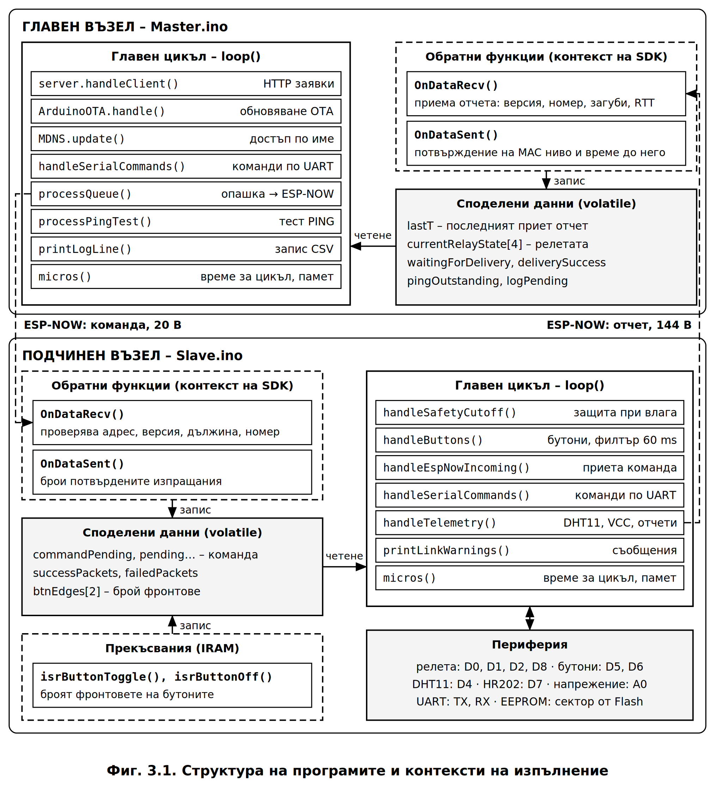{width=15.5cm}

### 3.1.2. Изисквания към времето за цикъл

Горната граница на продължителността на една итерация се определя от три условия. Първото
е работата на радиостека (под 50 ms [26]). Второто е филтърът на бутоните, който приема ново
състояние след 60 ms без промяна (т. 2.5.2) и затова трябва да проверява входа многократно
в този интервал. Третото е възприемането от потребителя – реакция до 100 ms изглежда
мигновена [28].

Единствената блокираща операция, оставена в програмата, е четенето на DHT11 – около 25 ms
на всеки 2 s (т. 2.6.1). Ако натискането на бутон съвпадне с него, промяната се отчита с до
25 ms закъснение, след което тече интервалът на филтъра:

$$t_{\text{реакция,max}} \approx t_{\text{DHT}} + t_{\text{филтър}} = 25 + 60 = 85\ \text{ms} < 100\ \text{ms}$$

Промените спрямо версия 2 са обобщени в **Таблица 3.1**.

**Таблица 3.1. Операции с продължително изпълнение в подчинения възел**

| Операция | Версия 2 | Версия 3 |
|---|---|---|
| Четене на DHT11 | ≈ 25 ms на всеки 2 s | ≈ 25 ms на всеки 2 s |
| Измерване на напрежението (10 проби) | блокиращо, 10 × `delay(2)` ≈ 20 ms | неблокиращо, по една проба на итерация |
| Най-дълга итерация (оценка) | ≈ 45 ms | ≈ 25 ms |
| Отчитане на времето за цикъл | `millis()`, разделителна способност 1 ms | `micros()`, разделителна способност 1 µs |

## 3.2. Конфигуриране и енергонезависима памет

### 3.2.1. Структура на конфигурацията

ESP8266 няма вградена EEPROM памет. Библиотеката `EEPROM` зарежда в оперативната памет
отделен сектор от Flash паметта, а `commit()` го изтрива и записва наново [26].
Конфигурацията е структура от 244 B в главния и 24 B в подчинения възел. Параметрите ѝ –
мрежа, адрес на другия възел, канал, интервал на телеметрията, корекция на напрежението,
пароли и праг за авария – са дадени в Таблица Б.1 (Приложение Б).

Целостта на записа се проверява по три признака. Сигнатурата („HMC1“ или „HMS1“) открива
неинициализирана памет, версията на формата – запис от друга версия на програмата, а
контролната сума CRC-32 на останалите байтове – повреда при прекъсване на захранването по
време на запис. Запис от версия 2 с вярна сигнатура и контролна сума се прехвърля
автоматично. Разположението на полетата е същото, затова се сменя само номерът на версията,
а корекцията на напрежението се нулира, тъй като във версия 2 тя не се прилагаше. Във
всички останали случаи се зареждат фабричните настройки. Във Flash паметта се записва само
по команда, а не периодично, така че ограниченият брой цикли на изтриване не е проблем.

### 3.2.2. Команден интерфейс по UART

Серийният интерфейс работи със 115 200 bit/s, формат 8N1. Всяка команда е ред текст – `SET
<ключ> <стойност>` за параметрите, `SAVE`, `FACTORY`, `PUSH`, команди за релетата и за
измерванията (Таблица Б.2 в Приложение Б). Алгоритъмът на обработката е даден на **Фиг. 3.2**.

Разборът на командите `SET` е даден в Листинг Б.1 (Приложение Б). Ключовите думи се
сравняват в главни букви, а стойността запазва регистъра си, защото SSID и паролите
различават малки и главни букви. Стойностите се проверяват преди присвояването (обхват,
формат на MAC адреса), а текстовете се копират с `strncpy` до размера на полето. Паролите
не се извеждат нито в ехото на командата, нито в уеб интерфейса. Приемането не блокира
цикъла: изчакването на непълен ред е ограничено до 50 ms, затова терминалът трябва да
изпраща целия ред наведнъж.

Промените се правят в оперативната памет и се запазват със `SAVE`. Ако главният възел не се
свърже с мрежата за 20 s, той обслужва само UART още 120 s и се рестартира. Така погрешно
въведени SSID или парола могат да се поправят без повторно програмиране. Фабричните
настройки на подчинения възел се възстановяват и без компютър – със задържане на бутона SB1
за 3 s при подаване на захранването (т. 2.8).

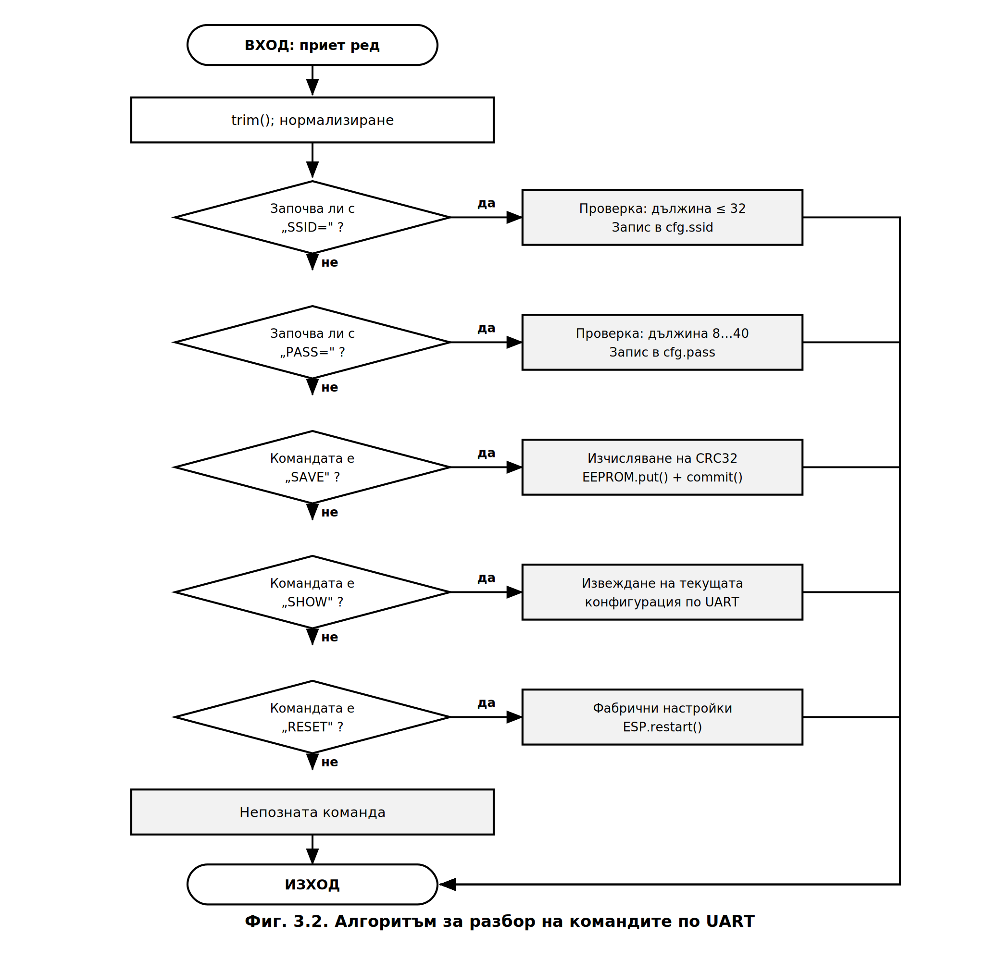{width=15.5cm}

## 3.3. Комуникационен протокол по ESP-NOW

### 3.3.1. Съобщения

ESP-NOW пренася до 250 B полезни данни в кадър за управление по IEEE 802.11 от вида
„действие, специфично за производителя“. Освен данните кадърът съдържа MAC заглавие,
идентификатори и контролна сума – общо 43 B [10, 12].

Обменът използва две структури, еднакви в двата възела: отчет от 144 B от подчинения
към главния възел (съставът му е даден в Таблица Б.3 в Приложение Б) и команда от 20 B
в обратна посока (**Таблица 3.2**). Структурите се предават като блок байтове без
преобразуване. Това е допустимо, защото двата възела са с еднакъв процесор и компилатор.
Ограничението от 250 B се проверява при компилиране със `static_assert`.

**Таблица 3.2. Видове команди на главния възел**

| Код | Команда | Действие в подчинения възел |
|---|---|---|
| 0 | `CMD_RELAY` | включва или изключва реле; включването се отказва при блокировка |
| 1 | `CMD_RESTART` | рестарт |
| 2 | `CMD_CONFIG` | запис на интервала, корекцията и канала; при нов канал – рестарт |
| 3 | `CMD_PING` | само отговор – за измерване на закъснението |
| 4 | `CMD_RESET_STATS` | нулира броячите на измерванията |

Всяка команда съдържа версията на протокола и пореден номер `seq`. Отчетите са три вида:
периодичен – на всеки интервал на телеметрията (2 s); отговор на команда – веднага след
изпълнението ѝ; събитие – след натискане на бутон, промяна на датчика за влага HR202 или
команда по UART, най-често веднъж на 50 ms.

**Време за предаване.** Горна оценка се получава при най-ниската скорост на IEEE 802.11b –
1 Mbit/s с дълга преамбюла от 192 µs [10]:

$$t_{\text{кадър}} = t_{\text{PLCP}} + \frac{8\,(L + 43)}{R} = 192\ \mu\text{s} + \frac{8 \times (144 + 43)\ \text{bit}}{1\ \text{Mbit/s}} = 1{,}69\ \text{ms}$$

За командата ($L$ = 20 B) времето е 0,70 ms. С кадъра за потвърждение (0,30 ms) един отчет
заема канала за около 2 ms, а една команда – за около 1 ms. При интервал 2 s периодичните
отчети заемат около 0,1 % от времето на канала, така че натоварването на домашната мрежа е
пренебрежимо.

### 3.3.2. Надеждност на обмена

**Две нива на потвърждение.** Обратната функция `OnDataSent` съобщава дали приемникът е
потвърдил кадъра на MAC ниво. Това показва, че кадърът е приет от радиоинтерфейса, но не и
че е обработен от програмата [12]. Затова след всяка изпълнена команда подчиненият възел
изпраща отчет „отговор на команда“ с номера ѝ (`ackSeq`) и с действителното състояние на
релетата, прочетено обратно от изходите. Главният възел приема състоянието на релетата само
от отчетите, т. е. меродавно е състоянието, прочетено в подчинения възел.

**Проверка на приетите команди.** Подчиненият възел проверява адреса на подателя, версията
на протокола, дължината и поредния номер (Листинг Б.2 в Приложение Б). Отхвърлените
команди се броят и броят им се предава в отчетите.

**Идемпотентни команди.** `CMD_RELAY` съдържа желаното състояние, а не указание
„превключи“. Повторното изпълнение дава същия резултат и две бързи натискания в браузъра
преди пристигането на отчета не превключват релето обратно.

**Случаен начален пореден номер.** Главният възел номерира командите от случайно 32-битово
число (`ESP.random()`). Във версия 2 номерирането започваше от стойност, запазена в
конфигурацията, и след рестарт на главния възел първата команда можеше да бъде отхвърлена
като повторна. Във версия 3 вероятността за такова съвпадение е пренебрежимо малка
(около $2^{-32}$).

**Отчитане на загубите.** Отчетите се номерират последователно след всеки рестарт на
подчинения възел. Пропуск от $k$ номера увеличава брояча на загубените пакети с $k$, а
по-малък номер или по-малко време на работа означава рестарт. Ако отчет липсва по-дълго от
прага за авария (10 s), уеб страницата показва предупреждение.

### 3.3.3. Неблокираща опашка от команди

Командите на главния възел – от уеб интерфейса, UART, теста на закъснението и командите
`PUSH` и `RESET STATS` – се поставят в кръгова опашка с 12 места. Изпращането се управлява
от крайния автомат на **Фиг. 3.3**, който заменя блокиращото изчакване на потвърждението.

Командата не се повтаря на приложно ниво. Повторните предавания на MAC ниво се извършват от
радиоинтерфейса, а неуспехът се съобщава на потребителя. Изчакването от 500 ms предпазва
автомата от блокиране, ако обратната функция не бъде извикана. Паузата от 250 ms между
командите включва релетата едно след друго: токът по шината +5 V нараства на стъпки от
71,4 mA вместо 286 mA наведнъж (т. 2.7), а при свързани товари във времето се разпределят и
пусковите им токове. Командата „включи всички“ се изпълнява за около 0,76 s.

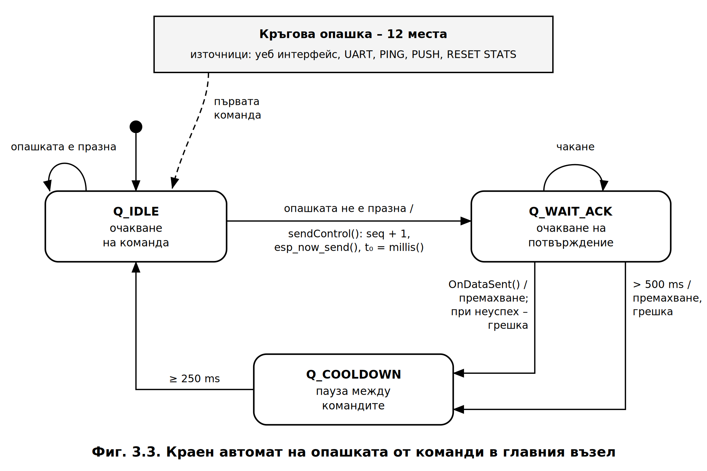{width=15.5cm}

### 3.3.4. Последователност на обмена

Пътят на една команда от браузъра до релето и обратно е показан на **Фиг. 3.4**.

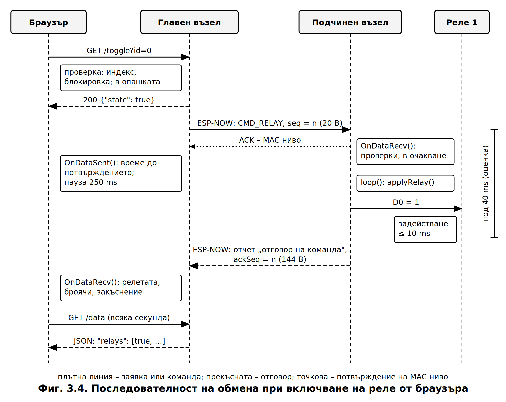{width=15.5cm}

Главният възел поставя командата в опашката и веднага отговаря на браузъра. Подчиненият
възел я изпълнява в следващата си итерация и в същата итерация изпраща отчета.
Закъснението до задействането на релето е сума от предаването на командата (около 1 ms),
изчакването на итерацията (до 25 ms при четене на DHT11) и времето за задействане на релето
(до 10 ms [19]) – общо под 40 ms. Двупосочното закъснение „команда – отчет“ е изследвано в
Глава 4.

### 3.3.5. Синхронизация на работния канал

ESP8266 има един радиочестотен тракт, затова интерфейсът за станция и ESP-NOW работят на
общ канал (т. 1.1.6). Каналът на главния възел се определя от рутера, а подчиненият възел не
е свързан към мрежата. Затова подчиненият възел стартира скрита точка за достъп, чиято
единствена задача е да фиксира канала от конфигурацията:

```cpp
WiFi.mode(WIFI_AP_STA);
WiFi.softAP("Hidden_Slave", "", cfg.wifiChannel, 1);   // 1 - скрито име на мрежата
```

При стартиране главният възел сравнява канала на рутера с конфигурирания и при разлика
извежда предупреждение. Каналът на подчинения възел се сменя по UART или с `CMD_CONFIG`.
Втората възможност работи само докато двата възела са на общ канал, т. е. при планирана
смяна: първо се изпраща новият канал и след това се сменя каналът на рутера. Рутерът трябва
да работи на фиксиран канал. Автоматичното търсене на канала е оставено за бъдещо развитие.

## 3.4. Уеб сървър и потребителски интерфейс

### 3.4.1. Организация и адреси

Главният възел използва синхронния сървър `ESP8266WebServer`. Заявките се обслужват от
`server.handleClient()` в главния цикъл, а всеки обработчик завършва бързо – поставя команда
в опашката или формира отговор. Уеб страницата (HTML, CSS и JavaScript, 17,5 kB) е записана
в програмната памет с атрибут `PROGMEM` и се изпраща с `send_P()` направо от Flash паметта,
без копиране в оперативната памет. Затова не е необходима файлова система, а страницата и
програмата се обновяват заедно. Адресите – `/`, `/data`, `/config`, `/toggle`, `/onAll`,
`/offAll`, `/ping` и `/resetStats` – и кодовете за грешка са дадени в Таблица Б.4
(Приложение Б).

Състоянието е представено като ресурс (`/data`), който страницата запитва периодично –
подход, близък до стила REST [35]. Действията обаче се извикват с метода GET, който според
семантиката на HTTP не бива да променя състоянието на сървъра [36]. В системата рискът е
малък, защото адресите се извикват само от скрипта на страницата, но в изделие действията
трябва да се изпълняват с метода POST.

### 3.4.2. Формиране на отговорите в JSON

Във версия 2 отговорът на `/data` се получаваше чрез долепване на обекти `String`. Всяка
заявка, изпращана веднъж в секунда, заделяше и освобождаваше десетки блокове динамична
памет, а при непрекъсната работа това води до фрагментиране. Във версия 3 отговорите се
формират в статичен буфер от 2048 B (Листинг Б.3 в Приложение Б). Текстовете се екранират
съгласно RFC 8259, а стойностите NaN и ±∞, които нямат представяне в JSON, се записват като
`null` [37]. Ако резултатът не се побере в буфера, сървърът връща код 500 с кратък валиден
JSON, така че браузърът не получава невалиден документ.

При типични стойности отговорът на `/data` е около 1 kB. При най-големи стойности на всички
броячи и най-дълги текстове той е около 1,4 kB, т. е. буферът има резерв около 30 %.

### 3.4.3. Клиентска част, достъп и защита

Скриптът на страницата запитва всяка секунда `/data` чрез Fetch API [38] и обновява
страницата без презареждане. Неуспешната заявка означава, че главният възел е недостъпен, а
флагът за авария в отговора – че подчиненият възел не изпраща данни. Датчикът за влага HR202
се показва в картата „Сензор за влага“ като „СУХО“, „МОКРО (БЛОКИРАНО)“ или „СУХО
(ИЗЧАКВАНЕ)“.

Главният възел обявява името си чрез mDNS [39] и LLMNR и е достъпен на адрес
`http://smarthome.local`. По избор достъпът се защитава с HTTP Basic автентикация, при която
паролата се предава кодирана, но не шифрирана [40]. Това е приемливо в доверена домашна
мрежа, но не и в изделие. Главният възел се обновява безжично (OTA) с парола – изображението
от 393 kB се побира в областта за OTA от около 1 MB. Шифрирането на ESP-NOW със 128-битови
ключове е предвидено по избор [12] и в макета е изключено.

## 3.5. Измервания в подчинения възел

### 3.5.1. Температура, влажност и захранващо напрежение

DHT11 се чете в началото на всеки периодичен отчет, но не по-често от веднъж на 2 s. При
неуспешно четене се увеличава броячът на грешките и се задържат последните валидни
стойности. Ако вместо тях се предаде нула, панелът би показал подвеждащите 0 °C. До първото
успешно четене в JSON се предава `null`.

Измерването на напрежението е разделено на стъпки, за да не блокира цикъла. След четенето на
DHT11 се стартира серия от 10 проби. Във всяка итерация се взема най-много една проба, ако от
предходната са изминали поне 2 ms, а след десетата се изпраща периодичният отчет
(**Фиг. 3.5, а**). Напрежението се изчислява с една обща функция за телеметрията и за UART:

$$U_{\text{VCC}} = \frac{\bar{N}_{A0}}{1024}\,U_{\text{FS}} - n\,\Delta U_{\text{р}} + U_{\text{кор}}$$

където $\bar{N}_{A0}$ е средният отчет на АЦП; $U_{\text{FS}}$ = 10,91 V – калибрираната пълна
скала (т. 2.6.3); $n$ – броят на включените релета; $\Delta U_{\text{р}}$ = 0,055 V –
грешката на едно включено реле; $U_{\text{кор}}$ – корекцията от конфигурацията. Стойността
$\Delta U_{\text{р}}$ съответства на макета, в който R2 е свързан към шината GND на
макетната платка. Ако R2 се свърже по принципната схема с отделен проводник (т. 2.9),
константата трябва да се нулира. В отчета се предава и сумата на пробите – за калибровката.

При интервал 2 ms десетте проби обхващат около 20 ms – един период на мрежовото напрежение.
При равномерно разположени проби сумата на десет стойности на синусоида с период 20 ms е
нула:

$$\sum_{k=0}^{9} \sin(2\pi k/10 + \varphi) = 0$$

Следователно освен случайния шум осредняването намалява и смущенията с честота 50 Hz. Тъй
като действителният интервал е малко над 2 ms, потискането е само частично.

### 3.5.2. Време за цикъл и динамична памет

Програмата измерва с `micros()` две величини (**Фиг. 3.5, б**): време за изпълнение
$t_{\text{изп}}$ – от началото до края на `loop()`, и период $T$ – между началата на две
поредни итерации, който включва и обслужването на радиостека от SDK. В началото на `loop()`
се запомня моментът $t_0$ и се обновява най-големият период, а в края се натрупват броят на
итерациите, сумата и максимумът на $t_{\text{изп}} = t_{\text{край}} - t_0$.

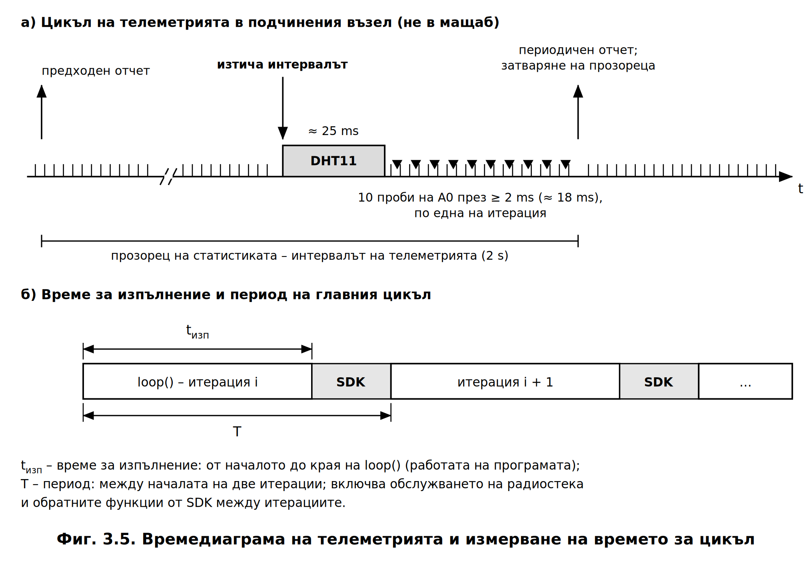{width=15.5cm}

Статистиката се натрупва в прозорец между два периодични отчета и се предава с отчета:
брой итерации $N$, средно и най-голямо $t_{\text{изп}}$, най-голям период и продължителност
на прозореца $t_{\text{пр}}$; честотата на итерациите е $f = N / t_{\text{пр}}$. Пази се и
най-голямото $t_{\text{изп}}$ от стартирането. Четенето на DHT11 е в началото на същия цикъл
на телеметрията, затова максимумът във всеки отчет показва колко време датчикът блокира
програмата.

**Защо версия 2 показваше 0 ms.** Във версия 2 времето се измерваше с `millis()` в края на
`loop()`, след изпращането на телеметрията. В отчета попадаше продължителността на
предходната итерация – обикновена итерация от няколко микросекунди, която с разделителна
способност 1 ms се отчита като 0 ms. Итерацията с четенето на DHT11 и с блокиращото
измерване на напрежението (около 45 ms) не се предаваше. Показанието 0 ms следователно се
дължи на начина на измерване.

Главният възел измерва по същия начин собствения си цикъл, времето до потвърждението на MAC
ниво и двупосочното закъснение при теста PING – от изпращането на заявката до пристигането
на отчета с нейния номер. Двата възела следят и свободната динамична памет, най-малката ѝ
стойност от стартирането и фрагментацията. С командата `LOG ON` главният възел извежда по
UART ред във формат CSV за всеки периодичен отчет, за да могат измерванията да се обработят
по-късно.

## 3.6. Местно управление и защита при влага

### 3.6.1. Обработка на бутоните

Всеки бутон се обслужва от неблокиращ филтър (Листинг Б.4 в Приложение Б). Новото
състояние се приема, когато входът е непроменен повече от 60 ms. При натискане SB1
превключва реле 1, а SB2 изключва всички релета, след което се изпраща отчет за събитие.

Двата входа имат и прекъсване по всеки фронт, чийто обработчик само увеличава брояч. При
всяко прието превключване се изчислява колко фронта са отчетени от предходното и се запазва
най-голямата стойност. Без трептене на едно превключване съответства един фронт, а всеки
следващ е отскок на контакта. Така трептенето може да се оцени без осцилоскоп, като броят е
долна граница, защото много близки фронтове се сливат.

### 3.6.2. Защитна блокировка при влага (HR202)

Функцията на защитата се извиква първа в главния цикъл. Поведението ѝ е описано с крайния
автомат на **Фиг. 3.6**.

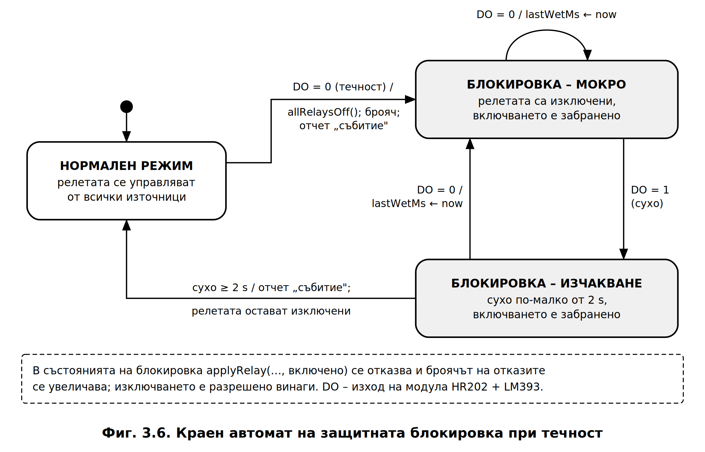{width=15.5cm}

Блокировката се задейства при първото отчитане на влага (DO = 0 на HR202) и незабавно
изключва всички релета. Тя се сваля едва след 2 s непрекъснато сухо състояние, което
предпазва от трептенето на изхода на компаратора около прага (т. 2.6.2). След свалянето ѝ
релетата не се включват автоматично. Докато блокировката е активна, всяко включване – от
бутон, по UART или по ESP-NOW – се отказва, а изключването е разрешено винаги. Проверката е
на три нива: браузърът не изпраща заявка, главният възел отговаря с код 403, а подчиненият
възел отказва изпълнението. Най-важна е проверката в подчинения възел, защото тя работи и
когато няма връзка с главния възел или с Wi-Fi мрежата.

Времето за реакция е сума от най-много един период на главния цикъл (до около 25 ms при
съвпадение с четенето на DHT11) и времето за отпускане на релето (до 5 ms [19]), т. е.
най-много около 30 ms.

## 3.7. Алгоритъм на управляващата програма

Алгоритъмът на двата възела реализира т. 4.4 от заданието, а графичното му представяне е
лист 3 от графичната част (т. 5.3).

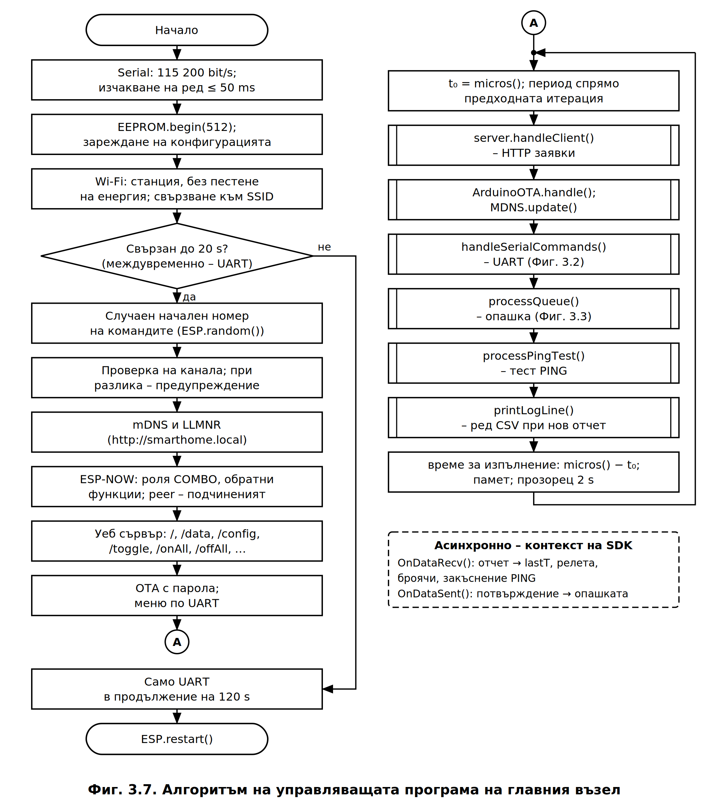{width=15.5cm}

Началната последователност на главния възел (**Фиг. 3.7**) включва зареждане на
конфигурацията и свързване към мрежата. Докато чака връзката, главният възел обслужва и
командите по UART, а ако връзка няма – преминава в конфигурационния прозорец (т. 3.2.2). След
свързването се избира случаен начален номер на командите, проверява се каналът и се
инициализират mDNS, ESP-NOW, уеб сървърът и безжичното обновяване. Режимът за пестене на
енергия на радиоинтерфейса е изключен, за да не се увеличава закъснението при приемане на
кадри.

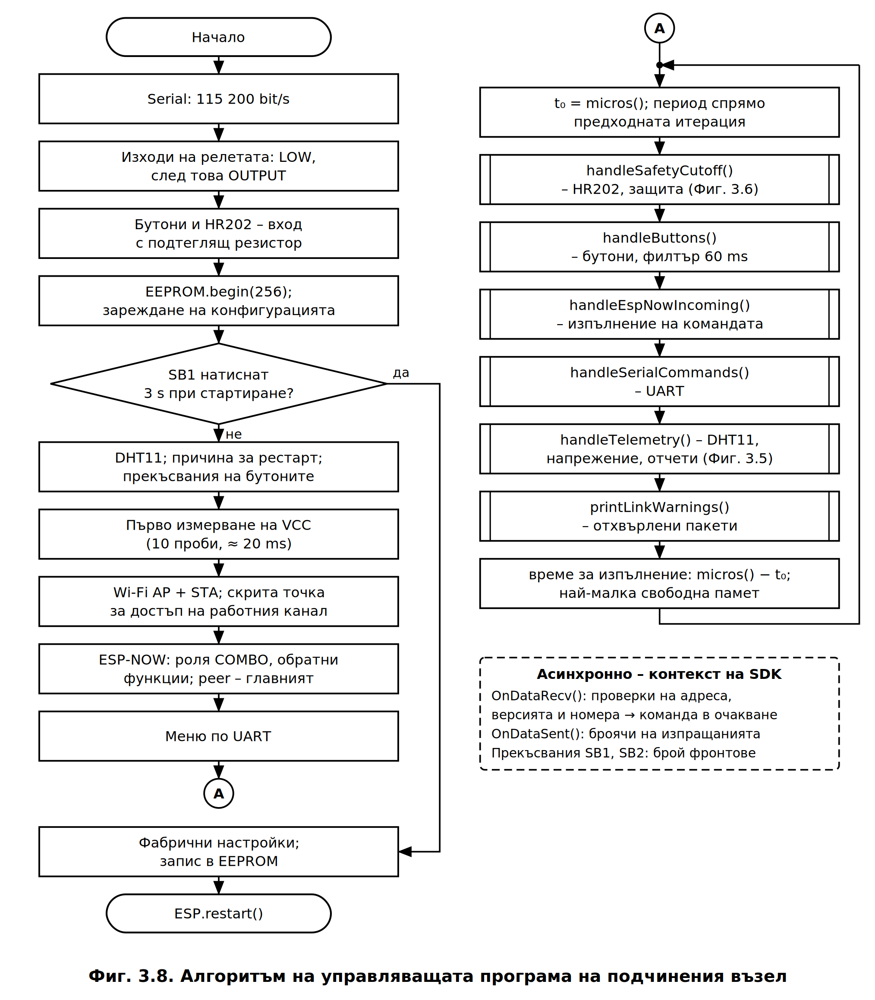{width=15.5cm}

В началната последователност на подчинения възел (**Фиг. 3.8**) изходите се установяват в
ниско ниво, преди да бъдат конфигурирани като изходи, така че релетата не се задействат
за кратко при подаване на захранването. Фабричното нулиране със задържан бутон се проверява
преди инициализацията на радиоинтерфейса, а първото измерване на напрежението се извършва
още в `setup()`, за да съдържа първият отчет валидна стойност. Функциите в главния цикъл се
извикват по реда на приоритета си: първа е защитата при влага, следват бутоните, командите
по ESP-NOW и UART, а последна е телеметрията. Така отчетът съдържа състоянието след всички
промени в същата итерация.

## 3.8. Проверка на програмата

Двете програми се компилират без предупреждения. Използваната памет е дадена в
**Таблица 3.3**.

**Таблица 3.3. Използвана памет (версия 3)**

| Памет | Главен възел | Подчинен възел | Достъпна |
|---|---|---|---|
| RAM – глобални и статични данни | 33 712 B (42 %) | 29 316 B (36 %) | 80 192 B |
| IRAM – код в оперативната памет | 60 831 B (92 %) | 60 747 B (92 %) | 65 536 B |
| Flash – програмен код | 356 644 B (34 %) | 271 980 B (25 %) | 1 048 576 B |

Високото запълване на IRAM се дължи на кеша на инструкциите (32 768 B) и на кода на ядрото и
SDK – приложната програма добавя само двата обработчика на прекъсвания. Паметта за данни на
главния възел е нараснала спрямо версия 2 (30 884 B) главно заради статичния буфер за JSON,
който е постоянен, за разлика от динамичните обекти `String`.

Част от поведението трудно се възпроизвежда на макета – препълването на `micros()`, загубата
на определени пакети, пакети от чужд адрес, препълването на буфера за JSON. Затова
непроменените файлове `Master.ino` и `Slave.ino` се компилират и на персонален компютър
заедно с имитация на програмния интерфейс на Arduino и ESP8266 – със симулирано време,
изводи, АЦП, EEPROM, ESP-NOW, уеб сървър и сериен порт. Проверени са 114 условия за
подчинения и 74 за главния възел и всички са изпълнени. Отговорите в JSON се проверяват със
строг анализатор, а скриптът на уеб страницата се изпълнява в Node.js с действителните
отговори на главния възел, без грешки. Тестовете проверяват логиката на програмата, а
времевите параметри и радиовръзката са изследвани в Глава 4.

## 3.9. Изводи по Глава 3

1. Програмите използват кооперативна многозадачност: обратните функции и прекъсванията
   само записват данни, а действията се изпълняват в главния цикъл. Най-дългата итерация е
   намалена от около 45 ms във версия 2 до около 25 ms (четенето на DHT11), а реакцията на
   бутон е до около 85 ms.
2. Конфигурацията се пази в емулирана EEPROM с проверка по сигнатура, версия и CRC-32.
   Командите по UART проверяват стойностите и не извеждат паролите.
3. Протоколът по ESP-NOW (отчет 144 B, команда 20 B) има потвърждение на две нива,
   идемпотентни команди и отчитане на загубите. Един отчет заема канала около 2 ms.
4. Уеб страницата се изпраща от Flash паметта, а отговорите в JSON се формират в статичен
   буфер с резерв около 30 %.
5. Програмите измерват времето за цикъл, закъснението, загубите и трептенето на бутоните.
   Показанието „0 ms“ във версия 2 се дължи на начина на измерване.
6. Защитната блокировка изключва релетата за около 30 ms и се проверява на три нива.
   Алгоритъмът на двата възела (т. 4.4 и т. 5.3 от заданието) е проверен със 188 условия.


```{=openxml}
<w:p><w:r><w:br w:type="page"/></w:r></w:p>
```


# ГЛАВА ЧЕТВЪРТА
# ЕКСПЕРИМЕНТАЛНИ И СИМУЛАЦИОННИ ИЗСЛЕДВАНИЯ

## 4.1. Цел и методи на изследването

Изследването проверява дали системата запазва правилното си поведение при неблагоприятни
условия: грешки и прекъсвания в радиоканала, повторно доставени кадри, рестарти на възлите,
трептене на бутоните и на изхода на датчика за влага HR202, продължителна непрекъсната работа.
Използвани са три метода (**Таблица 4.1**): проверка на макета, изчисление на времената на
обмена и на енергийния бюджет на радиовръзката и симулация на системата, в която двете
програми работят едновременно в симулирано време и обменят кадри през модел на
радиоканала. Симулацията позволява изпитвания, които на макета трудно се възпроизвеждат –
десетки хиляди повторения, зададен процент грешки в канала, рестарт в определен момент,
денонощна работа. Резултатите в т. 4.4–4.7 са получени чрез симулация и са означени като
такива.

**Таблица 4.1. Изследвани показатели и методи**

| Показател | Метод |
|---|---|
| Работа на двата възела, реле 4 на извода D8 | проверка на макета |
| Калибровка на измерването на напрежението | проверка на макета (т. 2.6.3) |
| Закъснение на обмена, време до потвърждението | изчисление и симулация |
| Отчитане на загубите, съгласуваност на състоянието при грешки в канала | симулация |
| Бутони с трептене, защитна блокировка при влага (HR202) | симулация |
| Денонощна работа с прекъсвания и рестарти | симулация |
| Обхват на радиовръзката | изчисление |

## 4.2. Проверка на макета

Двата възела са програмирани с версия 3 и работят заедно. Реле 4 се управлява нормално от
новия извод D8, с което е проверено на практика решението от т. 2.8. Коефициентите за
измерването на напрежението – пълна скала 10,91 V и грешка 55 mV на включено реле – са
определени при изработването на макета чрез сравнение с мултиметър (т. 2.6.3).

Величините, които симулацията не моделира – напрежения и токове, обхват на радиовръзката,
поведение на динамичната памет, – не са измервани с уреди в рамките на тази работа. За
измерването им е разработена методика (протокол с опити Е1–Е12), приложена в електронния
архив към програмното осигуряване. Изпълнението ѝ е първата от насоките за бъдещо
развитие.

## 4.3. Симулационен модел

Структурата на модела е показана на **Фиг. 4.1**. Непроменените файлове `Slave.ino` и
`Master.ino` се компилират на персонален компютър заедно с имитацията на хардуера от т. 3.8.
Всеки възел е отделна споделена библиотека със собствени изводи, EEPROM, сериен порт и
часовник с разделителна способност 1 µs. Рестартът на възел е ново зареждане на
библиотеката: оперативната памет се инициализира наново, а съдържанието на EEPROM се
запазва, както при реалния модул.

Кадрите между възлите преминават през модел на радиоканала по IEEE 802.11b при 1 Mbit/s
[10]. Всеки опит за предаване започва след интервал DIFS и случайно изчакване, чиято
горна граница се удвоява при всяко повторение. Кадърът се губи с вероятност FER. Ако
потвърждението не пристигне, опитът се повтаря до 7 пъти – стойността по подразбиране в
стандарта. Моделирани са и загуба само на потвърждението, повторно доставяне на кадър до
програмата, фонов трафик от други станции и пълни прекъсвания на връзката. Обратните функции
на ESP-NOW се извикват между итерациите на главния цикъл, както при реалния модул.

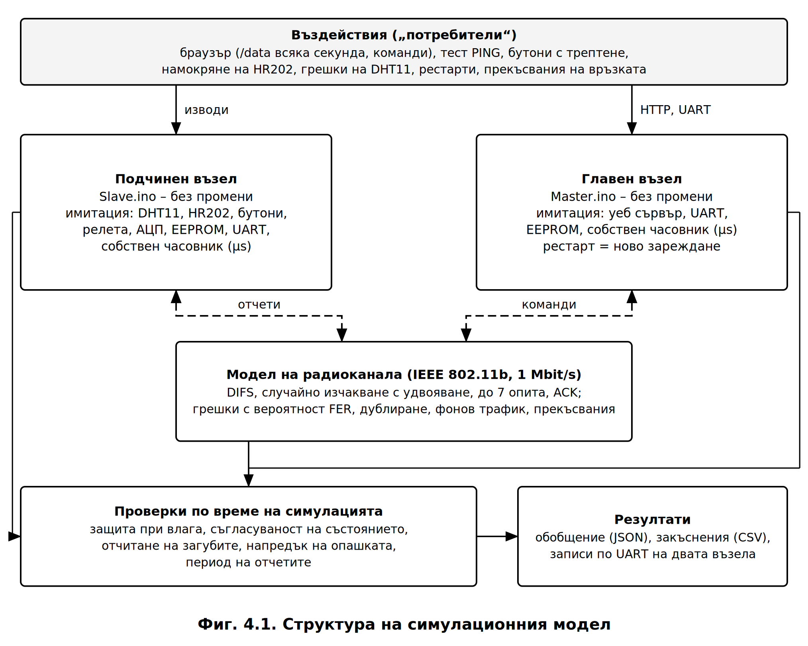{width=15.5cm}

Въздействията са: браузър, който запитва `/data` всяка секунда и подава команди; тест PING;
натискания на бутоните с 1…6 отскока през 0,1…1,6 ms [27]; намокряне на датчика за влага
HR202 с трептене на изхода на компаратора; грешки при четенето на DHT11. По време на симулацията
непрекъснато се проверяват инвариантите: нито едно реле не е включено по време на
блокировка; състоянието на релетата в главния възел съвпада с действителното (проба на всеки
100 ms); броят на загубените отчети, отчетен от главния възел, съвпада със загубените в канала;
опашката от команди не блокира. Параметрите на модела са дадени в **Таблица 4.2**.

**Таблица 4.2. Параметри на симулационния модел**

| Параметър | Стойност |
|---|---|
| Скорост; PLCP; DIFS / SIFS / слот | 1 Mbit/s; 192 µs; 50 / 10 / 20 µs |
| Граница на случайното изчакване | 31…1023 слота, удвояване при повторение |
| Опити на MAC ниво | до 7 |
| Време на обратните функции | между итерациите на главния цикъл |
| Четене на DHT11 / проба на АЦП / запис в EEPROM | 25,5 ms / 90 µs / 30 ms |
| Време между итерациите (работа на SDK) | 20…200 µs според сценария |
| Общо симулирано време | 44 h в 11 сценария |

**Ограничения на модела.** Времената на хардуерните функции в Таблица 4.2 са зададени в
модела, а не измерени. Затова симулацията проверява логиката и времевото поведение при тези
стойности, но не и действителното време за изпълнение на ESP8266. Не се моделират
разпространението на радиовълните (заместено е с параметъра FER), протоколът TCP и
динамичната памет. Те могат да се проверят на макета по протокола от т. 4.2.

## 4.4. Закъснение на обмена

### 4.4.1. Изчислена оценка

Един обмен „заявка – отговор" при теста PING е показан на **Фиг. 4.2**, а изчислените му
съставки при 1 Mbit/s – в **Таблица 4.3**.

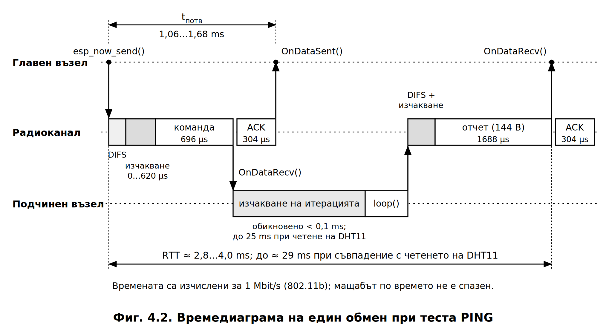{width=15.5cm}

**Таблица 4.3. Изчислени съставки на обмена при 1 Mbit/s**

| Съставка | Време, µs |
|---|---|
| Интервал DIFS | 50 |
| Случайно изчакване, 0…31 слота по 20 µs | 0…620 |
| Кадър с команда (20 + 43 B) | 696 |
| SIFS и кадър за потвърждение (14 B) | 10 + 304 |
| **Време до потвърждението $t_{\text{потв}}$** | **1060…1680** |
| Изчакване на итерацията на подчинения възел | обикновено под 100; до 25 000 при четене на DHT11 |
| DIFS и случайно изчакване преди отчета | 50…670 |
| Кадър с отчет (144 + 43 B) | 1688 |
| **Двупосочно закъснение RTT** | **≈ 2800…4000; до ≈ 29 000** |

Ако заявката пристигне, докато подчиненият възел чете DHT11, RTT нараства с до 25 ms. Делът на
такива заявки е равен на дела на времето, в което се чете датчикът:
$P \approx t_{\text{DHT}} / T_{\text{тел}} = 25 / 2000 = 1{,}25\ \%$.

### 4.4.2. Резултати от симулацията

Изпълнени са по около 14 000 последователни заявки при два режима на канала. Резултатите са
дадени в **Таблица 4.4**, а разпределенията – на **Фиг. 4.3**.

**Таблица 4.4. Закъснение по ESP-NOW (симулация, по 1 h)**

| Показател | Изчислено | Идеален канал | Зает канал: FER 20 %, фонов трафик 30 % |
|---|---|---|---|
| Заявки / загубени | – | 14 263 / 0 | 14 151 / 0 |
| $t_{\text{потв}}$ мин. / ср. / макс., ms | 1,06 / 1,37 / 1,68 | 1,12 / 1,43 / 4,14 | 1,12 / 3,17 / 49,2 |
| RTT мин. / медиана, ms | 2,8 / – | 2,86 / 3,48 | 2,86 / 5,28 |
| RTT ср. / 99 % / макс., ms | – / – / ≈ 29 | 3,65 / 8,62 / 28,2 | 6,47 / 24,6 / 51,7 |
| Дял на RTT > 10 ms | ≈ 0,93 % | 0,91 % | 11,5 % |

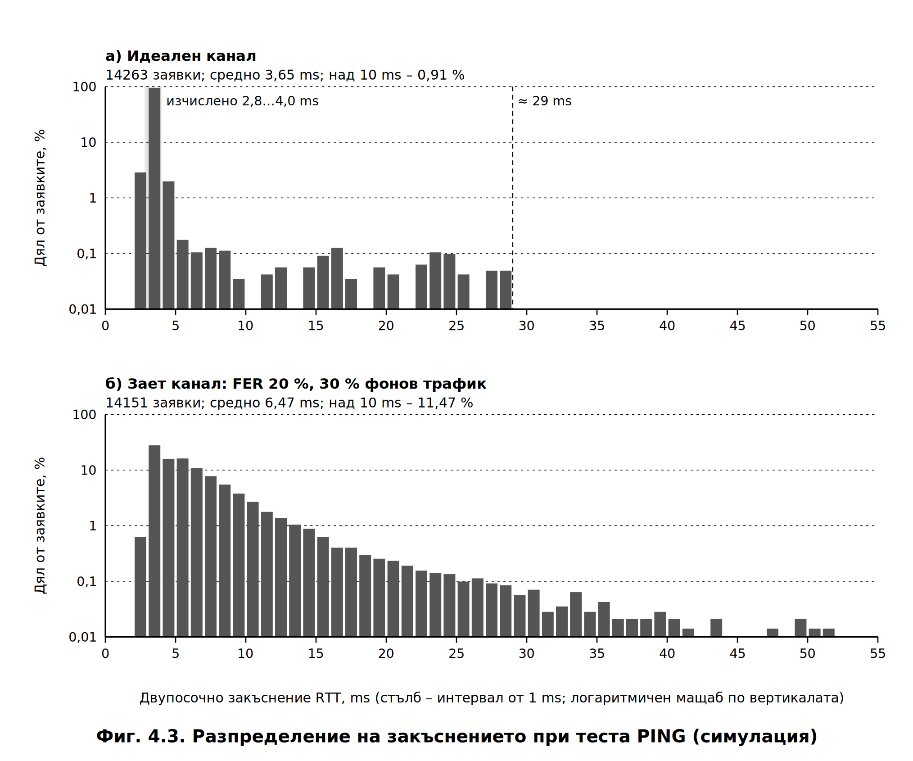{width=15.5cm}

При идеален канал симулацията потвърждава изчислението. Най-малкото RTT (2,86 ms) и средното
време до потвърждението (1,43 ms) се отличават от изчислените с по-малко от 5 %. Разликата
се дължи на времето до следващата итерация на главния цикъл. Разпределението е двугрупово
(Фиг. 4.3, а): 98 % от заявките са между 2,8 и 4,2 ms, а останалите са разпределени до
28,2 ms – случаите, в които заявката пристига по време на четенето на DHT11. Делът над 10 ms
(0,91 %) съвпада с очаквания за закъснения, по-големи от 6,5 ms, в рамките на 25-милисекундното
четене: $(25 - 6{,}5)/2000 \approx 0{,}93\ \%$.

При зает канал средното RTT се увеличава до 6,47 ms, а максималното – до 51,7 ms. Причините
са повторните предавания и удвояването на случайното изчакване. Нито една заявка не е
загубена. В 11 случая потвърждението на MAC ниво липсва, но командата е изпълнена и отчетът
е пристигнал – главният възел показва грешка, но показаното състояние остава вярно, защото
идва от отчета.

## 4.5. Устойчивост при грешки в радиоканала

### 4.5.1. Загуби, повторни кадри и съгласуваност на състоянието

Проведени са пет симулации по 2 h с вероятност за грешка на кадъра при един опит FER от 0 до
90 %, с команда от браузъра средно на всеки 10 s и с 0,2 % повторно доставени кадри
(**Таблица 4.5**). При 7 опита вероятността отчетът да бъде загубен на приложно ниво е
$\text{FER}^7$.

**Таблица 4.5. Работа при грешки в канала (симулация, по 2 h)**

| FER при един опит | 0 | 30 % | 50 % | 70 % | 90 % |
|---|---|---|---|---|---|
| Загубени отчети в канала | 0 от 4640 | 0 от 4681 | 25 от 4524 | 339 от 4499 | 2002 от 4146 |
| Очаквано по $\text{FER}^7$ | 0 | 0,02 % | 0,78 % | 8,2 % | 47,8 % |
| Загубени, отчетени от главния възел | 0 | 0 | 25 | 339 | 1999 + 3 |
| Повторни отчети: в канала / отчетени | 9 / 9 | 14 / 14 | 13 / 13 | 10 / 10 | 3 / 3 |
| Загубени команди | 0 | 0 | 8 | 79 | 549 |
| Повторни команди: доставени / отхвърлени | 4 / 4 | 0 / 0 | 1 / 1 | 1 / 1 | 0 / 0 |
| Съобщения за неуспешно изпращане | 0 | 13 | 107 | 507 | 1028 |
| Несъответствие на състоянието: дял / най-дълго | 0,03 % / 0,1 s | 0,06 % / 0,1 s | 0,24 % / 1,8 s | 0,94 % / 3,7 s | 6,6 % / 17,6 s |
| Средно $t_{\text{потв}}$, ms | 1,46 | 3,72 | 8,51 | 12,4 | 16,5 |

До FER 30 % повторните предавания на MAC ниво скриват грешките в канала и не е загубен нито
един отчет. Загубите растат рязко едва при FER над 50 %, както следва от $\text{FER}^7$.
Главният възел открива всеки загубен отчет, след който е пристигнал следващ. Трите неоткрити
загуби при FER 90 % са последните отчети преди края на симулацията. Повторно доставените
кадри се разпознават: повторните отчети се броят отделно, а повторните команди не се
изпълняват втори път.

Показаното в браузъра състояние се възстановява със следващия периодичен отчет.
Несъответствието трае до 1,8 s при FER 50 % и до 17,6 s при 48 % загуби, а опашката от
команди не блокира. Когато командата е изпълнена, но потвърждението е загубено,
потребителят вижда съобщение за грешка, а показаното състояние остава вярно (т. 3.3.3).

### 4.5.2. Оценка на обхвата

Грешката на кадъра зависи от мощността на приемания сигнал, т. е. от затихването по пътя.
При изходна мощност +20 dBm и чувствителност −98 dBm при 1 Mbit/s [11], антени с
усилване 0 dBi и запас за замиране 10 dB допустимото затихване е:

$$PL_{\text{доп}} = P_{\text{пред}} + G_{\text{пред}} + G_{\text{пр}} - S - M = 20 + 0 + 0 + 98 - 10 = 108\ \text{dB}$$

Затихването в сграда се описва с логаритмичния модел [41, 42]
$PL(d) = PL(1\ \text{m}) + N \lg d + L_{\text{прегр}}$, където $PL(1\ \text{m}) = 40{,}2$ dB при
2437 MHz, а $N \approx 28$ за жилищни сгради в обхвата 2,4 GHz [42]. От бюджета се
получава запасът, който остава за стените и плочите (**Таблица 4.6**).

**Таблица 4.6. Затихване и запас за преградите (изчисление)**

| Разстояние, m | 5 | 10 | 20 | 30 | 50 |
|---|---|---|---|---|---|
| Затихване без прегради, dB | 59,8 | 68,2 | 76,6 | 81,5 | 87,8 |
| Запас за прегради, dB | 48 | 40 | 31 | 26 | 20 |

В жилище обхватът зависи най-вече от преградите – на
20 m остават около 31 dB за загуби в стени и плочи. Когато сигналът приближи границата на чувствителността,
делът на грешните кадри расте. Според Таблица 4.5 системата продължава да работи с
възстановяващо се състояние дори при FER 70…90 %.

## 4.6. Местно управление и защита при влага

Резултатите от симулациите на бутоните и на защитата са дадени в **Таблица 4.7**.

**Таблица 4.7. Бутони и защитна блокировка (симулация)**

| Изпитване | Резултат |
|---|---|
| Нормални натискания (90…390 ms) с трептене, 2 h | 4692 от 4692 приети (SB1 – 3736, SB2 – 956) |
| Много кратки почуквания (20…45 ms) | 0 от 797 приети |
| Намокряния на HR202 с трептене на изхода на компаратора, 3 h | 231 задействания при 231 намокряния |
| Намокряния на HR202 без трептене, 3 h | 243 задействания при 243 намокряния |
| Опити за включване по време на блокировка – браузър / UART / бутон | 472 / 472 / 473 – всички отказани |
| Включено реле по време на блокировка | 0 случая |
| Време за реакция без трептене: медиана / 99 % / макс. | 0,25 / 15,6 / 25,5 ms |
| Време за реакция с трептене: медиана / 99 % / макс. | 0,25 / 27,8 / 45,7 ms |

Филтърът на бутоните приема всяко нормално натискане въпреки трептенето и отхвърля всички
почуквания, по-кратки от 60 ms. Трептенето на изхода на компаратора при намокряне и при
изсъхване не предизвиква допълнителни задействания и преждевременно сваляне на блокировката
– изискването за 2 s непрекъснато сухо състояние действа.

Времето за реакция обикновено е под 1 ms. Най-голямото време без трептене е 25,5 ms – колкото
продължава четенето на DHT11 в модела. Това потвърждава оценката от т. 3.6.2. При трептене
максимумът достига 45,7 ms. Причината е, че първият импулс на намокрянето е по-кратък от
текущото четене на датчика и завършва, преди програмата да провери входа. Блокировката се
задейства при следващия импулс. Постоянното намокряне винаги се открива при първата проверка.

## 4.7. Денонощна работа

Последната симулация обхваща 24 h работа с всички въздействия едновременно: FER 10 %, 10 %
фонов трафик, 0,1 % повторно доставени кадри, 1 % грешки при четене на DHT11, две прекъсвания
на връзката (30 s и 90 s), изключване на захранването на подчинения възел, рестарт на
подчинения възел по команда, рестарт на главния възел, 1486 команди от браузъра, поредица от
30 команди наведнъж, 554 натискания на бутоните (21 от тях по време на блокировка) и 21
намокряния. Резултатите са в **Таблица 4.8**.

**Таблица 4.8. Денонощна работа (симулация, 24 h)**

| Показател | Резултат |
|---|---|
| Изпратени отчети | 45 942 |
| Период на периодичните отчети: ср. / мин. / макс. | 2000,00 / 1999,78 / 2000,20 ms при около 20 препълвания на `micros()` |
| Загубени отчети (при прекъсванията) – в канала / отчетени | 61 / 61 |
| Повторни отчети – в канала / отчетени | 38 / 38 |
| Рестарти на подчинения възел – извършени / открити | 2 / 2 |
| Повторни команди – в канала / отхвърлени | 3 / 3 |
| Нови команди, отхвърлени след рестарта на главния възел | 0 |
| Предупреждение за авария: поява / изчезване | 10,6 s след началото / 1,6 s след края на прекъсването |
| Поредица от 30 команди | 12 приети, 18 с код 503 (пълна опашка) |
| Намокряния / задействания / включено реле при блокировка | 21 / 21 / 0 |
| Натискания: нормални / приети; кратки / приети | 511 / 511; 43 / 0 |
| Грешки на DHT11 / показана температура 0 °C | 482 / 0 случая |
| Препълвания на буфера за JSON / блокиране на опашката | 0 / 0 |
| Несъответствие на състоянието извън прекъсванията и първите 5 s след рестарт: дял / най-дълго | 0,01 % / 1,1 s |

Всички загуби на отчети са по време на двете прекъсвания и главният възел ги отчита точно.
Отчитането остава точно и след рестартите на двата възела. Предупреждението за авария се
появява около 10 s след началото на прекъсването – колкото е прагът – и изчезва с първия отчет
след него. Единственото по-дълго несъответствие на състоянието (1,1 s) е веднага след
30-секундното прекъсване. Командите, подадени по време на прекъсването, се губят, а
действителното състояние пристига с първия периодичен отчет. Периодът на отчетите остава
2 s с отклонение под 0,25 ms и при препълванията на брояча `micros()`.

## 4.8. Изводи по Глава 4

1. Макетът работи с версия 3 на програмите, а реле 4 се управлява от извода D8. Поведението
   на системата е изследвано чрез съвместна симулация на двете непроменени програми – 44 h в
   11 сценария.
2. Изчисленото закъснение е потвърдено: при идеален канал RTT е 2,86…4,2 ms за 98 % от
   заявките и до 28,2 ms при съвпадение с четенето на DHT11; при зает канал средното RTT е
   6,47 ms без загубени заявки.
3. Повторните предавания скриват грешките в канала до FER 30 %. При по-голям FER загубите се
   отчитат точно, повторните кадри се разпознават, а състоянието се възстановява със
   следващия отчет.
4. Филтърът на бутоните приема всички нормални натискания и отхвърля почукванията под 60 ms.
   Защитната блокировка се задейства при всяко намокряне на HR202 и не допуска включено реле;
   реакцията без трептене е до 25,5 ms.
5. При денонощна работа с прекъсвания, рестарти и грешки отчитането на загубите остава точно,
   а опашката и буферът за JSON не се препълват. Тези резултати важат в рамките на модела.
   Напреженията, токовете и обхватът не са измервани с уреди; за тях е подготвен протокол с
   опити Е1–Е12.


```{=openxml}
<w:p><w:r><w:br w:type="page"/></w:r></w:p>
```


# ЗАКЛЮЧЕНИЕ

## 1. Изпълнение на заданието

В дипломната работа е проектирана, реализирана и изследвана двувъзлова система за
управление на дома с два модула ESP8266 и потребителски интерфейс по IEEE 802.11.
Литературното проучване (т. 4.1 от заданието) е в Глава 1. Блоковата схема (т. 4.2, т. 5.1)
и принципната схема на подчинения възел с изчисленията (т. 4.3, т. 5.2) са в Глава 2, а
алгоритъмът на програмите (т. 4.4, т. 5.3) и конфигурирането по UART – в Глава 3.
Изследването (т. 4.5) е описано в Глава 4, а графичната част е в Приложение А.

## 2. Основни резултати

Релейните модули за 5 V логика и двата датчика – DHT11 и HR202 – работят с 3,3 V логиката
на ESP8266 без допълнителни елементи. Входният ток на релейния модул е около 2,2 mA, а
енергийният баланс на подчинения възел (около 0,49 A) налага адаптер 5 V / 1 A. Делителят за
контрол на захранването дава разделителна способност 10,65 mV. Грешката от 55 mV на
включено реле най-вероятно се дължи на общия път на масата в макетната платка.
Себестойността на макета е около 40 €.

В програмите най-дългата итерация на главния цикъл е намалена от около 45 ms във версия 2 до
около 25 ms – колкото продължава четенето на DHT11. Един отчет по ESP-NOW заема радиоканала
около 2 ms, т. е. около 0,1 % от времето при интервал 2 s.

Симулацията на двете непроменени програми дава двупосочно закъснение 2,86…4,2 ms за 98 % от
заявките, което съответства на изчислението. До FER 30 % повторните предавания скриват
грешките в канала, а при повече грешки загубите се отчитат точно и състоянието се
възстановява със следващия отчет. Всички нормални натискания на бутоните са приети, а
почукванията под 60 ms – отхвърлени. При 495 намокряния на HR202 блокировката не е
допуснала включено реле, а реакцията е до 25,5 ms.

Резултатите имат и ограничения. Времената в симулационния модел са зададени, а не
измерени; напреженията, токовете и обхватът не са проверени с уреди, а контактите на
релетата в макета не са свързани към мрежата 230 V.

## 3. Приноси

Като приложни приноси на работата могат да се посочат:

1. Архитектура с два вида обмен – Wi-Fi към потребителя и ESP-NOW между възлите – и
   оценката, че по-високата консумация на Wi-Fi не е пречка за възли с мрежово захранване,
   предназначени да управляват киловатови товари (делът на електрониката е около 0,1 %).
2. Свързване на модули за 5 V логика и на двата датчика към ESP8266 без допълнителни
   елементи – чрез режим H на релейните модули, захранване на датчиците от 3,3 V и
   преместване на реле 4 на GPIO15, – както и обяснение на грешката при измерването на
   напрежението.
3. Протокол по ESP-NOW, при който подчиненият възел потвърждава изпълнението на всяка
   команда с отчет, командите са идемпотентни, а загубите се броят. Програмите измерват сами
   времето за цикъл, закъснението и трептенето на бутоните.
4. Изследване на непроменените програми в съвместна симулация с модел на радиоканала по
   IEEE 802.11, при което през цялото време се проверява, че по време на блокировка няма
   включено реле.

## 4. Насоки за бъдещо развитие

1. Изпитване на макета с измервателни уреди по протокола Е1–Е12 – напрежения и токове на
   релейните модули, обхват при различни прегради, продължителна работа.
2. Свързване на реални товари – с печатна платка, предпазител, контактори за товари над
   10 A и кутия, отговаряща на изискванията за електрическа безопасност.
3. Добавяне на токов трансформатор (например SCT-013) към главния захранващ проводник на
   таблото за автоматично разпознаване на започнало зареждане – така се затваря
   управляващият контур.
4. Контролер за зарядна станция – генератор на сигнала *Control Pilot* по IEC 61851-1 за
   динамично управление на тока за зареждане и за изместване на товарите към периодите със
   собствено фотоволтаично производство.
5. По-добра защита на достъпа – шифриране на ESP-NOW по подразбиране, метод POST, HTTPS и
   смяна на паролите по подразбиране при първото включване.
6. Обърнато активно ниво на датчика за влага, така че прекъснат проводник да води до
   блокировка, и автоматично търсене на работния канал от подчинения възел.
7. Преход към ESP32 и Matter и запис на измерванията във файлова система, например
   LittleFS [43], за анализ на енергийното потребление.

## 5. Заключителна оценка

Целта на работата е постигната, като изследването е проведено главно чрез симулация.
Системата се управлява от браузъра на смартфон или лаптоп в домашната мрежа. Следващите
стъпки са измерванията с уреди и свързването на реални товари.


```{=openxml}
<w:p><w:r><w:br w:type="page"/></w:r></w:p>
```


# ИЗПОЛЗВАНА ЛИТЕРАТУРА

*Източниците са номерирани по реда на първото им цитиране в текста съгласно
БДС ISO 690. Позоваванията в изложението са дадени в квадратни скоби.*

1. EN 50090. *Home and Building Electronic Systems (HBES).* CENELEC.
2. ISO/IEC 14543-3. *Home electronic systems (HES) architecture (KNX).* ISO/IEC.
3. RFC 7228. *Terminology for Constrained-Node Networks.* IETF, 2014.
4. RFC 4944. *Transmission of IPv6 Packets over IEEE 802.15.4 Networks.* IETF, 2007.
5. RFC 7252. *The Constrained Application Protocol (CoAP).* IETF, 2014.
6. IEEE Std 802.15.4-2020. *Standard for Low-Rate Wireless Networks.* IEEE, 2020.
7. Bluetooth SIG. *Bluetooth Core Specification, Version 5.3.* 2021.
8. Connectivity Standards Alliance. *Matter Specification, Version 1.0.* CSA, 2022.
9. Thread Group. *Thread 1.3 Specification.* 2022.
10. IEEE Std 802.11-2020. *Part 11: Wireless LAN MAC and PHY Specifications.* IEEE, 2021.
11. Espressif Systems. *ESP8266EX Datasheet.* Version 7.0, 2023.
12. Espressif Systems. *ESP-NOW User Guide.*
13. IEC 61851-1:2017. *Electric vehicle conductive charging system – Part 1: General requirements.* IEC.
14. EN 60898-1. *Circuit-breakers for overcurrent protection for household and similar installations.* CENELEC.
15. ISO 15118-2:2014. *Road vehicles – Vehicle to grid communication interface – Part 2: Network and application protocol requirements.* ISO.
16. Open Charge Alliance. *Open Charge Point Protocol (OCPP) 2.0.1 – Part 2: Specification.*
17. EN 50160:2010. *Voltage characteristics of electricity supplied by public distribution networks.* CENELEC.
18. Nanjing Qinheng Microelectronics (WCH). *CH340 – USB to Serial Chip – Datasheet.*
19. Ningbo Songle Relay Co. *SRD Series Relay (SRD-05VDC-SL-C) – Datasheet.*
20. USB Implementers Forum. *Universal Serial Bus Specification, Revision 2.0.* 2000.
21. NodeMCU Team. *NODEMCU DEVKIT V1.0 – Schematic.* GitHub: nodemcu/nodemcu-devkit-v1.0, 2015.
22. Aosong Electronics. *DHT11 Humidity & Temperature Sensor – Datasheet.*
23. Aosong Electronics. *HR202L – Humidity Sensitive Resistor – Datasheet.* 2022.
24. Texas Instruments. *LMx93-N, LM2903-N Low-Power, Low-Offset Voltage, Dual Comparators (LM393) – Datasheet.*
25. Sharp Corporation. *PC817 Series – DIP 4-pin General Purpose Photocoupler – Datasheet.*
26. ESP8266 Community. *Arduino core for ESP8266 – Documentation.*
27. Ganssle, J. G. *A Guide to Debouncing.* The Ganssle Group, 2004 (rev. 2008).
28. Nielsen, J. *Usability Engineering.* Boston: Academic Press, 1993.
29. Adafruit Industries. *DHT-sensor-library – Arduino library for DHT11, DHT22 and similar sensors.* Version 1.4.6, GitHub.
30. Advanced Monolithic Systems. *AMS1117 – 1A Low Dropout Voltage Regulator – Datasheet.*
31. Espressif Systems. *ESP8266 Hardware Design Guidelines.* Version 2.6, 2023.
32. BerryBase. *NodeMCU v3 – ESP8266 Development Board, CH340G* [онлайн]. https://www.berrybase.de/en/nodemcu-v3-esp8266-development-board-ch340g (към 26.09.2026).
33. Exallto. *1-канален релеен модул 5 V / 10 A – високо ниво* [онлайн]. https://exallto.com/elektronika/153-1-kanalen-releen-modul-5v-10a-visoko-nivo.html (към 26.09.2026).
34. Espressif Systems. *ESP8266 Non-OS SDK API Reference.* Version 3.0.
35. Fielding, R. T. *Architectural Styles and the Design of Network-based Software Architectures.* PhD dissertation, University of California, Irvine, 2000.
36. RFC 9110. *HTTP Semantics.* IETF, 2022.
37. RFC 8259. *The JavaScript Object Notation (JSON) Data Interchange Format.* IETF, 2017.
38. WHATWG. *Fetch Living Standard.*
39. RFC 6762. *Multicast DNS.* IETF, 2013.
40. RFC 7617. *The 'Basic' HTTP Authentication Scheme.* IETF, 2015.
41. Rappaport, T. S. *Wireless Communications: Principles and Practice.* 2nd ed., Prentice Hall, 2002.
42. ITU-R P.1238. *Propagation data and prediction methods for the planning of indoor radiocommunication systems.* International Telecommunication Union.
43. ARM Ltd. *littlefs – A little fail-safe filesystem designed for microcontrollers.*

**Общо: 43 заглавия** – 22 стандарта и спецификации, 10 каталожни
листа и документация на елементи и 11 други източника (програмна документация,
монографии и дисертации).


```{=openxml}
<w:p><w:r><w:br w:type="page"/></w:r></w:p>
```


# АНОТАЦИЯ

::: {custom-style="Compact"}
**Тема:** Система за управление на дома чрез IEEE 802.11 (Wi-Fi) интерфейс

**Дипломант:** инж. Кръстиян Тодоров Праматаров, ф. № 901322003

**Научен ръководител:** доц. д-р инж. Любомир Богданов
:::

В дипломната работа е проектирана, реализирана и изследвана двувъзлова система за
управление на дома с два модула ESP8266 и потребителски интерфейс по IEEE 802.11.
Подчиненият възел управлява четири релета и има два датчика – DHT11 за температура и
влажност и HR202 за влага. Системата се управлява от произволен браузър, а възлите обменят
данни по протокола ESP-NOW, без да минават през домашния маршрутизатор.

Литературното проучване обосновава избора на IEEE 802.11 и на ESP8266. В хардуерната част са
изчислени съвместимостта на модулите с 3,3 V логика, делителят за контрол на захранването и
енергийният баланс, анализирана е точността и е оценена себестойността (около 40 €).
Програмите имат неблокиращ главен цикъл, опашка от команди, конфигуриране по UART и защитна
блокировка при влага.

Поведението на системата е изследвано чрез съвместна симулация на двете непроменени
програми с модел на радиоканала – 44 h в 11 сценария. Закъснението на обмена е 2,9…4,2 ms
за 98 % от заявките, загубите се отчитат точно, а при 495 намокряния блокировката не допуска
включено реле. Напреженията, токовете и обхватът не са измервани с уреди.

**Ключови думи:** IEEE 802.11, ESP8266, ESP-NOW, домашна автоматизация, енергиен мениджмънт,
DHT11, HR202, симулация.

Обемът на дипломната работа е 77 страници без приложенията. Тя съдържа 19 фигури,
23 таблици и 43 литературни източника. Приложенията съдържат графичната част
(3 листа формат A1), 4 таблици и 4 листинга от програмите.


```{=openxml}
<w:p><w:r><w:br w:type="page"/></w:r></w:p>
```


# ПРИЛОЖЕНИЕ А

## Графична част – листове 1…3

Листовете са изпълнени във формат A1 (841 × 594 mm) с основен надпис по ЕСКД. Тук са дадени в умален вид, завъртени на 90°; оригиналите са приложени отделно.

```{=openxml}
<w:p><w:r><w:br w:type="page"/></w:r></w:p>
```


{width=15.5cm}


```{=openxml}
<w:p><w:r><w:br w:type="page"/></w:r></w:p>
```


{width=15.5cm}


```{=openxml}
<w:p><w:r><w:br w:type="page"/></w:r></w:p>
```


{width=15.5cm}


```{=openxml}
<w:p><w:r><w:br w:type="page"/></w:r></w:p>
```


# ПРИЛОЖЕНИЕ Б

## Програмно осигуряване – структури на данните и фрагменти от програмите

Дадени са таблиците и фрагментите от програмите на двата възела (версия 3), към които се
препраща в Глава 3. Пълният изходен код на двете програми е приложен в електронен вид
(папка `firmware/v3`).

**Таблица Б.1. Конфигурационни параметри**

| Параметър | Възел | По подразбиране | Допустими стойности |
|---|---|---|---|
| Име на мрежата (SSID) / парола | Г | – | до 32 / до 64 знака |
| Име за mDNS | Г | `smarthome` | до 31 знака |
| MAC адрес на другия възел | Г, П | адресът в макета | `xx:xx:xx:xx:xx:xx` |
| Wi-Fi канал на подчинения възел | Г, П | 6 | 1…13 |
| Интервал на телеметрията | Г, П | 2000 ms | 500…60 000 ms |
| Корекция на напрежението | Г, П | 0 V | −2…+2 V |
| Парола за OTA | Г | `esp8266ota` | до 32 знака |
| Уеб потребител / парола; автентикация | Г | `admin` / `admin`; изкл. | до 16 / 32 знака; 0 или 1 |
| Праг за авария на връзката | Г | 10 s | 3…300 s |

*Г – главен възел; П – подчинен възел.*

**Таблица Б.2. Команди по UART**

| Команда | Действие | Възел |
|---|---|---|
| `SET SSID <име>`, `SET PASS <парола>`, `SET NAME <име>` | мрежа и име за mDNS | Г |
| `SET MAC`, `SET CHANNEL`, `SET INTERVAL`, `SET VCCOFFSET` | адрес на другия възел, канал, интервал, корекция | Г, П |
| `SET OTAPASS`, `SET WEBUSER`, `SET WEBPASS`, `SET WEBAUTH`, `SET LINKTIMEOUT` | защита на достъпа, праг за авария | Г |
| `SAVE`, `FACTORY` | запис в EEPROM; фабрични настройки и рестарт | Г, П |
| `PUSH` | изпраща интервала, корекцията и канала към подчинения възел | Г |
| `1`…`7`, `M`, `R<n> ON`, `R<n> OFF` | статус, релета, рестарт, конфигурация, измервания, меню | Г, П |
| `PING <n>`, `LOG ON`, `LOG OFF`, `RESET STATS` | тест на закъснението, запис във формат CSV, нулиране на броячите | Г (`RESET STATS` – и П) |

**Таблица Б.3. Състав на отчета на подчинения възел (144 B)**

| Група | Съдържание | Размер |
|---|---|---|
| Заглавие | версии на протокола и програмата, вид на отчета, канал, пореден номер, номер на последната изпълнена команда | 12 B |
| Датчици и изходи | DHT11: температура, влажност, валидност, брой грешки; HR202: сухо/мокро; блокировка; 4 релета | 17 B |
| Напрежение и конфигурация | сума на пробите от A0, напрежение, интервал, корекция | 12 B |
| Състояние на системата | време на работа, причина за последния рестарт | 36 B |
| Връзка и команди | потвърдени и непотвърдени изпращания, отхвърлени команди | 10 B |
| Време за цикъл | брой итерации, средно и най-голямо време за изпълнение, най-голям период, прозорец, максимум от стартирането | 24 B |
| Памет, бутони, защита | свободна памет и фрагментация; фронтове и натискания на бутоните; задействания и откази на защитата | 31 B |
| Подравняване | – | 2 B |

**Таблица Б.4. Адреси на уеб сървъра**

| Адрес | Параметри | Действие | Отговор / кодове за грешка |
|---|---|---|---|
| `/` | – | уеб страницата | HTML |
| `/data` | – | състояние, измервания, диагностика | JSON, ≈ 1 kB |
| `/config` | – | конфигурация, без паролите | JSON |
| `/toggle` | `id` = 0…3 | превключва реле | 400 – индекс; 403 – влага; 503 – пълна опашка |
| `/onAll`, `/offAll` | – | включва или изключва всички релета | 403 – влага |
| `/ping` | `n` = 1…1000 | стартира теста на закъснението | 409 – тестът се изпълнява |
| `/resetStats` | – | нулира броячите в двата възела | – |


**Листинг Б.1. Разбор на командите `SET <ключ> <стойност>` в главния възел (фрагмент)**

```cpp
  // up - редът в главни букви, raw - оригиналът
  if (up.startsWith("SET ")) {
    int sp = raw.indexOf(' ', 4);           // интервалът след ключа
    String key = (sp < 0 ? raw.substring(4) : raw.substring(4, sp));
    String val = (sp < 0 ? String("") : raw.substring(sp + 1));
    key.trim(); key.toUpperCase(); val.trim();   // стойността запазва регистъра
    if (val.length() == 0) { Serial.println(F("Липсва стойност.")); return; }

    if (key == "SSID") {
      strncpy(cfg.ssid, val.c_str(), sizeof(cfg.ssid) - 1);
      cfg.ssid[sizeof(cfg.ssid) - 1] = 0;
    }
    else if (key == "CHANNEL") {
      int c = val.toInt();
      if (c >= 1 && c <= 13) cfg.wifiChannel = (uint8_t)c;
      else Serial.println(F("Допустим диапазон: 1-13."));
    }
    // ... останалите параметри по същия начин
    return;
  }
```

**Листинг Б.2. Приемане на команда в подчинения възел (фрагмент)**

```cpp
void OnDataRecv(uint8_t *mac, uint8_t *incomingData, uint8_t len) {
  if (!isBroadcastMac(cfg.peerMac) && memcmp(mac, cfg.peerMac, 6) != 0) {
    foreignMacSeen = true; cmdRejected++; return;           // не е от главния възел
  }
  if (len >= 1 && incomingData[0] != PROTO_VERSION) {  // друга версия на протокола
    badProtoSeen = incomingData[0]; cmdRejected++; return;
  }
  if (len != sizeof(incomingControl)) { cmdRejected++; return; }
  memcpy(&incomingControl, incomingData, sizeof(incomingControl));
  if (haveLastSeq && incomingControl.seq == lastSeq) {     // повторно приет пакет
    cmdRejected++; return;
  }
  lastSeq = incomingControl.seq;
  haveLastSeq = true;
  // ... само запомняне на полетата - командата се изпълнява в loop()
  commandPending = true;
}
```

**Листинг Б.3. Форматиране на отговорите в статичния буфер на главния възел**

```cpp
__attribute__((format(printf, 1, 2)))     // компилаторът проверява аргументите
static void jsonPrintf(const char *fmt, ...) {
  if (jsonOverflow) return;
  size_t room = JSON_BUF_SIZE - jsonLen;
  va_list ap;
  va_start(ap, fmt);
  int n = vsnprintf(jsonBuf + jsonLen, room, fmt, ap);
  va_end(ap);
  if (n < 0 || (size_t)n >= room) {
    jsonOverflow = true; jsonBuf[jsonLen] = '\0'; return;
  }
  jsonLen += (size_t)n;
}
```

**Листинг Б.4. Филтър срещу трептене и броене на фронтовете в подчинения възел (бутон SB1)**

```cpp
void IRAM_ATTR isrButtonToggle() { btnEdges[0]++; }   // прекъсване по всеки фронт

void handleButtons() {
  unsigned long now = millis();
  bool r = digitalRead(BUTTON_TOGGLE_PIN);
  if (r != toggleLastRead) { toggleLastRead = r; toggleLastChange = now; }
  else if (now - toggleLastChange > DEBOUNCE_MS && r != toggleStable) {   // 60 ms
    toggleStable = r;
    noteButtonTransition(0);                 // фронтове от предходното приемане
    if (toggleStable == LOW) {               // натискане
      btnPresses[0]++;
      applyRelay(0, !currentRelayState[0]);  // при блокировка включването се отказва
      requestReport(REPORT_EVENT);
    }
  }
  // ... бутон SB2 (D6) - аналогично, изключва всички релета
}
```