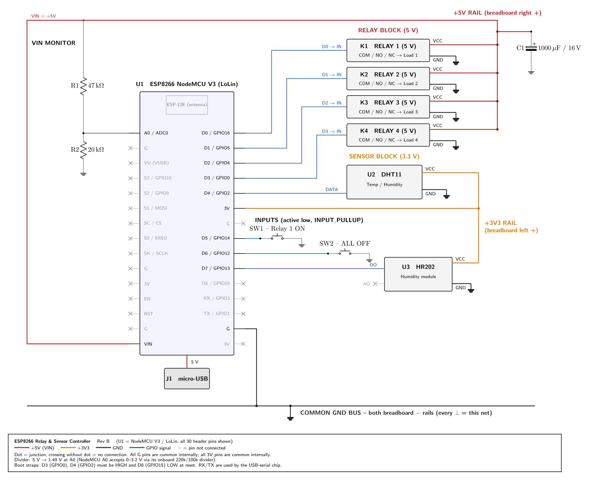
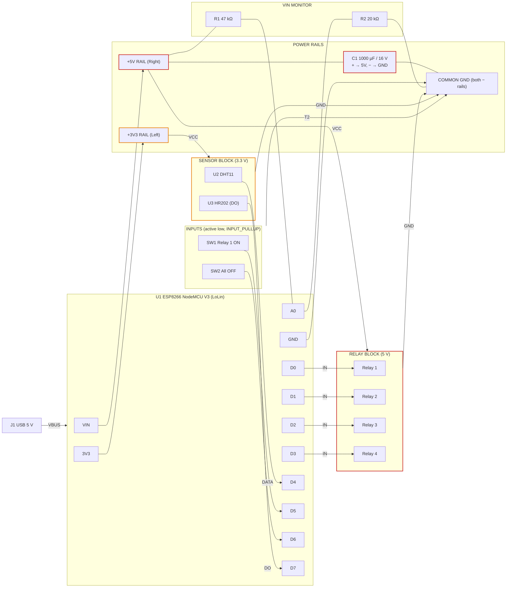

# ESP8266 Relay & Sensor Controller: Schematic

| File | Format |
|---|---|
| [`schematic.tex`](schematic.tex) | LaTeX / CircuiTikZ source (`pdflatex schematic.tex`) |
| [`schematic.pdf`](schematic.pdf) | Vector schematic |
| [`schematic.png`](schematic.png) | Raster preview |

## Block diagram (Mermaid)

## Netlist

| Net | Connections |
|---|---|
| **+5V** | J1 VBUS → U1 VIN, C1(+), R1 pin 1, K1–K4 VCC |
| **+3V3** | U1 3V3, U2 VCC, U3 VCC |
| **GND** | U1 GND (both), C1(−), R2 pin 2, K1–K4 GND, U2 GND, U3 GND, SW1 T2, SW2 T2 |
| VSENSE | R1 pin 2, R2 pin 1, U1 A0 |
| RLY1…RLY4 | U1 D0 / D1 / D2 / D3 (GPIO16 / 5 / 4 / 0) → K1…K4 IN |
| DHT_DATA | U1 D4 (GPIO2) ↔ U2 DATA |
| HUM_DO | U3 DO → U1 D7 (GPIO13) |
| BTN_ON / BTN_OFF | SW1 T1 → U1 D5 (GPIO14), SW2 T1 → U1 D6 (GPIO12) |

## U1 NodeMCU V3 (LoLin): all 30 header pins

Board orientation: antenna at the top, micro-USB at the bottom. **×** = on the board but not wired.

| # | Left pin | Function | Net / use | | # | Right pin | Function | Net / use |
|---|---|---|---|---|---|---|---|---|
| 1 | A0 | ADC0 | **VSENSE** (R1/R2 divider) | | 1 | D0 | GPIO16 | **Relay 1 IN** |
| 2 | G | GND | × (common internally) | | 2 | D1 | GPIO5 | **Relay 2 IN** |
| 3 | VU | USB 5 V | × | | 3 | D2 | GPIO4 | **Relay 3 IN** |
| 4 | S3 | GPIO10 | × (flash) | | 4 | D3 | GPIO0 / FLASH | **Relay 4 IN** |
| 5 | S2 | GPIO9 | × (flash) | | 5 | D4 | GPIO2 / TXD1 | **DHT11 DATA** |
| 6 | S1 | MOSI | × (flash) | | 6 | 3V | 3.3 V | **+3V3 rail** |
| 7 | SC | CS | × (flash) | | 7 | G | GND | × (common internally) |
| 8 | S0 | MISO | × (flash) | | 8 | D5 | GPIO14 | **SW1** (Relay 1 ON) |
| 9 | SK | SCLK | × (flash) | | 9 | D6 | GPIO12 | **SW2** (All OFF) |
| 10 | G | GND | × | | 10 | D7 | GPIO13 | **HR202 DO** |
| 11 | 3V | 3.3 V | × (same net as right 3V) | | 11 | D8 | GPIO15 | × (must stay LOW at boot) |
| 12 | EN | Chip enable | × | | 12 | RX | GPIO3 / RXD0 | × (USB serial) |
| 13 | RST | Reset | × | | 13 | TX | GPIO1 / TXD0 | × (USB serial) |
| 14 | G | GND | × | | 14 | G | GND | **Common GND bus** |
| 15 | VIN | 5 V in | **+5V rail** | | 15 | 3V | 3.3 V | × |

The drawing uses one pin of each kind (right 3V, right-bottom G). All G pins are tied together on the board, and so are all 3V pins, so on the breadboard you can use any G or 3V pin; the circuit is the same.

## Design review notes

1. **A0 divider.** The drawing assumes a NodeMCU‑style board, which has its own 220 k / 100 k divider behind A0, so the pin accepts 0–3.2 V. With R1/R2, 5.00 V gives 1.49 V unloaded and about 1.43 V loaded by the onboard 320 kΩ. That reads as roughly 457 counts, so `Vin ≈ raw × 0.01094`. On a **bare ESP‑12 module** the ADC maxes out at **1.0 V**, and 1.49 V would be out of range. In that case use 47 k / 10 k (0.88 V).
2. **The 5 V rail is not quite 5 V.** On NodeMCU V3 (LoLin) boards VIN sits behind a Schottky diode from USB, so the rail measures about 4.6–4.8 V. This is the value the divider reports. The **VU** pin is USB 5 V *before* the diode. Feeding the relays from VU would give them the full 5 V.
3. **Power budget.** Each relay coil draws about 70–90 mA. With all four on, plus the ESP8266 (up to about 300 mA peaks on Wi‑Fi TX), you get close to the 500 mA USB limit. C1 absorbs coil inrush; use a 1–2 A USB supply.
4. **Boot strapping pins.** D3 (GPIO0) and D4 (GPIO2) must be HIGH at reset. Active‑low opto relay modules and the DHT11 pull-up both keep them high, which is fine. In firmware, `digitalWrite(pin, HIGH)` **before** `pinMode(pin, OUTPUT)` so the relays don't click at boot.
5. **3.3 V GPIO → 5 V relay input.** On many opto-isolated active‑low modules, a 3.3 V "HIGH" leaves about 1.7 V across the opto LED, and the relay may not release reliably. If that happens, switch "off" by setting the pin to `INPUT` (Hi‑Z) instead of HIGH. Other options are a module with a transistor or level-shifted input, or powering the module's logic side (VCC) from 3.3 V while keeping JD‑VCC on 5 V. ESP8266 GPIOs are not officially 5 V tolerant.
6. **HR202.** HR202 is a bare resistive element. The "DO" pin implies the LM393 comparator board, which gives only a threshold (set by its trimpot). AO is left unconnected, since A0 is taken by the divider.
7. **DHT11.** A bare 4‑pin DHT11 needs a 4.7–10 kΩ pull‑up from DATA to 3V3. The 3‑pin modules already include one.
8. **Buttons.** No external resistors are needed because of INPUT_PULLUP. Debounce in software (about 30–50 ms).
